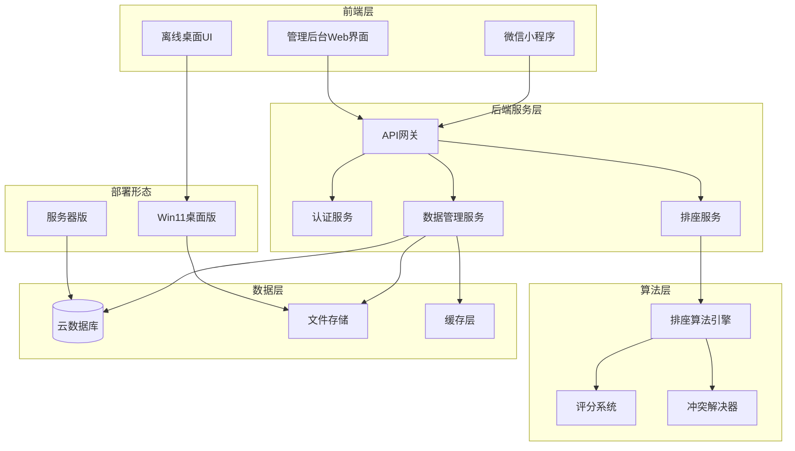
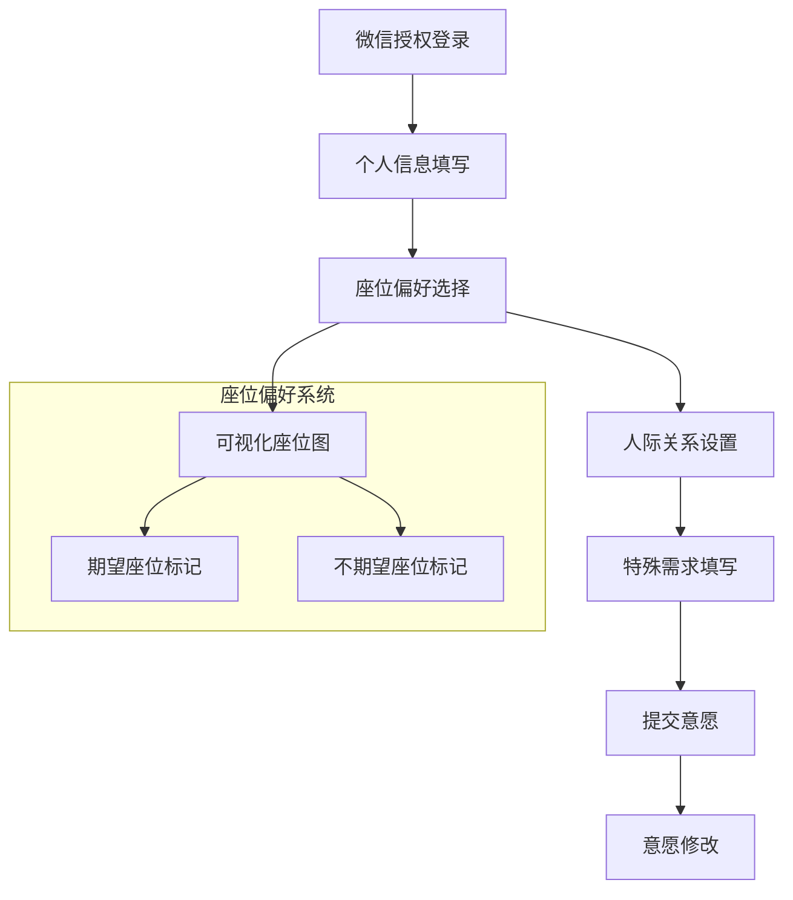
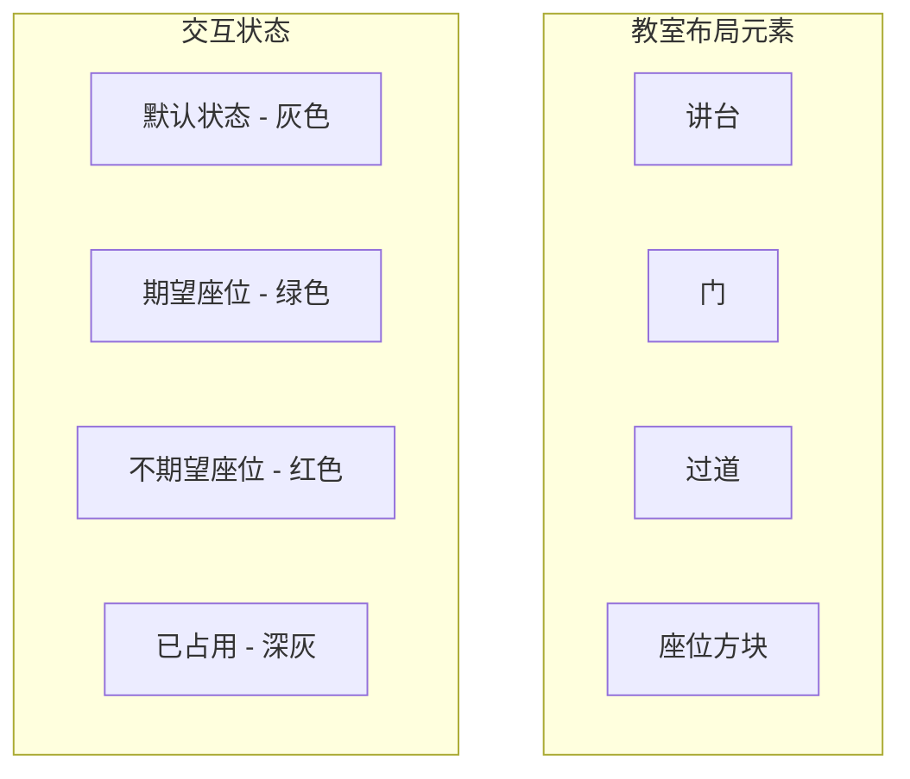
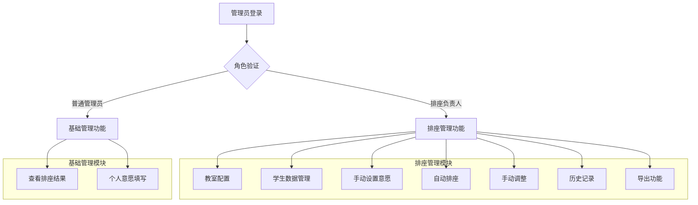
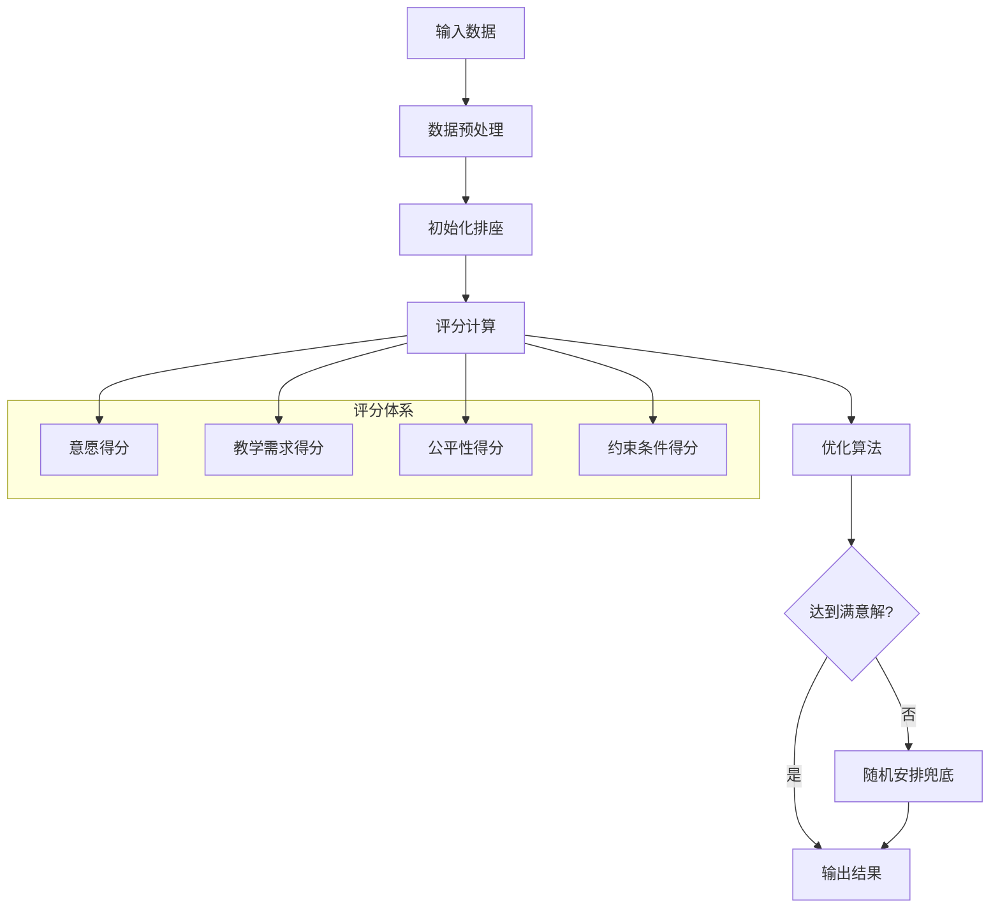
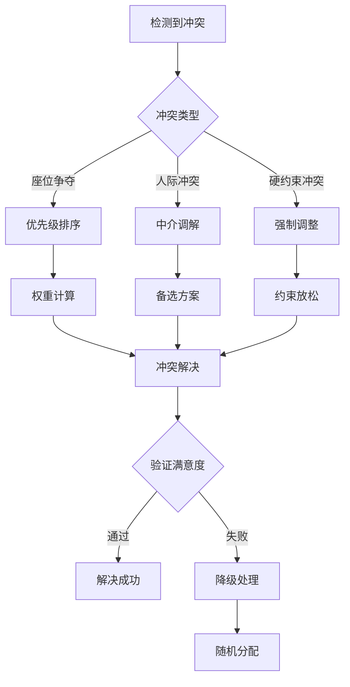
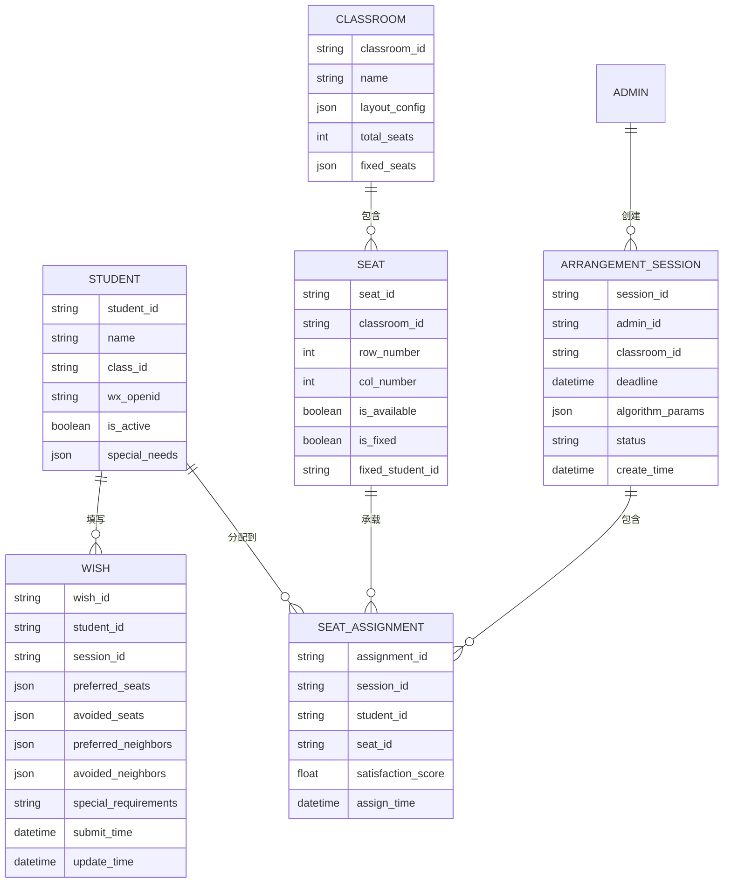
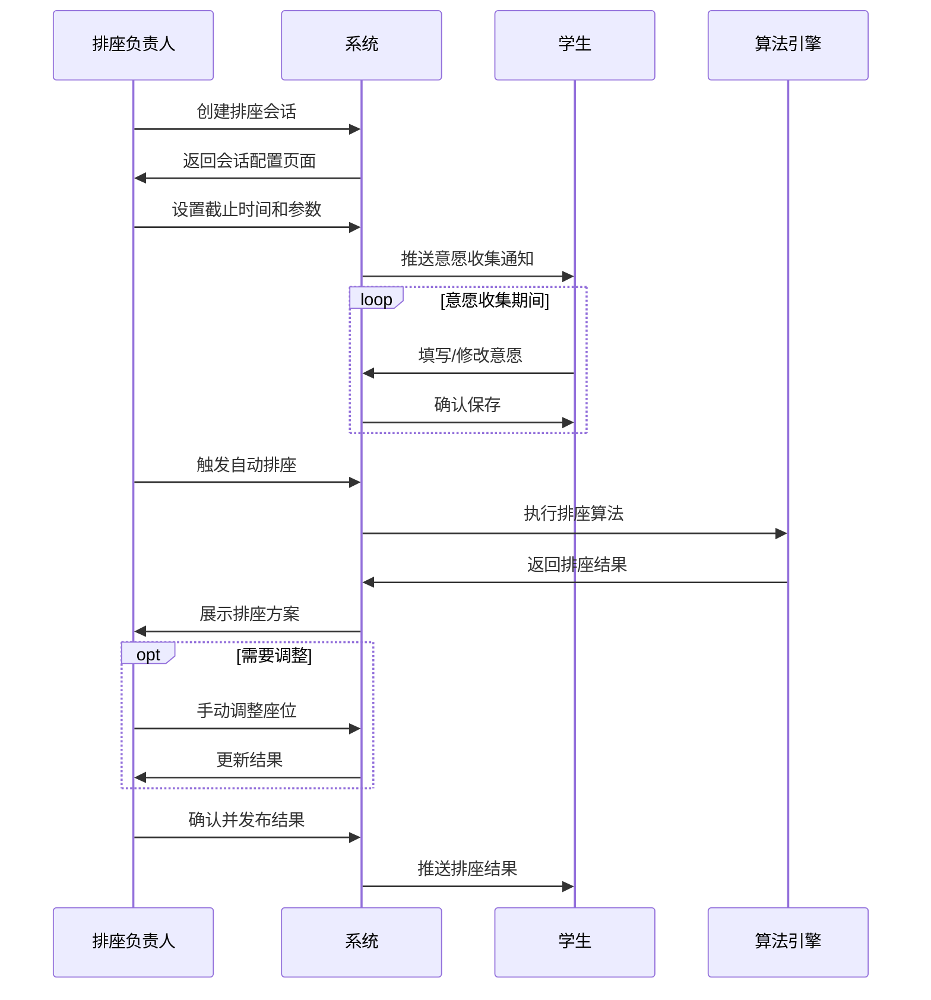
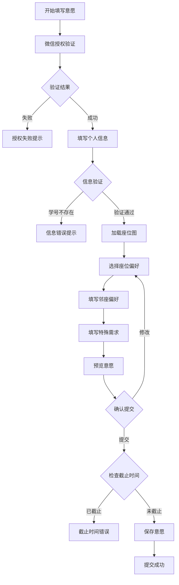
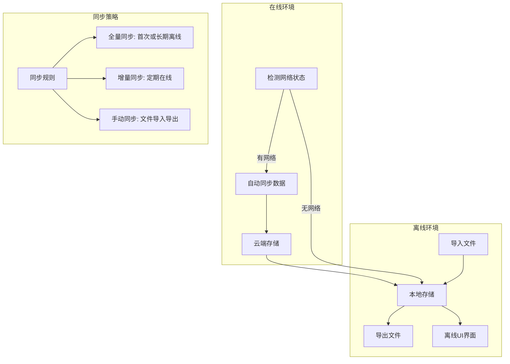

# 自动排座位系统设计文档

## 1. 概述

### 1.1 系统目标
自动排座位系统是一个基于微信小程序的智能座位安排解决方案，旨在通过收集学生意愿并结合管理需求，自动生成最优座位安排方案。系统采用前后端分离架构，支持在线和离线两种运行模式。

### 1.2 核心价值
- **智能化排座**：基于多维度权重算法，平衡学生意愿与教学管理需求
- **便捷性**：通过微信小程序简化学生意愿收集流程
- **灵活性**：支持多种部署模式和数据同步方式
- **可视化管理**：直观的座位图界面和历史记录管理

### 1.3 目标用户
- **学生用户**：20-80人规模的大学班级学生
- **管理员**：班主任、辅导员等班级管理人员
- **排座负责人**：专门负责座位安排的管理人员

## 2. 技术架构

### 2.1 整体架构



### 2.2 部署架构

| 部署模式 | 适用场景 | 特性 |
|---------|---------|------|
| 服务器版 | 正常网络环境 | 实时数据同步、云端存储、多端访问 |
| Win11桌面版 | 离线环境 | 本地数据存储、文件导入导出、独立UI |

## 3. 功能模块设计

### 3.1 学生端功能架构



#### 3.1.1 核心功能模块

| 功能模块 | 功能描述 | 关键特性 |
|---------|---------|----------|
| 身份认证 | 微信授权登录 | 获取用户基本信息，确保身份唯一性 |
| 信息填写 | 姓名学号输入 | 智能联想提示，基于已有学生名单 |
| 座位偏好 | 可视化座位选择 | 绿色标记期望座位，红色标记不期望座位 |
| 人际关系 | 同伴偏好设置 | 填写希望邻座和不希望邻座的同学 |
| 特殊需求 | 文本描述需求 | 向管理员展示个性化需求 |
| 意愿管理 | 提交和修改 | 截止时间前可重复修改 |

#### 3.1.2 座位图可视化规范



### 3.2 管理员端功能架构



#### 3.2.1 权限管理体系

| 用户角色 | 权限范围 | 特殊说明 |
|---------|---------|----------|
| 排座负责人 | 所有功能权限 | 可参与排座，需单独意愿填写入口 |
| 普通管理员 | 查看结果、填写个人意愿 | 可参与排座，使用标准意愿填写流程 |

#### 3.2.2 核心管理功能

| 功能模块 | 功能描述 | 实现要点 |
|---------|---------|----------|
| 教室配置 | 设计座位布局 | 支持不规则教室布局，可设置固定座位 |
| 学生管理 | 维护学生名单 | 支持批量导入，处理转学和请假情况 |
| 意愿管理 | 手动设置学生意愿 | 为未填写意愿的学生代为设置 |
| 自动排座 | 执行排座算法 | 基于多权重评分系统生成最优方案 |
| 手动调整 | 微调排座结果 | 支持拖拽式座位调整 |
| 历史管理 | 查看历史排座 | 记录每次排座的时间、参数和结果 |
| 数据导出 | 导出各类数据 | 支持座位表、意愿数据、历史记录导出 |

### 3.3 排座算法引擎

#### 3.3.1 算法框架设计



#### 3.3.2 评分权重体系

| 评分维度 | 权重范围 | 计算要素 |
|---------|---------|----------|
| 学生意愿 | 40% | 座位偏好匹配度、人际关系满足度 |
| 教学需求 | 30% | 视力听力考虑、身高分布、成绩搭配 |
| 公平性 | 20% | 历史位置避重、轮换机制 |
| 约束条件 | 10% | 固定座位、特殊需求 |

#### 3.3.3 冲突解决策略



## 4. 数据模型设计

### 4.1 核心实体关系



### 4.2 关键数据表设计

#### 4.2.1 学生信息表 (Student)

| 字段名 | 类型 | 说明 | 约束 |
|--------|------|------|------|
| student_id | VARCHAR(50) | 学生唯一标识 | 主键 |
| name | VARCHAR(100) | 学生姓名 | 非空 |
| student_number | VARCHAR(50) | 学号 | 唯一 |
| class_id | VARCHAR(50) | 班级标识 | 外键 |
| wx_openid | VARCHAR(100) | 微信OpenID | 唯一 |
| is_active | BOOLEAN | 是否在校 | 默认true |
| special_needs | JSON | 特殊需求 | 可空 |
| create_time | DATETIME | 创建时间 | 自动填充 |

#### 4.2.2 意愿信息表 (Wish)

| 字段名 | 类型 | 说明 | 约束 |
|--------|------|------|------|
| wish_id | VARCHAR(50) | 意愿唯一标识 | 主键 |
| student_id | VARCHAR(50) | 学生标识 | 外键 |
| session_id | VARCHAR(50) | 排座会话标识 | 外键 |
| preferred_seats | JSON | 期望座位列表 | 可空 |
| avoided_seats | JSON | 不期望座位列表 | 可空 |
| preferred_neighbors | JSON | 期望邻座列表 | 可空 |
| avoided_neighbors | JSON | 不期望邻座列表 | 可空 |
| special_requirements | TEXT | 特殊需求描述 | 可空 |
| submit_time | DATETIME | 提交时间 | 非空 |
| update_time | DATETIME | 更新时间 | 自动更新 |

### 4.3 配置数据结构

#### 4.3.1 教室布局配置

```mermaid
graph TD
    subgraph "教室配置JSON结构"
        LAYOUT[layout_config]
        LAYOUT --> DIMENSIONS[dimensions]
        LAYOUT --> SEATS[seats]
        LAYOUT --> ELEMENTS[elements]
        
        DIMENSIONS --> WIDTH[width: 数值]
        DIMENSIONS --> HEIGHT[height: 数值]
        
        SEATS --> SEAT_LIST[座位数组]
        SEAT_LIST --> SEAT_ITEM[seat_item]
        SEAT_ITEM --> POSITION[position: {x, y}]
        SEAT_ITEM --> STATUS[status: available/fixed/blocked]
        
        ELEMENTS --> PODIUM[podium: {x, y, width, height}]
        ELEMENTS --> DOOR[door: {x, y}]
        ELEMENTS --> AISLE[aisle: 路径数组]
    end
```

#### 4.3.2 算法参数配置

| 参数类别 | 参数名 | 取值范围 | 默认值 | 说明 |
|---------|--------|----------|--------|------|
| 权重设置 | wish_weight | 0.0-1.0 | 0.4 | 学生意愿权重 |
| 权重设置 | teaching_weight | 0.0-1.0 | 0.3 | 教学需求权重 |
| 权重设置 | fairness_weight | 0.0-1.0 | 0.2 | 公平性权重 |
| 权重设置 | constraint_weight | 0.0-1.0 | 0.1 | 约束条件权重 |
| 算法参数 | max_iterations | 100-10000 | 1000 | 最大迭代次数 |
| 算法参数 | min_satisfaction | 0.0-1.0 | 0.7 | 最低满意度阈值 |
| 算法参数 | enable_random_fallback | true/false | true | 启用随机兜底 |

## 5. 业务流程设计

### 5.1 完整排座流程



### 5.2 意愿收集子流程



### 5.3 离线同步流程



## 6. 接口设计

### 6.1 RESTful API 设计

#### 6.1.1 认证相关接口

| 接口路径 | 方法 | 功能描述 | 请求参数 | 响应数据 |
|---------|------|----------|----------|----------|
| /api/auth/wx-login | POST | 微信授权登录 | code, userInfo | token, userProfile |
| /api/auth/admin-login | POST | 管理员登录 | username, password | token, role, permissions |
| /api/auth/logout | POST | 用户登出 | token | success |
| /api/auth/refresh | POST | 刷新令牌 | refreshToken | newToken |

#### 6.1.2 学生意愿接口

| 接口路径 | 方法 | 功能描述 | 请求参数 | 响应数据 |
|---------|------|----------|----------|----------|
| /api/wish/submit | POST | 提交意愿 | studentId, sessionId, wishData | wishId, submitTime |
| /api/wish/update | PUT | 更新意愿 | wishId, wishData | updateTime |
| /api/wish/get | GET | 获取意愿 | studentId, sessionId | wishData |
| /api/wish/list | GET | 获取意愿列表 | sessionId, page, limit | wishList, total |

#### 6.1.3 排座管理接口

| 接口路径 | 方法 | 功能描述 | 请求参数 | 响应数据 |
|---------|------|----------|----------|----------|
| /api/session/create | POST | 创建排座会话 | classroomId, deadline, params | sessionId |
| /api/session/start-arrange | POST | 开始自动排座 | sessionId | taskId |
| /api/session/get-result | GET | 获取排座结果 | sessionId | seatAssignments, score |
| /api/session/manual-adjust | PUT | 手动调整座位 | sessionId, adjustments | newAssignments |
| /api/session/publish | POST | 发布排座结果 | sessionId | publishTime |

### 6.2 数据传输格式

#### 6.2.1 意愿数据格式

```json
{
  "wishId": "wish_20241201_001",
  "studentId": "stu_001",
  "sessionId": "session_001",
  "preferredSeats": [
    {"row": 1, "col": 1, "priority": 1},
    {"row": 1, "col": 2, "priority": 2}
  ],
  "avoidedSeats": [
    {"row": 5, "col": 1},
    {"row": 5, "col": 2}
  ],
  "preferredNeighbors": [
    {"studentId": "stu_002", "relationship": "friend"},
    {"studentId": "stu_003", "relationship": "study_partner"}
  ],
  "avoidedNeighbors": [
    {"studentId": "stu_004", "reason": "personality_conflict"}
  ],
  "specialRequirements": "需要靠近讲台，视力较差",
  "submitTime": "2