# 自动排座位系统设计文档

## 1. 概述

### 1.1 系统目标
自动排座位系统是一个基于微信小程序的智能座位安排解决方案，旨在通过收集学生意愿并结合管理需求，自动生成最优座位安排方案。系统采用前后端分离架构，支持在线和离线两种运行模式。

### 1.2 核心价值
- **智能化排座**：基于多维度权重算法，平衡学生意愿与教学管理需求
- **便捷性**：通过微信小程序简化学生意愿收集流程
- **灵活性**：支持多种部署模式和数据同步方式
- **可视化管理**：直观的座位图界面和历史记录管理

### 1.3 目标用户
- **学生用户**：20-80人规模的大学班级学生
- **管理员**：班主任、辅导员等班级管理人员
- **排座负责人**：专门负责座位安排的管理人员

## 2. 技术架构

### 2.1 整体架构

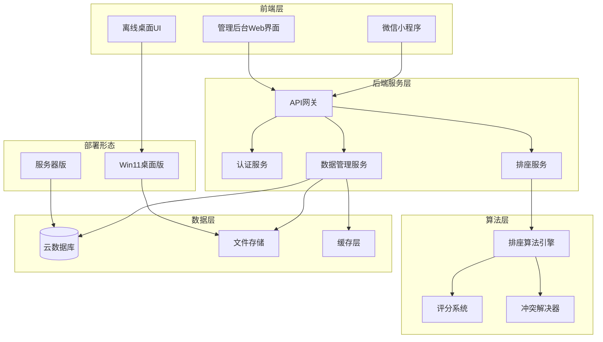
```mermaid
graph TB
    subgraph "前端层"
        MP[微信小程序]
        WEB[管理后台Web界面]
        OFFLINE[离线桌面UI]
    end
    
    subgraph "后端服务层"
        API[API网关]
        AUTH[认证服务]
        SEAT[排座服务]
        DATA[数据管理服务]
    end
    
    subgraph "算法层"
        ALG[排座算法引擎]
        SCORE[评分系统]
        CONFLICT[冲突解决器]
    end
    
    subgraph "数据层"
        DB[(云数据库)]
        FILE[文件存储]
        CACHE[缓存层]
    end
    
    subgraph "部署形态"
        CLOUD[服务器版]
        DESKTOP[Win11桌面版]
    end
    
    MP --> API
    WEB --> API
    OFFLINE --> DESKTOP
    
    API --> AUTH
    API --> SEAT
    API --> DATA
    
    SEAT --> ALG
    ALG --> SCORE
    ALG --> CONFLICT
    
    DATA --> DB
    DATA --> FILE
    DATA --> CACHE
    
    CLOUD --> DB
    DESKTOP --> FILE
```

### 2.2 部署架构

| 部署模式 | 适用场景 | 特性 |
|---------|---------|------|
| 服务器版 | 正常网络环境 | 实时数据同步、云端存储、多端访问 |
| Win11桌面版 | 离线环境 | 本地数据存储、文件导入导出、独立UI |

## 3. 功能模块设计

### 3.1 学生端功能架构

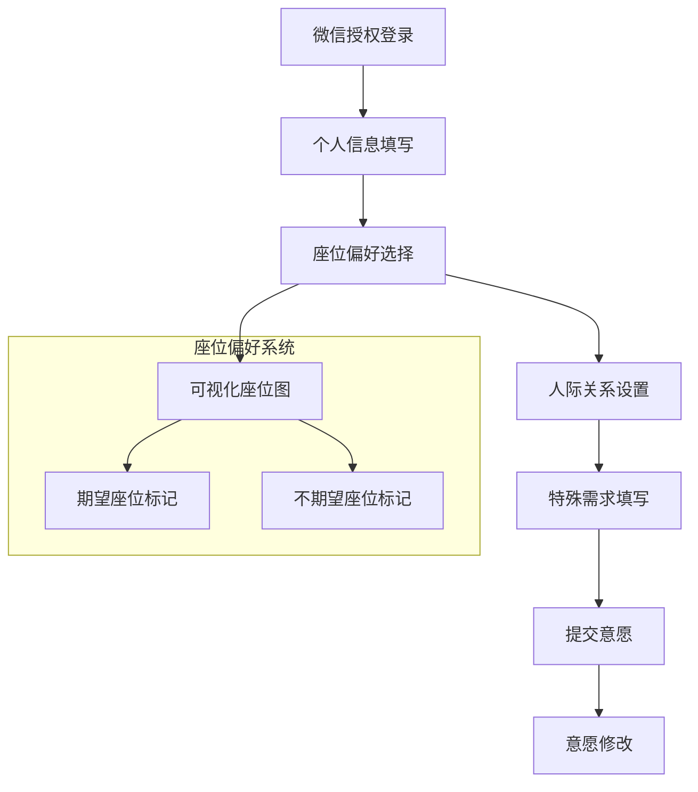
```mermaid
graph TD
    LOGIN[微信授权登录] --> PROFILE[个人信息填写]
    PROFILE --> SEAT_SELECT[座位偏好选择]
    SEAT_SELECT --> RELATION[人际关系设置]
    RELATION --> SPECIAL[特殊需求填写]
    SPECIAL --> SUBMIT[提交意愿]
    SUBMIT --> MODIFY[意愿修改]
    
    subgraph "座位偏好系统"
        VISUAL[可视化座位图]
        GREEN[期望座位标记]
        RED[不期望座位标记]
        VISUAL --> GREEN
        VISUAL --> RED
    end
    
    SEAT_SELECT --> VISUAL
```

#### 3.1.1 核心功能模块

| 功能模块 | 功能描述 | 关键特性 |
|---------|---------|----------|
| 身份认证 | 微信授权登录 | 获取用户基本信息，确保身份唯一性 |
| 信息填写 | 姓名学号输入 | 智能联想提示，基于已有学生名单 |
| 座位偏好 | 可视化座位选择 | 绿色标记期望座位，红色标记不期望座位 |
| 人际关系 | 同伴偏好设置 | 填写希望邻座和不希望邻座的同学 |
| 特殊需求 | 文本描述需求 | 向管理员展示个性化需求 |
| 意愿管理 | 提交和修改 | 截止时间前可重复修改 |

#### 3.1.2 座位图可视化规范

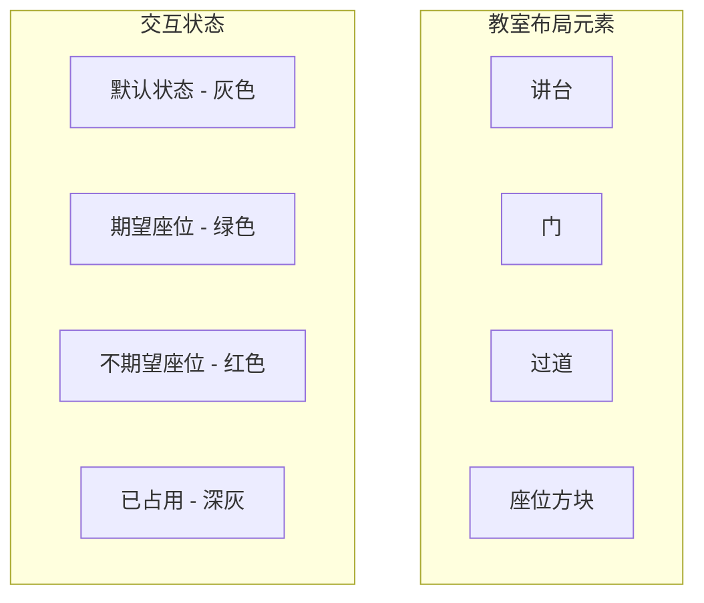
```mermaid
graph TD
    subgraph "教室布局元素"
        PODIUM[讲台]
        DOOR[门]
        AISLE[过道]
        SEAT[座位方块]
    end
    
    subgraph "交互状态"
        DEFAULT[默认状态 - 灰色]
        PREFER[期望座位 - 绿色]
        AVOID[不期望座位 - 红色]
        OCCUPIED[已占用 - 深灰]
    end
```

### 3.2 管理员端功能架构

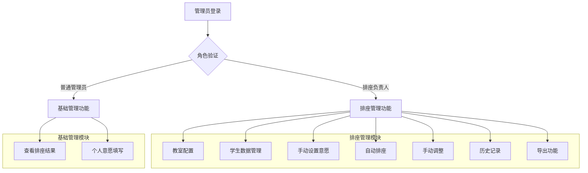
```mermaid
graph TD
    ADMIN_LOGIN[管理员登录] --> ROLE_CHECK{角色验证}
    ROLE_CHECK --> |排座负责人| SEAT_MANAGER[排座管理功能]
    ROLE_CHECK --> |普通管理员| ADMIN_FUNC[基础管理功能]
    
    subgraph "排座管理模块"
        CLASSROOM[教室配置]
        STUDENT_DATA[学生数据管理]
        MANUAL_WISH[手动设置意愿]
        AUTO_ARRANGE[自动排座]
        MANUAL_ADJUST[手动调整]
        HISTORY[历史记录]
        EXPORT[导出功能]
    end
    
    subgraph "基础管理模块"
        VIEW_RESULT[查看排座结果]
        PERSONAL_WISH[个人意愿填写]
    end
    
    SEAT_MANAGER --> CLASSROOM
    SEAT_MANAGER --> STUDENT_DATA
    SEAT_MANAGER --> MANUAL_WISH
    SEAT_MANAGER --> AUTO_ARRANGE
    SEAT_MANAGER --> MANUAL_ADJUST
    SEAT_MANAGER --> HISTORY
    SEAT_MANAGER --> EXPORT
    
    ADMIN_FUNC --> VIEW_RESULT
    ADMIN_FUNC --> PERSONAL_WISH
```

#### 3.2.1 权限管理体系

| 用户角色 | 权限范围 | 特殊说明 |
|---------|---------|----------|
| 排座负责人 | 所有功能权限 | 可参与排座，需单独意愿填写入口 |
| 普通管理员 | 查看结果、填写个人意愿 | 可参与排座，使用标准意愿填写流程 |

#### 3.2.2 核心管理功能

| 功能模块 | 功能描述 | 实现要点 |
|---------|---------|----------|
| 教室配置 | 设计座位布局 | 支持不规则教室布局，可设置固定座位 |
| 学生管理 | 维护学生名单 | 支持批量导入，处理转学和请假情况 |
| 意愿管理 | 手动设置学生意愿 | 为未填写意愿的学生代为设置 |
| 自动排座 | 执行排座算法 | 基于多权重评分系统生成最优方案 |
| 手动调整 | 微调排座结果 | 支持拖拽式座位调整 |
| 历史管理 | 查看历史排座 | 记录每次排座的时间、参数和结果 |
| 数据导出 | 导出各类数据 | 支持座位表、意愿数据、历史记录导出 |

### 3.3 排座算法引擎

#### 3.3.1 算法框架设计

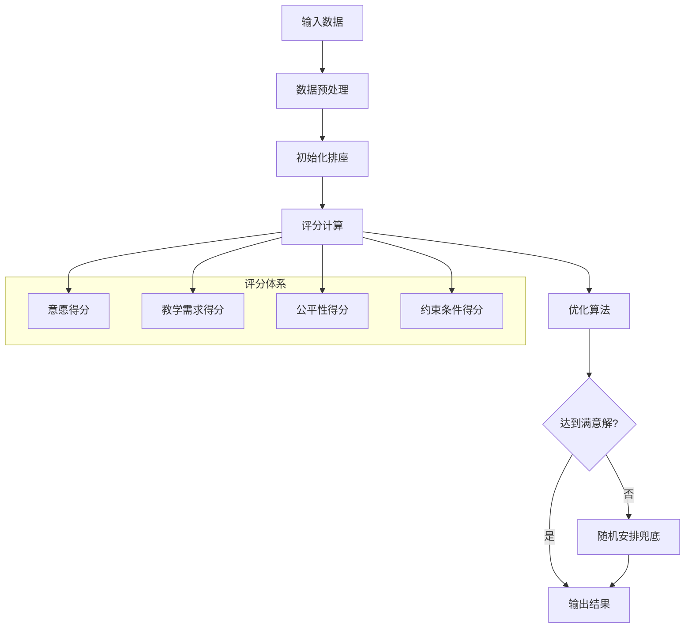
```mermaid
graph TD
    INPUT[输入数据] --> PREPROCESS[数据预处理]
    PREPROCESS --> INIT[初始化排座]
    INIT --> SCORE[评分计算]
    SCORE --> OPTIMIZE[优化算法]
    OPTIMIZE --> CHECK{达到满意解?}
    CHECK --> |是| OUTPUT[输出结果]
    CHECK --> |否| RANDOM[随机安排兜底]
    RANDOM --> OUTPUT
    
    subgraph "评分体系"
        WISH_SCORE[意愿得分]
        TEACHING_SCORE[教学需求得分]
        FAIRNESS_SCORE[公平性得分]
        CONSTRAINT_SCORE[约束条件得分]
    end
    
    SCORE --> WISH_SCORE
    SCORE --> TEACHING_SCORE
    SCORE --> FAIRNESS_SCORE
    SCORE --> CONSTRAINT_SCORE
```

#### 3.3.2 评分权重体系

| 评分维度 | 权重范围 | 计算要素 |
|---------|---------|----------|
| 学生意愿 | 40% | 座位偏好匹配度、人际关系满足度 |
| 教学需求 | 30% | 视力听力考虑、身高分布、成绩搭配 |
| 公平性 | 20% | 历史位置避重、轮换机制 |
| 约束条件 | 10% | 固定座位、特殊需求 |

#### 3.3.3 冲突解决策略

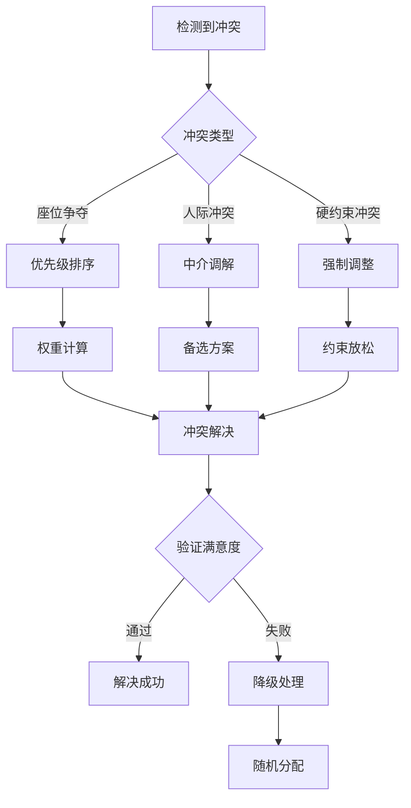
```mermaid
graph TD
    CONFLICT[检测到冲突] --> TYPE{冲突类型}
    TYPE --> |座位争夺| PRIORITY[优先级排序]
    TYPE --> |人际冲突| MEDIATE[中介调解]
    TYPE --> |硬约束冲突| FORCE[强制调整]
    
    PRIORITY --> WEIGHT[权重计算]
    MEDIATE --> ALTERNATIVE[备选方案]
    FORCE --> CONSTRAINT[约束放松]
    
    WEIGHT --> RESOLVE[冲突解决]
    ALTERNATIVE --> RESOLVE
    CONSTRAINT --> RESOLVE
    
    RESOLVE --> VERIFY{验证满意度}
    VERIFY --> |通过| SUCCESS[解决成功]
    VERIFY --> |失败| FALLBACK[降级处理]
    FALLBACK --> RANDOM_ASSIGN[随机分配]
```

## 4. 数据模型设计

### 4.1 核心实体关系

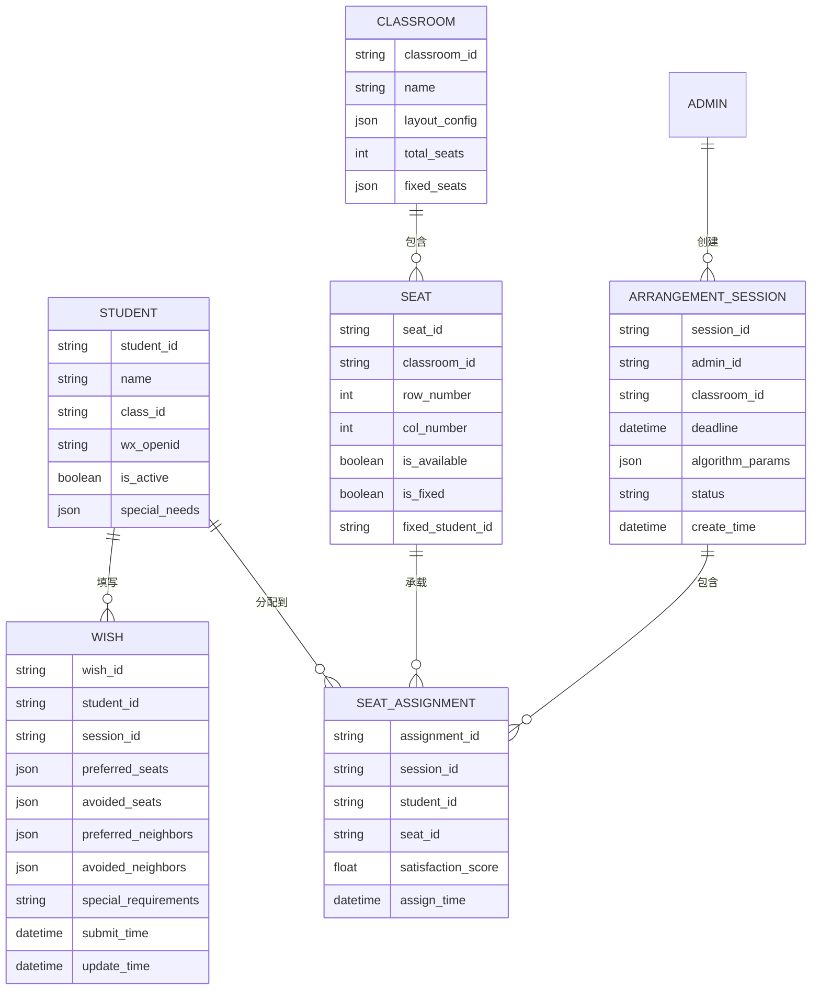
```mermaid
erDiagram
    STUDENT ||--o{ WISH : "填写"
    STUDENT ||--o{ SEAT_ASSIGNMENT : "分配到"
    CLASSROOM ||--o{ SEAT : "包含"
    SEAT ||--o{ SEAT_ASSIGNMENT : "承载"
    ADMIN ||--o{ ARRANGEMENT_SESSION : "创建"
    ARRANGEMENT_SESSION ||--o{ SEAT_ASSIGNMENT : "包含"
    
    STUDENT {
        string student_id
        string name
        string class_id
        string wx_openid
        boolean is_active
        json special_needs
    }
    
    WISH {
        string wish_id
        string student_id
        string session_id
        json preferred_seats
        json avoided_seats
        json preferred_neighbors
        json avoided_neighbors
        string special_requirements
        datetime submit_time
        datetime update_time
    }
    
    CLASSROOM {
        string classroom_id
        string name
        json layout_config
        int total_seats
        json fixed_seats
    }
    
    SEAT {
        string seat_id
        string classroom_id
        int row_number
        int col_number
        boolean is_available
        boolean is_fixed
        string fixed_student_id
    }
    
    ARRANGEMENT_SESSION {
        string session_id
        string admin_id
        string classroom_id
        datetime deadline
        json algorithm_params
        string status
        datetime create_time
    }
    
    SEAT_ASSIGNMENT {
        string assignment_id
        string session_id
        string student_id
        string seat_id
        float satisfaction_score
        datetime assign_time
    }
```

### 4.2 关键数据表设计

#### 4.2.1 学生信息表 (Student)

| 字段名 | 类型 | 说明 | 约束 |
|--------|------|------|------|
| student_id | VARCHAR(50) | 学生唯一标识 | 主键 |
| name | VARCHAR(100) | 学生姓名 | 非空 |
| student_number | VARCHAR(50) | 学号 | 唯一 |
| class_id | VARCHAR(50) | 班级标识 | 外键 |
| wx_openid | VARCHAR(100) | 微信OpenID | 唯一 |
| is_active | BOOLEAN | 是否在校 | 默认true |
| special_needs | JSON | 特殊需求 | 可空 |
| create_time | DATETIME | 创建时间 | 自动填充 |

#### 4.2.2 意愿信息表 (Wish)

| 字段名 | 类型 | 说明 | 约束 |
|--------|------|------|------|
| wish_id | VARCHAR(50) | 意愿唯一标识 | 主键 |
| student_id | VARCHAR(50) | 学生标识 | 外键 |
| session_id | VARCHAR(50) | 排座会话标识 | 外键 |
| preferred_seats | JSON | 期望座位列表 | 可空 |
| avoided_seats | JSON | 不期望座位列表 | 可空 |
| preferred_neighbors | JSON | 期望邻座列表 | 可空 |
| avoided_neighbors | JSON | 不期望邻座列表 | 可空 |
| special_requirements | TEXT | 特殊需求描述 | 可空 |
| submit_time | DATETIME | 提交时间 | 非空 |
| update_time | DATETIME | 更新时间 | 自动更新 |

### 4.3 配置数据结构

#### 4.3.1 教室布局配置

```mermaid
graph TD
    subgraph "教室配置JSON结构"
        LAYOUT[layout_config]
        LAYOUT --> DIMENSIONS[dimensions]
        LAYOUT --> SEATS[seats]
        LAYOUT --> ELEMENTS[elements]
        
        DIMENSIONS --> WIDTH[width: 数值]
        DIMENSIONS --> HEIGHT[height: 数值]
        
        SEATS --> SEAT_LIST[座位数组]
        SEAT_LIST --> SEAT_ITEM[seat_item]
        SEAT_ITEM --> POSITION[position: {x, y}]
        SEAT_ITEM --> STATUS[status: available/fixed/blocked]
        
        ELEMENTS --> PODIUM[podium: {x, y, width, height}]
        ELEMENTS --> DOOR[door: {x, y}]
        ELEMENTS --> AISLE[aisle: 路径数组]
    end
```

#### 4.3.2 算法参数配置

| 参数类别 | 参数名 | 取值范围 | 默认值 | 说明 |
|---------|--------|----------|--------|------|
| 权重设置 | wish_weight | 0.0-1.0 | 0.4 | 学生意愿权重 |
| 权重设置 | teaching_weight | 0.0-1.0 | 0.3 | 教学需求权重 |
| 权重设置 | fairness_weight | 0.0-1.0 | 0.2 | 公平性权重 |
| 权重设置 | constraint_weight | 0.0-1.0 | 0.1 | 约束条件权重 |
| 算法参数 | max_iterations | 100-10000 | 1000 | 最大迭代次数 |
| 算法参数 | min_satisfaction | 0.0-1.0 | 0.7 | 最低满意度阈值 |
| 算法参数 | enable_random_fallback | true/false | true | 启用随机兜底 |

## 5. 业务流程设计

### 5.1 完整排座流程

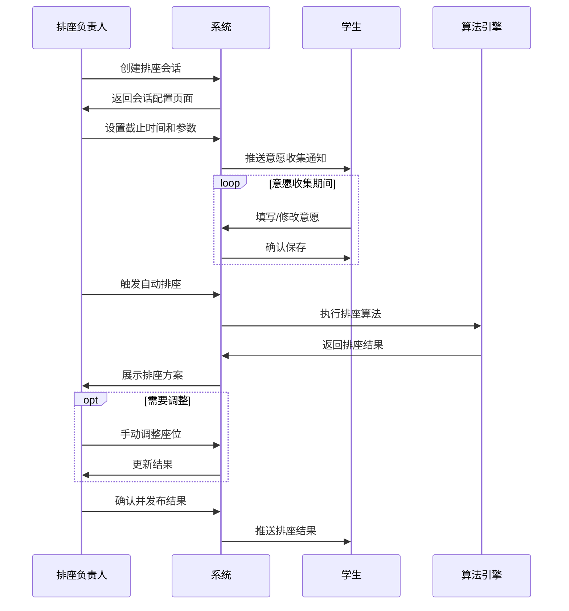
```mermaid
sequenceDiagram
    participant Admin as 排座负责人
    participant System as 系统
    participant Student as 学生
    participant Algorithm as 算法引擎
    
    Admin->>System: 创建排座会话
    System->>Admin: 返回会话配置页面
    Admin->>System: 设置截止时间和参数
    System->>Student: 推送意愿收集通知
    
    loop 意愿收集期间
        Student->>System: 填写/修改意愿
        System->>Student: 确认保存
    end
    
    Admin->>System: 触发自动排座
    System->>Algorithm: 执行排座算法
    Algorithm->>System: 返回排座结果
    System->>Admin: 展示排座方案
    
    opt 需要调整
        Admin->>System: 手动调整座位
        System->>Admin: 更新结果
    end
    
    Admin->>System: 确认并发布结果
    System->>Student: 推送排座结果
```

### 5.2 意愿收集子流程

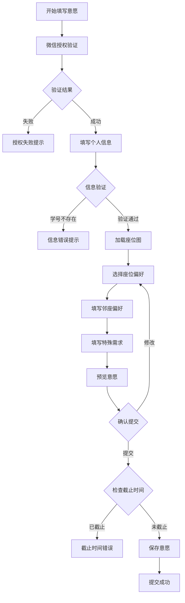
```mermaid
graph TD
    START[开始填写意愿] --> AUTH[微信授权验证]
    AUTH --> CHECK{验证结果}
    CHECK --> |失败| AUTH_FAIL[授权失败提示]
    CHECK --> |成功| INFO[填写个人信息]
    
    INFO --> VALIDATE{信息验证}
    VALIDATE --> |学号不存在| INFO_ERROR[信息错误提示]
    VALIDATE --> |验证通过| SEAT_MAP[加载座位图]
    
    SEAT_MAP --> SELECT[选择座位偏好]
    SELECT --> NEIGHBOR[填写邻座偏好]
    NEIGHBOR --> SPECIAL[填写特殊需求]
    SPECIAL --> PREVIEW[预览意愿]
    PREVIEW --> CONFIRM{确认提交}
    
    CONFIRM --> |修改| SELECT
    CONFIRM --> |提交| DEADLINE{检查截止时间}
    DEADLINE --> |已截止| DEADLINE_ERROR[截止时间错误]
    DEADLINE --> |未截止| SAVE[保存意愿]
    SAVE --> SUCCESS[提交成功]
```

### 5.3 离线同步流程

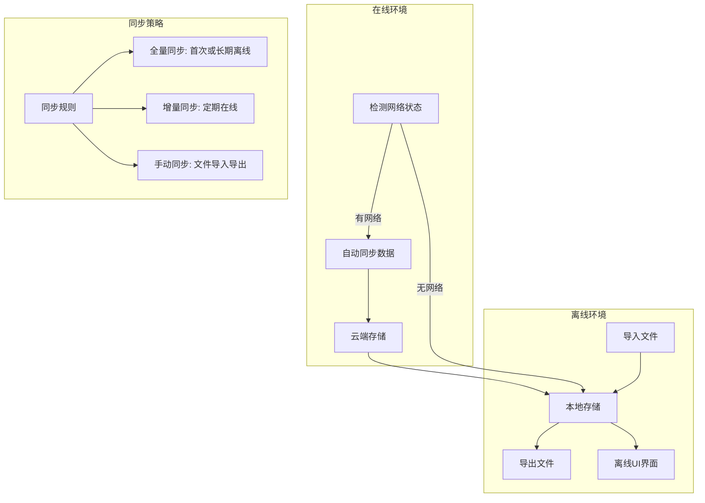
```mermaid
graph TD
    subgraph "在线环境"
        ONLINE_CHECK[检测网络状态]
        AUTO_SYNC[自动同步数据]
        CLOUD_STORAGE[云端存储]
    end
    
    subgraph "离线环境"
        LOCAL_STORAGE[本地存储]
        EXPORT_FILE[导出文件]
        IMPORT_FILE[导入文件]
        OFFLINE_UI[离线UI界面]
    end
    
    ONLINE_CHECK --> |有网络| AUTO_SYNC
    AUTO_SYNC --> CLOUD_STORAGE
    CLOUD_STORAGE --> LOCAL_STORAGE
    
    ONLINE_CHECK --> |无网络| LOCAL_STORAGE
    LOCAL_STORAGE --> EXPORT_FILE
    IMPORT_FILE --> LOCAL_STORAGE
    LOCAL_STORAGE --> OFFLINE_UI
    
    subgraph "同步策略"
        SYNC_RULE[同步规则]
        SYNC_RULE --> FULL_SYNC[全量同步: 首次或长期离线]
        SYNC_RULE --> INCREMENTAL[增量同步: 定期在线]
        SYNC_RULE --> MANUAL_SYNC[手动同步: 文件导入导出]
    end
```

## 6. 接口设计

### 6.1 RESTful API 设计

#### 6.1.1 认证相关接口

| 接口路径 | 方法 | 功能描述 | 请求参数 | 响应数据 |
|---------|------|----------|----------|----------|
| /api/auth/wx-login | POST | 微信授权登录 | code, userInfo | token, userProfile |
| /api/auth/admin-login | POST | 管理员登录 | username, password | token, role, permissions |
| /api/auth/logout | POST | 用户登出 | token | success |
| /api/auth/refresh | POST | 刷新令牌 | refreshToken | newToken |

#### 6.1.2 学生意愿接口

| 接口路径 | 方法 | 功能描述 | 请求参数 | 响应数据 |
|---------|------|----------|----------|----------|
| /api/wish/submit | POST | 提交意愿 | studentId, sessionId, wishData | wishId, submitTime |
| /api/wish/update | PUT | 更新意愿 | wishId, wishData | updateTime |
| /api/wish/get | GET | 获取意愿 | studentId, sessionId | wishData |
| /api/wish/list | GET | 获取意愿列表 | sessionId, page, limit | wishList, total |

#### 6.1.3 排座管理接口

| 接口路径 | 方法 | 功能描述 | 请求参数 | 响应数据 |
|---------|------|----------|----------|----------|
| /api/session/create | POST | 创建排座会话 | classroomId, deadline, params | sessionId |
| /api/session/start-arrange | POST | 开始自动排座 | sessionId | taskId |
| /api/session/get-result | GET | 获取排座结果 | sessionId | seatAssignments, score |
| /api/session/manual-adjust | PUT | 手动调整座位 | sessionId, adjustments | newAssignments |
| /api/session/publish | POST | 发布排座结果 | sessionId | publishTime |

### 6.2 数据传输格式

#### 6.2.1 意愿数据格式

```json
{
  "wishId": "wish_20241201_001",
  "studentId": "stu_001",
  "sessionId": "session_001",
  "preferredSeats": [
    {"row": 1, "col": 1, "priority": 1},
    {"row": 1, "col": 2, "priority": 2}
  ],
  "avoidedSeats": [
    {"row": 5, "col": 1},
    {"row": 5, "col": 2}
  ],
  "preferredNeighbors": [
    {"studentId": "stu_002", "relationship": "friend"},
    {"studentId": "stu_003", "relationship": "study_partner"}
  ],
  "avoidedNeighbors": [
    {"studentId": "stu_004", "reason": "personality_conflict"}
  ],
  "specialRequirements": "需要靠近讲台，视力较差",
  "submitTime": "2024-12-01T10:30:00Z",
  "updateTime": "2024-12-01T15:45:00Z"
}
```

#### 6.2.2 排座结果格式

```json
{
  "sessionId": "session_001",
  "classroomId": "classroom_001",
  "totalStudents": 45,
  "algorithm": "weighted_optimization",
  "overallSatisfaction": 0.85,
  "assignments": [
    {
      "studentId": "stu_001",
      "seatId": "seat_1_1",
      "row": 1,
      "col": 1,
      "satisfactionScore": 0.9,
      "reasons": [
        "preferred_seat_matched",
        "preferred_neighbor_nearby"
      ]
    }
  ],
  "statistics": {
    "wishFulfillmentRate": 0.78,
    "conflictResolutions": 5,
    "randomAssignments": 2
  },
  "generateTime": "2024-12-01T16:00:00Z"
}
```

## 7. 非功能性需求

### 7.1 性能要求

| 性能指标 | 目标值 | 测试场景 |
|---------|--------|----------|
| 意愿提交响应时间 | < 2秒 | 正常网络环境 |
| 排座算法执行时间 | < 30秒 | 80人班级 |
| 座位图加载时间 | < 1秒 | 微信小程序内 |
| 并发用户支持 | 200+ | 同时填写意愿 |
| 数据同步时间 | < 10秒 | 离线到在线切换 |

### 7.2 可用性要求

#### 7.2.1 系统可用性
- **服务可用性**：99.5%（除计划维护时间）
- **故障恢复时间**：< 4小时
- **数据备份频率**：每日自动备份
- **离线可用性**：支持完全离线运行

#### 7.2.2 用户体验要求
- **操作直观性**：用户无需培训即可完成基本操作
- **错误提示**：提供清晰的错误信息和解决建议
- **响应式设计**：适配不同屏幕尺寸
- **无障碍支持**：支持视力障碍用户使用

### 7.3 安全性要求

#### 7.3.1 数据安全
- **数据加密**：敏感数据传输和存储加密
- **权限控制**：基于角色的访问控制
- **审计日志**：记录关键操作日志
- **数据脱敏**：导出数据时自动脱敏

#### 7.3.2 身份认证
- **微信授权**：基于微信官方授权机制
- **令牌管理**：JWT令牌有效期控制
- **会话安全**：防止会话劫持和重放攻击
- **多端登录**：支持同一用户多设备登录

### 7.4 兼容性要求

#### 7.4.1 平台兼容性
| 平台类型 | 支持版本 | 特殊说明 |
|---------|---------|----------|
| 微信小程序 | 基础库2.0+ | 主要用户界面 |
| Windows 11 | 21H2+ | 桌面版支持 |
| Web浏览器 | Chrome 80+, Safari 13+ | 管理后台 |
| 移动设备 | iOS 12+, Android 8+ | 微信内访问 |

#### 7.4.2 数据兼容性
- **导入格式**：支持Excel、CSV格式
- **导出格式**：支持Excel、PDF、图片格式
- **版本兼容**：向下兼容历史数据格式
- **字符编码**：支持UTF-8编码

## 8. 部署与运维

### 8.1 部署架构

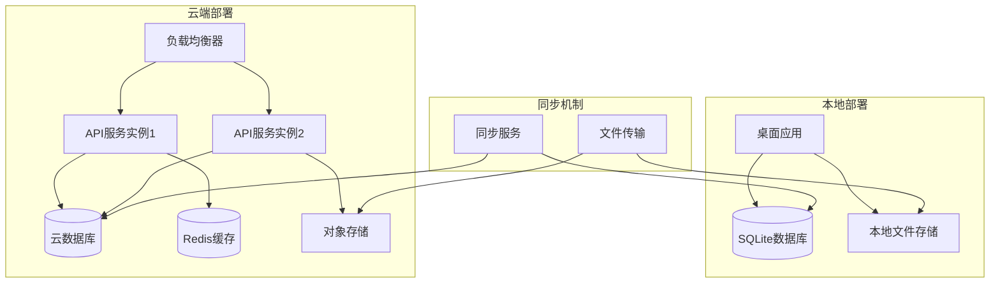
```mermaid
graph TD
    subgraph "云端部署"
        LB[负载均衡器]
        API1[API服务实例1]
        API2[API服务实例2]
        DB[(云数据库)]
        REDIS[(Redis缓存)]
        OSS[对象存储]
    end
    
    subgraph "本地部署"
        DESKTOP[桌面应用]
        SQLITE[(SQLite数据库)]
        LOCAL_FILE[本地文件存储]
    end
    
    subgraph "同步机制"
        SYNC_SERVICE[同步服务]
        FILE_TRANSFER[文件传输]
    end
    
    LB --> API1
    LB --> API2
    API1 --> DB
    API2 --> DB
    API1 --> REDIS
    API2 --> OSS
    
    DESKTOP --> SQLITE
    DESKTOP --> LOCAL_FILE
    
    SYNC_SERVICE --> DB
    SYNC_SERVICE --> SQLITE
    FILE_TRANSFER --> OSS
    FILE_TRANSFER --> LOCAL_FILE
```

### 8.2 环境配置

#### 8.2.1 服务器环境要求
| 组件 | 最低配置 | 推荐配置 |
|------|----------|----------|
| CPU | 2核 | 4核 |
| 内存 | 4GB | 8GB |
| 存储 | 50GB SSD | 100GB SSD |
| 带宽 | 10Mbps | 100Mbps |
| 操作系统 | Linux/Windows Server | CentOS 7+/Windows Server 2019+ |

#### 8.2.2 桌面环境要求
| 项目 | 要求 |
|------|------|
| 操作系统 | Windows 11 21H2+ |
| 内存 | 4GB+ |
| 存储空间 | 1GB可用空间 |
| .NET版本 | .NET 6.0+ |
| 显示器 | 1366x768+ |

### 8.3 监控与维护

#### 8.3.1 监控指标
- **系统监控**：CPU、内存、磁盘使用率
- **应用监控**：接口响应时间、错误率、并发数
- **业务监控**：意愿提交数、排座成功率、用户活跃度
- **数据监控**：数据库连接数、缓存命中率、存储使用量

#### 8.3.2 备份策略
- **自动备份**：每日凌晨3点自动备份数据库
- **增量备份**：每4小时增量备份变更数据
- **本地备份**：桌面版支持本地数据备份
- **恢复测试**：每月进行备份恢复测试

#### 8.3.3 更新维护
- **版本控制**：采用语义化版本号管理
- **灰度发布**：新功能先在小范围内测试
- **回滚机制**：支持快速回滚到上一稳定版本
- **维护窗口**：每周日凌晨2-4点为维护时间

## 9. 测试策略

### 9.1 测试层次架构

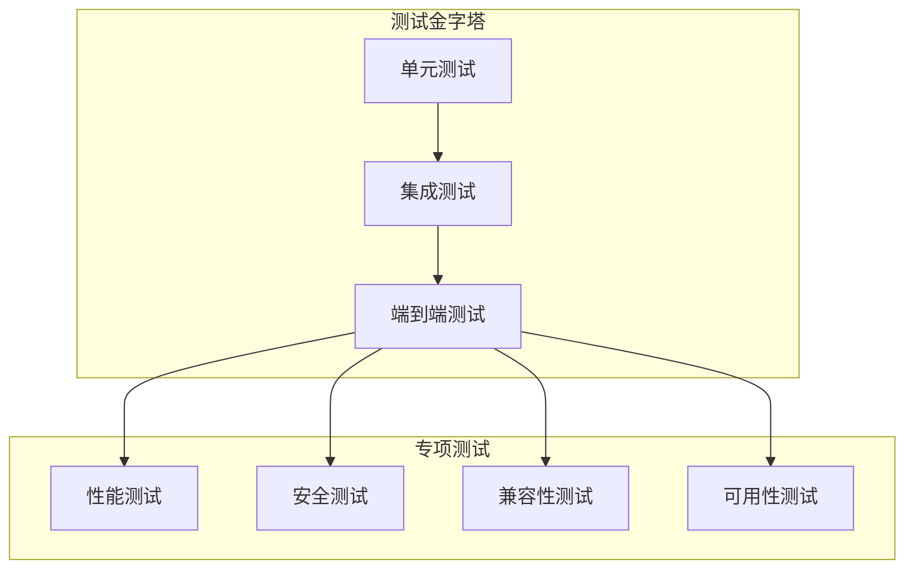
```mermaid
graph TD
    subgraph "测试金字塔"
        E2E[端到端测试]
        INTEGRATION[集成测试]
        UNIT[单元测试]
    end
    
    subgraph "专项测试"
        PERFORMANCE[性能测试]
        SECURITY[安全测试]
        COMPATIBILITY[兼容性测试]
        USABILITY[可用性测试]
    end
    
    UNIT --> INTEGRATION
    INTEGRATION --> E2E
    
    E2E --> PERFORMANCE
    E2E --> SECURITY
    E2E --> COMPATIBILITY
    E2E --> USABILITY
```

### 9.2 测试用例设计

#### 9.2.1 功能测试用例

| 测试模块 | 测试场景 | 预期结果 | 优先级 |
|---------|----------|----------|--------|
| 微信登录 | 正常授权登录 | 成功获取用户信息并生成令牌 | 高 |
| 意愿提交 | 完整填写并提交意愿 | 意愿数据正确保存到数据库 | 高 |
| 座位选择 | 点击座位图选择偏好 | 界面状态正确更新并记录选择 | 高 |
| 自动排座 | 执行排座算法 | 生成合理的座位安排方案 | 高 |
| 手动调整 | 拖拽调整座位 | 座位交换成功并更新结果 | 中 |
| 数据导出 | 导出座位表 | 生成正确格式的文件 | 中 |
| 离线同步 | 离线数据与在线同步 | 数据一致性得到保证 | 中 |

#### 9.2.2 边界测试用例

| 边界场景 | 测试描述 | 验证要点 |
|---------|----------|----------|
| 最大班级规模 | 80人班级排座 | 算法性能和结果质量 |
| 截止时间边界 | 截止时间前后提交 | 时间控制的准确性 |
| 网络异常 | 网络中断时操作 | 离线功能和数据完整性 |
| 并发操作 | 多用户同时提交意愿 | 数据一致性和系统稳定性 |
| 空意愿处理 | 部分学生未填写意愿 | 算法的容错能力 |

### 9.3 性能测试

#### 9.3.1 负载测试场景

| 测试场景 | 并发用户数 | 持续时间 | 成功标准 |
|---------|-----------|----------|----------|
| 正常负载 | 100用户 | 30分钟 | 响应时间<2秒，错误率<1% |
| 高负载 | 200用户 | 15分钟 | 响应时间<5秒，错误率<5% |
| 峰值负载 | 500用户 | 5分钟 | 系统不崩溃，基本功能可用 |
| 稳定性测试 | 50用户 | 24小时 | 内存无泄漏，服务稳定运行 |

#### 9.3.2 算法性能测试

| 班级规模 | 期望执行时间 | 内存使用 | 成功率要求 |
|---------|-------------|----------|------------|
| 20人 | <5秒 | <100MB | 95%+ |
| 40人 | <15秒 | <200MB | 90%+ |
| 60人 | <25秒 | <300MB | 85%+ |
| 80人 | <30秒 | <400MB | 80%+ |

### 9.4 自动化测试

#### 9.4.1 持续集成测试流程

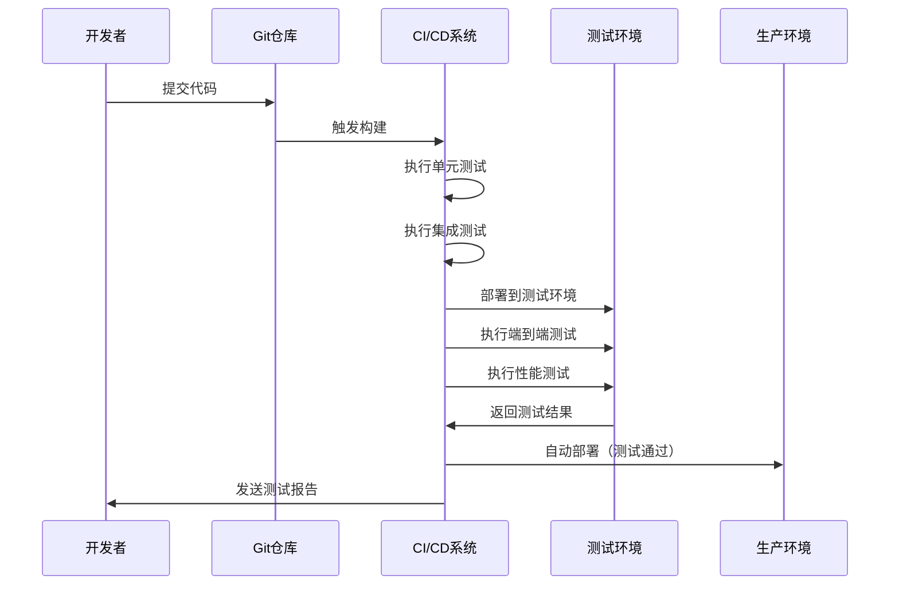
```mermaid
sequenceDiagram
    participant Dev as 开发者
    participant Git as Git仓库
    participant CI as CI/CD系统
    participant Test as 测试环境
    participant Prod as 生产环境
    
    Dev->>Git: 提交代码
    Git->>CI: 触发构建
    CI->>CI: 执行单元测试
    CI->>CI: 执行集成测试
    CI->>Test: 部署到测试环境
    CI->>Test: 执行端到端测试
    CI->>Test: 执行性能测试
    Test->>CI: 返回测试结果
    CI->>Prod: 自动部署（测试通过）
    CI->>Dev: 发送测试报告
```

#### 9.4.2 测试工具选择

| 测试类型 | 工具选择 | 用途说明 |
|---------|----------|----------|
| 单元测试 | Jest, Mocha | 前端和后端单元测试 |
| 接口测试 | Postman, Newman | API自动化测试 |
| UI测试 | Selenium, Cypress | Web界面自动化测试 |
| 小程序测试 | 微信开发者工具 | 小程序功能测试 |
| 性能测试 | JMeter, LoadRunner | 负载和压力测试 |
| 安全测试 | OWASP ZAP | 安全漏洞扫描 |

## 10. 通知与消息系统

### 10.1 通知机制设计

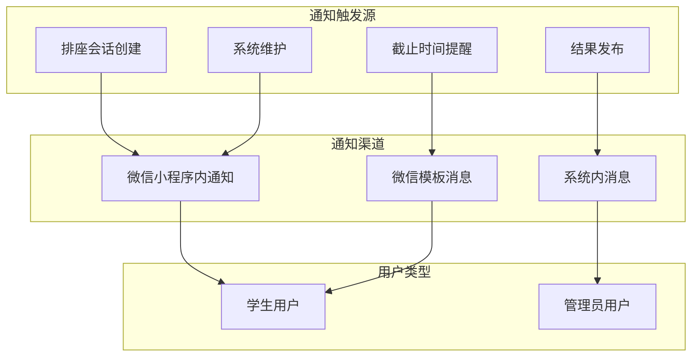
```mermaid
graph TD
    subgraph "通知触发源"
        SESSION_CREATE[排座会话创建]
        DEADLINE_REMIND[截止时间提醒]
        RESULT_PUBLISH[结果发布]
        SYSTEM_MAINT[系统维护]
    end
    
    subgraph "通知渠道"
        WX_NOTIFY[微信小程序内通知]
        WX_MSG[微信模板消息]
        SYSTEM_MSG[系统内消息]
    end
    
    subgraph "用户类型"
        STUDENTS[学生用户]
        ADMINS[管理员用户]
    end
    
    SESSION_CREATE --> WX_NOTIFY
    DEADLINE_REMIND --> WX_MSG
    RESULT_PUBLISH --> SYSTEM_MSG
    SYSTEM_MAINT --> WX_NOTIFY
    
    WX_NOTIFY --> STUDENTS
    WX_MSG --> STUDENTS
    SYSTEM_MSG --> ADMINS
```

### 10.2 通知类型与内容

| 通知类型 | 触发条件 | 目标用户 | 通知内容 | 发送渠道 |
|---------|----------|----------|----------|----------|
| 意愿收集开始 | 排座会话创建 | 全体学生 | "新的排座意愿收集已开始，请及时填写" | 小程序通知+模板消息 |
| 截止时间提醒 | 距离截止24/6/1小时 | 未提交学生 | "排座意愿即将截止，请尽快提交" | 模板消息 |
| 排座结果发布 | 结果确认发布 | 全体参与者 | "排座结果已出，请查看您的座位安排" | 小程序通知 |
| 系统维护通知 | 维护计划执行 | 所有用户 | "系统将于XX时间进行维护" | 系统公告 |
| 意愿修改提醒 | 学生修改意愿 | 管理员 | "学生XX已修改排座意愿" | 系统消息 |

### 10.3 消息模板设计

#### 10.3.1 微信模板消息格式
```json
{
  "touser": "用户openid",
  "template_id": "模板ID",
  "data": {
    "first": {"value": "排座意愿收集通知"},
    "keyword1": {"value": "计算机科学与技术1班"},
    "keyword2": {"value": "2024年12月01日 18:00"},
    "keyword3": {"value": "请及时填写您的座位偏好"},
    "remark": {"value": "点击查看详情"}
  }
}
```

## 11. 错误处理与异常管理

### 11.1 错误分类体系

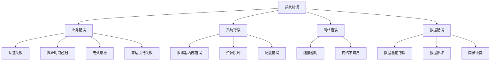
```mermaid
graph TD
    ERROR[系统错误] --> BUSINESS[业务错误]
    ERROR --> SYSTEM[系统错误]
    ERROR --> NETWORK[网络错误]
    ERROR --> DATA[数据错误]
    
    BUSINESS --> AUTH_FAIL[认证失败]
    BUSINESS --> DEADLINE_EXCEED[截止时间超过]
    BUSINESS --> INVALID_WISH[无效意愿]
    BUSINESS --> ALGORITHM_FAIL[算法执行失败]
    
    SYSTEM --> SERVER_ERROR[服务器内部错误]
    SYSTEM --> RESOURCE_LIMIT[资源限制]
    SYSTEM --> CONFIG_ERROR[配置错误]
    
    NETWORK --> CONNECTION_TIMEOUT[连接超时]
    NETWORK --> NETWORK_UNAVAILABLE[网络不可用]
    
    DATA --> VALIDATION_ERROR[数据验证错误]
    DATA --> CORRUPTION[数据损坏]
    DATA --> SYNC_CONFLICT[同步冲突]
```

### 11.2 错误处理策略

| 错误类型 | 处理策略 | 用户提示 | 恢复机制 |
|---------|---------|----------|----------|
| 网络连接失败 | 自动重试3次 | "网络连接异常，正在重试..." | 启用离线模式 |
| 意愿提交失败 | 本地暂存 | "提交失败，已保存到本地" | 网络恢复后自动提交 |
| 算法执行超时 | 降级策略 | "正在使用备用算法生成结果" | 启用随机分配 |
| 数据同步冲突 | 冲突检测 | "检测到数据冲突，请选择处理方式" | 手动选择或自动合并 |
| 服务器内部错误 | 错误记录 | "系统暂时不可用，请稍后重试" | 故障转移到备用服务 |

### 11.3 异常监控与告警

#### 11.3.1 监控指标
- **错误率监控**：API错误率 > 5%触发告警
- **响应时间监控**：平均响应时间 > 5秒触发告警
- **系统资源监控**：CPU使用率 > 80%触发告警
- **业务指标监控**：排座失败率 > 10%触发告警

#### 11.3.2 告警机制
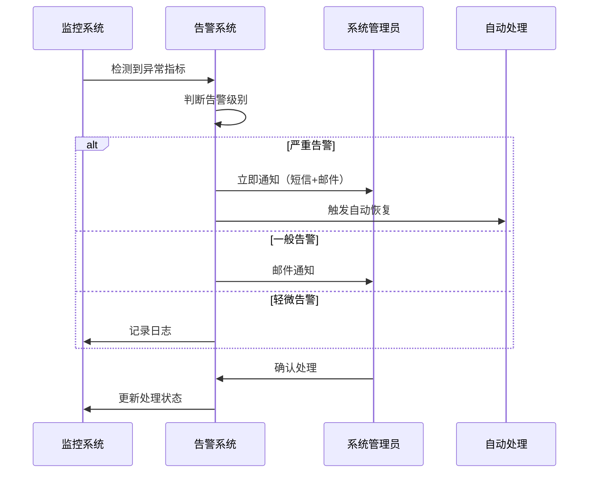
```mermaid
sequenceDiagram
    participant Monitor as 监控系统
    participant Alert as 告警系统
    participant Admin as 系统管理员
    participant Auto as 自动处理
    
    Monitor->>Alert: 检测到异常指标
    Alert->>Alert: 判断告警级别
    
    alt 严重告警
        Alert->>Admin: 立即通知（短信+邮件）
        Alert->>Auto: 触发自动恢复
    else 一般告警
        Alert->>Admin: 邮件通知
    else 轻微告警
        Alert->>Monitor: 记录日志
    end
    
    Admin->>Alert: 确认处理
    Alert->>Monitor: 更新处理状态
```

## 12. 数据迁移与版本升级

### 12.1 数据迁移策略

#### 12.1.1 迁移场景

| 迁移场景 | 触发条件 | 迁移范围 | 回滚策略 |
|---------|---------|----------|----------|
| 数据库结构升级 | 版本更新 | 表结构、索引 | 保留原表备份 |
| 历史数据归档 | 存储空间不足 | 历史排座记录 | 归档数据可恢复 |
| 跨环境迁移 | 环境切换 | 全量数据 | 源环境保持可用 |
| 离线数据导入 | 初始化使用 | 学生名单、教室配置 | 支持重新导入 |

#### 12.1.2 迁移流程设计

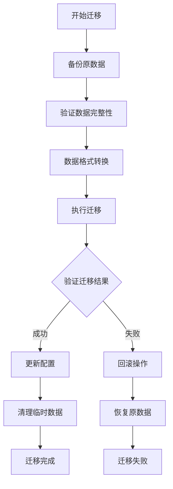
```mermaid
graph TD
    START[开始迁移] --> BACKUP[备份原数据]
    BACKUP --> VALIDATE[验证数据完整性]
    VALIDATE --> CONVERT[数据格式转换]
    CONVERT --> MIGRATE[执行迁移]
    MIGRATE --> VERIFY{验证迁移结果}
    
    VERIFY --> |成功| UPDATE[更新配置]
    VERIFY --> |失败| ROLLBACK[回滚操作]
    
    UPDATE --> CLEANUP[清理临时数据]
    ROLLBACK --> RESTORE[恢复原数据]
    
    CLEANUP --> SUCCESS[迁移完成]
    RESTORE --> FAILED[迁移失败]
```

### 12.2 版本兼容性管理

#### 12.2.1 版本号规则
- **主版本号**：不兼容的API修改
- **次版本号**：向下兼容的功能新增
- **修订号**：向下兼容的问题修正

#### 12.2.2 兼容性矩阵

| 客户端版本 | 服务端版本 | 兼容性 | 说明 |
|-----------|-----------|--------|------|
| 1.x | 1.x | 完全兼容 | 同主版本号完全兼容 |
| 1.x | 2.x | 基础兼容 | 核心功能兼容，新功能不可用 |
| 1.x | 3.x | 不兼容 | 需要升级客户端 |

## 13. 运营支持功能

### 13.1 统计分析功能

#### 13.1.1 数据统计维度

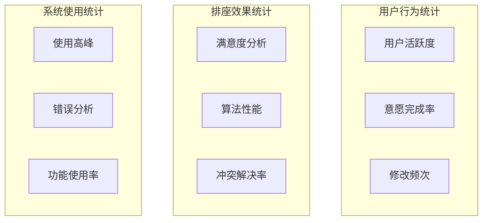
```mermaid
graph TD
    subgraph "用户行为统计"
        USER_ACTIVE[用户活跃度]
        WISH_COMPLETION[意愿完成率]
        MODIFICATION_FREQ[修改频次]
    end
    
    subgraph "排座效果统计"
        SATISFACTION[满意度分析]
        ALGORITHM_PERF[算法性能]
        CONFLICT_RATE[冲突解决率]
    end
    
    subgraph "系统使用统计"
        PEAK_USAGE[使用高峰]
        ERROR_ANALYSIS[错误分析]
        FEATURE_USAGE[功能使用率]
    end
```

#### 13.1.2 报表生成

| 报表类型 | 生成频率 | 内容描述 | 目标用户 |
|---------|---------|----------|----------|
| 日常运营报表 | 每日 | 用户活跃、意愿提交情况 | 管理员 |
| 排座效果报表 | 每次排座后 | 满意度、冲突解决情况 | 排座负责人 |
| 系统性能报表 | 每周 | 系统性能、错误统计 | 技术团队 |
| 学期总结报表 | 每学期 | 整体使用效果分析 | 学校管理层 |

### 13.2 用户反馈机制

#### 13.2.1 反馈收集方式

| 反馈方式 | 触发时机 | 收集内容 | 处理流程 |
|---------|---------|----------|----------|
| 满意度评分 | 排座结果发布后 | 1-5星评分+文字评价 | 自动统计分析 |
| 问题举报 | 任意时间 | 问题描述+截图 | 工单系统处理 |
| 功能建议 | 任意时间 | 建议描述+优先级 | 产品需求池 |
| 使用体验调研 | 定期发起 | 详细问卷调查 | 专项分析报告 |

### 13.3 帮助与文档系统

#### 13.3.1 用户帮助体系

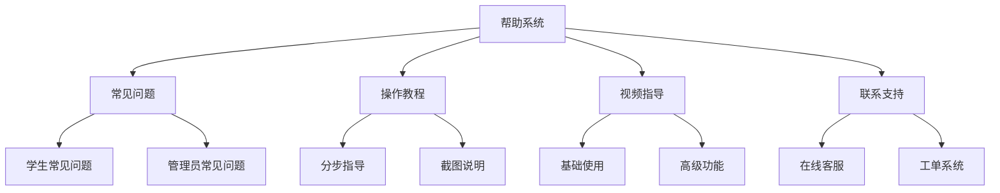
```mermaid
graph TD
    HELP[帮助系统] --> FAQ[常见问题]
    HELP --> TUTORIAL[操作教程]
    HELP --> VIDEO[视频指导]
    HELP --> CONTACT[联系支持]
    
    FAQ --> STUDENT_FAQ[学生常见问题]
    FAQ --> ADMIN_FAQ[管理员常见问题]
    
    TUTORIAL --> STEP_GUIDE[分步指导]
    TUTORIAL --> SCREENSHOT[截图说明]
    
    VIDEO --> BASIC_USAGE[基础使用]
    VIDEO --> ADVANCED_FEATURE[高级功能]
    
    CONTACT --> ONLINE_SUPPORT[在线客服]
    CONTACT --> TICKET_SYSTEM[工单系统]
```

#### 13.3.2 文档维护策略
- **内容更新**：每次功能更新后同步更新文档
- **用户反馈**：基于用户反馈优化文档内容
- **多媒体支持**：图文并茂，提供视频教程
- **搜索功能**：支持关键词搜索和智能推荐