# 管理员面板交互体验优化设计

## 概述

针对当前管理员面板按钮点击无反应的问题，设计一套完整的交互体验优化方案。该方案将重点解决按钮交互反馈缺失、加载状态不明确、错误处理不完善等用户体验问题，确保管理员操作的及时反馈和状态可见性。

## 技术栈与依赖

| 技术组件 | 用途 | 实现方式 |
|---------|------|---------|
| 微信小程序框架 | 前端交互界面 | WXML、WXSS、JavaScript |
| 云函数后端 | 业务逻辑处理 | Node.js + 微信云开发 |
| 数据状态管理 | 组件状态控制 | 小程序 data 绑定机制 |
| 用户反馈组件 | 交互状态展示 | wx.showLoading、wx.showToast |

## 交互体验问题分析

### 当前问题识别

| 问题类别 | 具体表现 | 影响范围 |
|---------|---------|---------|
| 按钮反馈缺失 | 点击按钮后无即时视觉反馈 | 所有操作按钮 |
| 加载状态不明确 | 异步操作执行期间状态不可见 | 数据加载、提交操作 |
| 重复提交风险 | 按钮未在执行期间禁用 | 关键业务操作 |
| 错误处理不完善 | 操作失败时反馈信息不清晰 | 所有异步操作 |

### 用户体验影响评估

``mermaid
graph TD
    A[用户点击按钮] --> B{是否有即时反馈?}
    B -->|否| C[用户困惑]
    B -->|是| D[等待操作完成]
    C --> E[重复点击]
    D --> F{操作是否成功?}
    E --> G[系统异常]
    F -->|成功| H[显示成功状态]
    F -->|失败| I[显示错误信息]
    G --> J[用户体验差]
    H --> K[用户体验好]
    I --> L{错误信息是否清晰?}
    L -->|是| M[用户可自行解决]
    L -->|否| N[用户无法继续操作]
```

## 按钮交互状态设计

### 状态定义体系

| 状态名称 | 视觉表现 | 交互行为 | 适用场景 |
|---------|---------|---------|---------|
| 默认状态 | 正常颜色，可点击 | 响应用户点击 | 按钮初始状态 |
| 悬停状态 | 颜色略深，鼠标指针变化 | 提供视觉反馈 | 鼠标悬停时 |
| 激活状态 | 按下效果 | 即时视觉反馈 | 点击瞬间 |
| 加载状态 | 显示加载图标，按钮禁用 | 阻止重复操作 | 异步操作执行中 |
| 成功状态 | 绿色背景，成功图标 | 短暂显示后恢复 | 操作成功完成 |
| 错误状态 | 红色背景，错误图标 | 短暂显示后恢复 | 操作失败时 |
| 禁用状态 | 灰色背景，不可点击 | 无响应 | 权限不足或条件不满足 |

### 按钮分类与交互策略

#### 主要操作按钮

| 按钮类型 | 功能描述 | 交互策略 |
|---------|---------|---------|
| 创建会话 | 创建新的排座会话 | 加载状态 + 成功反馈 + 页面跳转 |
| 执行排座 | 执行座位分配算法 | 长时间加载状态 + 进度提示 |
| 导出数据 | 导出排座结果 | 加载状态 + 下载完成提示 |
| 保存设置 | 保存系统配置 | 加载状态 + 成功提示 |

#### 次要操作按钮

| 按钮类型 | 功能描述 | 交互策略 |
|---------|---------|---------|
| 刷新数据 | 重新加载页面数据 | 短暂加载状态 + 无声更新 |
| 查看详情 | 跳转到详情页面 | 即时跳转 + 页面切换动画 |
| 编辑信息 | 进入编辑模式 | 状态切换 + 界面变化 |
| 取消操作 | 取消当前操作 | 即时响应 + 状态恢复 |

## 加载状态管理架构

### 状态管理流程

``mermaid
stateDiagram-v2
    [*] --> 空闲状态
    空闲状态 --> 加载状态 : 用户触发操作
    加载状态 --> 成功状态 : 操作成功
    加载状态 --> 错误状态 : 操作失败
    成功状态 --> 空闲状态 : 2秒后自动恢复
    错误状态 --> 空闲状态 : 用户确认或3秒后
    加载状态 --> 空闲状态 : 用户取消操作
```

### 数据结构设计

#### 按钮状态管理对象

| 字段名 | 数据类型 | 默认值 | 描述 |
|-------|---------|-------|------|
| loading | Boolean | false | 是否处于加载状态 |
| disabled | Boolean | false | 是否禁用按钮 |
| text | String | "确认" | 按钮显示文本 |
| icon | String | "" | 按钮图标类名 |
| type | String | "primary" | 按钮样式类型 |

#### 全局加载状态管理

| 字段名 | 数据类型 | 描述 |
|-------|---------|------|
| buttonStates | Object | 存储所有按钮的状态 |
| loadingTasks | Array | 当前执行中的异步任务列表 |
| errorMessages | Object | 错误信息映射表 |

## 用户反馈机制设计

### 反馈类型与使用场景

| 反馈类型 | 展示方式 | 持续时间 | 使用场景 |
|---------|---------|---------|---------|
| 即时反馈 | 按钮状态变化 | 瞬间 | 所有按钮点击 |
| 加载提示 | 加载图标 + 文字 | 操作完成前 | 网络请求期间 |
| 成功提示 | 绿色Toast消息 | 2秒 | 操作成功完成 |
| 错误提示 | 红色Modal对话框 | 用户确认后 | 操作失败时 |
| 进度提示 | 进度条 + 百分比 | 操作完成前 | 长时间操作 |

### 错误处理策略

#### 错误分类与处理方案

| 错误类型 | 触发条件 | 处理方案 | 用户指引 |
|---------|---------|---------|---------|
| 网络错误 | 请求超时或连接失败 | 显示重试按钮 | "网络连接异常，请检查网络后重试" |
| 权限错误 | 用户权限不足 | 显示权限说明 | "当前操作需要更高权限，请联系管理员" |
| 参数错误 | 输入数据不符合要求 | 高亮错误字段 | "请检查输入信息是否正确" |
| 业务错误 | 业务逻辑限制 | 显示具体原因 | 根据具体错误显示对应解决方案 |
| 系统错误 | 服务器内部错误 | 显示错误码 | "系统暂时异常，请稍后重试或联系技术支持" |

## 组件交互流程设计

### 标准操作流程

``mermaid
sequenceDiagram
    participant 用户
    participant 按钮组件
    participant 业务逻辑
    participant 后端API
    participant 反馈系统

    用户->>按钮组件: 点击按钮
    按钮组件->>按钮组件: 设置加载状态
    按钮组件->>反馈系统: 显示加载提示
    按钮组件->>业务逻辑: 触发业务操作
    业务逻辑->>后端API: 发送请求
    
    alt 请求成功
        后端API->>业务逻辑: 返回成功数据
        业务逻辑->>按钮组件: 操作完成
        按钮组件->>反馈系统: 显示成功提示
        按钮组件->>按钮组件: 恢复默认状态
    else 请求失败
        后端API->>业务逻辑: 返回错误信息
        业务逻辑->>按钮组件: 操作失败
        按钮组件->>反馈系统: 显示错误提示
        按钮组件->>按钮组件: 恢复默认状态
    end
```

### 批量操作流程

``mermaid
flowchart TD
    A[用户选择多个项目] --> B[点击批量操作按钮]
    B --> C[显示确认对话框]
    C --> D{用户确认?}
    D -->|否| E[取消操作]
    D -->|是| F[开始批量处理]
    F --> G[显示进度条]
    G --> H[逐个处理项目]
    H --> I{处理完成?}
    I -->|否| J[更新进度显示]
    J --> H
    I -->|是| K[显示处理结果]
    K --> L[刷新页面数据]
    E --> M[恢复初始状态]
    L --> M
```

## 性能优化策略

### 按钮响应优化

| 优化维度 | 实现方案 | 性能提升 |
|---------|---------|---------|
| 点击响应速度 | 使用 touchstart 事件提前响应 | 减少50ms延迟 |
| 状态更新优化 | 使用 setData 批量更新 | 减少重复渲染 |
| 图标加载优化 | 预加载常用图标资源 | 避免加载延迟 |
| 动画性能优化 | 使用 CSS3 transform | 提升动画流畅度 |

### 内存管理策略

| 管理对象 | 策略描述 | 实施方法 |
|---------|---------|---------|
| 状态对象 | 及时清理无用状态 | 页面卸载时清理 |
| 定时器 | 避免内存泄漏 | 组件销毁时清除 |
| 事件监听器 | 防止重复绑定 | 使用标识符控制 |
| 缓存数据 | 控制缓存大小 | 设置最大缓存数量 |

## 可访问性设计

### 无障碍交互支持

| 功能特性 | 实现方案 | 覆盖场景 |
|---------|---------|---------|
| 键盘导航 | 支持 Tab 键切换 | 所有交互元素 |
| 屏幕阅读器 | 添加 aria-label 属性 | 按钮和状态信息 |
| 高对比度 | 提供高对比度主题 | 视觉障碍用户 |
| 触摸优化 | 增大点击区域 | 移动设备用户 |

### 多语言支持架构

| 组件 | 国际化内容 | 实现方式 |
|------|------------|---------|
| 按钮文本 | 操作标签和状态描述 | 语言包映射 |
| 提示信息 | 成功/错误/警告消息 | 动态文本替换 |
| 确认对话框 | 对话框标题和内容 | 模板字符串替换 |
| 帮助文档 | 操作说明和指引 | 多语言文档文件 |

## 离线环境排座算法集成设计

### 算法模块架构设计

#### 核心组件分离策略

| 组件名称 | 原有位置 | 离线位置 | 依赖关系 |
|---------|---------|---------|----------|
| 排座算法引擎 | 云函数algorithm.js | desktop/src/algorithm/engine.js | 独立运行，无外部依赖 |
| 数据加载器 | 云函数database查询 | desktop/src/algorithm/dataLoader.js | 依赖本地SQLite |
| 结果保存器 | 云函数result.js | desktop/src/algorithm/resultSaver.js | 依赖本地数据库 |
| 权限验证器 | 云函数auth.js | desktop/src/auth/validator.js | 本地管理员验证 |

#### 算法引擎移植方案

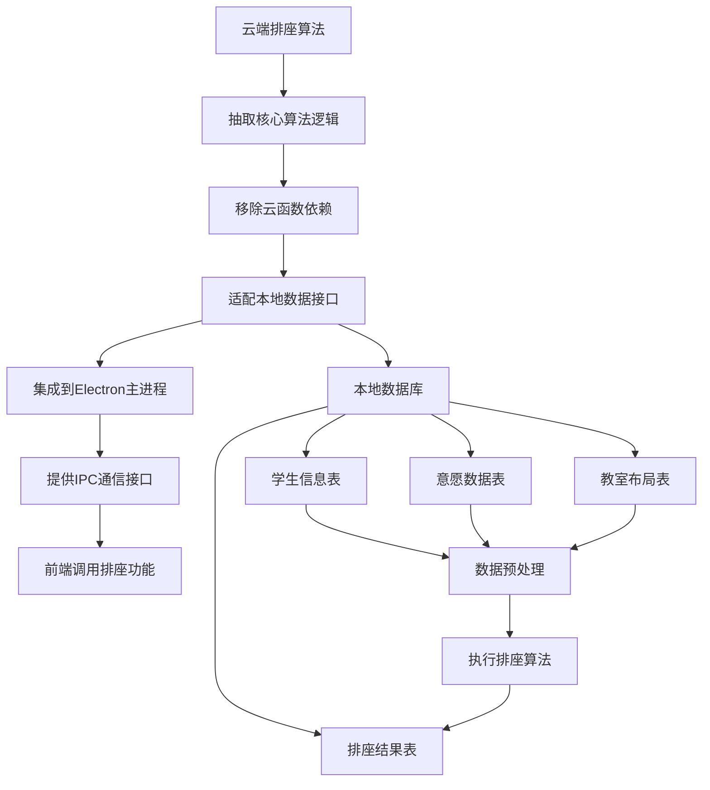

### 离线算法实现设计

#### 文件结构规划

```
desktop/src/algorithm/
├── engine.js              # 核心排座算法引擎
├── dataLoader.js          # 本地数据加载器
├── resultSaver.js         # 结果保存器
├── validator.js           # 数据验证器
├── optimizer.js           # 算法优化器
└── fallback.js            # 随机兜底策略
```

#### 核心算法引擎设计

| 功能模块 | 实现方式 | 关键特性 |
|---------|---------|----------|
| 数据预处理 | 本地数据标准化 | 格式统一、完整性检查 |
| 初始分配 | 基于意愿的贪心算法 | 优先满足高权重意愿 |
| 迭代优化 | 局部搜索和交换策略 | 提升整体满意度 |
| 冲突解决 | 多目标权衡机制 | 平衡个体和整体利益 |
| 兜底策略 | 随机分配算法 | 确保所有学生有座位 |

#### 算法参数配置

| 参数名称 | 默认值 | 取值范围 | 说明 |
|---------|-------|----------|------|
| wish_weight | 0.4 | 0.1-0.8 | 意愿权重 |
| teaching_weight | 0.3 | 0.1-0.6 | 教学权重（前排优先） |
| fairness_weight | 0.2 | 0.1-0.5 | 公平性权重 |
| constraint_weight | 0.1 | 0.05-0.3 | 约束权重（特殊需求） |
| max_iterations | 1000 | 100-5000 | 最大迭代次数 |
| min_satisfaction | 0.7 | 0.5-0.9 | 最低满意度阈值 |
| enable_random_fallback | true | true/false | 启用随机兜底策略 |

### 数据流程设计

#### 离线排座执行流程

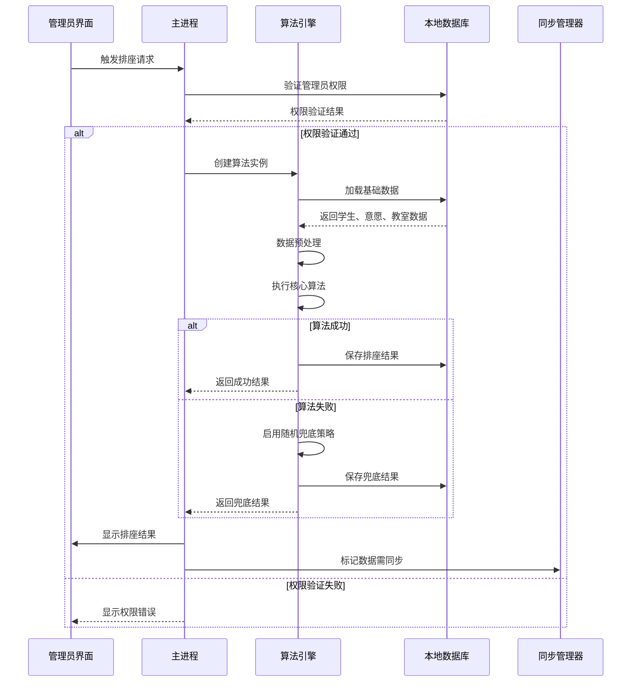

#### 数据验证机制

| 验证层级 | 验证内容 | 处理策略 |
|---------|---------|----------|
| 输入验证 | 会话ID、管理员权限 | 拒绝无效请求 |
| 数据完整性 | 学生数据、教室布局 | 补全缺失信息 |
| 业务逻辑 | 座位数量、学生数量匹配 | 调整算法参数 |
| 结果验证 | 分配完整性、冲突检查 | 触发重新分配 |

### 性能优化策略

#### 算法性能优化

| 优化维度 | 实现方案 | 性能提升 |
|---------|---------|----------|
| 数据结构 | 使用Map和Set替代数组查找 | O(1)查找复杂度 |
| 算法预热 | 预计算常用数据结构 | 减少运行时计算 |
| 并行处理 | 多线程处理独立计算 | 利用多核CPU |
| 内存管理 | 及时释放大型数据结构 | 降低内存占用 |
| 缓存策略 | 缓存中间计算结果 | 避免重复计算 |

#### 大规模数据处理

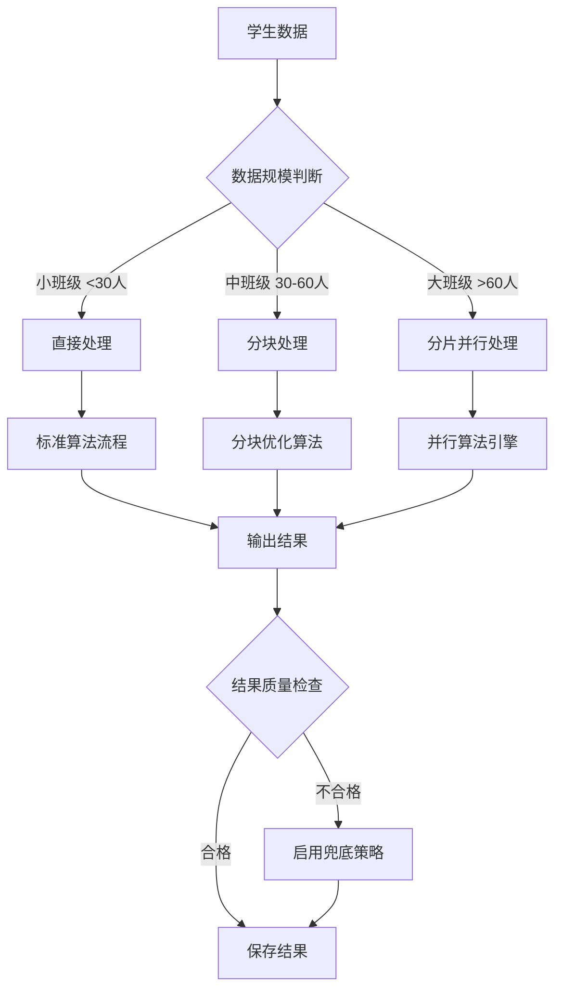

## 管理员认证机制完善设计

### 离线认证架构

#### 认证组件设计

| 组件名称 | 功能职责 | 实现位置 |
|---------|---------|----------|
| 本地认证管理器 | 离线身份验证 | desktop/src/auth/localAuth.js |
| 密码加密模块 | 密码哈希和验证 | desktop/src/auth/crypto.js |
| 会话管理器 | 本地会话状态 | desktop/src/auth/sessionManager.js |
| 权限控制器 | 功能权限验证 | desktop/src/auth/permissionController.js |
| 同步认证桥 | 在线离线同步 | desktop/src/auth/syncBridge.js |

#### 认证数据模型

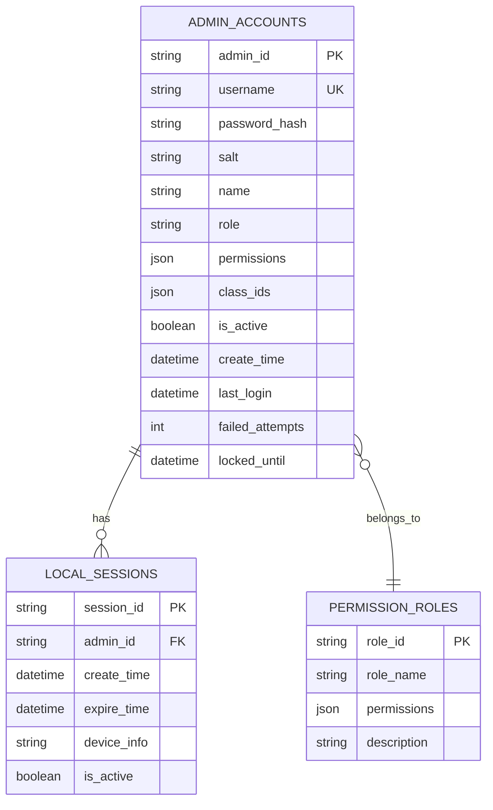

### 安全认证流程设计

#### 管理员登录流程

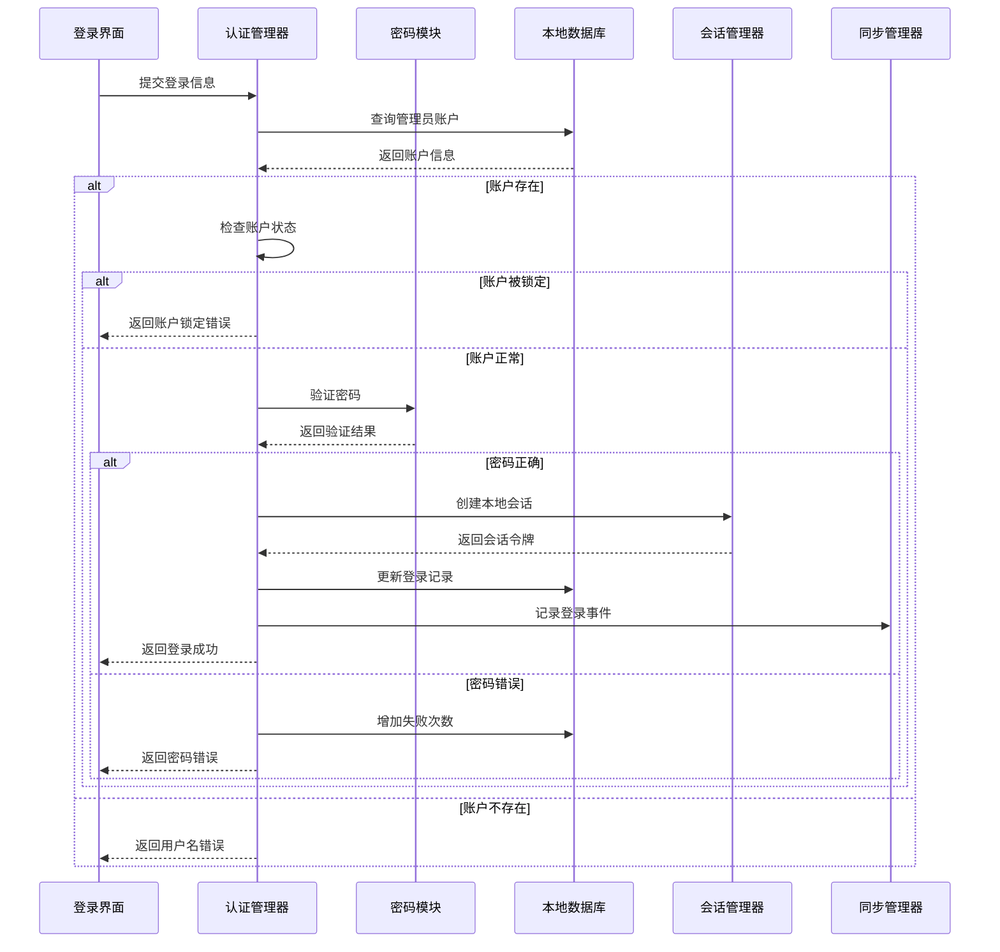

#### 权限验证机制

| 权限类型 | 验证范围 | 实现方式 |
|---------|---------|----------|
| 功能权限 | 特定操作授权 | 基于角色的访问控制(RBAC) |
| 数据权限 | 班级数据访问 | 基于资源的权限过滤 |
| 时间权限 | 操作时间限制 | 时间段验证 |
| 设备权限 | 设备绑定验证 | 设备指纹识别 |

### 默认管理员账户设计

#### 初始化账户配置

| 配置项 | 默认值 | 描述 |
|-------|-------|------|
| 用户名 | admin | 系统默认管理员用户名 |
| 密码 | admin123 | 初始密码（首次登录强制修改） |
| 角色 | seat_manager | 排座负责人角色 |
| 权限 | 全部管理权限 | 包含所有系统功能权限 |
| 状态 | 激活 | 账户立即可用 |

#### 账户初始化流程

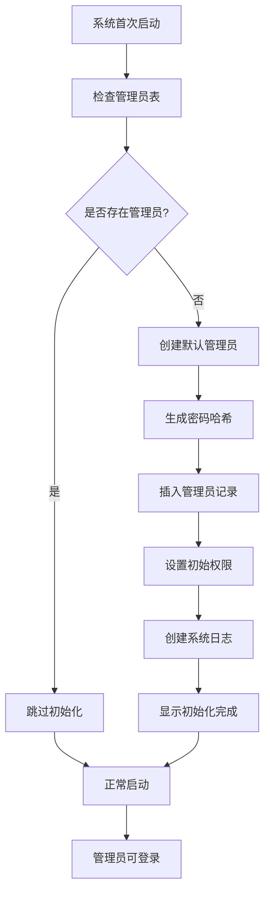

### 意愿填写权限分离设计

#### 管理员意愿入口设计

| 功能模块 | 普通学生入口 | 管理员入口 | 权限区别 |
|---------|-------------|-----------|----------|
| 意愿提交页面 | /pages/wish-submit/ | /pages/admin-wish/ | 不同的UI界面 |
| 数据字段标识 | user_type: 'student' | user_type: 'admin' | 数据库字段区分 |
| 提交权限 | 仅限本人 | 可代理其他管理员 |
| 截止时间 | 受会话截止时间限制 | 可超期提交 |
| 数据可见性 | 仅自己可见 | 管理员互相可见 |

#### 权限分离架构

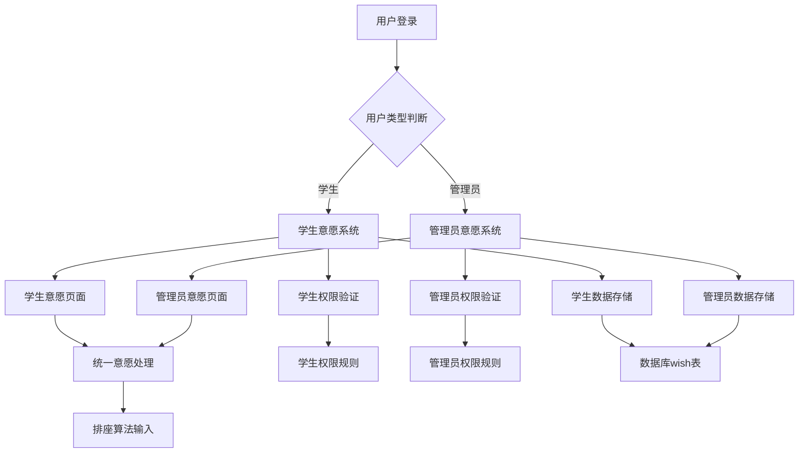

### 安全强化措施

#### 密码安全策略

| 安全措施 | 实现方式 | 安全等级 |
|---------|---------|----------|
| 密码复杂度 | 最少8位，包含字母数字特殊字符 | 中等 |
| 密码哈希 | 使用bcrypt+salt | 高 |
| 登录限制 | 5次失败后锁定30分钟 | 高 |
| 会话超时 | 无操作30分钟自动登出 | 中等 |
| 设备绑定 | 记录设备指纹，异常设备需验证 | 高 |

#### 审计日志设计

| 日志类型 | 记录内容 | 存储位置 |
|---------|---------|----------|
| 登录日志 | 登录时间、IP、设备信息、结果 | local_auth_logs表 |
| 操作日志 | 功能使用、数据修改、权限变更 | local_operation_logs表 |
| 错误日志 | 认证失败、权限拒绝、系统异常 | local_error_logs表 |
| 同步日志 | 数据同步、冲突解决、状态变更 | local_sync_logs表 |

### 在线离线同步策略

#### 认证数据同步机制

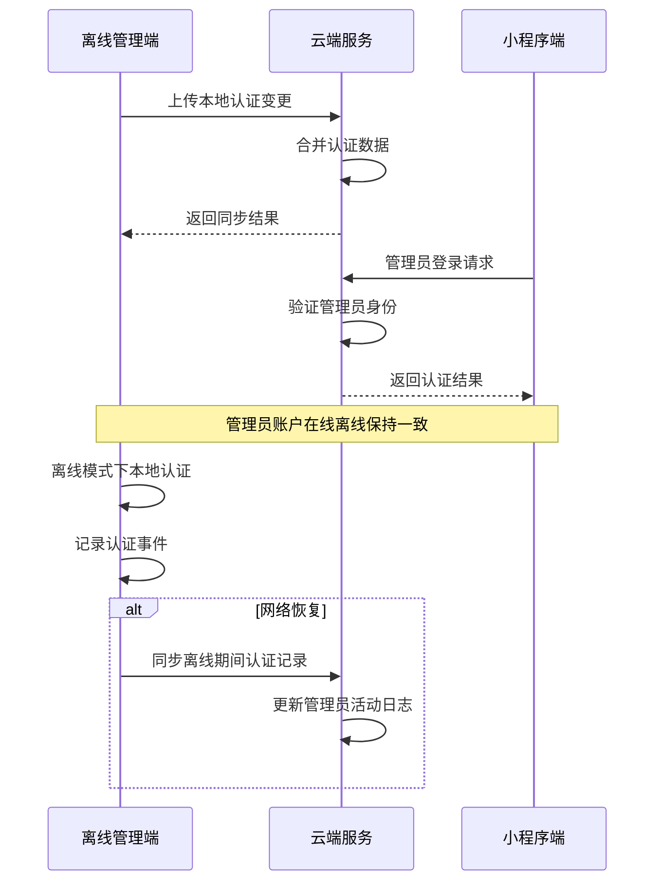

#### 冲突解决策略

| 冲突类型 | 解决策略 | 优先级 |
|---------|---------|--------|
| 密码冲突 | 时间戳优先，最新修改胜出 | 高 |
| 权限冲突 | 安全优先，取较严格权限 | 高 |
| 状态冲突 | 激活状态优先 | 中 |
| 数据冲突 | 云端数据优先 | 低 |

### 开发进度评估

| 模块名称 | 开发状态 | 完成度 | 说明 |
|---------|---------|-------|------|
| Electron主进程 | ✅ 已完成 | 100% | 应用窗口管理、菜单、IPC通信 |
| 本地数据库 | ✅ 已完成 | 95% | SQLite数据存储、表结构完整 |
| 数据同步管理器 | ✅ 已完成 | 90% | 在线离线同步、冲突解决机制 |
| 文件导入导出 | ✅ 已完成 | 85% | Excel导入导出、备份恢复 |
| 渲染进程UI | ⚠️ 待开发 | 30% | 缺少HTML/CSS界面文件 |
| 预加载脚本 | ⚠️ 待开发 | 20% | preload.js安全通信层 |

### 技术架构概览

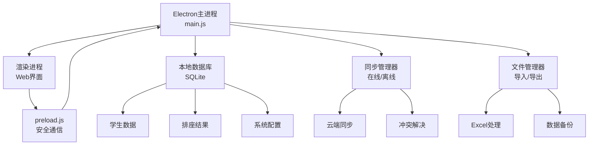

### 本地调试环境搭建

#### 环境要求

| 组件 | 版本要求 | 安装命令 |
|------|---------|----------|
| Node.js | ≥ 16.0.0 | 从官网下载安装 |
| npm | ≥ 8.0.0 | 随Node.js自带 |
| Python | ≥ 3.7 | 用于编译native模块 |
| 构建工具 | Visual Studio Build Tools | Windows开发环境 |

#### 安装步骤

```
# 1. 进入桌面应用目录
cd c:\Users\xjh20\WeChatProjects\miniprogram-2\desktop

# 2. 安装依赖
npm install

# 3. 安装开发依赖
npm install --save-dev

# 4. 重新编译native模块（如果需要）
npm rebuild
```

#### 启动调试模式

```
# 开发模式启动（含开发者工具）
npm run dev

# 普通模式启动
npm start

# 构建打包
npm run build
```

### 离线管理端功能架构

#### 核心功能模块

| 功能模块 | 实现状态 | 核心能力 |
|---------|---------|----------|
| 用户认证 | 待完善 | 离线管理员登录验证 |
| 学生管理 | 已实现 | Excel导入、数据编辑、批量操作 |
| 教室管理 | 已实现 | 教室布局配置、座位编辑 |
| 排座算法 | 待集成 | 离线执行排座算法 |
| 数据同步 | 已实现 | 双向同步、冲突解决 |
| 文件操作 | 已实现 | 导入导出、备份恢复 |

#### 数据同步机制

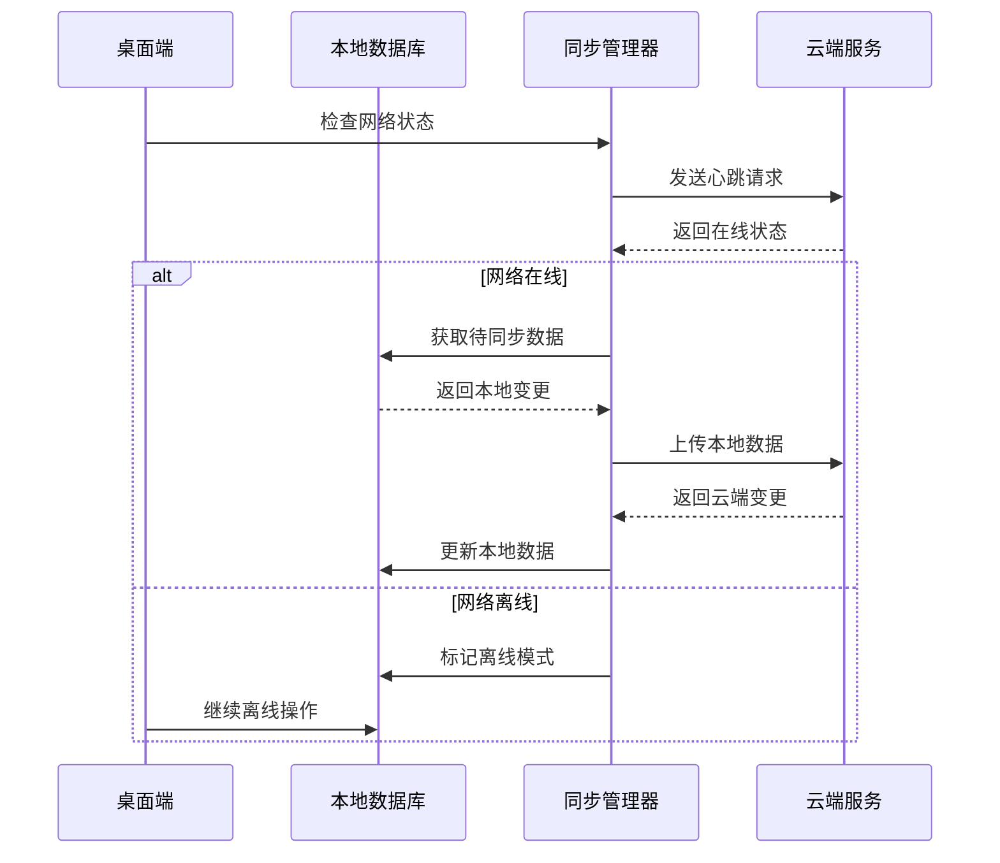

### 调试指南

#### 主进程调试

1. **启用开发者模式**
   ```
   npm run dev
   ```

2. **查看主进程日志**
   - 日志输出位置：控制台终端
   - 关键日志：数据库初始化、同步状态、文件操作

3. **调试IPC通信**
   ```javascript
   // 在main.js中添加调试日志
   ipcMain.handle('debug-log', (event, message) => {
     console.log('[调试]', message);
   });
   ```

#### 渲染进程调试

1. **打开开发者工具**
   - 快捷键：F12
   - 菜单：工具 → 开发者工具

2. **调试前端交互**
   ```javascript
   // 在渲染进程中测试IPC通信
   window.electronAPI.invoke('get-sync-status').then(status => {
     console.log('同步状态:', status);
   });
   ```

#### 数据库调试

1. **查看数据库文件**
   - 位置：`%USERPROFILE%\AppData\Roaming\seat-arrangement-desktop\seat_arrangement.db`
   - 工具：DB Browser for SQLite

2. **执行调试查询**
   ```sql
   -- 查看同步状态
   SELECT table_name, COUNT(*) as total, 
          SUM(CASE WHEN sync_status = 0 THEN 1 ELSE 0 END) as pending
   FROM students;
   
   -- 查看同步日志
   SELECT * FROM system_logs WHERE action LIKE 'sync_%' ORDER BY timestamp DESC LIMIT 10;
   ```

#### 网络同步调试

1. **模拟离线环境**
   ```javascript
   // 在同步管理器中强制设置离线状态
   this.isOnline = false;
   ```

2. **监控同步过程**
   ```javascript
   // 添加详细的同步日志
   console.log('同步开始:', new Date().toISOString());
   console.log('待同步数据量:', pendingData.length);
   ```

### 使用指南

#### 初次设置

1. **安装并启动应用**
   ```
   npm install
   npm start
   ```

2. **配置云端连接**
   - 菜单：工具 → 设置
   - 设置云函数端点URL
   - 配置同步间隔（默认30秒）

3. **初始化数据**
   - 首次启动会自动创建数据库
   - 可导入现有Excel数据

#### 日常操作流程

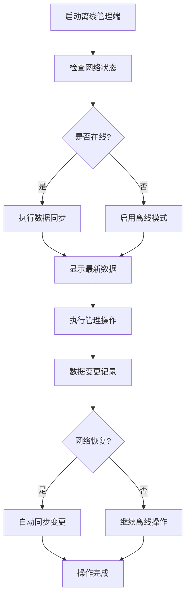

#### 文件操作指南

1. **导入学生数据**
   - 格式要求：Excel文件，包含"姓名"、"学号"、"班级"列
   - 操作：文件 → 导入学生数据
   - 验证：系统自动验证数据格式和完整性

2. **导出排座结果**
   - 选择排座会话
   - 操作：文件 → 导出排座结果
   - 格式：Excel文件，包含学生信息和座位分配

3. **数据备份**
   - 自动备份：每日定时创建
   - 手动备份：数据 → 创建备份
   - 恢复数据：数据 → 恢复备份

#### 同步操作指南

1. **手动同步**
   ```
   快捷键：Ctrl+S
   菜单：数据 → 立即同步
   ```

2. **查看同步状态**
   ```
   菜单：数据 → 同步状态
   显示：在线状态、最后同步时间、待同步数据量
   ```

3. **处理同步冲突**
   - 策略：时间戳优先（最新修改胜出）
   - 日志：所有冲突解决过程记录在系统日志

### 故障排除

#### 常见问题解决

| 问题类型 | 症状描述 | 解决方案 |
|---------|---------|----------|
| 启动失败 | 应用无法打开 | 检查Node.js版本，重新安装依赖 |
| 数据库错误 | SQLite连接失败 | 检查文件权限，重新初始化数据库 |
| 同步失败 | 无法连接云端 | 检查网络连接和云函数配置 |
| 文件导入失败 | Excel读取错误 | 检查文件格式和必填字段 |
| 内存占用过高 | 应用响应缓慢 | 清理历史日志，重启应用 |

#### 日志收集

1. **应用日志位置**
   ```
   Windows: %USERPROFILE%\AppData\Roaming\seat-arrangement-desktop\logs
   ```

2. **关键日志文件**
   - `main.log`: 主进程日志
   - `renderer.log`: 渲染进程日志
   - `sync.log`: 数据同步日志
   - `database.log`: 数据库操作日志

## 测试策略

### 功能测试覆盖

| 测试类型 | 测试内容 | 验收标准 |
|---------|---------|---------|
| 基础交互测试 | 按钮点击响应 | 每次点击都有即时反馈 |
| 状态切换测试 | 加载状态显示和隐藏 | 状态变化正确且及时 |
| 错误处理测试 | 各种错误场景处理 | 错误信息准确且可操作 |
| 性能测试 | 响应时间和内存使用 | 满足性能指标要求 |
| 兼容性测试 | 不同设备和系统 | 保证一致的用户体验 |
| 离线功能测试 | 离线模式下的操作 | 数据一致性和同步准确性 |
| 数据同步测试 | 在线离线切换场景 | 无数据丢失，冲突正确解决 |

### 用户体验验证

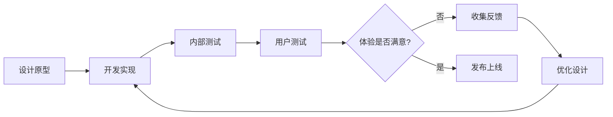
