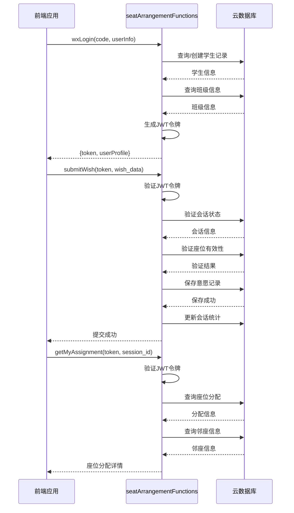

# API接口文档

<cite>
**本文档引用的文件**  
- [auth.js](file://cloudfunctions/seatArrangementFunctions/modules/auth.js)
- [wish.js](file://cloudfunctions/seatArrangementFunctions/modules/wish.js)
- [result.js](file://cloudfunctions/seatArrangementFunctions/modules/result.js)
- [index.js](file://cloudfunctions/seatArrangementFunctions/index.js)
- [login.js](file://miniprogram/pages/login/login.js)
- [wish-submit.js](file://miniprogram/pages/wish-submit/wish-submit.js)
- [result.js](file://miniprogram/pages/result/result.js)
</cite>

## 目录
1. [简介](#简介)
2. [API调用规范](#api调用规范)
3. [接口详情](#接口详情)
   - [wxLogin - 微信登录](#wxlogin---微信登录)
   - [adminLogin - 管理员登录](#adminlogin---管理员登录)
   - [submitWish - 提交座位意愿](#submitwish---提交座位意愿)
   - [getMyAssignment - 获取我的座位分配](#getmyassignment---获取我的座位分配)
   - [getArrangementResult - 获取排座结果](#getarrangementresult---获取排座结果)
4. [JWT令牌机制](#jwt令牌机制)
5. [前端调用示例](#前端调用示例)
6. [权限级别说明](#权限级别说明)
7. [API调用时序图](#api调用时序图)

## 简介
本接口文档详细描述了座位安排系统中所有云函数API端点的调用方式、参数结构、响应格式和错误处理机制。系统采用JWT令牌进行身份验证，支持学生和管理员两种角色，涵盖登录、意愿提交、结果查询等核心功能。

## API调用规范
所有API通过微信云函数`seatArrangementFunctions`进行调用，使用`type`字段指定具体接口。请求和响应遵循统一格式。

**统一请求格式**
```json
{
  "type": "接口类型",
  "token": "JWT令牌（除登录接口外）",
  "其他参数": "..."
}
```

**统一响应格式**
```json
{
  "success": true/false,
  "code": 200,
  "message": "操作结果描述",
  "data": { "返回数据" },
  "timestamp": 1234567890
}
```

**HTTP方法**：通过微信云调用，隐含为POST方法。

**Section sources**
- [index.js](file://cloudfunctions/seatArrangementFunctions/index.js#L42-L50)

## 接口详情

### wxLogin - 微信登录
学生通过微信授权登录系统，获取JWT令牌和用户档案。

**调用路径**：`seatArrangementFunctions` 云函数，`type=wxLogin`

**请求参数**
| 参数 | 类型 | 必填 | 说明 |
|------|------|------|------|
| type | string | 是 | 固定值 `wxLogin` |
| code | string | 是 | 微信登录凭证 |
| userInfo | object | 是 | 微信用户信息对象 |

**响应数据**
```json
{
  "token": "JWT令牌",
  "userProfile": {
    "openid": "微信openid",
    "student_id": "学生ID",
    "name": "姓名",
    "student_number": "学号",
    "role": "角色",
    "class_id": "班级ID",
    "class_name": "班级名称",
    "avatarUrl": "头像URL",
    "special_needs": "特殊需求"
  },
  "expiresIn": 604800
}
```

**错误码**
- 400: 缺少微信授权码或获取用户信息失败
- 500: 服务器内部错误

**权限级别**：公开接口

**Section sources**
- [auth.js](file://cloudfunctions/seatArrangementFunctions/modules/auth.js#L5-L118)

### adminLogin - 管理员登录
管理员通过用户名密码登录系统，获取JWT令牌和管理员档案。

**调用路径**：`seatArrangementFunctions` 云函数，`type=adminLogin`

**请求参数**
| 参数 | 类型 | 必填 | 说明 |
|------|------|------|------|
| type | string | 是 | 固定值 `adminLogin` |
| username | string | 是 | 管理员用户名 |
| password | string | 是 | 管理员密码 |
| loginType | string | 否 | 登录类型 |

**响应数据**
```json
{
  "token": "JWT令牌",
  "adminProfile": {
    "admin_id": "管理员ID",
    "name": "姓名",
    "username": "用户名",
    "role": "角色",
    "permissions": "权限列表",
    "class_ids": "管理班级ID列表",
    "class_names": "管理班级名称列表"
  },
  "expiresIn": 28800
}
```

**错误码**
- 400: 用户名或密码不能为空
- 401: 用户名或密码错误
- 500: 服务器内部错误

**权限级别**：公开接口

**Section sources**
- [auth.js](file://cloudfunctions/seatArrangementFunctions/modules/auth.js#L123-L207)

### submitWish - 提交座位意愿
学生提交座位安排意愿，包括偏好座位、避免座位、偏好邻座等。

**调用路径**：`seatArrangementFunctions` 云函数，`type=submitWish`

**请求参数**
| 参数 | 类型 | 必填 | 说明 |
|------|------|------|------|
| type | string | 是 | 固定值 `submitWish` |
| token | string | 是 | JWT令牌 |
| session_id | string | 是 | 排座会话ID |
| wish_data | object | 是 | 意愿数据对象 |

**wish_data结构**
```json
{
  "preferred_seats": [
    {"seat_id": "座位ID"}
  ],
  "avoided_seats": [
    {"seat_id": "座位ID"}
  ],
  "preferred_neighbors": [
    {"student_id": "学生ID"}
  ],
  "avoided_neighbors": [
    {"student_id": "学生ID"}
  ],
  "special_requirements": "特殊需求说明"
}
```

**响应数据**
```json
{
  "wish_id": "意愿ID",
  "submit_time": "提交时间",
  "version": 1,
  "next_modify_deadline": "下次修改截止时间"
}
```

**错误码**
- 400: 缺少必要参数或意愿提交已截止
- 404: 排座会话不存在
- 409: 已提交过意愿
- 500: 服务器内部错误

**权限级别**：学生

**Section sources**
- [wish.js](file://cloudfunctions/seatArrangementFunctions/modules/wish.js#L5-L119)

### getMyAssignment - 获取我的座位分配
学生获取自己在指定会话中的座位分配详情。

**调用路径**：`seatArrangementFunctions` 云函数，`type=getMyAssignment`

**请求参数**
| 参数 | 类型 | 必填 | 说明 |
|------|------|------|------|
| type | string | 是 | 固定值 `getMyAssignment` |
| token | string | 是 | JWT令牌 |
| session_id | string | 是 | 排座会话ID |

**响应数据**
```json
{
  "assignment_id": "分配ID",
  "student_id": "学生ID",
  "seat_info": {
    "seat_id": "座位ID",
    "position": {"row": 1, "col": 2},
    "position_desc": "第1排第2列"
  },
  "neighbors": {
    "front": {"student_id": "xxx", "student_name": "张三"},
    "back": null,
    "left": {"student_id": "yyy", "student_name": "李四"},
    "right": {"student_id": "zzz", "student_name": "王五"}
  },
  "satisfaction_score": 0.85,
  "assignment_reasons": ["满足偏好座位"],
  "manual_adjusted": false,
  "assign_time": "分配时间"
}
```

**错误码**
- 400: 缺少必要参数
- 404: 排座结果尚未生成或未找到座位分配
- 500: 服务器内部错误

**权限级别**：学生

**Section sources**
- [result.js](file://cloudfunctions/seatArrangementFunctions/modules/result.js#L5-L76)

### getArrangementResult - 获取排座结果
获取指定会话的完整排座结果，管理员可获取详细信息。

**调用路径**：`seatArrangementFunctions` 云函数，`type=getArrangementResult`

**请求参数**
| 参数 | 类型 | 必填 | 说明 |
|------|------|------|------|
| type | string | 是 | 固定值 `getArrangementResult` |
| token | string | 是 | JWT令牌 |
| session_id | string | 是 | 排座会话ID |
| format | string | 否 | 返回格式（simple/detailed） |

**响应数据（simple格式）**
```json
{
  "session_id": "会话ID",
  "classroom_layout": {
    "dimensions": {"width": 8, "height": 6},
    "seat_map": [[座位矩阵]]
  }
}
```

**响应数据（detailed格式 - 管理员）**
```json
{
  "execution_info": "执行信息",
  "overall_statistics": "总体统计",
  "assignments": "所有分配详情",
  "conflicts": "冲突解决记录",
  "generate_time": "生成时间"
}
```

**错误码**
- 400: 缺少会话ID
- 403: 权限不足（非管理员请求详细格式）
- 404: 排座结果尚未生成
- 500: 服务器内部错误

**权限级别**：学生（simple格式）、管理员（detailed格式）

**Section sources**
- [result.js](file://cloudfunctions/seatArrangementFunctions/modules/result.js#L81-L164)

## JWT令牌机制
系统使用JWT（JSON Web Token）进行身份验证和会话管理。

**令牌传递方式**：在请求参数中通过`token`字段传递。

**令牌过期处理**：
1. 客户端检查令牌有效期
2. 若即将过期或已过期，调用`refreshToken`接口刷新
3. 使用新令牌重新发起原请求

**令牌有效期**：
- 学生令牌：7天
- 管理员令牌：8小时

**Section sources**
- [index.js](file://cloudfunctions/seatArrangementFunctions/index.js#L23-L34)
- [auth.js](file://cloudfunctions/seatArrangementFunctions/modules/auth.js#L209-L244)

## 前端调用示例
以下为微信小程序前端调用示例：

**微信登录示例**
```javascript
// 调用微信登录
wx.login({
  success: (loginRes) => {
    // 调用云函数登录
    wx.cloud.callFunction({
      name: 'seatArrangementFunctions',
      data: {
        type: 'wxLogin',
        code: loginRes.code,
        userInfo: userInfo
      },
      success: (res) => {
        if (res.result.success) {
          // 保存令牌和用户信息
          wx.setStorageSync('token', res.result.data.token);
          wx.setStorageSync('userInfo', res.result.data.userProfile);
        }
      }
    });
  }
});
```

**提交意愿示例**
```javascript
wx.cloud.callFunction({
  name: 'seatArrangementFunctions',
  data: {
    type: 'submitWish',
    token: wx.getStorageSync('token'),
    session_id: 'sess_123',
    wish_data: {
      preferred_seats: [{seat_id: 'A1'}],
      avoided_seats: [{seat_id: 'B2'}]
    }
  },
  success: (res) => {
    if (res.result.success) {
      wx.showToast({title: '提交成功'});
    }
  }
});
```

**获取结果示例**
```javascript
wx.cloud.callFunction({
  name: 'seatArrangementFunctions',
  data: {
    type: 'getMyAssignment',
    token: wx.getStorageSync('token'),
    session_id: 'sess_123'
  },
  success: (res) => {
    if (res.result.success) {
      this.setData({myAssignment: res.result.data});
    }
  }
});
```

**Section sources**
- [login.js](file://miniprogram/pages/login/login.js#L70-L110)
- [wish-submit.js](file://miniprogram/pages/wish-submit/wish-submit.js#L50-L80)
- [result.js](file://miniprogram/pages/result/result.js#L100-L130)

## 权限级别说明
系统定义了两种权限级别：

**学生权限**
- 可调用：`wxLogin`, `submitWish`, `getMyAssignment`, `getArrangementResult`(simple)
- 令牌有效期：7天
- 主要功能：登录、提交意愿、查看个人分配

**管理员权限**
- 可调用：`adminLogin`, `getArrangementResult`(detailed), 以及其他管理接口
- 令牌有效期：8小时
- 主要功能：登录、查看完整排座结果、管理班级

**Section sources**
- [auth.js](file://cloudfunctions/seatArrangementFunctions/modules/auth.js#L5-L244)
- [result.js](file://cloudfunctions/seatArrangementFunctions/modules/result.js#L81-L164)

## API调用时序图


**Diagram sources**
- [auth.js](file://cloudfunctions/seatArrangementFunctions/modules/auth.js#L5-L118)
- [wish.js](file://cloudfunctions/seatArrangementFunctions/modules/wish.js#L5-L119)
- [result.js](file://cloudfunctions/seatArrangementFunctions/modules/result.js#L5-L76)

**Section sources**
- [auth.js](file://cloudfunctions/seatArrangementFunctions/modules/auth.js#L5-L118)
- [wish.js](file://cloudfunctions/seatArrangementFunctions/modules/wish.js#L5-L119)
- [result.js](file://cloudfunctions/seatArrangementFunctions/modules/result.js#L5-L76)