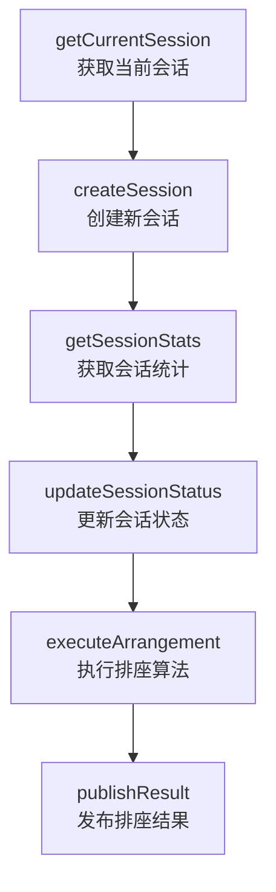
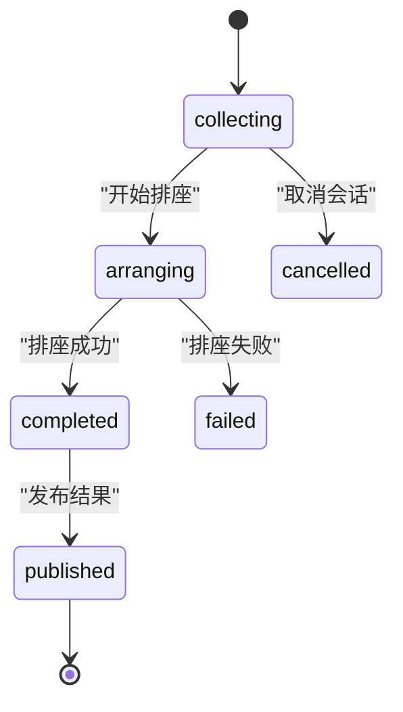
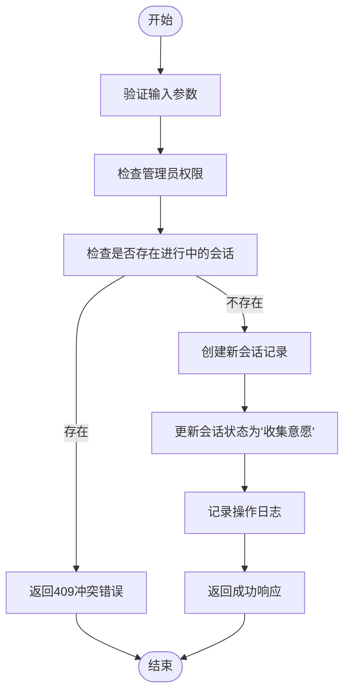
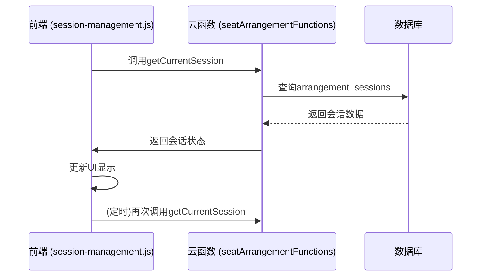

# 会话管理API

<cite>
**本文档引用的文件**
- [session.js](file://cloudfunctions/seatArrangementFunctions/modules/session.js)
- [index.js](file://cloudfunctions/seatArrangementFunctions/index.js)
- [session-management.js](file://miniprogram/pages/session-management/session-management.js)
</cite>

## 目录
1. [简介](#简介)
2. [核心接口](#核心接口)
3. [会话状态机](#会话状态机)
4. [会话配置参数](#会话配置参数)
5. [管理员创建会话示例](#管理员创建会话示例)
6. [统计接口与数据聚合](#统计接口与数据聚合)
7. [前端轮询与事件通知](#前端轮询与事件通知)

## 简介
会话管理API是排座系统的核心组件，负责管理整个排座流程的生命周期。该API提供了一系列接口，用于获取当前会话、创建新会话、查询会话统计信息以及更新会话状态。系统通过定义清晰的会话状态机来管理排座流程，确保操作的有序性和一致性。权限控制机制确保只有管理员和排座负责人可以执行关键操作。此外，API还支持丰富的配置选项，允许管理员根据具体需求调整排座算法的行为。

## 核心接口
会话管理API提供了四个核心接口：`getCurrentSession`、`createSession`、`getSessionStats`和`updateSessionStatus`。这些接口共同构成了排座会话的管理基础。

**会话管理核心接口**


**接口功能说明**
| 接口名称 | HTTP方法 | 路径 | 描述 |
| :--- | :--- | :--- | :--- |
| `getCurrentSession` | POST | `/cloudfunctions/seatArrangementFunctions` | 获取指定班级的当前活跃排座会话信息 |
| `createSession` | POST | `/cloudfunctions/seatArrangementFunctions` | 创建一个新的排座会话 |
| `getSessionStats` | POST | `/cloudfunctions/seatArrangementFunctions` | 获取指定会话的详细统计信息 |
| `updateSessionStatus` | POST | `/cloudfunctions/seatArrangementFunctions` | 更新会话的状态 |

**Section sources**
- [session.js](file://cloudfunctions/seatArrangementFunctions/modules/session.js#L5-L415)
- [index.js](file://cloudfunctions/seatArrangementFunctions/index.js#L200-L235)

## 会话状态机
排座会话遵循一个严格的状态机模型，确保流程的有序进行。会话状态包括“待开始”、“收集意愿”、“排座中”、“已完成”和“已发布”。状态转换受到严格的权限和逻辑约束。

**会话状态转换图**


**状态转换规则**
- **收集意愿 (collecting)**: 会话创建后的初始状态，学生可以在此阶段提交或修改座位意愿。
- **排座中 (arranging)**: 管理员启动排座算法后进入此状态，系统开始计算最优座位分配。
- **已完成 (completed)**: 排座算法成功执行后进入此状态，排座结果已生成但未发布。
- **已发布 (published)**: 排座结果向学生公开后进入此状态，学生可以查看自己的最终座位。
- **已取消 (cancelled)**: 管理员手动取消会话，或排座算法执行失败。

**权限控制**
- **仅管理员可修改**: 只有角色为`seat_manager`（排座负责人）的用户才能调用`updateSessionStatus`接口来改变会话状态。
- **状态转换验证**: 系统会验证状态转换的合理性，例如不允许从“排座中”直接跳转到“已发布”，必须先经过“已完成”状态。

**Diagram sources**
- [session.js](file://cloudfunctions/seatArrangementFunctions/modules/session.js#L315-L361)

**Section sources**
- [session.js](file://cloudfunctions/seatArrangementFunctions/modules/session.js#L315-L415)

## 会话配置参数
在创建排座会话时，可以通过`session_data`参数对象配置会话的详细行为，包括座位图布局和算法权重等。

**会话配置参数结构**
```json
{
  "title": "排座会话标题",
  "description": "会话描述",
  "classroom_id": "教室ID",
  "class_id": "班级ID",
  "deadline": "意愿提交截止时间",
  "auto_start_arrangement": false,
  "auto_publish_result": false,
  "algorithm_params": {
    "wish_weight": 0.4,
    "teaching_weight": 0.3,
    "fairness_weight": 0.2,
    "constraint_weight": 0.1,
    "max_iterations": 1000,
    "min_satisfaction": 0.7,
    "enable_random_fallback": true
  },
  "notification_config": {
    "send_on_create": true,
    "send_reminder": true,
    "reminder_times": [24, 6, 1],
    "send_on_publish": true
  }
}
```

**核心配置项说明**
| 配置项 | 类型 | 默认值 | 描述 |
| :--- | :--- | :--- | :--- |
| `algorithm_params.wish_weight` | 数字 | 0.4 | 学生意愿权重，影响排座算法对个人偏好的重视程度 |
| `algorithm_params.teaching_weight` | 数字 | 0.3 | 教学需求权重，如视力、听力等特殊需求的权重 |
| `algorithm_params.fairness_weight` | 数字 | 0.2 | 公平性权重，确保分配过程的公平性 |
| `algorithm_params.constraint_weight` | 数字 | 0.1 | 约束条件权重，如避免特定学生相邻等 |
| `max_iterations` | 整数 | 1000 | 排座算法最大迭代次数，防止无限循环 |
| `min_satisfaction` | 数字 | 0.7 | 最小满意度阈值，低于此值将触发随机兜底策略 |
| `enable_random_fallback` | 布尔值 | true | 是否启用随机兜底策略，当算法无法找到满意解时使用 |

**Section sources**
- [session.js](file://cloudfunctions/seatArrangementFunctions/modules/session.js#L114-L153)

## 管理员创建会话示例
以下是一个管理员创建新排座会话的完整调用示例，包括了异常处理逻辑。

**创建会话流程图**


**代码调用示例**
```javascript
// 前端页面调用示例 (session-management.js)
async createSession() {
  const { newSession, classList, classroomList } = this.data;
  
  // ... (输入验证)
  
  try {
    const token = wx.getStorageSync('adminToken');
    const selectedClass = classList[newSession.classIndex];
    const selectedClassroom = classroomList[newSession.classroomIndex];
    
    const result = await wx.cloud.callFunction({
      name: 'seatArrangementFunctions',
      data: {
        type: 'createArrangementSession',
        session_data: {
          name: newSession.name.trim(),
          class_id: selectedClass.class_id,
          classroom_id: selectedClassroom.classroom_id,
          deadline: newSession.deadline,
          algorithm_config: newSession.config
        },
        token
      }
    });

    // 处理响应
    if (result.result.success) {
      // 创建成功
      this.refreshSessions();
    } else {
      // 创建失败，显示错误信息
      wx.showToast({
        title: result.result.message || '创建失败',
        icon: 'none'
      });
    }
  } catch (error) {
    // 网络异常处理
    wx.showToast({
      title: '创建失败，请重试',
      icon: 'none'
    });
  }
}
```

**异常处理**
- **403 权限不足**: 如果调用者不是`seat_manager`角色，接口将返回此错误。
- **400 缺少必要参数**: 如果`session_data`中缺少`classroom_id`、`class_id`或`deadline`等必要字段，接口将返回此错误。
- **409 冲突**: 如果该班级已存在一个处于“收集意愿”或“排座中”状态的会话，接口将返回此错误，防止重复创建。

**Section sources**
- [session.js](file://cloudfunctions/seatArrangementFunctions/modules/session.js#L77-L153)
- [session-management.js](file://miniprogram/pages/session-management/session-management.js#L130-L192)

## 统计接口与数据聚合
`getSessionStats`接口用于聚合和返回会话的统计信息，为前端可视化提供数据支持。

**统计接口响应数据结构**
```json
{
  "success": true,
  "data": {
    "session_info": {
      "session_id": "sess_123",
      "title": "座位安排",
      "status": "collecting",
      "deadline": "2023-12-31T23:59:59Z"
    },
    "statistics": {
      "total_students": 45,
      "submitted_wishes": 38,
      "completion_rate": 0.844,
      "pending_students": [
        { "student_id": "s001", "name": "张三" },
        { "student_id": "s002", "name": "李四" }
      ]
    },
    "timeline": [
      {
        "time": "2023-12-01T10:00:00Z",
        "event": "create_session",
        "description": "排座会话创建",
        "user": "admin_001"
      }
    ]
  }
}
```

**数据聚合逻辑**
1. **学生总数**: 通过查询`students`集合中指定班级的活跃学生数量获得。
2. **已提交意愿数**: 通过查询`wishes`集合中属于该会话的记录数量获得。
3. **完成率**: 计算已提交意愿的学生数占总学生数的比例。
4. **未提交学生列表**: 通过对比班级学生列表和已提交意愿的学生ID列表，找出尚未提交意愿的学生。
5. **操作时间线**: 查询`system_logs`集合中与该会话相关的日志，按时间顺序排列，用于展示会话的历史操作。

**前端可视化应用**
前端可以利用`statistics`中的`completion_rate`字段绘制进度条，使用`pending_students`列表生成待办事项，使用`timeline`数据生成时间轴图表，从而为管理员提供直观的会话状态概览。

**Section sources**
- [session.js](file://cloudfunctions/seatArrangementFunctions/modules/session.js#L198-L313)

## 前端轮询与事件通知
前端通过轮询机制定期检查会话状态更新，并依赖后端的日志系统实现事件通知。

**前端轮询流程**


**轮询实现**
- **触发时机**: 当用户进入“排座选择”页面时，前端会立即调用`getCurrentSession`接口。之后，页面会根据需要（如用户手动刷新）再次调用该接口。
- **状态变更检查**: 前端通过比较`currentSession`对象中的`status`字段来判断会话状态是否发生变化。例如，当状态从`collecting`变为`arranging`时，前端可以更新UI以反映排座正在进行。

**事件通知机制**
- **日志驱动**: 系统通过`system_logs`集合记录所有关键操作，如会话创建、状态更新、排座执行等。
- **时间线展示**: `getSessionStats`接口会返回一个`timeline`数组，其中包含了最近的操作记录。前端可以将这些记录以时间轴的形式展示给管理员，让他们了解会话的完整操作历史。
- **描述映射**: 后端使用`getActionDescription`函数将内部操作代码（如`update_session_status`）转换为用户友好的中文描述（如“会话状态更新”），提升可读性。

**Section sources**
- [session-management.js](file://miniprogram/pages/session-management/session-management.js#L255-L318)
- [session.js](file://cloudfunctions/seatArrangementFunctions/modules/session.js#L280-L313)