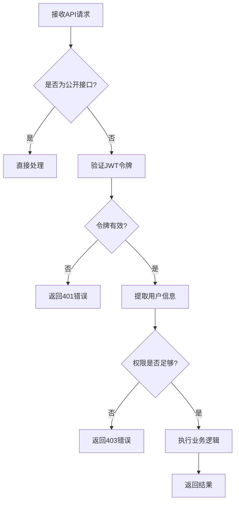
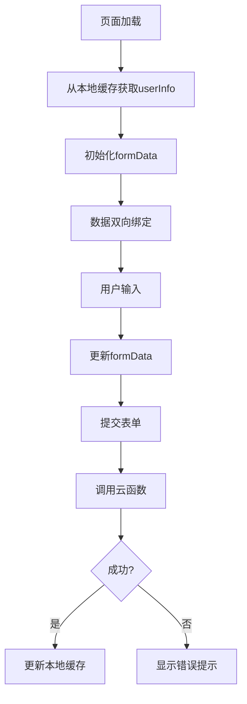
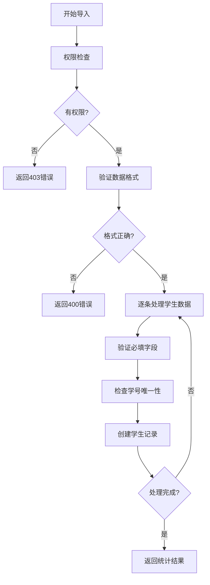
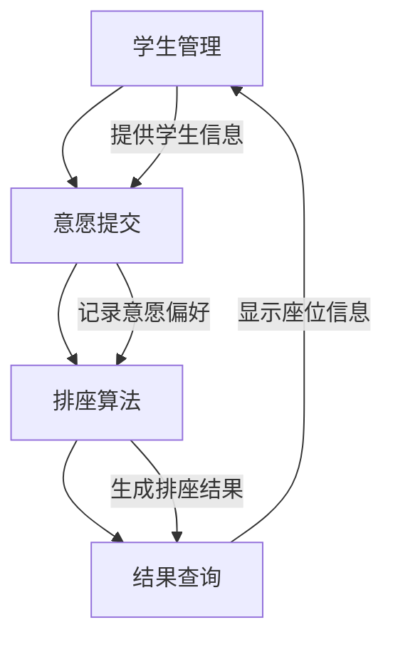
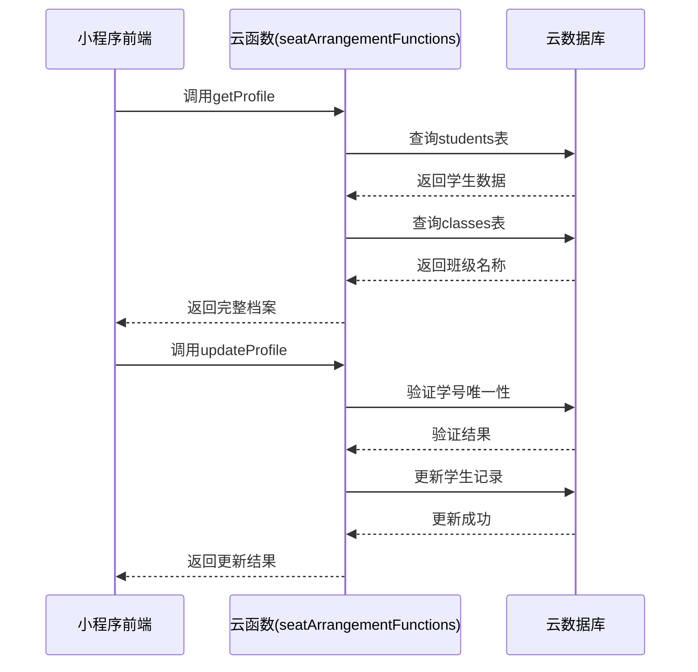

# 学生管理API

<cite>
**本文档引用的文件**  
- [student.js](file://cloudfunctions/seatArrangementFunctions/modules/student.js)
- [auth.js](file://cloudfunctions/seatArrangementFunctions/modules/auth.js)
- [profile.js](file://miniprogram/pages/profile/profile.js)
- [index.js](file://cloudfunctions/seatArrangementFunctions/index.js)
- [wish.js](file://cloudfunctions/seatArrangementFunctions/modules/wish.js)
- [result.js](file://cloudfunctions/seatArrangementFunctions/modules/result.js)
</cite>

## 目录
1. [简介](#简介)
2. [学生档案数据模型](#学生档案数据模型)
3. [核心接口说明](#核心接口说明)
4. [权限控制机制](#权限控制机制)
5. [前端实现示例](#前端实现示例)
6. [批量导入接口详解](#批量导入接口详解)
7. [错误处理策略](#错误处理策略)
8. [模块集成说明](#模块集成说明)

## 简介
学生管理API是排座系统的核心模块，提供学生档案管理、同班同学查询和批量导入等功能。该API通过云函数实现，支持微信小程序端调用，确保学生信息的安全性和完整性。系统实现了严格的权限控制，确保只有本人或管理员可以访问和修改学生信息。

## 学生档案数据模型
学生档案包含基本信息、特殊需求和个性化设置，各字段具有明确的业务约束。

### 学生档案字段定义
| 字段名 | 类型 | 必填 | 说明 | 业务约束 |
|--------|------|------|------|----------|
| student_id | string | 是 | 学生唯一标识 | 自动生成，以"stu_"开头 |
| name | string | 是 | 姓名 | 最大长度50字符 |
| student_number | string | 是 | 学号 | 9-12位数字，全局唯一 |
| class_id | string | 否 | 班级ID | 必须对应存在的班级 |
| class_name | string | 否 | 班级名称 | 从班级表关联获取 |
| special_needs | object | 否 | 特殊需求 | 包含视力、听力、身高等 |
| is_active | boolean | 是 | 是否活跃 | 默认true |
| avatarUrl | string | 否 | 头像URL | 从微信用户信息同步 |
| wx_openid | string | 否 | 微信OpenID | 用于微信登录绑定 |

### 特殊需求子字段
```json
{
  "vision_impaired": false,
  "hearing_impaired": false,
  "height_tall": false,
  "other_requirements": ""
}
```

**Section sources**
- [student.js](file://cloudfunctions/seatArrangementFunctions/modules/student.js#L25-L321)

## 核心接口说明
学生管理API提供四个核心接口，分别用于获取、更新学生信息和查询同班同学。

### 获取学生档案 (getProfile)
获取当前登录学生的基本信息和档案数据。

**请求参数**
- 无显式参数，通过用户认证信息自动获取student_id

**响应数据结构**
```json
{
  "success": true,
  "code": 200,
  "message": "获取成功",
  "data": {
    "student_id": "stu_123456",
    "name": "张三",
    "student_number": "202100001",
    "class_id": "cls_001",
    "class_name": "高一(1)班",
    "special_needs": {
      "vision_impaired": false,
      "hearing_impaired": false,
      "height_tall": false,
      "other_requirements": ""
    },
    "is_active": true,
    "avatarUrl": "https://..."
  },
  "timestamp": 1700000000000
}
```

**权限控制**
- 仅限本人访问
- 需要有效的JWT令牌

**Section sources**
- [student.js](file://cloudfunctions/seatArrangementFunctions/modules/student.js#L5-L54)

### 更新学生档案 (updateProfile)
更新学生的基本信息和档案数据。

**请求参数**
```json
{
  "type": "updateStudentProfile",
  "token": "jwt_token",
  "profile_data": {
    "name": "张三",
    "student_number": "202100001",
    "class_id": "cls_001",
    "special_needs": {
      "vision_impaired": false,
      "hearing_impaired": false,
      "height_tall": false,
      "other_requirements": "需要靠前坐"
    }
  }
}
```

**数据验证规则**
1. 学号格式：必须为9-12位数字
2. 学号唯一性：不能与其他学生重复
3. 班级存在性：class_id必须对应存在的班级
4. 必填字段：姓名和学号不能为空

**响应数据结构**
```json
{
  "success": true,
  "code": 200,
  "message": "更新成功",
  "data": {
    "userProfile": {
      // 同getProfile的data结构
    }
  }
}
```

**Section sources**
- [student.js](file://cloudfunctions/seatArrangementFunctions/modules/student.js#L59-L144)

### 获取同班同学 (getClassmates)
获取当前学生所在班级的活跃同学列表。

**请求参数**
- 无显式参数，通过用户认证信息自动获取class_id

**响应数据结构**
```json
{
  "success": true,
  "code": 200,
  "message": "获取成功",
  "data": {
    "classmates": [
      {
        "student_id": "stu_123456",
        "name": "张三",
        "student_number": "202100001"
      },
      {
        "student_id": "stu_123457",
        "name": "李四",
        "student_number": "202100002"
      }
    ]
  }
}
```

**业务约束**
- 仅返回活跃状态的学生
- 需要学生已绑定班级
- 按姓名拼音排序

**Section sources**
- [student.js](file://cloudfunctions/seatArrangementFunctions/modules/student.js#L149-L179)

### 批量导入学生 (batchImportStudents)
管理员批量导入学生数据，支持CSV格式数据导入。

**请求参数**
```json
{
  "type": "importStudents",
  "token": "admin_jwt_token",
  "students_data": [
    {
      "name": "张三",
      "student_number": "202100001",
      "gender": 1,
      "special_needs": "需要靠前坐"
    }
  ],
  "class_id": "cls_001"
}
```

**数据格式要求**
- students_data必须为数组
- 每个学生对象必须包含name和student_number
- 学号必须为9-12位数字
- 学号在系统中必须唯一

**响应数据结构**
```json
{
  "success": true,
  "code": 200,
  "message": "导入完成：成功2条，失败1条",
  "data": {
    "success": 2,
    "failed": 1,
    "errors": [
      {
        "student": {
          "name": "王五",
          "student_number": "202100005"
        },
        "error": "学号已存在"
      }
    ]
  }
}
```

**Section sources**
- [student.js](file://cloudfunctions/seatArrangementFunctions/modules/student.js#L214-L313)

## 权限控制机制
系统采用基于角色的访问控制(RBAC)机制，确保数据安全。

### 角色定义
| 角色 | 权限说明 |
|------|----------|
| student | 只能访问和修改自己的信息 |
| admin | 系统管理员，拥有全部权限 |
| seat_manager | 排座管理员，可管理学生和执行排座 |

### 权限验证流程


**Diagram sources**
- [index.js](file://cloudfunctions/seatArrangementFunctions/index.js#L150-L200)
- [auth.js](file://cloudfunctions/seatArrangementFunctions/modules/auth.js#L1-L244)

**Section sources**
- [index.js](file://cloudfunctions/seatArrangementFunctions/index.js#L150-L200)
- [auth.js](file://cloudfunctions/seatArrangementFunctions/modules/auth.js#L1-L244)

## 前端实现示例
前端通过微信小程序云开发能力调用学生管理API。

### 表单数据绑定


**Diagram sources**
- [profile.js](file://miniprogram/pages/profile/profile.js#L1-L300)

### 表单提交代码示例
```javascript
// 提交学生档案更新
onSubmit: function() {
  if (!this.validateForm()) {
    return;
  }

  wx.cloud.callFunction({
    name: 'seatArrangementFunctions',
    data: {
      type: 'updateStudentProfile',
      token: wx.getStorageSync('token'),
      profile_data: this.data.formData
    },
    success: (res) => {
      if (res.result.success) {
        // 更新本地存储
        const updatedUserInfo = {
          ...this.data.userInfo,
          ...res.result.data.userProfile
        };
        wx.setStorageSync('userInfo', updatedUserInfo);
        wx.showToast({ title: '保存成功', icon: 'success' });
      } else {
        wx.showToast({ 
          title: res.result.message || '保存失败', 
          icon: 'none' 
        });
      }
    }
  });
}
```

**Section sources**
- [profile.js](file://miniprogram/pages/profile/profile.js#L180-L250)

## 批量导入接口详解
批量导入接口为管理员提供高效的学生数据导入能力。

### CSV解析规则
| CSV列名 | 对应字段 | 数据类型 | 验证规则 |
|--------|----------|----------|----------|
| 姓名 | name | 字符串 | 必填，最大50字符 |
| 学号 | student_number | 字符串 | 必填，9-12位数字 |
| 性别 | gender | 数字 | 0-未知，1-男，2-女 |
| 特殊需求 | special_needs | 字符串 | 最大200字符 |

### 安全限制
1. **权限限制**：只有admin和seat_manager角色可以调用
2. **数据验证**：逐条验证学生数据的完整性和唯一性
3. **事务处理**：每条记录独立处理，部分成功时返回详细错误信息
4. **性能优化**：限制单次导入数量，避免超时

### 导入流程


**Diagram sources**
- [student.js](file://cloudfunctions/seatArrangementFunctions/modules/student.js#L214-L313)

**Section sources**
- [student.js](file://cloudfunctions/seatArrangementFunctions/modules/student.js#L214-L313)

## 错误处理策略
系统提供完善的错误处理机制，确保用户体验和数据一致性。

### 常见错误码
| 错误码 | 错误类型 | 原因 | 处理建议 |
|--------|----------|------|----------|
| 400 | 参数错误 | 请求参数不完整或格式错误 | 检查请求参数 |
| 401 | 认证失败 | JWT令牌无效或过期 | 重新登录获取令牌 |
| 403 | 权限不足 | 用户角色无权访问 | 检查用户角色 |
| 404 | 资源不存在 | 学生或班级不存在 | 检查ID是否正确 |
| 409 | 冲突 | 学号已存在等冲突 | 修改冲突数据 |

### 特殊场景处理
**学生不存在**
```json
{
  "success": false,
  "code": 404,
  "message": "学生信息不存在",
  "data": null
}
```

**数据冲突**
```json
{
  "success": false,
  "code": 409,
  "message": "学号已被使用",
  "data": null
}
```

**批量导入部分失败**
```json
{
  "success": true,
  "code": 200,
  "message": "导入完成：成功2条，失败1条",
  "data": {
    "success": 2,
    "failed": 1,
    "errors": [
      {
        "student": { "name": "王五", "student_number": "202100005" },
        "error": "学号已存在"
      }
    ]
  }
}
```

**Section sources**
- [student.js](file://cloudfunctions/seatArrangementFunctions/modules/student.js#L5-L321)

## 模块集成说明
学生管理模块与其他功能模块紧密集成，形成完整的排座系统。

### 与意愿提交模块集成


**集成点说明**
1. **意愿提交**：获取同班同学列表用于邻座偏好选择
2. **排座算法**：使用学生特殊需求作为排座约束条件
3. **结果查询**：显示学生当前座位和满意度评分

### API调用关系


**Diagram sources**
- [student.js](file://cloudfunctions/seatArrangementFunctions/modules/student.js#L5-L321)
- [wish.js](file://cloudfunctions/seatArrangementFunctions/modules/wish.js#L1-L454)
- [result.js](file://cloudfunctions/seatArrangementFunctions/modules/result.js#L1-L350)

**Section sources**
- [student.js](file://cloudfunctions/seatArrangementFunctions/modules/student.js#L5-L321)
- [wish.js](file://cloudfunctions/seatArrangementFunctions/modules/wish.js#L1-L454)
- [result.js](file://cloudfunctions/seatArrangementFunctions/modules/result.js#L1-L350)