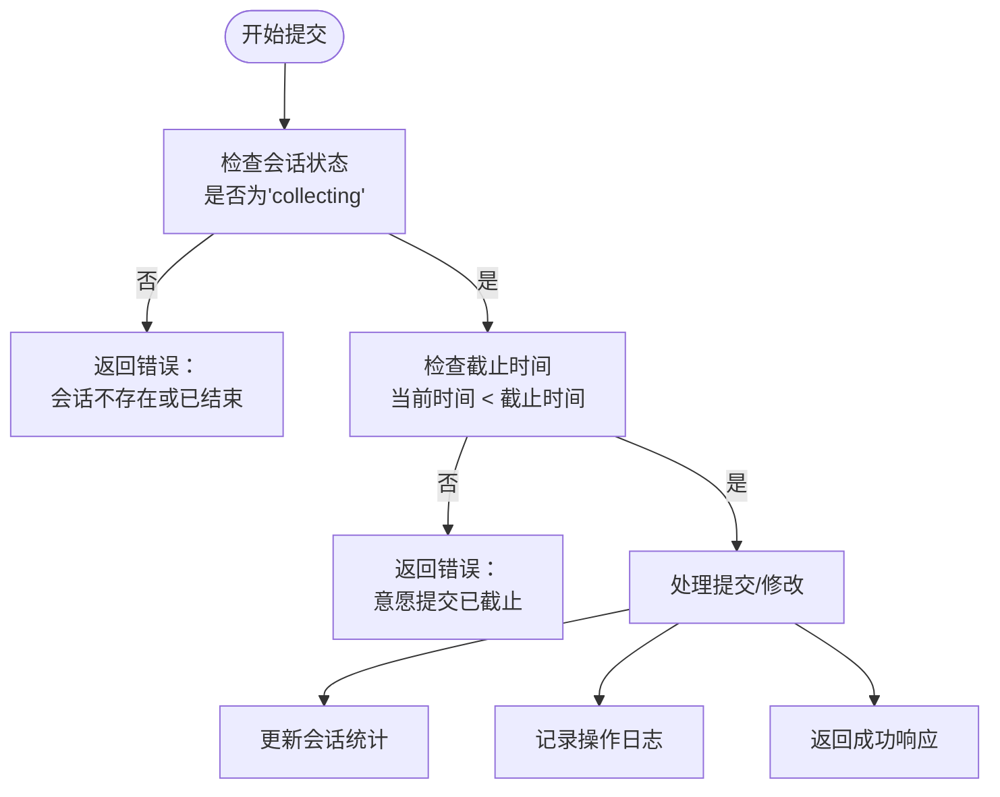
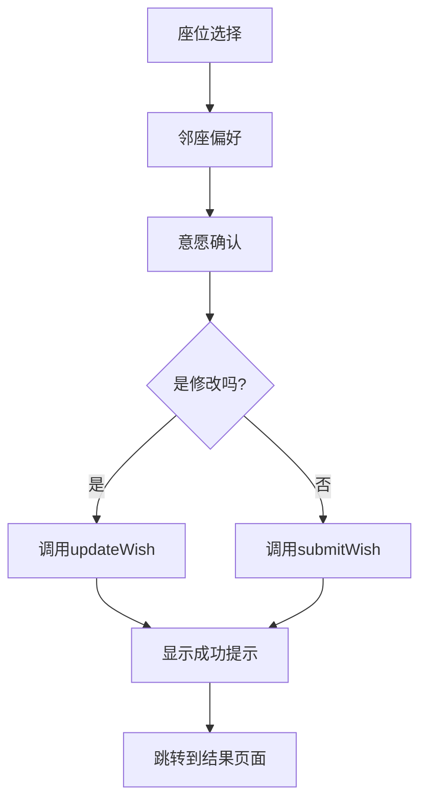

# 意愿管理API

<cite>
**本文档引用的文件**
- [wish.js](file://cloudfunctions/seatArrangementFunctions/modules/wish.js)
- [wish-submit.js](file://miniprogram/pages/wish-submit/wish-submit.js)
- [index.js](file://cloudfunctions/seatArrangementFunctions/index.js)
</cite>

## 目录
1. [简介](#简介)
2. [核心API接口](#核心api接口)
3. [意愿数据结构](#意愿数据结构)
4. [时间窗口控制机制](#时间窗口控制机制)
5. [前端多步骤表单流程](#前端多步骤表单流程)
6. [邻座偏好编码与隐私保护](#邻座偏好编码与隐私保护)
7. [意愿修改限制条件](#意愿修改限制条件)
8. [并发提交冲突处理](#并发提交冲突处理)

## 简介
意愿管理API为学生提供座位安排意愿提交与管理功能，支持在指定会话期间提交首选座位、备选座位、邻座偏好等信息。系统通过严格的验证规则确保数据有效性，并提供完整的操作日志记录和统计功能。

## 核心API接口

### submitWish - 提交意愿
**功能**: 学生首次提交座位安排意愿

**请求参数**:
- `session_id`: 会话ID
- `wish_data`: 意愿数据对象

**验证规则**:
- 会话必须处于"collecting"状态
- 当前时间必须在截止时间之前
- 用户在该会话中尚未提交过意愿

**响应数据**:
```json
{
  "success": true,
  "data": {
    "wish_id": "愿望记录ID",
    "submit_time": "提交时间",
    "version": 1,
    "next_modify_deadline": "下次修改截止时间"
  },
  "message": "意愿提交成功"
}
```

**错误码**:
- 400: 缺少必要参数或教室信息不存在
- 404: 排座会话不存在
- 409: 已提交过意愿，应使用修改功能

**Section sources**
- [wish.js](file://cloudfunctions/seatArrangementFunctions/modules/wish.js#L41-L119)

### updateWish - 更新意愿
**功能**: 修改已提交的座位安排意愿

**请求参数**:
- `session_id`: 会话ID
- `wish_data`: 新的意愿数据对象

**验证规则**:
- 会话必须处于"collecting"状态
- 当前时间必须在截止时间之前
- 用户在该会话中必须已提交过意愿

**版本控制**:
- 每次更新都会递增版本号
- 记录详细的修改历史，包括变更内容和时间戳

**响应数据**:
```json
{
  "success": true,
  "data": {
    "wish_id": "愿望记录ID",
    "update_time": "更新时间",
    "version": "新版本号"
  },
  "message": "意愿更新成功"
}
```

**Section sources**
- [wish.js](file://cloudfunctions/seatArrangementFunctions/modules/wish.js#L163-L229)

### getMyWish - 获取我的意愿
**功能**: 获取当前用户的意愿信息

**请求参数**:
- `session_id`: 会话ID

**返回数据**:
```json
{
  "success": true,
  "data": {
    "wish_id": "愿望ID",
    "wish_data": {
      "preferred_seats": "偏好座位",
      "avoided_seats": "避免座位",
      "preferred_neighbors": "偏好邻座",
      "avoided_neighbors": "避免邻座",
      "special_requirements": "特殊需求"
    },
    "submit_time": "初次提交时间",
    "update_time": "最后更新时间",
    "version": "当前版本",
    "can_modify": "是否可修改",
    "modification_history": "修改历史"
  },
  "message": "获取成功"
}
```

**可修改状态判断**:
- 会话状态为"collecting"
- 当前时间在截止时间之前

**Section sources**
- [wish.js](file://cloudfunctions/seatArrangementFunctions/modules/wish.js#L231-L291)

## 意愿数据结构

### 座位选择
**首选座位 (preferred_seats)**:
- 数组结构，包含用户偏好的座位
- 每个座位对象包含`seat_id`和`priority`（优先级）
- 最多可选择5个座位
- 必须是教室布局中可用的座位

**避免座位 (avoided_seats)**:
- 数组结构，包含用户希望避免的座位
- 每个座位对象包含`seat_id`
- 最多可选择5个座位
- 必须是教室布局中可用的座位

### 邻座偏好
**偏好邻座 (preferred_neighbors)**:
- 数组结构，包含用户希望邻座的同学
- 每个对象包含`student_id`
- 最多可选择3个同学
- 必须是同班同学

**避免邻座 (avoided_neighbors)**:
- 数组结构，包含用户希望避免邻座的同学
- 每个对象包含`student_id`
- 最多可选择3个同学
- 必须是同班同学

### 特殊需求
**特殊需求 (special_requirements)**:
- 字符串类型
- 用户可输入文本描述特殊座位需求
- 例如："需要靠近电源插座"、"需要大桌子"等

**验证规则**:
- 所有座位ID必须在教室可用座位列表中
- 所有学生ID必须在同班学生列表中
- 数量限制：偏好/避免座位≤5个，偏好/避免邻座≤3个

**Section sources**
- [wish.js](file://cloudfunctions/seatArrangementFunctions/modules/wish.js#L293-L371)

## 时间窗口控制机制

### 会话状态管理
系统通过会话状态控制意愿提交的时间窗口：

**会话状态**:
- `collecting`: 收集意愿阶段，允许提交和修改
- `processing`: 处理阶段，停止接收新意愿
- `completed`: 完成阶段，生成最终座位安排

### 截止时间检查


**实现逻辑**:
1. 验证会话存在且状态为"collecting"
2. 比较当前时间与会话截止时间
3. 只有在截止时间前才允许提交或修改

**相关字段**:
- `arrangement_sessions`集合中的`status`字段
- `arrangement_sessions`集合中的`deadline`字段

**Section sources**
- [wish.js](file://cloudfunctions/seatArrangementFunctions/modules/wish.js#L41-L85)
- [wish.js](file://cloudfunctions/seatArrangementFunctions/modules/wish.js#L163-L203)

## 前端多步骤表单流程

### 表单流程设计


### 数据流实现
**全局数据管理**:
- 使用`app.globalData`存储分步收集的数据
- `seatSelection`: 存储座位选择数据
- `neighborPreference`: 存储邻座偏好数据

**数据加载**:
```javascript
// 从全局数据获取并构建完整意愿数据
const wishData = {
  preferred_seats: seatSelection.preferred_seats || [],
  avoided_seats: seatSelection.avoided_seats || [],
  preferred_neighbors: neighborPreference.preferred_neighbors || [],
  avoided_neighbors: neighborPreference.avoided_neighbors || [],
  special_requirements: neighborPreference.special_requirements || ''
};
```

**提交逻辑**:
```javascript
// 根据isModification标志决定调用哪个API
data: {
  type: that.data.isModification ? 'updateWish' : 'submitWish',
  token: wx.getStorageSync('token'),
  wish_data: that.data.wishData
}
```

**用户体验**:
- 分步引导用户完成复杂表单
- 实时验证输入数据
- 提交后清除全局数据，防止重复提交
- 成功后自动跳转到结果页面

**Section sources**
- [wish-submit.js](file://miniprogram/pages/wish-submit/wish-submit.js#L0-L91)

## 邻座偏好编码与隐私保护

### 隐私保护策略
系统采用以下措施保护学生隐私：

**学号不直接暴露**:
- 前端不显示同学学号
- 使用昵称或姓名进行选择
- 后端通过安全的数据库查询验证学号有效性

**数据验证**:
```javascript
// 验证邻座选择的有效性
const classmates = await db.collection('students').where({
  class_id: classId,
  is_active: true
}).field({
  student_id: true
}).get();

const validStudentIds = classmates.data.map(student => student.student_id);
```

**选择限制**:
- 只能选择同班同学
- 不能选择自己
- 数量限制（最多3个偏好/避免邻座）

### 编码方式
**前端编码**:
- 用户通过姓名或昵称选择同学
- 系统将选择转换为对应的学号
- 学号在传输过程中加密处理

**后端验证**:
- 接收学号后立即验证是否属于同班
- 记录操作日志时不暴露敏感信息
- 数据库查询使用参数化防止注入攻击

**Section sources**
- [wish.js](file://cloudfunctions/seatArrangementFunctions/modules/wish.js#L327-L371)

## 意愿修改限制条件

### 修改次数限制
系统目前采用会话级别的修改限制：

**版本控制**:
- 每次修改都会递增版本号
- 记录完整的修改历史
- 可追溯每次变更的内容

```javascript
const newVersion = currentWish.version + 1;
const updateData = {
  version: newVersion,
  // ...其他更新字段
  'modification_history': [...(currentWish.modification_history || []), {
    version: newVersion,
    timestamp: now_iso,
    changes: changes.join(', ')
  }]
};
```

### 截止时间限制
**双重检查机制**:
1. 会话状态检查: `status === 'collecting'`
2. 时间截止检查: `now < deadline`

**修改历史记录**:
- 记录每次修改的版本号
- 记录修改时间戳
- 记录具体的变更内容
- 用于审计和问题排查

**操作日志**:
```javascript
await db.collection('system_logs').add({
  data: {
    log_id: `log_${Date.now()}`,
    user_id: student_id,
    user_type: 'student',
    action: 'update_wish',
    session_id: session_id,
    details: {
      wish_id: currentWish.wish_id,
      old_version: currentWish.version,
      new_version: newVersion,
      changes: changes
    },
    result: 'success',
    create_time: now_iso
  }
});
```

**Section sources**
- [wish.js](file://cloudfunctions/seatArrangementFunctions/modules/wish.js#L163-L229)

## 并发提交冲突处理

### 冲突检测机制
系统通过版本号和时间戳防止并发修改冲突：

**乐观锁机制**:
- 每次更新都基于当前最新版本
- 服务器端验证版本一致性
- 避免覆盖其他用户的修改

**变更计算**:
```javascript
const calculateChanges = (oldWish, newWishData) => {
  const changes = [];
  
  // 比较各个字段的JSON字符串
  if (JSON.stringify(oldWish.preferred_seats) !== JSON.stringify(newWishData.preferred_seats)) {
    changes.push('修改了偏好座位');
  }
  
  // ...其他字段比较
  
  return changes.length > 0 ? changes : ['无实质性变更'];
};
```

### 操作日志
**详细记录**:
- 记录每次操作的详细变更
- 包含操作前后的版本号
- 记录具体修改内容
- 用于后续审计和问题排查

**统计信息更新**:
```javascript
// 更新会话统计信息
await updateSessionStatistics(session_id, db);
```

**错误处理**:
- 捕获所有异常并返回友好错误信息
- 记录详细的错误日志用于排查
- 确保数据库事务的完整性

**Section sources**
- [wish.js](file://cloudfunctions/seatArrangementFunctions/modules/wish.js#L373-L405)
- [wish.js](file://cloudfunctions/seatArrangementFunctions/modules/wish.js#L407-L453)