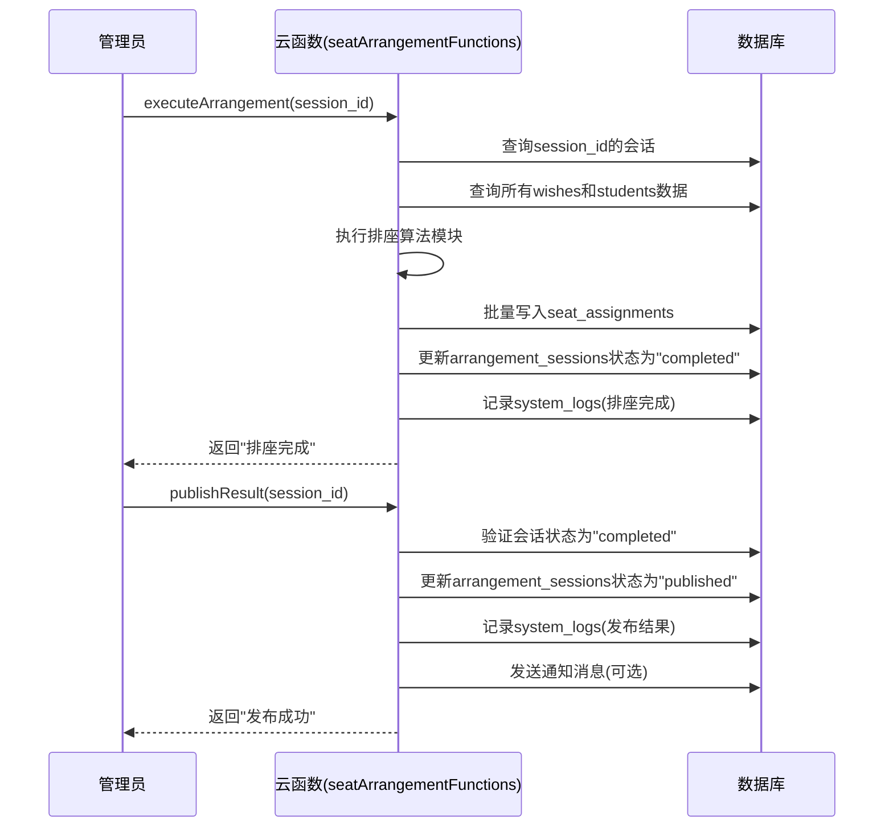

# 结果管理API

<cite>
**本文档引用的文件**   
- [result.js](file://cloudfunctions/seatArrangementFunctions/modules/result.js)
- [index.js](file://cloudfunctions/seatArrangementFunctions/index.js)
- [result.js](file://miniprogram/pages/result/result.js)
</cite>

## 目录
1. [简介](#简介)
2. [核心接口说明](#核心接口说明)
3. [权限控制与数据脱敏](#权限控制与数据脱敏)
4. [座位分配结果数据结构](#座位分配结果数据结构)
5. [排座结果发布流程时序图](#排座结果发布流程时序图)
6. [手动调整接口审计日志](#手动调整接口审计日志)
7. [前端展示代码示例](#前端展示代码示例)
8. [结果不可变性原则与修正流程](#结果不可变性原则与修正流程)

## 简介
本文档旨在为排座系统中的结果管理API提供权威的技术说明。系统通过自动化算法结合学生意愿进行智能排座，并提供完整的管理接口支持管理员进行手动调整与结果发布。本文档详细说明了`getMyAssignment`、`getArrangementResult`、`manualAdjustSeat`等关键接口的功能、权限控制、数据结构及使用方式，确保开发者和管理员能够正确理解和使用该系统。

## 核心接口说明

### 获取我的座位分配（getMyAssignment）
该接口允许学生查询自己在指定排座会话中的座位分配详情。接口会返回座位号、位置描述、邻座信息、满意度评分以及是否被手动调整等关键信息。

**接口路径**：`seatArrangementFunctions` 云函数，`type=getMyAssignment`

**请求参数**：
- `session_id`：排座会话ID
- `token`：用户认证令牌

**响应数据**：
- `seat_info`：包含座位ID、行列坐标和中文位置描述。
- `neighbors`：包含前后左右四个方向邻座的学生信息。
- `satisfaction_score`：0到1之间的数值，表示排座方案对学生个人意愿的满足程度。
- `manual_adjusted`：布尔值，标识该座位是否经过管理员手动调整。

### 获取排座结果（getArrangementResult）
该接口用于获取整个教室的排座结果。根据请求格式（`format`）的不同，返回的数据详略程度也不同。

**接口路径**：`seatArrangementFunctions` 云函数，`type=getArrangementResult`

**请求参数**：
- `session_id`：排座会话ID
- `format`：可选，`simple`（默认）或 `detailed`
- `token`：用户认证令牌

**响应数据**：
- **简单格式**：返回一个二维数组`seat_map`，表示教室的座位图，每个元素包含座位ID和对应的学生信息（仅姓名和满意度）。
- **详细格式**：除座位图外，还包含：
  - `overall_statistics`：总体统计信息，如总人数、平均满意度、满意度分布。
  - `assignments`：所有学生的详细分配记录列表。
  - `conflicts`：排座过程中解决的冲突记录。
  - `generate_time`：结果生成的时间戳。

### 手动调整座位（manualAdjustSeat）
此接口专供排座管理员使用，用于对已生成的排座结果进行人工干预和调整。

**接口路径**：`seatArrangementFunctions` 云函数，`type=manualAdjustSeat`

**请求参数**：
- `session_id`：排座会话ID
- `adjustments`：一个调整操作的数组，每个操作包含：
  - `student_id`：学生ID
  - `from_seat`：原座位ID
  - `to_seat`：目标座位ID
  - `reason`：调整原因（可选）

**处理逻辑**：
1.  验证管理员权限。
2.  对每个调整请求进行有效性检查（如学生是否在该会话中、目标座位是否空闲）。
3.  在数据库中更新学生的座位信息，并将`manual_adjusted`标记为`true`。
4.  将调整记录追加到`adjust_history`数组中。
5.  记录完整的操作日志。

**响应数据**：
- `adjusted_count`：成功调整的座位数量。
- `errors`：一个包含失败调整及其错误信息的数组。

**Section sources**
- [result.js](file://cloudfunctions/seatArrangementFunctions/modules/result.js#L5-L76)
- [result.js](file://cloudfunctions/seatArrangementFunctions/modules/result.js#L81-L164)
- [result.js](file://cloudfunctions/seatArrangementFunctions/modules/result.js#L325-L416)

## 权限控制与数据脱敏

### 权限控制
系统严格区分学生和管理员的角色，确保数据访问的安全性。

- **学生角色**：
  - 只能调用 `getMyAssignment` 接口，且只能查询自己的座位信息。
  - 调用 `getArrangementResult` 接口时，`format` 参数必须为 `simple`，只能获取脱敏后的座位图，无法查看其他学生的详细信息。

- **管理员角色**（`admin` 或 `seat_manager`）：
  - 可以调用所有结果管理接口。
  - 调用 `getArrangementResult` 接口时，可以指定 `format=detailed`，获取包含所有学生详细信息和统计分析的完整结果。

**权限检查代码示例**：
```javascript
// 在 getArrangementResult 函数中
if (format !== 'simple' && userInfo.role !== 'admin' && userInfo.role !== 'seat_manager') {
  return createResponse(false, null, '权限不足', 403);
}
```

### 数据脱敏规则
为了保护学生隐私，在向学生返回的座位图中，仅展示必要的信息：
- **姓名**：在前端展示时，通常只显示姓名的首字母（如 `张三` 显示为 `Z`），具体实现由前端代码控制。
- **学号**：在任何返回给学生的数据中均不包含学号。
- **联系方式**：任何接口均不返回学生的联系方式。

**Section sources**
- [result.js](file://cloudfunctions/seatArrangementFunctions/modules/result.js#L85-L88)

## 座位分配结果数据结构

### 核心数据结构
排座结果的核心数据存储在 `seat_assignments` 集合中，其主要字段如下：

| 字段名 | 类型 | 描述 |
| :--- | :--- | :--- |
| `assignment_id` | string | 唯一的分配记录ID |
| `session_id` | string | 关联的排座会话ID |
| `student_id` | string | 学生ID |
| `student_name` | string | 学生姓名 |
| `seat_id` | string | 分配的座位ID |
| `position` | object | 座位的行列坐标，如 `{row: 3, col: 5}` |
| `satisfaction_score` | number | 满意度评分 (0-1) |
| `assignment_reasons` | array | 分配原因的数组，如 ["满足第一志愿", "靠近讲台"] |
| `manual_adjusted` | boolean | 是否被手动调整过 |
| `adjust_history` | array | 手动调整的历史记录数组 |
| `assign_time` | string | 分配时间（ISO 8601格式） |
| `create_time` | string | 记录创建时间 |
| `update_time` | string | 记录更新时间 |

### 邻座信息结构
`getMyAssignment` 接口返回的 `neighbors` 对象是一个包含四个方向的映射：

```json
{
  "front": {
    "student_id": "stu_123",
    "student_name": "李四",
    "is_preferred": false
  },
  "back": null,
  "left": {
    "student_id": "stu_456",
    "student_name": "王五",
    "is_preferred": true
  },
  "right": null
}
```
- 如果某个方向没有邻座或座位为空，则该方向的值为 `null`。
- `is_preferred` 字段用于标识该邻座是否是学生在提交意愿时指定的希望邻座。

**Section sources**
- [result.js](file://cloudfunctions/seatArrangementFunctions/modules/result.js#L60-L70)

## 排座结果发布流程时序图

该时序图展示了从管理员启动排座算法到最终发布结果的完整流程。



**Diagram sources**
- [index.js](file://cloudfunctions/seatArrangementFunctions/index.js#L255-L257)
- [result.js](file://cloudfunctions/seatArrangementFunctions/modules/result.js)

## 手动调整接口审计日志

`manualAdjustSeat` 接口具备完善的审计日志功能，确保所有手动操作都可追溯。

### 操作追溯机制
每次成功的手动调整操作都会在 `system_logs` 集合中生成一条日志记录，其关键字段包括：

| 字段名 | 描述 |
| :--- | :--- |
| `action` | 固定为 `manual_adjust_seat` |
| `user_id` | 执行操作的管理员ID |
| `session_id` | 被调整的排座会话ID |
| `details.adjustments` | 包含所有调整请求的原始数据 |
| `details.results` | 包含实际调整结果（成功数量、错误信息） |
| `create_time` | 操作发生的时间戳 |

### 日志分析
通过查询 `system_logs` 集合，管理员可以：
- 查看某次排座会话中所有的手动调整记录。
- 追溯某个特定座位的调整历史。
- 了解每次调整的原因（由操作者填写）。
- 审计操作的合规性。

**Section sources**
- [result.js](file://cloudfunctions/seatArrangementFunctions/modules/result.js#L395-L408)

## 前端展示代码示例

以下代码展示了小程序前端如何调用API并渲染排座结果。

### 座位图渲染
```javascript
// pages/result/result.js
Page({
  data: {
    seatMap: [], // 用于存储处理后的座位图数据
    myAssignment: null // 存储我的座位信息
  },

  // 加载我的座位分配
  loadResult: function() {
    wx.cloud.callFunction({
      name: 'seatArrangementFunctions',
      data: {
        type: 'getMyAssignment',
        token: wx.getStorageSync('token'),
        session_id: this.data.currentSession.session_id
      },
      success: (res) => {
        if (res.result.success) {
          this.setData({
            myAssignment: res.result.data,
            satisfactionScore: (res.result.data.satisfaction_score * 100).toFixed(0)
          });
          // 加载座位图
          this.loadSeatMap();
        }
      }
    });
  },

  // 加载并处理座位图
  loadSeatMap: function() {
    wx.cloud.callFunction({
      name: 'seatArrangementFunctions',
      data: {
        type: 'getArrangementResult',
        token: wx.getStorageSync('token'),
        session_id: this.data.currentSession.session_id,
        format: 'simple'
      },
      success: (res) => {
        if (res.result.success) {
          // 处理座位图，添加学生姓名首字母
          const processedSeatMap = res.result.data.classroom_layout.seat_map.map(row => {
            return row.map(seat => ({
              ...seat,
              studentInitial: seat.student ? seat.student.name.charAt(0) : ''
            }));
          });
          this.setData({ seatMap: processedSeatMap });
        }
      }
    });
  }
});
```

### 邻座信息提示
在WXML模板中，可以通过 `myAssignment.neighbors` 数据来展示邻座信息：
```xml
<!-- 显示邻座信息 -->
<view wx:if="{{myAssignment}}">
  <view>我的邻座：</view>
  <view wx:if="{{myAssignment.neighbors.front}}">前座：{{myAssignment.neighbors.front.student_name}}</view>
  <view wx:if="{{myAssignment.neighbors.back}}">后座：{{myAssignment.neighbors.back.student_name}}</view>
  <view wx:if="{{myAssignment.neighbors.left}}">左座：{{myAssignment.neighbors.left.student_name}}</view>
  <view wx:if="{{myAssignment.neighbors.right}}">右座：{{myAssignment.neighbors.right.student_name}}</view>
</view>
```

**Section sources**
- [result.js](file://miniprogram/pages/result/result.js#L100-L140)

## 结果不可变性原则与修正流程

### 不可变性原则
一旦排座结果被发布（`status` 变更为 `published`），该结果即被视为最终且不可变的。这意味着：
- 学生无法再提交或修改座位意愿。
- 自动排座算法无法再次执行。
- `getArrangementResult` 接口返回的数据是最终的、权威的版本。

### 特殊情况下的修正流程
尽管结果被设计为不可变，但在出现严重错误（如数据录入错误）等极少数情况下，需要进行修正。此流程必须由高级管理员执行，并遵循严格的步骤：

1.  **申请与审批**：管理员需向上级提交书面申请，说明修正原因。
2.  **状态回退**：在获得批准后，通过 `updateSessionStatus` 接口将会话状态从 `published` 临时回退到 `completed`。
3.  **执行修正**：使用 `manualAdjustSeat` 接口进行必要的手动调整。
4.  **重新发布**：再次调用 `publishResult` 接口，将修正后的结果重新发布。
5.  **记录日志**：系统会自动记录状态变更和手动调整的日志，形成完整的审计轨迹。

此流程确保了任何对已发布结果的修改都是透明、可追溯且受控的。

**Section sources**
- [session.js](file://cloudfunctions/seatArrangementFunctions/modules/session.js#L220-L240)
- [result.js](file://cloudfunctions/seatArrangementFunctions/modules/result.js#L325-L416)