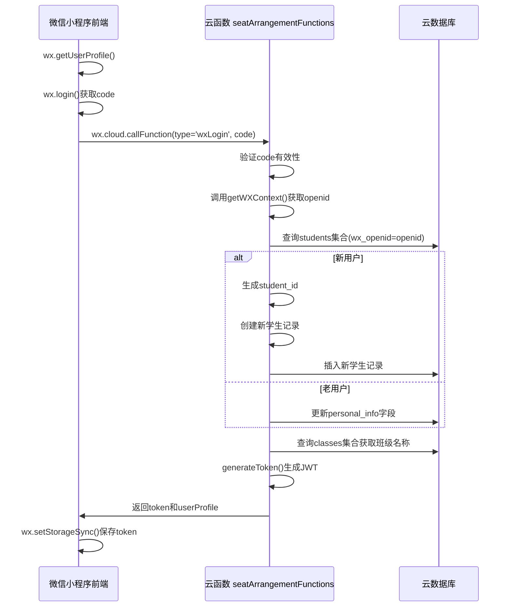

# 认证API

<cite>
**本文档引用的文件**
- [auth.js](file://cloudfunctions/seatArrangementFunctions/modules/auth.js)
- [index.js](file://cloudfunctions/seatArrangementFunctions/index.js)
- [login.js](file://miniprogram/pages/login/login.js)
- [app.js](file://miniprogram/app.js)
- [permission.js](file://cloudfunctions/seatArrangementFunctions/modules/permission.js)
</cite>

## 目录
1. [简介](#简介)
2. [核心认证接口](#核心认证接口)
3. [JWT令牌机制](#jwt令牌机制)
4. [前端调用示例](#前端调用示例)
5. [全局认证状态管理](#全局认证状态管理)
6. [权限区分机制](#权限区分机制)
7. [登录流程时序图](#登录流程时序图)

## 简介
本文档详细说明了座位安排小程序的认证系统，涵盖微信学生登录、管理员登录和令牌刷新三个核心云函数接口。系统采用JWT（JSON Web Token）进行身份验证，实现了学生用户与管理员用户的权限分离。认证流程从前端微信授权开始，通过云函数与数据库交互完成用户身份验证，并返回包含用户信息和访问令牌的响应。系统还实现了令牌刷新机制以提升用户体验。

## 核心认证接口

### wxLogin - 微信学生登录
该接口用于微信小程序用户的一键登录，通过微信授权码获取用户身份。

**调用名称**: `wxLogin`

**请求参数**:
- `code` (string, 必填): 微信登录凭证，通过 `wx.login()` 获取
- `userInfo` (object, 必填): 用户信息对象，包含 nickName、avatarUrl、gender 等字段

**响应数据结构**:
```json
{
  "success": true,
  "code": 200,
  "message": "登录成功",
  "data": {
    "token": "eyJhbGciOiJIUzI1NiIsInR5cCI6IkpXVCJ9...",
    "userProfile": {
      "openid": "o123456789",
      "student_id": "stu_abc123",
      "name": "张三",
      "student_number": "20210001",
      "role": "student",
      "class_id": "cls_101",
      "class_name": "计算机科学与技术1班",
      "avatarUrl": "https://...",
      "special_needs": {
        "vision_impaired": false,
        "hearing_impaired": false,
        "height_tall": false,
        "other_requirements": ""
      }
    },
    "expiresIn": 604800
  },
  "timestamp": 1700000000000
}
```

**错误码**:
- `INVALID_CODE`: 缺少微信授权码 (400)
- `USER_INFO_MISSING`: 获取微信用户信息失败 (400)
- `DATABASE_ERROR`: 数据库操作失败 (500)

**Section sources**
- [auth.js](file://cloudfunctions/seatArrangementFunctions/modules/auth.js#L5-L118)

### adminLogin - 管理员登录
该接口用于管理员用户通过用户名和密码进行登录。

**调用名称**: `adminLogin`

**请求参数**:
- `username` (string, 必填): 管理员用户名
- `password` (string, 必填): 管理员密码
- `loginType` (string, 可选): 登录类型标识

**响应数据结构**:
```json
{
  "success": true,
  "code": 200,
  "message": "登录成功",
  "data": {
    "token": "eyJhbGciOiJIUzI1NiIsInR5cCI6IkpXVCJ9...",
    "adminProfile": {
      "admin_id": "admin_123",
      "name": "系统管理员",
      "username": "admin",
      "role": "seat_manager",
      "permissions": ["create_session", "manage_students", "execute_arrangement"],
      "class_ids": ["cls_101", "cls_102"],
      "class_names": ["计算机科学与技术1班", "软件工程2班"]
    },
    "expiresIn": 28800
  },
  "timestamp": 1700000000000
}
```

**错误码**:
- `INVALID_CREDENTIAL`: 用户名或密码错误 (401)
- `MISSING_CREDENTIAL`: 用户名和密码不能为空 (400)
- `DATABASE_ERROR`: 数据库操作失败 (500)

**Section sources**
- [auth.js](file://cloudfunctions/seatArrangementFunctions/modules/auth.js#L123-L207)

### refreshToken - 令牌刷新
该接口用于使用刷新令牌获取新的访问令牌，延长用户会话。

**调用名称**: `refreshToken`

**请求参数**:
- `refreshToken` (string, 必填): 用于刷新的令牌

**响应数据结构**:
```json
{
  "success": true,
  "code": 200,
  "message": "令牌刷新成功",
  "data": {
    "token": "eyJhbGciOiJIUzI1NiIsInR5cCI6IkpXVCJ9...",
    "expiresIn": 7200
  },
  "timestamp": 1700000000000
}
```

**错误码**:
- `MISSING_REFRESH_TOKEN`: 缺少刷新令牌 (400)
- `INVALID_REFRESH_TOKEN`: 刷新令牌无效 (401)
- `REFRESH_FAILED`: 刷新令牌失败 (500)

**Section sources**
- [auth.js](file://cloudfunctions/seatArrangementFunctions/modules/auth.js#L212-L238)

## JWT令牌机制

### 令牌生成
系统使用 `jsonwebtoken` 库生成JWT令牌。令牌包含用户身份信息作为载荷（payload），并使用预设密钥进行签名。

**生成函数**:
```javascript
const generateToken = (payload, expiresIn = '2h') => {
  return jwt.sign(payload, JWT_SECRET, { expiresIn });
};
```

**学生令牌载荷**:
```json
{
  "student_id": "stu_abc123",
  "openid": "o123456789",
  "role": "student",
  "class_id": "cls_101"
}
```

**管理员令牌载荷**:
```json
{
  "admin_id": "admin_123",
  "username": "admin",
  "role": "seat_manager",
  "class_ids": ["cls_101", "cls_102"]
}
```

### 有效期配置
- **学生令牌**: 7天 (`7d`)
- **管理员令牌**: 8小时 (`8h`)
- **刷新令牌**: 2小时 (`2h`)

### 前端请求头使用
前端在调用需要认证的云函数时，需在请求数据中包含 `token` 字段：

```javascript
wx.cloud.callFunction({
  name: 'seatArrangementFunctions',
  data: {
    type: 'getCurrentSession',
    token: wx.getStorageSync('token'), // 从本地存储获取
    class_id: 'cls_101'
  }
})
```

云函数入口会自动验证令牌的有效性，验证失败则返回401状态码。

**Section sources**
- [index.js](file://cloudfunctions/seatArrangementFunctions/index.js#L15-L35)
- [auth.js](file://cloudfunctions/seatArrangementFunctions/modules/auth.js#L212-L238)

## 前端调用示例

### 微信登录完整代码示例
```javascript
// 调用云函数登录
callCloudLogin: function(code, userInfo) {
  const that = this;
  
  wx.cloud.callFunction({
    name: 'seatArrangementFunctions',
    data: {
      type: 'wxLogin',
      code: code,
      userInfo: userInfo
    },
    success: (res) => {
      console.log('cloud login success', res);
      
      if (res.result.success) {
        // 保存登录信息
        wx.setStorageSync('token', res.result.data.token);
        wx.setStorageSync('userInfo', res.result.data.userProfile);
        wx.setStorageSync('expiresIn', res.result.data.expiresIn);
        wx.setStorageSync('loginTime', Date.now());
        
        that.setData({
          isLoggedIn: true,
          userInfo: res.result.data.userProfile,
          loading: false
        });
        
        wx.showToast({
          title: '登录成功',
          icon: 'success'
        });
        
        // 跳转到主页面
        this.navigateToMain();
      } else {
        that.setData({ loading: false });
        wx.showToast({
          title: res.result.message || '登录失败',
          icon: 'none'
        });
      }
    },
    fail: (err) => {
      console.error('cloud login failed', err);
      that.setData({ loading: false });
      wx.showToast({
        title: '登录失败，请检查网络',
        icon: 'none'
      });
    }
  });
}
```

**Section sources**
- [login.js](file://miniprogram/pages/login/login.js#L70-L150)

## 全局认证状态管理

### app.js 全局初始化
在 `app.js` 中进行云开发环境的初始化，为整个小程序提供统一的云开发能力。

```javascript
// app.js
App({
  onLaunch: function () {
    this.globalData = {
      env: "cloud1-4gumvlngdea8db4b" // 云环境 ID
    };
    if (!wx.cloud) {
      console.error("请使用 2.2.3 或以上的基础库以使用云能力");
    } else {
      wx.cloud.init({
        env: this.globalData.env,
        traceUser: true,
      });
    }
  },
});
```

### 登录状态检查
在登录页面的 `onLoad` 生命周期中检查本地存储的登录状态：

```javascript
// 检查登录状态
checkLoginStatus: function() {
  const token = wx.getStorageSync('token');
  const userInfo = wx.getStorageSync('userInfo');
  
  if (token && userInfo) {
    this.setData({
      isLoggedIn: true,
      userInfo: userInfo
    });
    // 跳转到主页面
    this.navigateToMain();
  }
}
```

### 退出登录处理
清除本地存储的认证信息，实现安全退出：

```javascript
// 退出登录
onLogout: function() {
  wx.showModal({
    title: '提示',
    content: '确定要退出登录吗？',
    success: (res) => {
      if (res.confirm) {
        // 清除本地存储
        wx.removeStorageSync('token');
        wx.removeStorageSync('userInfo');
        wx.removeStorageSync('expiresIn');
        wx.removeStorageSync('loginTime');
        
        this.setData({
          isLoggedIn: false,
          userInfo: {}
        });
        
        wx.showToast({
          title: '已退出登录',
          icon: 'success'
        });
      }
    }
  });
}
```

**Section sources**
- [app.js](file://miniprogram/app.js#L1-L21)
- [login.js](file://miniprogram/pages/login/login.js#L15-L25)

## 权限区分机制

### 角色定义
系统定义了两种主要角色：
- **学生 (student)**: 普通用户，可查看自己的座位安排、提交意愿等
- **管理员 (admin/seat_manager)**: 管理人员，拥有创建会话、执行排座、管理用户等高级权限

### 权限验证流程
1. 云函数接收到请求后，首先检查 `type` 参数
2. 对于非公开接口（非 `wxLogin`, `adminLogin`, `refreshToken`），提取请求中的 `token`
3. 使用 `verifyToken` 函数验证JWT令牌的有效性
4. 从解码的令牌中获取用户角色信息
5. 根据角色和接口类型进行权限判断

### 权限控制实现
权限控制通过 `permission.js` 模块实现，使用装饰器模式包装处理函数：

```javascript
// 读取权限：所有人都可以执行
const allowRead = (handler) => {
  return async (event, userInfo, dependencies) => {
    return await handler(event, userInfo, dependencies);
  };
};

// 写入权限：仅管理员可执行
const requireAdminWrite = (handler) => {
  return async (event, userInfo, dependencies) => {
    const permissionCheck = checkPermission(userInfo, ['admin', 'seat_manager']);
    if (!permissionCheck.success) {
      return dependencies.createResponse(false, null, '仅管理员可执行写入操作', 403);
    }
    return await handler(event, userInfo, dependencies);
  };
};
```

**Section sources**
- [index.js](file://cloudfunctions/seatArrangementFunctions/index.js#L150-L160)
- [permission.js](file://cloudfunctions/seatArrangementFunctions/modules/permission.js#L45-L178)

## 登录流程时序图



**Diagram sources**
- [auth.js](file://cloudfunctions/seatArrangementFunctions/modules/auth.js#L5-L118)
- [index.js](file://cloudfunctions/seatArrangementFunctions/index.js#L150-L160)