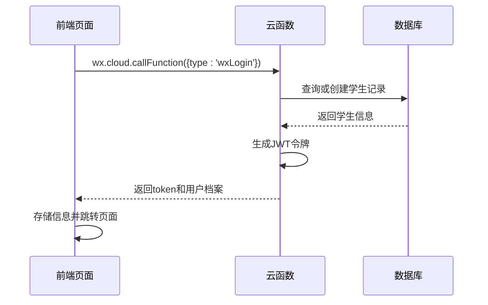
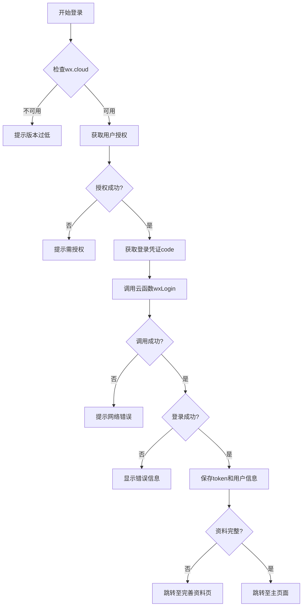
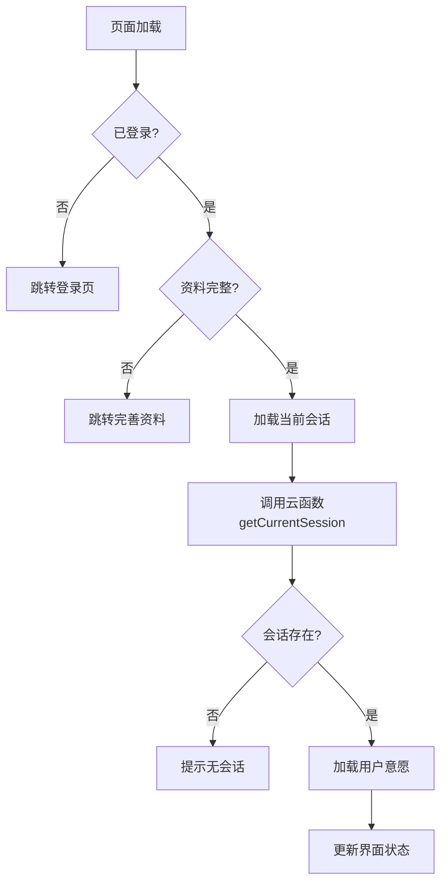

# API调用集成

<cite>
**本文档引用文件**  
- [login.js](file://miniprogram/pages/login/login.js)
- [seat-selection.js](file://miniprogram/pages/seat-selection/seat-selection.js)
- [index.js](file://cloudfunctions/seatArrangementFunctions/index.js)
- [auth.js](file://cloudfunctions/seatArrangementFunctions/modules/auth.js)
- [session.js](file://cloudfunctions/seatArrangementFunctions/modules/session.js)
- [wish.js](file://cloudfunctions/seatArrangementFunctions/modules/wish.js)
</cite>

## 目录
1. [简介](#简介)
2. [API调用格式与参数传递](#api调用格式与参数传递)
3. [成功与失败回调处理机制](#成功与失败回调处理机制)
4. [微信登录调用实例分析](#微信登录调用实例分析)
5. [权限校验与会话状态检查](#权限校验与会话状态检查)
6. [错误处理策略](#错误处理策略)
7. [统一请求封装建议](#统一请求封装建议)
8. [总结](#总结)

## 简介
本项目通过微信小程序云开发能力，实现前后端通信。前端使用 `wx.cloud.callFunction` 调用后端云函数，完成用户登录、会话加载、意愿提交等核心功能。文档将详细说明 API 调用机制，结合实际代码展示请求封装模式、权限校验逻辑和错误处理策略，为开发者提供完整的集成指导。

## API调用格式与参数传递
前端通过 `wx.cloud.callFunction` 方法调用云函数，核心参数包括 `name`（云函数名称）和 `data`（传递数据）。`data` 字段采用统一结构：`type` 表示操作类型，其余字段为具体参数。

例如，在登录流程中，调用 `seatArrangementFunctions` 云函数并指定 `type: 'wxLogin'`，同时传递微信授权码和用户信息：

```js
wx.cloud.callFunction({
  name: 'seatArrangementFunctions',
  data: {
    type: 'wxLogin',
    code: code,
    userInfo: userInfo
  }
})
```

后端通过 `event.type` 进行路由分发，调用对应模块处理逻辑。这种设计实现了单一入口、多业务路由的架构模式，便于维护和扩展。

**Section sources**
- [login.js](file://miniprogram/pages/login/login.js#L100-L115)
- [index.js](file://cloudfunctions/seatArrangementFunctions/index.js#L150-L155)

## 成功与失败回调处理机制
`wx.cloud.callFunction` 支持 `success` 和 `fail` 回调函数，分别处理成功响应和网络/执行异常。

- **成功回调**：检查 `res.result.success` 判断业务逻辑是否成功。若成功，更新页面数据、存储用户信息，并进行页面跳转；若失败，则根据 `res.result.message` 显示错误提示。
- **失败回调**：通常由网络问题或云函数执行异常引起，应提示用户检查网络连接。

在登录流程中，成功回调会保存 JWT 令牌、用户档案等信息至本地存储，并跳转至主页面或个人信息完善页。



**Diagram sources**
- [login.js](file://miniprogram/pages/login/login.js#L116-L150)
- [auth.js](file://cloudfunctions/seatArrangementFunctions/modules/auth.js#L10-L150)

**Section sources**
- [login.js](file://miniprogram/pages/login/login.js#L116-L150)
- [auth.js](file://cloudfunctions/seatArrangementFunctions/modules/auth.js#L10-L150)

## 微信登录调用实例分析
`login.js` 文件中的 `callCloudLogin` 方法展示了完整的云函数调用封装模式。该方法接收微信登录凭证 `code` 和用户信息 `userInfo`，调用 `seatArrangementFunctions` 云函数完成登录。

调用流程如下：
1. 设置加载状态
2. 发起云函数调用
3. 成功时保存 `token`、`userInfo`、`expiresIn` 等信息
4. 检查用户资料完整性，决定跳转路径
5. 失败时清除加载状态并提示用户

此模式体现了典型的请求-响应-状态更新闭环，确保用户体验流畅。



**Diagram sources**
- [login.js](file://miniprogram/pages/login/login.js#L80-L150)

**Section sources**
- [login.js](file://miniprogram/pages/login/login.js#L80-L150)

## 权限校验与会话状态检查
`seat-selection.js` 文件在页面加载时执行完整的权限与状态检查流程。`checkLoginStatus` 方法首先验证本地是否存在 `token` 和 `userInfo`，若缺失则重定向至登录页。

随后检查用户资料完整性（`student_id` 和 `name` 是否存在），若不完整则跳转至资料完善页。最后调用 `loadCurrentSession` 获取当前排座会话。

`loadCurrentSession` 方法通过云函数 `getCurrentSession` 查询会话信息，包含权限验证、截止时间判断、是否可修改等业务逻辑。前端根据返回的 `can_modify` 字段控制界面交互状态。



**Diagram sources**
- [seat-selection.js](file://miniprogram/pages/seat-selection/seat-selection.js#L30-L80)

**Section sources**
- [seat-selection.js](file://miniprogram/pages/seat-selection/seat-selection.js#L30-L80)

## 错误处理策略
系统采用分层错误处理机制：
- **网络异常**：在 `fail` 回调中捕获，提示“请检查网络”。
- **云函数执行失败**：在 `success` 回调中检查 `res.result.success`，根据 `message` 显示具体错误。
- **业务逻辑错误**：如登录失败、会话不存在等，由后端返回结构化错误信息，前端统一处理。

所有错误均通过 `wx.showToast` 友好提示用户，并在控制台打印详细日志用于调试。对于关键操作（如提交意愿），还提供重试机制。

此外，系统在关键路径添加了加载状态（`loading: true`），避免用户重复操作，提升体验。

**Section sources**
- [login.js](file://miniprogram/pages/login/login.js#L130-L150)
- [seat-selection.js](file://miniprogram/pages/seat-selection/seat-selection.js#L60-L80)

## 统一请求封装建议
为提升代码复用性和可维护性，建议封装统一的请求工具类，支持以下增强功能：

1. **加载提示**：自动显示/隐藏加载动画
2. **自动重试**：对网络请求失败进行有限次重试
3. **日志记录**：记录请求日志，便于问题追踪
4. **统一错误处理**：集中处理各类错误，减少重复代码
5. **请求拦截**：在请求前自动附加 `token`

示例封装结构：
```js
function requestWithLoading(options) {
  wx.showLoading({ title: '加载中...' });
  return wx.cloud.callFunction(options)
    .finally(() => wx.hideLoading());
}
```

该封装可应用于所有云函数调用，确保一致性并降低出错概率。

## 总结
本文档详细解析了小程序前端与云函数的通信机制，涵盖调用格式、参数传递、回调处理、权限校验和错误处理等关键环节。通过分析 `login.js` 和 `seat-selection.js` 的实际代码，展示了完整的请求封装模式和状态管理逻辑。建议在项目中采用统一请求封装，以提升代码质量和用户体验。