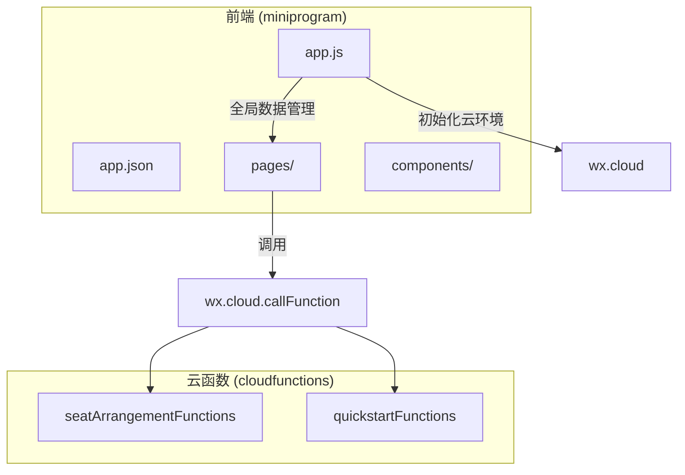
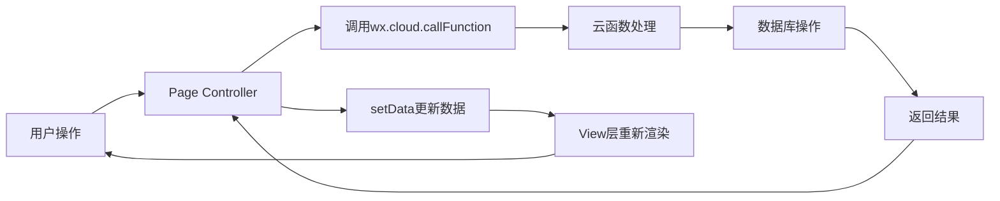
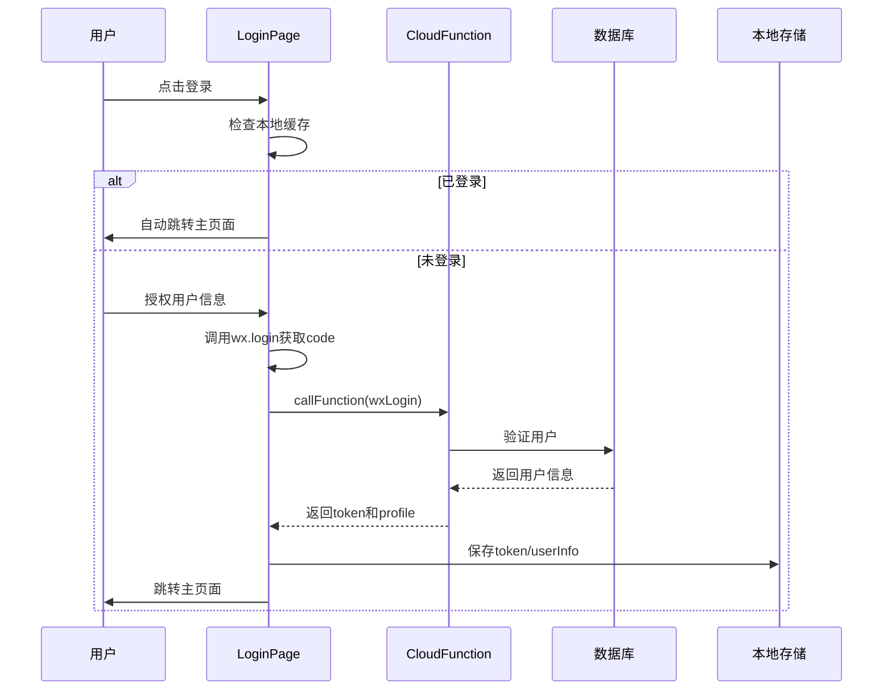
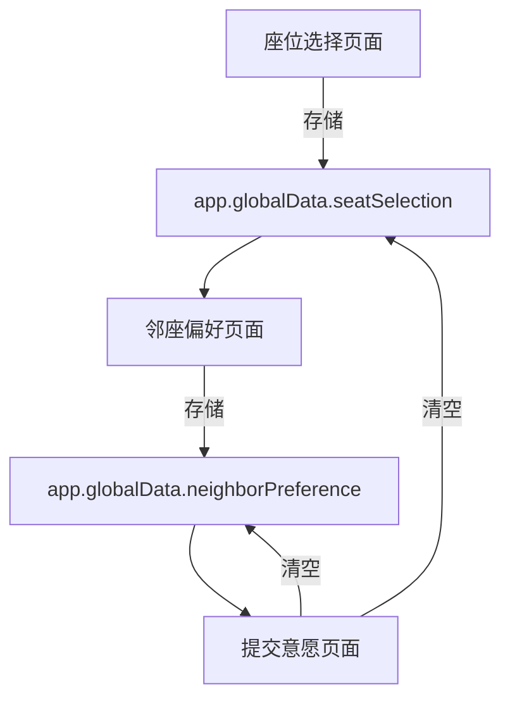
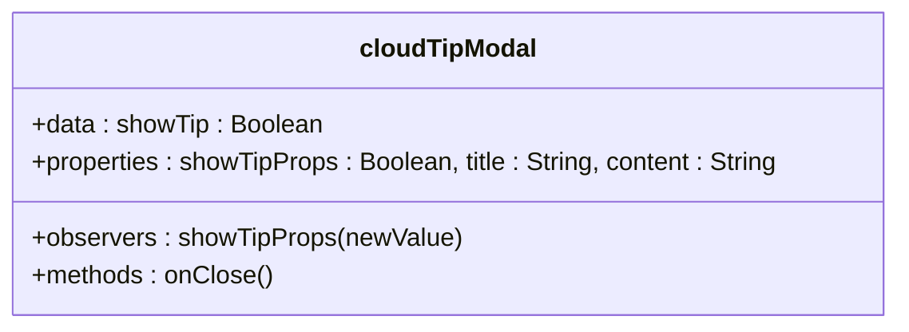
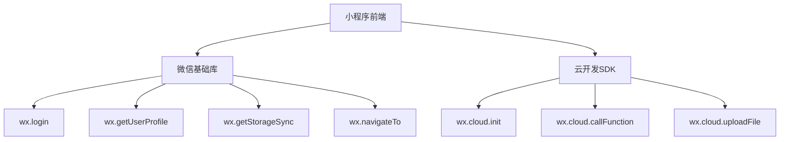

# 前端架构

<cite>
**本文档引用文件**  
- [app.js](file://miniprogram/app.js)
- [app.json](file://miniprogram/app.json)
- [cloudTipModal/index.js](file://miniprogram/components/cloudTipModal/index.js)
- [login/login.js](file://miniprogram/pages/login/login.js)
- [profile/profile.js](file://miniprogram/pages/profile/profile.js)
- [seat-selection/seat-selection.js](file://miniprogram/pages/seat-selection/seat-selection.js)
- [neighbor-preference/neighbor-preference.js](file://miniprogram/pages/neighbor-preference/neighbor-preference.js)
- [wish-submit/wish-submit.js](file://miniprogram/pages/wish-submit/wish-submit.js)
- [result/result.js](file://miniprogram/pages/result/result.js)
</cite>

## 目录
1. [简介](#简介)
2. [项目结构](#项目结构)
3. [核心组件](#核心组件)
4. [架构概览](#架构概览)
5. [详细组件分析](#详细组件分析)
6. [依赖分析](#依赖分析)
7. [性能考虑](#性能考虑)
8. [故障排除指南](#故障排除指南)
9. [结论](#结论)

## 简介
本项目为一个基于微信小程序的自动排座位系统，采用MVC-like设计模式构建前端架构。系统通过云开发能力实现前后端交互，支持用户登录、个人信息管理、座位偏好设置、邻座意愿提交及排座结果查看等核心功能。前端通过`app.js`作为应用入口初始化全局状态，利用`app.json`配置页面路由与界面样式，并通过页面间通信机制与全局数据传递实现复杂业务流程。

## 项目结构
项目采用标准的小程序目录结构，分为`cloudfunctions`（云函数）和`miniprogram`（小程序前端）两大模块。前端部分包含`app.js`、`app.json`等全局配置文件，`pages`目录下存放各功能页面，`components`目录存放可复用组件。



**图示来源**  
- [app.js](file://miniprogram/app.js#L1-L19)
- [app.json](file://miniprogram/app.json#L1-L58)

## 核心组件

### app.js：应用入口与全局状态管理
`app.js`作为小程序的入口文件，在`onLaunch`生命周期中完成云开发环境的初始化。通过`wx.cloud.init()`方法配置默认环境，实现前端与云函数的连接。全局数据`globalData`用于存储环境配置，支持跨页面数据共享。

**关键功能**：
- 云环境初始化
- 全局数据定义
- 基础库版本检测

**节来源**  
- [app.js](file://miniprogram/app.js#L1-L19)

### app.json：页面配置与导航管理
`app.json`定义了小程序的全局配置，包括页面路径、窗口样式、底部标签栏等。页面栈由`pages`数组定义，采用栈式管理实现页面跳转。导航栏样式统一配置，确保UI一致性。网络请求超时等行为通过`permission`和`style`字段控制。

**关键配置**：
- 页面路由：定义8个功能页面
- 导航栏：蓝色主题，白色文字
- 底部标签栏：4个主功能入口
- 用户权限：声明用户信息使用目的

**节来源**  
- [app.json](file://miniprogram/app.json#L1-L58)

## 架构概览
系统采用类MVC架构，`app.js`充当Model层管理全局状态，各页面Page实例作为Controller处理用户交互，WXML/WXSS作为View层渲染界面。数据流遵循单向绑定原则，通过`setData`更新视图。



**图示来源**  
- [app.js](file://miniprogram/app.js#L1-L19)
- [login/login.js](file://miniprogram/pages/login/login.js#L41-L76)
- [profile/profile.js](file://miniprogram/pages/profile/profile.js#L237-L269)

## 详细组件分析

### 登录状态管理机制
登录流程通过`login.js`实现完整的用户认证链。首先检查本地缓存中的token和userInfo，若存在则自动登录。用户点击登录时，调用`wx.getUserProfile`获取授权，再通过`wx.login`获取临时code，最后调用`seatArrangementFunctions`云函数完成登录验证。



**图示来源**  
- [login/login.js](file://miniprogram/pages/login/login.js#L0-L177)

**节来源**  
- [login/login.js](file://miniprogram/pages/login/login.js#L0-L177)

### 页面间通信与数据传递
系统采用多种方式实现页面间通信：
1. **全局数据**：通过`getApp().globalData`在座位选择与邻座偏好页面间传递选择数据
2. **本地存储**：使用`wx.setStorageSync`持久化用户登录状态和基本信息
3. **URL参数**：通过`url?param=value`方式传递页面参数（如action=setup）



**图示来源**  
- [seat-selection/seat-selection.js](file://miniprogram/pages/seat-selection/seat-selection.js#L320-L360)
- [neighbor-preference/neighbor-preference.js](file://miniprogram/pages/neighbor-preference/neighbor-preference.js#L250-L308)
- [wish-submit/wish-submit.js](file://miniprogram/pages/wish-submit/wish-submit.js#L0-L121)

### cloudTipModal组件：组件化思想实践
`cloudTipModal`是一个典型的自定义组件，体现了小程序的组件化开发思想。组件通过`properties`接收外部参数，`observers`监听属性变化，`methods`定义交互逻辑，实现了高内聚、低耦合的封装。

**组件特性**：
- **数据绑定**：`showTipProps`双向绑定控制显示状态
- **事件通信**：`onClose`方法通过`setData`更新自身状态
- **可复用性**：可在多处引入，通过参数定制标题和内容



**图示来源**  
- [cloudTipModal/index.js](file://miniprogram/components/cloudTipModal/index.js#L1-L28)

**节来源**  
- [cloudTipModal/index.js](file://miniprogram/components/cloudTipModal/index.js#L1-L28)

### 云函数调用机制
前端通过`wx.cloud.callFunction`实现与后端的无缝交互。所有业务逻辑均封装在`seatArrangementFunctions`云函数中，前端只需指定函数名、类型和数据即可完成调用。

**典型调用模式**：
```javascript
wx.cloud.callFunction({
  name: 'seatArrangementFunctions',
  data: {
    type: 'submitWish',
    token: wx.getStorageSync('token'),
    wish_data: this.data.wishData
  },
  success: (res) => { /* 处理成功 */ },
  fail: (err) => { /* 处理失败 */ }
})
```

**支持的业务类型**：
- 用户认证：wxLogin, getStudentProfile
- 会话管理：getCurrentSession, createSession
- 意愿处理：submitWish, updateWish, getMyWish
- 数据查询：getClassmates, getClassList

**节来源**  
- [login/login.js](file://miniprogram/pages/login/login.js#L78-L129)
- [profile/profile.js](file://miniprogram/pages/profile/profile.js#L50-L100)
- [cloudfunctions/seatArrangementFunctions/index.js](file://cloudfunctions/seatArrangementFunctions/index.js#L114-L149)

## 依赖分析
前端主要依赖微信小程序基础库和云开发SDK，通过`wx`对象提供的API实现功能。



**图示来源**  
- [app.js](file://miniprogram/app.js#L1-L19)
- [login/login.js](file://miniprogram/pages/login/login.js#L41-L76)

**节来源**  
- [app.js](file://miniprogram/app.js#L1-L19)
- [login/login.js](file://miniprogram/pages/login/login.js#L0-L177)

## 性能考虑
- **启动优化**：`app.js`中尽早初始化云环境
- **网络优化**：合理使用本地存储减少重复请求
- **渲染优化**：复杂列表使用`wx:if`而非`hidden`控制显示
- **内存管理**：在页面跳转后及时清理全局数据

## 故障排除指南
常见问题及解决方案：

| 问题现象 | 可能原因 | 解决方案 |
|--------|--------|--------|
| 登录失败 | 云环境未配置 | 检查`app.js`中env字段 |
| 功能无法使用 | 基础库版本过低 | 升级至2.2.3以上版本 |
| 数据加载失败 | 云函数未部署 | 上传并部署`seatArrangementFunctions` |
| 页面空白 | 页面路径错误 | 检查`app.json`中pages配置 |

**节来源**  
- [app.js](file://miniprogram/app.js#L1-L19)
- [login/login.js](file://miniprogram/pages/login/login.js#L0-L177)

## 结论
本前端架构采用MVC-like模式，通过`app.js`统一管理全局状态和云环境，`app.json`集中配置页面路由与UI样式。页面间通过全局数据和本地存储实现高效通信，组件化开发提高了代码复用性。所有业务逻辑通过`wx.cloud.callFunction`调用云函数完成，实现了前后端分离。整体架构清晰、可维护性强，为自动排座位系统的稳定运行提供了坚实基础。