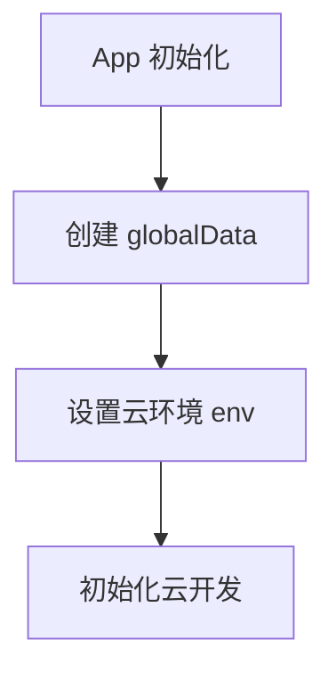
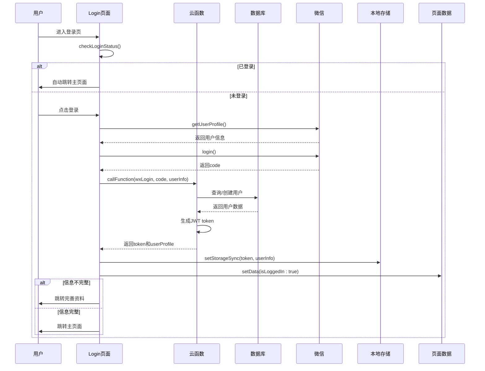
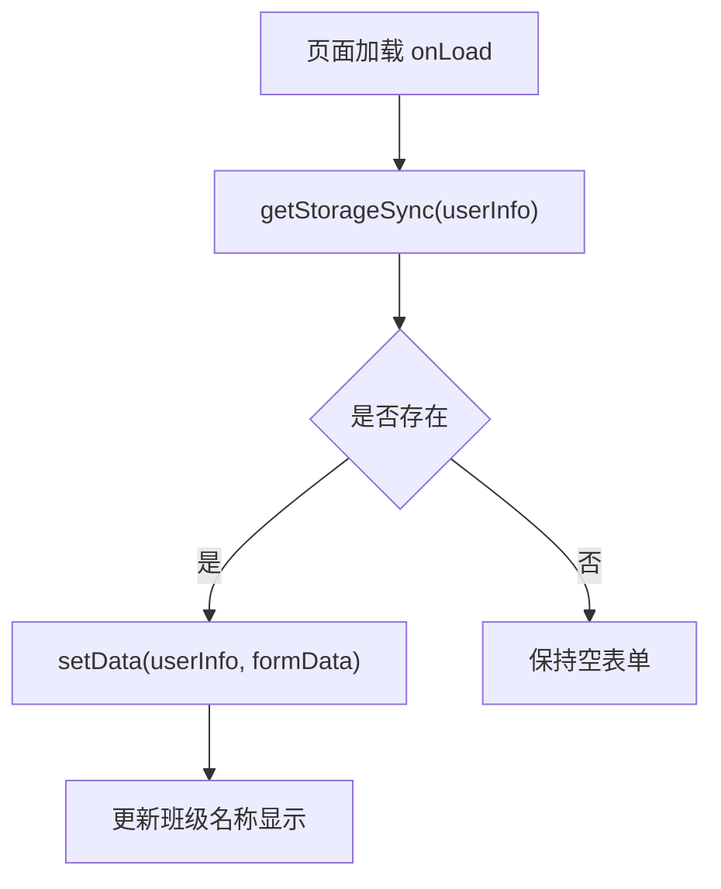
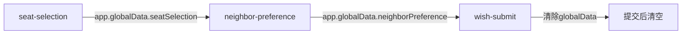
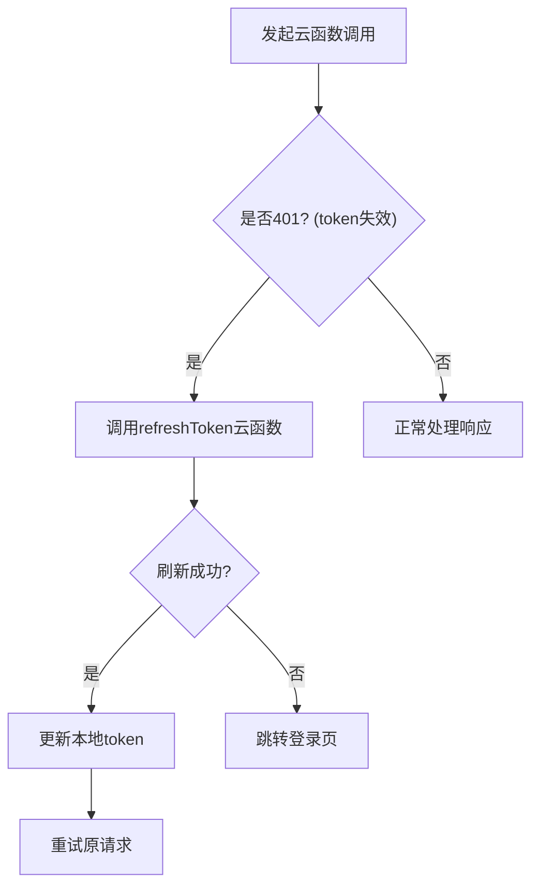
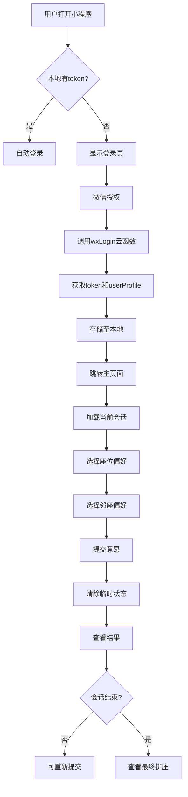

# 状态管理

<cite>
**本文档引用文件**  
- [app.js](file://miniprogram/app.js)
- [login.js](file://miniprogram/pages/login/login.js)
- [profile.js](file://miniprogram/pages/profile/profile.js)
- [seat-selection.js](file://miniprogram/pages/seat-selection/seat-selection.js)
- [neighbor-preference.js](file://miniprogram/pages/neighbor-preference/neighbor-preference.js)
- [wish-submit.js](file://miniprogram/pages/wish-submit/wish-submit.js)
- [result.js](file://miniprogram/pages/result/result.js)
- [auth.js](file://cloudfunctions/seatArrangementFunctions/modules/auth.js)
- [index.js](file://cloudfunctions/seatArrangementFunctions/index.js)
</cite>

## 目录
1. [简介](#简介)
2. [全局状态管理](#全局状态管理)
3. [登录流程与状态更新](#登录流程与状态更新)
4. [页面状态同步机制](#页面状态同步机制)
5. [状态一致性保障](#状态一致性保障)
6. [状态流转示意图](#状态流转示意图)
7. [常见状态丢失问题及解决方案](#常见状态丢失问题及解决方案)

## 简介
本项目为座位安排小程序，采用微信小程序框架结合云开发实现。系统通过全局状态与本地存储协同管理用户登录态、身份信息、选座偏好等关键数据。用户登录后，系统将token、用户资料等信息持久化存储，并在多个页面间共享状态，确保用户体验的连贯性。

## 全局状态管理

小程序通过 `app.js` 中的 `globalData` 实现跨页面共享数据的管理。`globalData` 用于存储云环境配置等全局参数，而用户相关的登录态和身份信息则通过本地存储与页面间传递相结合的方式进行管理。

在 `app.js` 中初始化时，`globalData` 被赋予云环境 ID，用于后续云函数调用：

**图示来源**  
- [app.js](file://miniprogram/app.js#L1-L20)

**本节来源**  
- [app.js](file://miniprogram/app.js#L1-L20)

## 登录流程与状态更新

用户登录流程通过 `login.js` 实现，包含微信授权、调用云函数、更新状态等关键步骤。

1. **检查登录状态**：页面加载时检查本地是否已存在 token 和用户信息，若存在则直接跳转主页面。
2. **微信授权登录**：调用 `wx.getUserProfile` 获取用户基本信息。
3. **获取登录凭证**：调用 `wx.login` 获取临时登录凭证 code。
4. **调用云函数登录**：将 code 和用户信息传递给云函数 `seatArrangementFunctions` 的 `wxLogin` 接口。
5. **更新本地状态**：云函数返回 token 和用户档案后，保存至本地存储并更新页面状态。

**图示来源**  
- [login.js](file://miniprogram/pages/login/login.js#L0-L184)
- [auth.js](file://cloudfunctions/seatArrangementFunctions/modules/auth.js#L0-L244)
- [index.js](file://cloudfunctions/seatArrangementFunctions/index.js#L155-L204)

**本节来源**  
- [login.js](file://miniprogram/pages/login/login.js#L0-L184)
- [auth.js](file://cloudfunctions/seatArrangementFunctions/modules/auth.js#L0-L244)

## 页面状态同步机制

各页面通过 `getApp()` 获取全局对象，并结合本地存储实现状态同步。

### 个人资料页（profile.js）
`profile.js` 页面在加载时从本地存储读取用户信息，并同步到页面 `data` 中：

**图示来源**  
- [profile.js](file://miniprogram/pages/profile/profile.js#L0-L300)

**本节来源**  
- [profile.js](file://miniprogram/pages/profile/profile.js#L0-L300)

### 选座流程状态传递
在多步骤选座流程中，使用 `app.globalData` 临时传递中间状态：

1. **座位选择页**：用户选择偏好座位后，点击下一步时将数据存入 `app.globalData.seatSelection`
2. **邻座偏好页**：加载时从 `app.globalData.seatSelection` 获取前一步数据
3. **提交意愿页**：整合所有全局数据，提交至云端

**图示来源**  
- [seat-selection.js](file://miniprogram/pages/seat-selection/seat-selection.js#L0-L360)
- [neighbor-preference.js](file://miniprogram/pages/neighbor-preference/neighbor-preference.js#L0-L308)
- [wish-submit.js](file://miniprogram/pages/wish-submit/wish-submit.js#L0-L121)

**本节来源**  
- [seat-selection.js](file://miniprogram/pages/seat-selection/seat-selection.js#L0-L360)
- [neighbor-preference.js](file://miniprogram/pages/neighbor-preference/neighbor-preference.js#L0-L308)
- [wish-submit.js](file://miniprogram/pages/wish-submit/wish-submit.js#L0-L121)

## 状态一致性保障

系统通过以下机制保障状态一致性：

### Token 过期处理
当 token 即将过期时，系统可通过 `refreshToken` 机制自动刷新：

**图示来源**  
- [auth.js](file://cloudfunctions/seatArrangementFunctions/modules/auth.js#L209-L244)
- [index.js](file://cloudfunctions/seatArrangementFunctions/index.js#L155-L204)

**本节来源**  
- [auth.js](file://cloudfunctions/seatArrangementFunctions/modules/auth.js#L209-L244)

### 数据更新同步
当用户在 `profile.js` 中更新个人信息后，系统会同步更新本地存储和内存中的数据：

1. 调用云函数 `updateStudentProfile`
2. 成功后更新 `wx.setStorageSync('userInfo')`
3. 同时更新页面 `setData(userInfo)`

此机制确保了本地存储与运行时状态的一致性。

**本节来源**  
- [profile.js](file://miniprogram/pages/profile/profile.js#L0-L300)

## 状态流转示意图

**图示来源**  
- [login.js](file://miniprogram/pages/login/login.js#L0-L184)
- [seat-selection.js](file://miniprogram/pages/seat-selection/seat-selection.js#L0-L360)
- [result.js](file://miniprogram/pages/result/result.js#L0-L205)

## 常见状态丢失问题及解决方案

### 问题1：页面刷新后状态丢失
**现象**：使用 `app.globalData` 临时存储的数据在页面刷新后丢失  
**解决方案**：仅将临时流程数据存入 `globalData`，关键状态仍以本地存储为主

### 问题2：token过期未及时处理
**现象**：用户操作时突然跳转登录页，体验中断  
**解决方案**：在每次云函数调用前检查token有效期，提前刷新

### 问题3：多设备登录状态冲突
**现象**：用户在不同设备上操作导致数据不一致  
**解决方案**：服务端记录最后登录时间，客户端定期同步最新状态

### 问题4：全局数据未及时清理
**现象**：提交意愿后再次进入流程显示旧数据  
**解决方案**：在关键节点（如提交成功后）主动清理 `app.globalData`

**本节来源**  
- [wish-submit.js](file://miniprogram/pages/wish-submit/wish-submit.js#L0-L121)
- [login.js](file://miniprogram/pages/login/login.js#L0-L184)
- [result.js](file://miniprogram/pages/result/result.js#L0-L205)