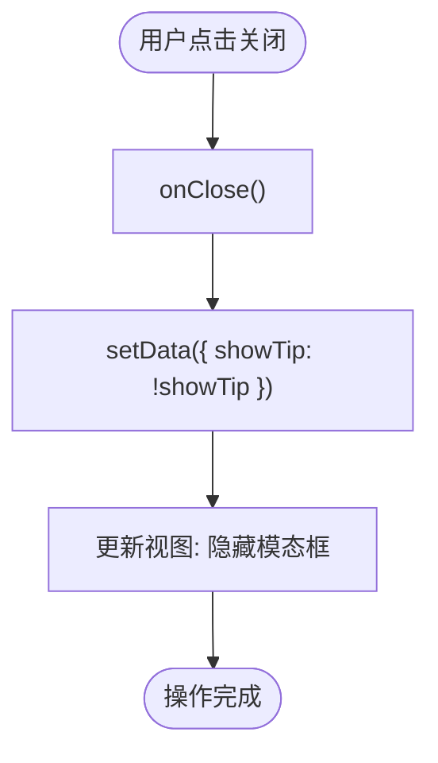

# 组件设计

<cite>
**本文档引用的文件**  
- [index.js](file://miniprogram/components/cloudTipModal/index.js)
- [index.json](file://miniprogram/components/cloudTipModal/index.json)
- [index.wxml](file://miniprogram/components/cloudTipModal/index.wxml)
- [index.wxss](file://miniprogram/components/cloudTipModal/index.wxss)
- [index.json](file://miniprogram/pages/example/index.json)
- [index.wxml](file://miniprogram/pages/example/index.wxml)
- [index.json](file://miniprogram/pages/index/index.json)
- [index.wxml](file://miniprogram/pages/index/index.wxml)
</cite>

## 目录
1. [简介](#简介)
2. [组件结构](#组件结构)
3. [核心功能分析](#核心功能分析)
4. [属性与数据定义](#属性与数据定义)
5. [方法实现逻辑](#方法实现逻辑)
6. [模板与样式设计](#模板与样式设计)
7. [事件通信机制](#事件通信机制)
8. [使用示例](#使用示例)
9. [可配置性与扩展性](#可配置性与扩展性)
10. [总结](#总结)

## 简介
`cloudTipModal` 是一个自定义的微信小程序组件，用于封装云开发调用过程中的提示信息展示功能。该组件通过统一的 UI 样式和交互逻辑，提升了用户操作反馈的一致性与代码复用性。它支持动态显示/隐藏、标题与内容自定义，并可通过事件机制与父页面进行解耦通信。

**Section sources**  
- [index.js](file://miniprogram/components/cloudTipModal/index.js#L1-L27)

## 组件结构
该组件位于 `miniprogram/components/cloudTipModal/` 目录下，包含以下四个核心文件：
- `index.js`：组件逻辑，定义 properties、data、methods
- `index.json`：组件配置，声明为自定义组件
- `index.wxml`：组件模板，定义结构布局
- `index.wxss`：组件样式，控制视觉表现


**Diagram sources**  
- [index.js](file://miniprogram/components/cloudTipModal/index.js#L1-L27)
- [index.json](file://miniprogram/components/cloudTipModal/index.json#L1-L4)
- [index.wxml](file://miniprogram/components/cloudTipModal/index.wxml#L1-L11)
- [index.wxss](file://miniprogram/components/cloudTipModal/index.wxss#L1-L60)

## 核心功能分析
`cloudTipModal` 的主要功能是作为一个可复用的模态提示框，用于在执行云函数调用或其他关键操作时向用户展示状态信息（如成功、错误、加载中等）。组件通过 `properties` 接收外部控制参数，利用 `observers` 监听状态变化，并通过 `wxml` 模板渲染提示内容。

**Section sources**  
- [index.js](file://miniprogram/components/cloudTipModal/index.js#L1-L27)
- [index.wxml](file://miniprogram/components/cloudTipModal/index.wxml#L1-L11)

## 属性与数据定义
组件通过 `properties` 定义了三个可配置属性，用于接收父页面传入的数据：

| 属性名 | 类型 | 默认值 | 说明 |
|--------|------|--------|------|
| showTipProps | Boolean | false | 控制模态框是否显示 |
| title | String | "" | 提示框标题 |
| content | String | "" | 提示框正文内容 |

内部数据 `data` 中的 `showTip` 用于实际控制视图层的显示状态，通过 `observers` 监听 `showTipProps` 的变化并同步更新。


**Diagram sources**  
- [index.js](file://miniprogram/components/cloudTipModal/index.js#L6-L18)

## 方法实现逻辑
组件目前定义了一个核心方法 `onClose`，用于处理用户点击关闭按钮时的逻辑。该方法通过 `setData` 切换 `showTip` 的状态，从而控制模态框的隐藏。此设计实现了组件内部状态的独立管理。



**Diagram sources**  
- [index.js](file://miniprogram/components/cloudTipModal/index.js#L20-L26)

## 模板与样式设计
### WXML 模板结构
组件模板采用分层设计：
- 外层遮罩层 `.install_tip_back`：全屏半透明背景，防止用户操作底层页面
- 内容层 `.install_tip_detail`：固定定位的弹窗主体
- 标题与内容区域：分别展示 `title` 和 `content`
- 关闭按钮：绑定 `onClose` 事件

### WXSS 样式逻辑
样式采用响应式单位 `rpx`，确保在不同设备上具有一致的视觉效果。关键样式包括：
- 遮罩层使用 `rgba(0,0,0,0.4)` 实现半透明效果
- 弹窗底部圆角设计，提升现代感
- 文字居中与对齐优化阅读体验
- 关闭按钮绝对定位，便于操作

**Section sources**  
- [index.wxml](file://miniprogram/components/cloudTipModal/index.wxml#L1-L11)
- [index.wxss](file://miniprogram/components/cloudTipModal/index.wxss#L1-L60)

## 事件通信机制
虽然当前代码未显式调用 `triggerEvent`，但从设计角度看，未来可通过在 `onClose` 方法中添加事件触发逻辑，向父页面传递关闭事件，实现更完整的解耦通信。例如：

```js
onClose() {
  this.setData({ showTip: false });
  this.triggerEvent('close'); // 通知父组件
}
```

这种模式允许父页面监听并响应模态框的关闭行为，适用于需要执行后续操作的场景。

## 使用示例
该组件已在多个页面中注册并使用，典型引用方式如下：

### 页面配置（JSON）
在需要使用的页面 JSON 文件中声明组件：

```json
{
  "usingComponents": {
    "cloud-tip-modal": "/components/cloudTipModal/index"
  }
}
```

### 页面模板（WXML）
在 WXML 中插入组件标签并绑定数据：

```xml
<cloud-tip-modal 
  showTipProps="{{showTip}}" 
  title="{{title}}" 
  content="{{content}}">
</cloud-tip-modal>
```

### 实际应用页面
- `pages/example/index`：用于演示基础能力
- `pages/index/index`：主功能入口页

**Section sources**  
- [index.json](file://miniprogram/pages/example/index.json#L1-L4)
- [index.wxml](file://miniprogram/pages/example/index.wxml#L20)
- [index.json](file://miniprogram/pages/index/index.json#L2-L5)
- [index.wxml](file://miniprogram/pages/index/index.wxml#L27)

## 可配置性与扩展性
当前组件已具备良好的可配置性，支持通过 `title` 和 `content` 属性定制提示内容。为进一步增强其灵活性，建议扩展以下功能：

### 支持多种提示类型
可通过新增 `type` 属性（如 `success`, `error`, `loading`）来区分不同状态，并动态调整图标与颜色。

### 添加确认/取消按钮
引入按钮组支持交互式操作，例如确认删除或取消提交。

### 支持自动关闭
增加 `duration` 属性，实现倒计时自动关闭功能，适用于轻量提示。

### 扩展事件类型
除 `close` 外，还可支持 `confirm`、`cancel` 等事件，提升交互能力。

这些扩展将使 `cloudTipModal` 成为一个更加通用和强大的提示组件。

## 总结
`cloudTipModal` 组件通过封装通用的提示逻辑，有效提升了小程序的 UI 一致性与开发效率。其结构清晰、职责分明，具备良好的可维护性与扩展潜力。未来可通过丰富事件机制与视觉类型，进一步提升其在用户反馈场景中的适用性。