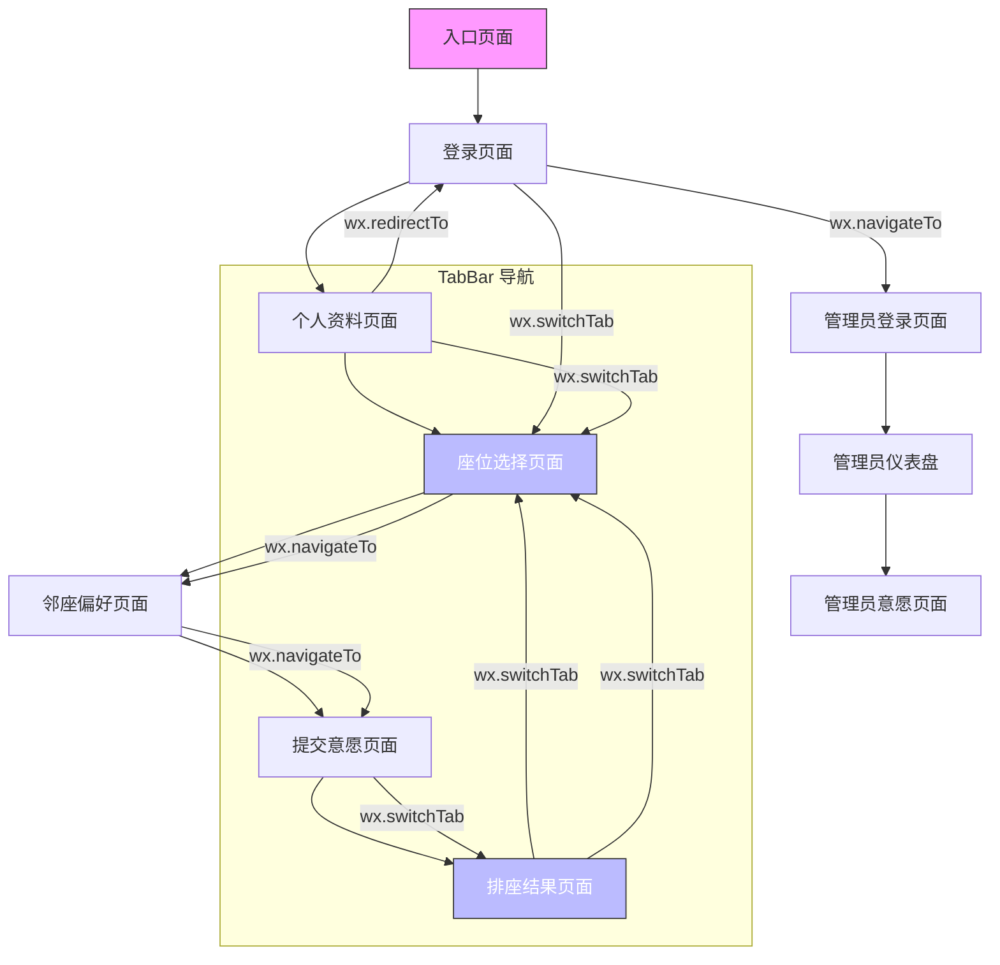

# 页面结构

<cite>
**本文档引用的文件**
- [app.json](file://miniprogram/app.json)
- [app.js](file://miniprogram/app.js)
- [login.js](file://miniprogram/pages/login/login.js)
- [profile.js](file://miniprogram/pages/profile/profile.js)
- [seat-selection.js](file://miniprogram/pages/seat-selection/seat-selection.js)
- [neighbor-preference.js](file://miniprogram/pages/neighbor-preference/neighbor-preference.js)
- [wish-submit.js](file://miniprogram/pages/wish-submit/wish-submit.js)
- [result.js](file://miniprogram/pages/result/result.js)
- [admin-login.js](file://miniprogram/pages/admin-login/admin-login.js)
</cite>

## 目录
1. [项目结构](#项目结构)
2. [页面路由与页面栈](#页面路由与页面栈)
3. [页面生命周期管理](#页面生命周期管理)
4. [页面跳转逻辑](#页面跳转逻辑)
5. [用户工作流与数据流](#用户工作流与数据流)
6. [页面结构关系图](#页面结构关系图)
7. [核心页面分析](#核心页面分析)

## 项目结构

本项目为微信小程序，主要目录结构如下：
- `miniprogram/`：小程序主体代码
  - `pages/`：存放所有页面，每个页面包含 `.js`、`.json`、`.wxml`、`.wxss` 文件
  - `app.js`：小程序全局逻辑
  - `app.json`：全局配置，包括页面路径、窗口样式、tabBar 等
- `cloudfunctions/`：云函数逻辑，处理后端业务

重点关注 `miniprogram/pages/` 下的页面实现。

**Section sources**
- [app.json](file://miniprogram/app.json#L1-L60)
- [app.js](file://miniprogram/app.js#L1-L20)

## 页面路由与页面栈

小程序通过 `app.json` 中的 `pages` 字段定义页面栈结构。页面栈遵循“先进后出”原则，用户每进入一个新页面，该页面即被推入栈顶。

### 页面路径配置

`app.json` 中 `pages` 数组定义了所有可访问页面的路径：

```json
"pages": [
  "pages/login/login",
  "pages/profile/profile",
  "pages/seat-selection/seat-selection",
  "pages/neighbor-preference/neighbor-preference",
  "pages/wish-submit/wish-submit",
  "pages/result/result",
  "pages/admin-login/admin-login",
  "pages/admin-dashboard/admin-dashboard",
  "pages/admin-wish/admin-wish",
  "pages/index/index",
  "pages/example/index"
]
```

其中前两个页面分别为：
- 入口页面：`pages/login/login`
- 主功能页面：`pages/seat-selection/seat-selection`

### TabBar 导航

通过 `tabBar` 配置底部标签栏，支持快速切换：

```json
"tabBar": {
  "list": [
    {
      "pagePath": "pages/seat-selection/seat-selection",
      "text": "选择座位"
    },
    {
      "pagePath": "pages/wish-submit/wish-submit",
      "text": "我的意愿"
    },
    {
      "pagePath": "pages/result/result",
      "text": "排座结果"
    },
    {
      "pagePath": "pages/profile/profile",
      "text": "个人中心"
    }
  ]
}
```

TabBar 页面之间切换使用 `wx.switchTab`，不可通过 `wx.navigateTo` 实现。

**Section sources**
- [app.json](file://miniprogram/app.json#L2-L50)

## 页面生命周期管理

小程序页面通过 `Page` 构造函数定义，其生命周期方法用于响应页面状态变化。

### 核心生命周期函数

| 生命周期 | 触发时机 | 典型用途 |
|--------|--------|--------|
| `onLoad` | 页面加载时触发，仅一次 | 初始化数据、获取参数 |
| `onShow` | 页面显示时触发 | 刷新数据、检查状态 |
| `onHide` | 页面隐藏时触发 | 暂停任务、释放资源 |
| `onUnload` | 页面卸载时触发 | 清理资源、重置状态 |

### 各页面生命周期实现

#### 登录页面 (`login.js`)

- `onLoad`: 检查登录状态，若已登录则跳转主页面
- `onWxLogin`: 处理微信授权登录流程
- `checkLoginStatus`: 从本地缓存读取 token 和用户信息

```js
Page({
  onLoad: function(options) {
    this.checkLoginStatus();
  },
  checkLoginStatus: function() {
    const token = wx.getStorageSync('token');
    const userInfo = wx.getStorageSync('userInfo');
    if (token && userInfo) {
      this.setData({ isLoggedIn: true, userInfo });
      this.navigateToMain();
    }
  }
});
```

#### 个人资料页面 (`profile.js`)

- `onLoad`: 接收 `action` 参数（view/setup/edit），加载用户信息和班级列表
- `onShow`: 未显式定义，依赖 `onLoad` 初始化

```js
onLoad: function(options) {
  const action = options.action || 'view';
  this.setData({ action });
  this.loadUserInfo();
  this.loadClassList();
}
```

#### 座位选择页面 (`seat-selection.js`)

- `onLoad`: 检查登录状态，若未登录跳转登录页
- `onShow`: 若存在会话，重新加载当前排座信息

```js
onLoad: function() {
  this.checkLoginStatus();
},
onShow: function() {
  if (this.data.hasSession) {
    this.loadCurrentSession();
  }
}
```

#### 结果页面 (`result.js`)

- `onLoad`: 检查登录状态
- `onShow`: 若已有会话，加载排座结果

```js
onLoad: function() {
  this.checkLoginStatus();
},
onShow: function() {
  if (this.data.currentSession) {
    this.loadResult();
  }
}
```

**Section sources**
- [login.js](file://miniprogram/pages/login/login.js#L1-L184)
- [profile.js](file://miniprogram/pages/profile/profile.js#L1-L300)
- [seat-selection.js](file://miniprogram/pages/seat-selection/seat-selection.js#L1-L360)
- [result.js](file://miniprogram/pages/result/result.js#L1-L205)

## 页面跳转逻辑

小程序提供多种页面跳转 API，用于实现不同导航行为。

### 跳转方式对比

| 方法 | 行为 | 是否可返回 | 用途 |
|------|------|-----------|------|
| `wx.navigateTo` | 打开新页面，压入栈 | 是 | 普通页面跳转 |
| `wx.redirectTo` | 关闭当前页，跳转 | 否 | 替换当前页 |
| `wx.switchTab` | 跳转到 tabBar 页面 | 是 | 底部标签切换 |
| `wx.navigateBack` | 返回上一页 | - | 返回操作 |

### 实际代码应用

#### 从登录页到主页面

```js
// 登录成功后跳转
navigateToMain: function() {
  wx.switchTab({
    url: '/pages/seat-selection/seat-selection'
  });
}
```

#### 从登录页到管理员登录页

```js
navigateToAdmin: function() {
  wx.navigateTo({
    url: '/pages/admin-login/admin-login'
  });
}
```

#### 退出登录后跳转回登录页

```js
onLogout: function() {
  wx.showModal({
    success: (res) => {
      if (res.confirm) {
        // 清除缓存
        wx.removeStorageSync('token');
        // 重定向到登录页
        wx.redirectTo({
          url: '/pages/login/login'
        });
      }
    }
  });
}
```

#### 座位选择 → 邻座偏好 → 提交意愿

```js
// 座位选择页下一步
onNext: function() {
  this.navigateToNext();
},
navigateToNext: function() {
  const app = getApp();
  app.globalData.seatSelection = { /* 数据 */ };
  wx.navigateTo({
    url: '/pages/neighbor-preference/neighbor-preference'
  });
}

// 邻座偏好页下一步
onNext: function() {
  const app = getApp();
  app.globalData.neighborPreference = { /* 数据 */ };
  wx.navigateTo({
    url: '/pages/wish-submit/wish-submit'
  });
}
```

#### 提交意愿后跳转结果页

```js
onSubmit: function() {
  wx.showToast({
    title: '提交成功',
    icon: 'success'
  });
  setTimeout(() => {
    wx.switchTab({
      url: '/pages/result/result'
    });
  }, 1500);
}
```

**Section sources**
- [login.js](file://miniprogram/pages/login/login.js#L135-L146)
- [profile.js](file://miniprogram/pages/profile/profile.js#L235-L293)
- [seat-selection.js](file://miniprogram/pages/seat-selection/seat-selection.js#L312)
- [neighbor-preference.js](file://miniprogram/pages/neighbor-preference/neighbor-preference.js#L265)
- [wish-submit.js](file://miniprogram/pages/wish-submit/wish-submit.js#L70)

## 用户工作流与数据流

### 用户典型工作流

1. **登录** → 2. **完善资料** → 3. **选择座位** → 4. **设置邻座偏好** → 5. **提交意愿** → 6. **查看结果**

### 数据初始化与传递

#### 全局数据传递

使用 `getApp().globalData` 在页面间传递临时数据：

```js
// 保存座位选择
app.globalData.seatSelection = {
  preferred_seats: this.data.selectedPreferred,
  avoided_seats: this.data.selectedAvoided
};

// 保存邻座偏好
app.globalData.neighborPreference = {
  preferred_neighbors: this.data.preferredNeighbors,
  avoided_neighbors: this.data.avoidedNeighbors
};
```

#### 本地缓存

使用 `wx.setStorageSync` 持久化关键信息：

- `token`: 登录凭证
- `userInfo`: 用户资料
- `adminToken`: 管理员凭证
- `adminInfo`: 管理员信息

### 表单提交与结果展示

#### 表单提交流程（以个人资料为例）

1. 用户输入姓名、学号、班级
2. `validateForm()` 验证输入合法性
3. 调用云函数 `updateStudentProfile`
4. 成功后更新本地缓存和 UI
5. 若为首次设置，自动跳转主页面

```js
onSubmit: function() {
  if (!this.validateForm()) return;
  wx.cloud.callFunction({
    name: 'seatArrangementFunctions',
    data: { type: 'updateStudentProfile', profile_data: formData }
  });
}
```

#### 结果展示流程

1. 调用 `getMyAssignment` 获取个人排座
2. 调用 `getArrangementResult` 获取完整座位图
3. 渲染座位图，显示学生姓名首字母
4. 展示满意度评分（0-100）

**Section sources**
- [profile.js](file://miniprogram/pages/profile/profile.js#L1-L300)
- [seat-selection.js](file://miniprogram/pages/seat-selection/seat-selection.js#L1-L360)
- [wish-submit.js](file://miniprogram/pages/wish-submit/wish-submit.js#L1-L121)
- [result.js](file://miniprogram/pages/result/result.js#L1-L205)

## 页面结构关系图



**Diagram sources**
- [app.json](file://miniprogram/app.json#L2-L50)
- [login.js](file://miniprogram/pages/login/login.js#L135-L146)
- [seat-selection.js](file://miniprogram/pages/seat-selection/seat-selection.js#L312)
- [result.js](file://miniprogram/pages/result/result.js#L181)

## 核心页面分析

### 登录页面 (`login.js`)

负责用户身份认证，集成微信授权登录，检查本地登录状态，引导用户进入主流程。

**Section sources**
- [login.js](file://miniprogram/pages/login/login.js#L1-L184)

### 个人资料页面 (`profile.js`)

管理用户基本信息，支持首次设置与后续编辑，确保排座系统拥有完整用户数据。

**Section sources**
- [profile.js](file://miniprogram/pages/profile/profile.js#L1-L300)

### 座位选择页面 (`seat-selection.js`)

核心交互页面，提供可视化座位图，支持偏好与避免选择，是用户表达意愿的主要入口。

**Section sources**
- [seat-selection.js](file://miniprogram/pages/seat-selection/seat-selection.js#L1-L360)

### 排座结果页面 (`result.js`)

展示最终排座结果，包括个人座位、班级布局、满意度评分，支持分享与重新提交。

**Section sources**
- [result.js](file://miniprogram/pages/result/result.js#L1-L205)