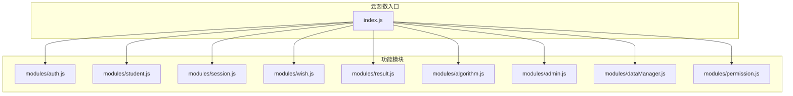
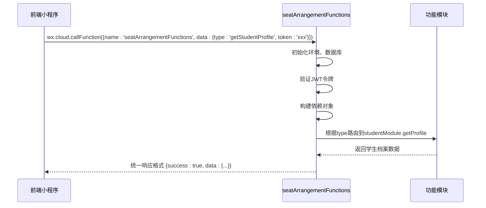
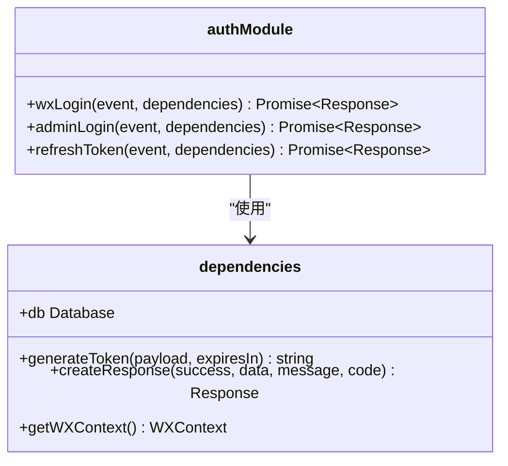
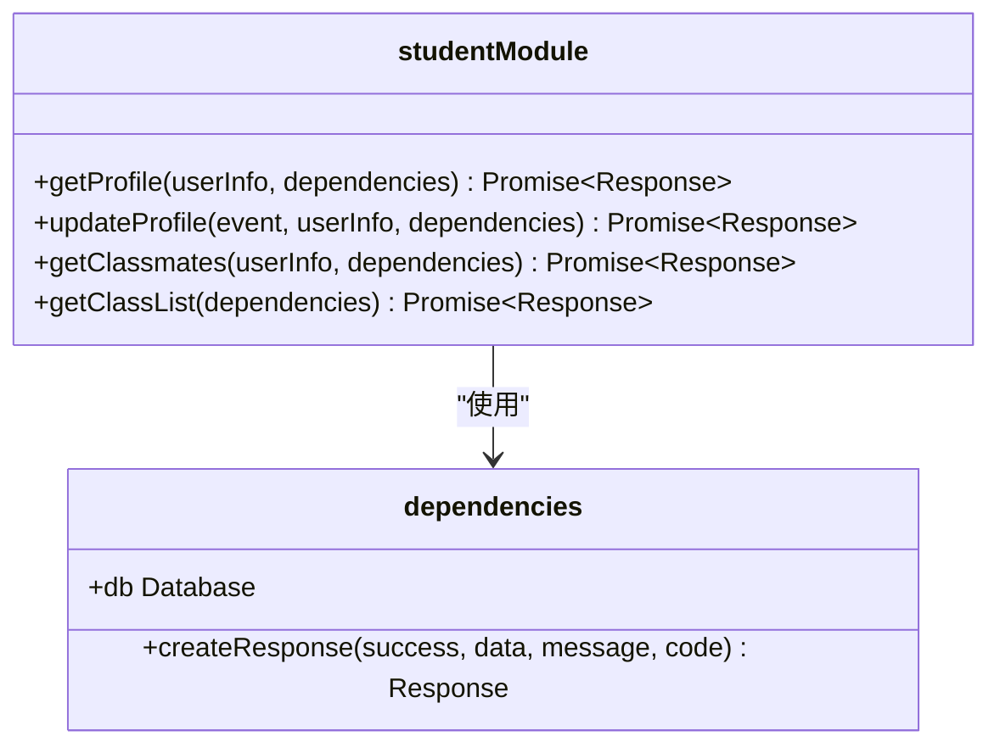
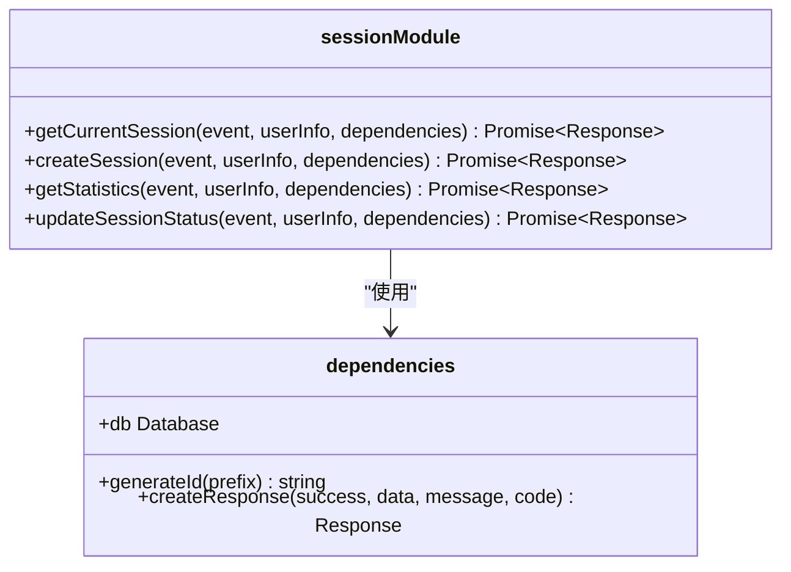
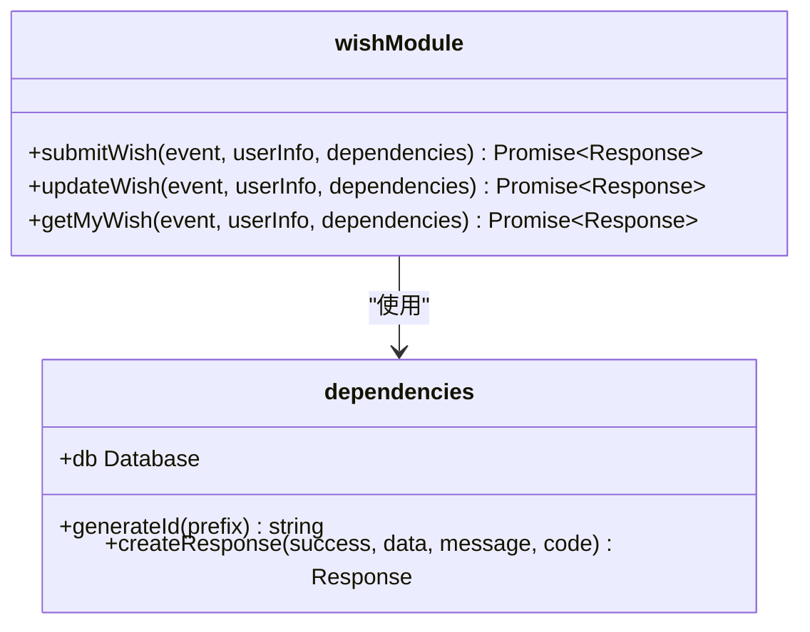
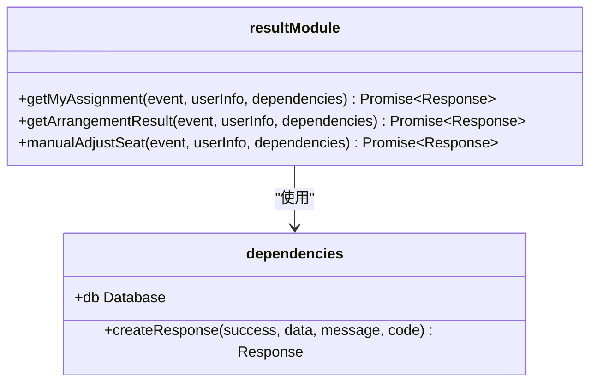
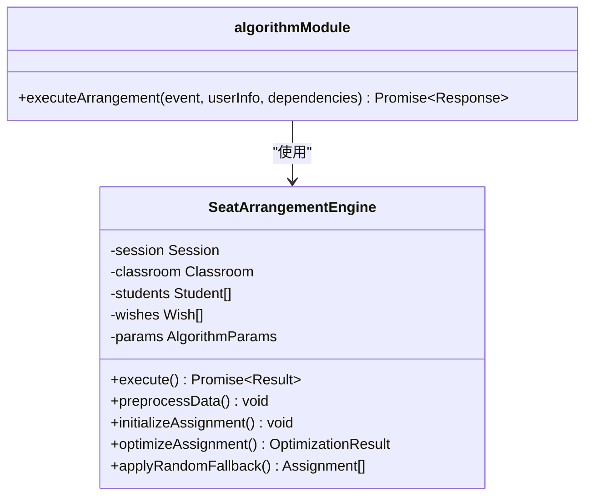
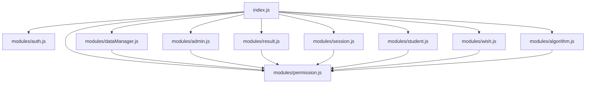

# 云函数入口设计

<cite>
**本文档引用文件**   
- [index.js](file://cloudfunctions/seatArrangementFunctions/index.js)
- [auth.js](file://cloudfunctions/seatArrangementFunctions/modules/auth.js)
- [student.js](file://cloudfunctions/seatArrangementFunctions/modules/student.js)
- [session.js](file://cloudfunctions/seatArrangementFunctions/modules/session.js)
- [wish.js](file://cloudfunctions/seatArrangementFunctions/modules/wish.js)
- [result.js](file://cloudfunctions/seatArrangementFunctions/modules/result.js)
- [algorithm.js](file://cloudfunctions/seatArrangementFunctions/modules/algorithm.js)
- [admin.js](file://cloudfunctions/seatArrangementFunctions/modules/admin.js)
- [dataManager.js](file://cloudfunctions/seatArrangementFunctions/modules/dataManager.js)
- [permission.js](file://cloudfunctions/seatArrangementFunctions/modules/permission.js)
</cite>

## 目录
1. [简介](#简介)
2. [项目结构](#项目结构)
3. [核心组件](#核心组件)
4. [架构概述](#架构概述)
5. [详细组件分析](#详细组件分析)
6. [依赖分析](#依赖分析)
7. [性能考虑](#性能考虑)
8. [故障排除指南](#故障排除指南)
9. [结论](#结论)

## 简介
本文档详细说明了 `seatArrangementFunctions` 云函数的入口文件 `index.js` 如何作为统一API网关接收前端调用。解释其通过HTTP触发器响应 `wx.cloud.callFunction` 请求的机制，分析其初始化流程，包括云开发环境初始化、数据库实例获取和公共响应生成器的构建。描述其如何根据 `action` 参数路由到对应功能模块（如 `auth`、`student`、`session` 等），并实现统一的错误处理和日志输出。结合代码示例说明请求分发逻辑和上下文传递机制，阐述这种集中式入口的优势与最佳实践。

## 项目结构
`seatArrangementFunctions` 云函数项目采用模块化设计，将不同功能拆分为独立的模块文件，由 `index.js` 统一调度。核心功能模块位于 `modules` 目录下，包括认证、学生管理、会话管理、意愿管理、结果管理、算法执行、管理员功能和数据管理等。这种结构清晰地分离了关注点，便于维护和扩展。

**图示来源**
- [index.js](file://cloudfunctions/seatArrangementFunctions/index.js#L1-L305)
- [auth.js](file://cloudfunctions/seatArrangementFunctions/modules/auth.js#L1-L244)
- [student.js](file://cloudfunctions/seatArrangementFunctions/modules/student.js#L1-L321)
- [session.js](file://cloudfunctions/seatArrangementFunctions/modules/session.js#L1-L415)
- [wish.js](file://cloudfunctions/seatArrangementFunctions/modules/wish.js#L1-L453)
- [result.js](file://cloudfunctions/seatArrangementFunctions/modules/result.js#L1-L455)
- [algorithm.js](file://cloudfunctions/seatArrangementFunctions/modules/algorithm.js#L1-L508)
- [admin.js](file://cloudfunctions/seatArrangementFunctions/modules/admin.js#L1-L213)
- [dataManager.js](file://cloudfunctions/seatArrangementFunctions/modules/dataManager.js#L1-L401)
- [permission.js](file://cloudfunctions/seatArrangementFunctions/modules/permission.js#L1-L178)

**本节来源**
- [index.js](file://cloudfunctions/seatArrangementFunctions/index.js#L1-L305)

## 核心组件
`seatArrangementFunctions` 云函数的核心组件包括统一的入口函数、模块化功能实现、依赖注入机制、权限验证系统和统一的响应格式。入口函数 `main` 负责接收所有请求，进行初始化和路由分发。各功能模块（如 `auth`、`student`）封装了具体的业务逻辑。依赖注入对象 `dependencies` 将数据库实例、工具函数等共享给所有模块，避免了重复代码。权限验证系统确保了数据安全。统一的响应格式 `createResponse` 保证了API返回数据的一致性。

**本节来源**
- [index.js](file://cloudfunctions/seatArrangementFunctions/index.js#L156-L305)
- [auth.js](file://cloudfunctions/seatArrangementFunctions/modules/auth.js#L1-L244)
- [student.js](file://cloudfunctions/seatArrangementFunctions/modules/student.js#L1-L321)

## 架构概述
`seatArrangementFunctions` 云函数采用了集中式入口、模块化、依赖注入和权限控制的架构设计。该架构的核心是 `index.js` 文件，它作为单一入口点，接收所有来自前端的 `wx.cloud.callFunction` 调用。通过 `type` 参数进行路由，将请求分发到不同的功能模块。这种设计实现了高内聚、低耦合，便于维护和扩展。

**图示来源**
- [index.js](file://cloudfunctions/seatArrangementFunctions/index.js#L156-L305)
- [student.js](file://cloudfunctions/seatArrangementFunctions/modules/student.js#L1-L321)

## 详细组件分析
`seatArrangementFunctions` 云函数的详细组件分析涵盖了其核心功能模块的实现细节，包括认证、学生管理、会话管理、意愿管理、结果管理和算法执行等。

### 认证模块分析
认证模块 `auth.js` 负责处理用户的身份验证，包括微信登录、管理员登录和令牌刷新。它通过JWT（JSON Web Token）技术实现无状态认证，确保了接口的安全性。

**图示来源**
- [auth.js](file://cloudfunctions/seatArrangementFunctions/modules/auth.js#L1-L244)
- [index.js](file://cloudfunctions/seatArrangementFunctions/index.js#L184-L193)

**本节来源**
- [auth.js](file://cloudfunctions/seatArrangementFunctions/modules/auth.js#L1-L244)

### 学生模块分析
学生模块 `student.js` 提供了学生信息的管理功能，包括获取档案、更新档案、获取同班同学列表和获取班级列表。该模块实现了对学生个人信息的增删改查操作。

**图示来源**
- [student.js](file://cloudfunctions/seatArrangementFunctions/modules/student.js#L1-L321)
- [index.js](file://cloudfunctions/seatArrangementFunctions/index.js#L184-L193)

**本节来源**
- [student.js](file://cloudfunctions/seatArrangementFunctions/modules/student.js#L1-L321)

### 会话模块分析
会话模块 `session.js` 负责管理排座会话的生命周期，包括创建会话、获取当前会话、获取统计信息和更新会话状态。该模块是排座业务流程的核心。

**图示来源**
- [session.js](file://cloudfunctions/seatArrangementFunctions/modules/session.js#L1-L415)
- [index.js](file://cloudfunctions/seatArrangementFunctions/index.js#L184-L193)

**本节来源**
- [session.js](file://cloudfunctions/seatArrangementFunctions/modules/session.js#L1-L415)

### 意愿模块分析
意愿模块 `wish.js` 处理学生提交和修改座位意愿的逻辑，包括提交意愿、更新意愿和获取我的意愿。该模块确保了学生意愿数据的完整性和有效性。

**图示来源**
- [wish.js](file://cloudfunctions/seatArrangementFunctions/modules/wish.js#L1-L453)
- [index.js](file://cloudfunctions/seatArrangementFunctions/index.js#L184-L193)

**本节来源**
- [wish.js](file://cloudfunctions/seatArrangementFunctions/modules/wish.js#L1-L453)

### 结果模块分析
结果模块 `result.js` 负责管理排座结果，包括获取我的座位分配、获取排座结果和手动调整座位。该模块为学生和管理员提供了查看和管理最终排座结果的能力。

**图示来源**
- [result.js](file://cloudfunctions/seatArrangementFunctions/modules/result.js#L1-L455)
- [index.js](file://cloudfunctions/seatArrangementFunctions/index.js#L184-L193)

**本节来源**
- [result.js](file://cloudfunctions/seatArrangementFunctions/modules/result.js#L1-L455)

### 算法模块分析
算法模块 `algorithm.js` 实现了核心的排座算法引擎，负责执行自动排座任务。它基于多权重评分系统，综合考虑学生意愿、教学需求、公平性和约束条件，生成最优的座位安排。

**图示来源**
- [algorithm.js](file://cloudfunctions/seatArrangementFunctions/modules/algorithm.js#L1-L508)
- [index.js](file://cloudfunctions/seatArrangementFunctions/index.js#L184-L193)

**本节来源**
- [algorithm.js](file://cloudfunctions/seatArrangementFunctions/modules/algorithm.js#L1-L508)

## 依赖分析
`seatArrangementFunctions` 云函数的依赖关系清晰，`index.js` 是核心入口，直接依赖于所有功能模块和权限控制模块。各功能模块之间没有直接依赖，它们通过 `index.js` 提供的 `dependencies` 对象间接访问共享资源，如数据库实例和工具函数。这种设计有效地避免了模块间的紧耦合。

**图示来源**
- [index.js](file://cloudfunctions/seatArrangementFunctions/index.js#L1-L305)
- [dataManager.js](file://cloudfunctions/seatArrangementFunctions/modules/dataManager.js#L1-L401)
- [admin.js](file://cloudfunctions/seatArrangementFunctions/modules/admin.js#L1-L213)
- [result.js](file://cloudfunctions/seatArrangementFunctions/modules/result.js#L1-L455)
- [session.js](file://cloudfunctions/seatArrangementFunctions/modules/session.js#L1-L415)
- [student.js](file://cloudfunctions/seatArrangementFunctions/modules/student.js#L1-L321)
- [wish.js](file://cloudfunctions/seatArrangementFunctions/modules/wish.js#L1-L453)
- [algorithm.js](file://cloudfunctions/seatArrangementFunctions/modules/algorithm.js#L1-L508)
- [permission.js](file://cloudfunctions/seatArrangementFunctions/modules/permission.js#L1-L178)

**本节来源**
- [index.js](file://cloudfunctions/seatArrangementFunctions/index.js#L1-L305)
- [permission.js](file://cloudfunctions/seatArrangementFunctions/modules/permission.js#L1-L178)

## 性能考虑
`seatArrangementFunctions` 云函数在性能方面进行了多项优化。首先，通过在入口处初始化数据库实例并复用，减少了重复连接的开销。其次，使用 `Promise.all` 并行执行数据库查询，显著提高了数据加载效率。再者，算法模块实现了迭代优化和随机兜底策略，确保在合理时间内得到可用结果。最后，通过字段过滤（`field`）和分页（`limit`）减少数据传输量，提升了响应速度。

## 故障排除指南
当 `seatArrangementFunctions` 云函数出现问题时，可以按照以下步骤进行排查：
1.  **检查日志**：在云开发控制台查看函数执行日志，定位错误信息。
2.  **验证参数**：确认前端传递的 `event` 参数是否完整且符合预期。
3.  **检查权限**：对于需要认证的接口，确保 `token` 参数有效且用户具有相应权限。
4.  **数据库状态**：检查相关数据库集合是否存在，数据是否符合预期。
5.  **依赖模块**：如果某个功能模块报错，检查其依赖的其他模块是否正常工作。

**本节来源**
- [index.js](file://cloudfunctions/seatArrangementFunctions/index.js#L254-L305)
- [auth.js](file://cloudfunctions/seatArrangementFunctions/modules/auth.js#L1-L244)
- [student.js](file://cloudfunctions/seatArrangementFunctions/modules/student.js#L1-L321)

## 结论
`seatArrangementFunctions` 云函数通过 `index.js` 作为统一API网关的设计，成功实现了功能的集中管理和高效分发。其模块化、依赖注入和权限控制的架构，不仅保证了代码的可维护性和可扩展性，也确保了系统的安全性和稳定性。这种设计模式为小程序后端开发提供了一个优秀的实践范例。