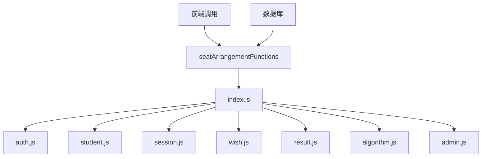

# 后端架构

<cite>
**本文档引用文件**   
- [index.js](file://cloudfunctions/seatArrangementFunctions/index.js)
- [auth.js](file://cloudfunctions/seatArrangementFunctions/modules/auth.js)
- [student.js](file://cloudfunctions/seatArrangementFunctions/modules/student.js)
- [session.js](file://cloudfunctions/seatArrangementFunctions/modules/session.js)
- [wish.js](file://cloudfunctions/seatArrangementFunctions/modules/wish.js)
- [result.js](file://cloudfunctions/seatArrangementFunctions/modules/result.js)
- [algorithm.js](file://cloudfunctions/seatArrangementFunctions/modules/algorithm.js)
- [admin.js](file://cloudfunctions/seatArrangementFunctions/modules/admin.js)
</cite>

## 目录
1. [项目结构](#项目结构)
2. [核心组件](#核心组件)
3. [模块职责划分](#模块职责划分)
4. [依赖注入机制](#依赖注入机制)
5. [云函数处理流程](#云函数处理流程)
6. [安全机制](#安全机制)
7. [调用频率限制与日志监控](#调用频率限制与日志监控)
8. [后端处理流程图](#后端处理流程图)

## 项目结构

本项目采用模块化设计，后端云函数主要位于 `cloudfunctions/seatArrangementFunctions` 目录下。主入口文件 `index.js` 负责路由分发，核心业务逻辑被拆分为多个独立模块，分别处理认证、学生管理、会话控制、意愿提交、结果查询和算法执行等职责。



**图示来源**
- [index.js](file://cloudfunctions/seatArrangementFunctions/index.js#L1-L187)
- [auth.js](file://cloudfunctions/seatArrangementFunctions/modules/auth.js#L1-L245)
- [student.js](file://cloudfunctions/seatArrangementFunctions/modules/student.js#L1-L322)

## 核心组件

`seatArrangementFunctions` 作为主业务云函数，其核心组件包括：
- **index.js**：云函数入口，负责请求路由和依赖注入
- **auth.js**：用户认证模块，处理微信登录和管理员登录
- **student.js**：学生信息管理模块
- **session.js**：排座会话生命周期管理
- **wish.js**：学生意愿收集与管理
- **result.js**：排座结果查询与展示
- **algorithm.js**：核心排座算法引擎
- **admin.js**：管理员专用功能模块

这些组件通过模块化方式组织，实现了高内聚、低耦合的设计原则。

**组件来源**
- [index.js](file://cloudfunctions/seatArrangementFunctions/index.js#L1-L187)
- [auth.js](file://cloudfunctions/seatArrangementFunctions/modules/auth.js#L1-L245)
- [student.js](file://cloudfunctions/seatArrangementFunctions/modules/student.js#L1-L322)
- [session.js](file://cloudfunctions/seatArrangementFunctions/modules/session.js#L1-L416)
- [wish.js](file://cloudfunctions/seatArrangementFunctions/modules/wish.js#L1-L454)
- [result.js](file://cloudfunctions/seatArrangementFunctions/modules/result.js#L1-L456)
- [algorithm.js](file://cloudfunctions/seatArrangementFunctions/modules/algorithm.js#L1-L509)
- [admin.js](file://cloudfunctions/seatArrangementFunctions/modules/admin.js#L1-L429)

## 模块职责划分

各模块具有明确的职责边界，遵循单一职责原则：

### 认证模块 (auth.js)
负责用户身份验证，包括微信用户登录和管理员登录，生成JWT令牌进行会话管理。

### 学生模块 (student.js)
管理学生基本信息，提供档案查询、更新及同班同学列表获取等功能。

### 会话模块 (session.js)
管理排座会话的创建、状态变更和统计信息，确保排座流程有序进行。

### 意愿模块 (wish.js)
处理学生座位意愿的提交、修改和查询，包含严格的输入验证逻辑。

### 结果模块 (result.js)
提供排座结果的查询接口，支持个人座位查询和整体排座图展示。

### 算法模块 (algorithm.js)
实现核心排座算法，采用多权重评分系统和随机兜底策略确保算法鲁棒性。

### 管理员模块 (admin.js)
为管理员提供专属功能，如会话管理、统计查看和手动调整等。

**职责来源**
- [auth.js](file://cloudfunctions/seatArrangementFunctions/modules/auth.js#L1-L245)
- [student.js](file://cloudfunctions/seatArrangementFunctions/modules/student.js#L1-L322)
- [session.js](file://cloudfunctions/seatArrangementFunctions/modules/session.js#L1-L416)
- [wish.js](file://cloudfunctions/seatArrangementFunctions/modules/wish.js#L1-L454)
- [result.js](file://cloudfunctions/seatArrangementFunctions/modules/result.js#L1-L456)
- [algorithm.js](file://cloudfunctions/seatArrangementFunctions/modules/algorithm.js#L1-L509)
- [admin.js](file://cloudfunctions/seatArrangementFunctions/modules/admin.js#L1-L429)

## 依赖注入机制

系统采用依赖注入模式，将共享资源和工具函数统一注入到各个模块中，避免了全局变量的滥用和模块间的紧耦合。

### 依赖注入对象
在 `index.js` 中定义了 `dependencies` 对象，包含以下核心依赖：
- **db**：数据库实例
- **_**：数据库命令对象
- **getWXContext**：获取微信上下文信息
- **generateToken**：生成JWT令牌
- **generateId**：生成唯一ID
- **createResponse**：创建标准化响应
- **verifyToken**：验证JWT令牌
- **JWT_SECRET**：JWT密钥

### 注入实现方式
```javascript
const dependencies = {
  db,
  _,
  getWXContext,
  generateToken,
  generateId,
  createResponse,
  verifyToken,
  JWT_SECRET
};

// 路由调用时注入依赖
case 'getStudentProfile':
  return await studentModule.getProfile(userInfo, dependencies);
```

这种设计使得各模块无需直接访问全局状态，提高了代码的可测试性和可维护性。

**依赖注入来源**
- [index.js](file://cloudfunctions/seatArrangementFunctions/index.js#L50-L68)
- [auth.js](file://cloudfunctions/seatArrangementFunctions/modules/auth.js#L1-L245)
- [student.js](file://cloudfunctions/seatArrangementFunctions/modules/student.js#L1-L322)

## 云函数处理流程

云函数采用统一的请求处理流程，确保所有接口具有一致的行为模式：

### 请求处理步骤
1. **日志记录**：记录请求事件用于调试
2. **权限验证**：除公开接口外，均需验证JWT令牌
3. **依赖注入**：构建依赖对象并传递给目标模块
4. **路由分发**：根据请求类型调用相应模块方法
5. **异常处理**：捕获并处理运行时异常
6. **响应返回**：返回标准化的JSON响应

### 标准化响应格式
所有接口返回统一格式的响应对象：
```json
{
  "success": true,
  "code": 200,
  "message": "操作成功",
  "data": {},
  "timestamp": 1234567890
}
```

该格式包含操作状态、状态码、消息、数据和时间戳，便于前端统一处理。

**处理流程来源**
- [index.js](file://cloudfunctions/seatArrangementFunctions/index.js#L71-L186)
- [auth.js](file://cloudfunctions/seatArrangementFunctions/modules/auth.js#L1-L245)

## 安全机制

系统实现了多层次的安全防护机制：

### JWT身份验证
使用JSON Web Token进行用户身份验证，所有敏感接口都需要有效的JWT令牌才能访问。令牌包含用户ID、角色和班级信息等声明。

### 权限控制
基于角色的访问控制（RBAC），区分学生、管理员和排座负责人等不同角色，确保用户只能访问其权限范围内的资源。

### 输入验证
对所有用户输入进行严格验证，包括参数完整性检查、数据格式验证和业务规则校验，防止非法数据进入系统。

### 数据库安全
使用微信云开发的安全规则，结合查询条件限制，确保用户只能访问授权的数据。

### 日志审计
记录关键操作日志，包括登录、会话创建、排座执行等，便于安全审计和问题追踪。

**安全机制来源**
- [index.js](file://cloudfunctions/seatArrangementFunctions/index.js#L71-L186)
- [auth.js](file://cloudfunctions/seatArrangementFunctions/modules/auth.js#L1-L245)
- [session.js](file://cloudfunctions/seatArrangementFunctions/modules/session.js#L1-L416)

## 调用频率限制与日志监控

### 调用频率限制
微信云开发平台提供内置的调用频率限制机制：
- 免费版：每日调用次数有限制
- 按量付费：根据实际调用量计费
- 可通过云开发控制台设置自定义的调用频率限制

### 日志监控能力
系统具备完善的日志监控功能：
- **云函数日志**：自动记录云函数的执行日志，包括console输出和错误信息
- **自定义日志**：通过`console.log`记录关键业务流程
- **系统日志**：在数据库中存储操作日志，便于长期保存和分析
- **错误追踪**：捕获异常并记录详细错误信息，便于问题定位

开发者可通过微信开发者工具或云开发控制台查看实时日志，进行性能分析和故障排查。

**监控来源**
- [index.js](file://cloudfunctions/seatArrangementFunctions/index.js#L71-L186)
- [algorithm.js](file://cloudfunctions/seatArrangementFunctions/modules/algorithm.js#L138-L364)

## 后端处理流程图

以下流程图展示了从API请求到数据库操作再到响应返回的完整链路：

```mermaid
sequenceDiagram
participant 前端 as 前端应用
participant 云函数 as seatArrangementFunctions
participant 数据库 as 云数据库
前端->>云函数 : 发送API请求(type, token, data)
activate 云函数
云函数->>云函数 : 记录请求日志
云函数->>云函数 : 验证JWT令牌(公开接口除外)
alt 令牌验证失败
云函数-->>前端 : 返回401错误
deactivate 云函数
else 令牌验证成功
云函数->>云函数 : 构建依赖对象
云函数->>云函数 : 根据type路由到对应模块
云函数->>数据库 : 执行数据库操作
activate 数据库
数据库-->>云函数 : 返回查询结果
deactivate 数据库
云函数->>云函数 : 处理业务逻辑
云函数->>数据库 : 保存操作结果
activate 数据库
数据库-->>云函数 : 确认保存成功
deactivate 数据库
云函数->>云函数 : 生成标准化响应
云函数-->>前端 : 返回成功响应
deactivate 云函数
end
```

**流程图来源**
- [index.js](file://cloudfunctions/seatArrangementFunctions/index.js#L71-L186)
- [auth.js](file://cloudfunctions/seatArrangementFunctions/modules/auth.js#L1-L245)
- [student.js](file://cloudfunctions/seatArrangementFunctions/modules/student.js#L1-L322)