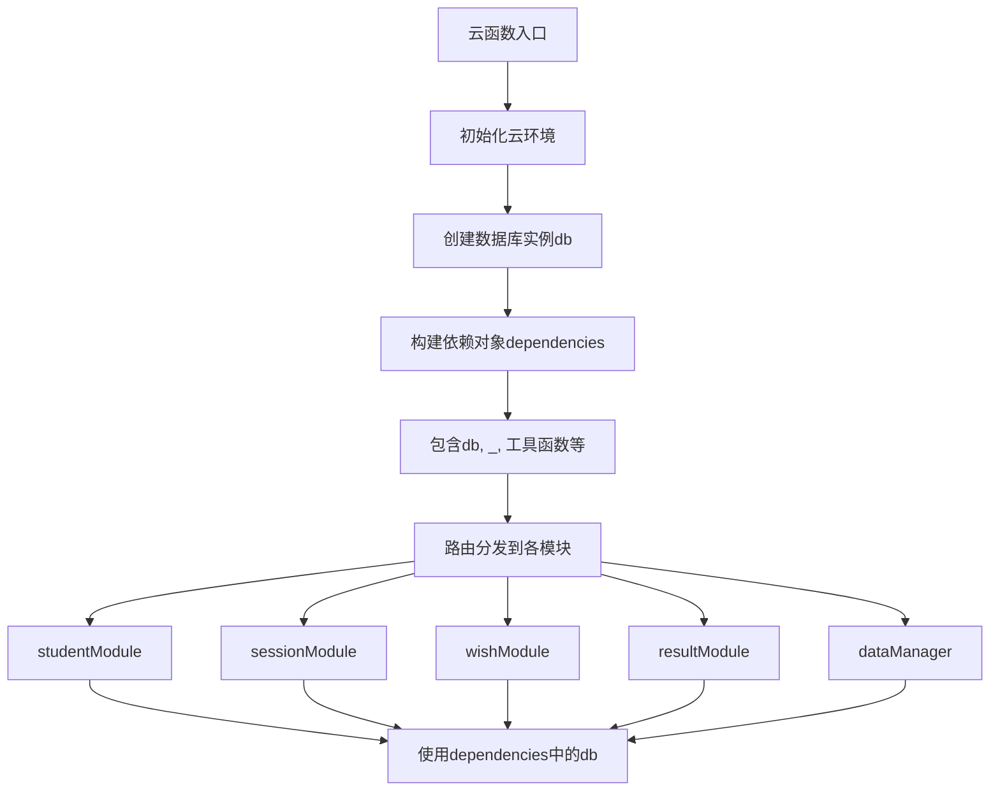
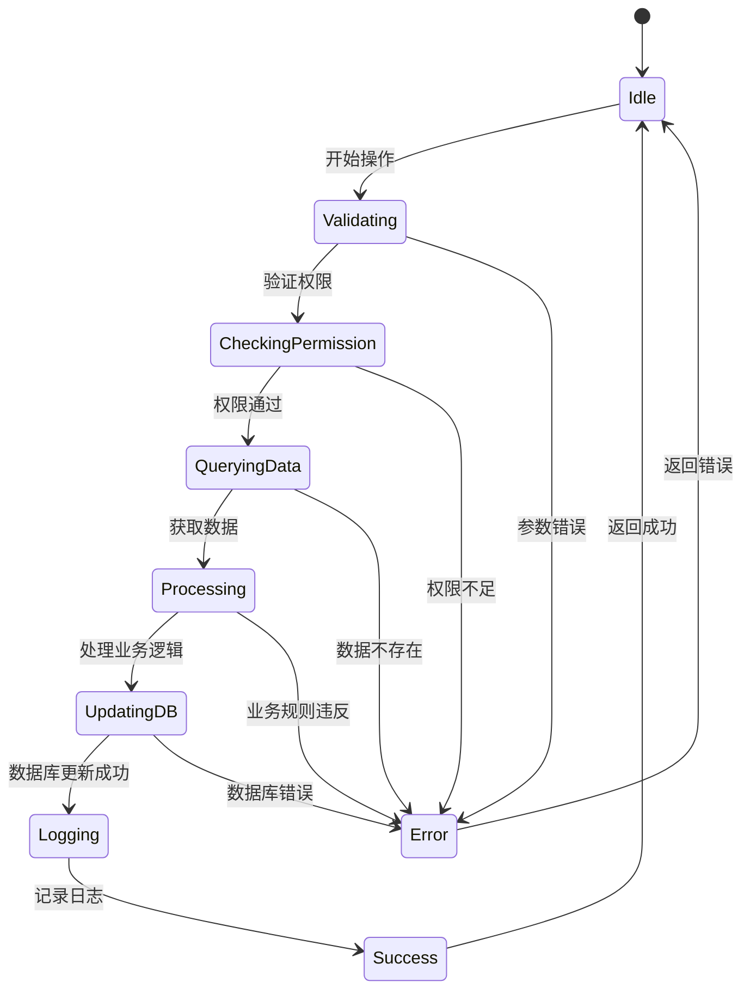

# 数据库访问模式

<cite>
**本文档引用的文件**   
- [index.js](file://cloudfunctions/seatArrangementFunctions/index.js)
- [student.js](file://cloudfunctions/seatArrangementFunctions/modules/student.js)
- [session.js](file://cloudfunctions/seatArrangementFunctions/modules/session.js)
- [wish.js](file://cloudfunctions/seatArrangementFunctions/modules/wish.js)
- [result.js](file://cloudfunctions/seatArrangementFunctions/modules/result.js)
- [dataManager.js](file://cloudfunctions/seatArrangementFunctions/modules/dataManager.js)
- [permission.js](file://cloudfunctions/seatArrangementFunctions/modules/permission.js)
</cite>

## 目录
1. [引言](#引言)
2. [数据库实例初始化与传递机制](#数据库实例初始化与传递机制)
3. [核心数据集合与操作流程](#核心数据集合与操作流程)
4. [students集合操作分析](#students集合操作分析)
5. [sessions集合操作分析](#sessions集合操作分析)
6. [wishes集合操作分析](#wishes集合操作分析)
7. [results集合操作分析](#results集合操作分析)
8. [数据一致性保障机制](#数据一致性保障机制)
9. [性能优化策略](#性能优化策略)
10. [权限控制与安全访问](#权限控制与安全访问)
11. [结论](#结论)

## 引言
本系统采用微信云开发平台的云数据库作为核心数据存储方案，通过云函数实现对数据库的安全访问与业务逻辑处理。系统围绕学生座位安排这一核心场景，构建了students、sessions、wishes、results等多个数据集合，实现了从学生信息管理、意愿收集、排座算法执行到结果发布的完整业务闭环。本文档系统化描述后端对微信云数据库的访问模式，重点说明数据库实例的初始化与传递机制、各模块执行增删改查操作的标准流程、数据一致性保障机制以及性能优化策略。

## 数据库实例初始化与传递机制

系统在云函数入口文件`index.js`中完成数据库实例的初始化，并通过依赖注入的方式将数据库实例传递给各个业务模块，确保了数据库连接的统一管理和高效复用。



**图示来源**
- [index.js](file://cloudfunctions/seatArrangementFunctions/index.js#L1-L305)

**本节来源**
- [index.js](file://cloudfunctions/seatArrangementFunctions/index.js#L1-L305)

## 核心数据集合与操作流程

系统定义了清晰的数据访问分层架构，将业务逻辑与数据访问分离。各业务模块（如student、session、wish、result）负责处理特定领域的业务逻辑，而数据访问操作则通过统一的数据库实例`db`执行。所有数据库操作均遵循"验证输入 -> 检查权限 -> 执行查询/更新 -> 返回响应"的标准流程。


**图示来源**
- [index.js](file://cloudfunctions/seatArrangementFunctions/index.js#L1-L305)
- [permission.js](file://cloudfunctions/seatArrangementFunctions/modules/permission.js#L1-L178)

**本节来源**
- [index.js](file://cloudfunctions/seatArrangementFunctions/index.js#L1-L305)
- [permission.js](file://cloudfunctions/seatArrangementFunctions/modules/permission.js#L1-L178)

## students集合操作分析

`students`集合存储学生基本信息，其操作主要由`student.js`模块处理。系统通过`getProfile`、`updateProfile`、`getClassmates`等接口提供对学生数据的访问。

### 查询逻辑
- **getProfile**: 通过`student_id`精确查询学生信息，并关联查询班级名称，实现数据聚合。
- **getClassmates**: 通过`class_id`和`is_active: true`条件查询同班同学列表，使用`field`方法指定返回字段以减少数据传输量。
- **getClassList**: 查询`active_students > 0`的活跃班级，按年级降序和班级名称升序排序。

### 索引使用策略
虽然代码中未显式创建索引，但根据查询模式，建议在以下字段上创建索引以提升查询性能：
- `students`集合的`student_id`（主键查询）
- `students`集合的`class_id`和`is_active`（复合查询）
- `classes`集合的`active_students`（范围查询）

### 事务处理
学生信息更新操作（`updateProfile`）包含多个步骤：验证学号唯一性、检查班级存在性、更新学生记录。这些操作在单个函数调用中顺序执行，但由于微信云数据库的`update`操作本身是原子性的，因此无需显式事务。系统通过`where`条件确保更新的精确性。

**本节来源**
- [student.js](file://cloudfunctions/seatArrangementFunctions/modules/student.js#L1-L322)

## sessions集合操作分析

`arrangement_sessions`集合管理排座会话的生命周期，其操作由`session.js`模块处理。会话状态机（collecting, arranging, completed, published）是核心业务逻辑。

### 查询逻辑
- **getCurrentSession**: 使用`class_id`和`status`（in ['collecting', 'arranging', 'completed']）条件查询最新的活跃会话，利用`orderBy('create_time', 'desc')`和`limit(1)`实现。
- **getStatistics**: 综合查询，涉及`students`集合（统计总数）、`wishes`集合（统计提交数）和`system_logs`集合（获取操作时间线）。

### 事务处理与数据一致性
会话创建（`createSession`）是一个典型的多集合操作：
1. 在`arrangement_sessions`集合中创建新会话。
2. 在`system_logs`集合中记录操作日志。
这两个操作虽未使用数据库事务，但通过函数的原子性执行和错误处理机制保障了数据一致性。若日志记录失败，系统会记录错误但不会回滚会话创建，这符合"尽力而为"的日志记录原则。

### 状态转换控制
系统通过`validTransitions`对象严格定义了会话状态的合法转换路径，防止非法状态迁移。状态更新操作（`updateSessionStatus`）在更新数据库前会进行状态转换合理性验证。

**本节来源**
- [session.js](file://cloudfunctions/seatArrangementFunctions/modules/session.js#L1-L415)

## wishes集合操作分析

`wishes`集合存储学生提交的座位意愿，是排座算法的核心输入数据，其操作由`wish.js`模块处理。

### 查询逻辑
- **getMyWish**: 通过`student_id`和`session_id`联合主键查询学生的意愿记录。
- **submitWish/updateWish**: 在提交或更新意愿前，会进行复杂的业务验证，包括会话状态、截止时间、座位有效性、邻座学生存在性等。

### 事务处理
意愿提交（`submitWish`）包含多个数据库操作：
1. 验证会话和截止时间。
2. 检查是否已提交（幂等性检查）。
3. 调用`validateWishData`进行复杂业务规则验证。
4. 向`wishes`集合添加新记录。
5. 调用`updateSessionStatistics`更新会话统计信息。
6. 向`system_logs`集合添加日志。
这些操作在单个函数中顺序执行，`add`和`update`操作各自是原子的。系统通过`existingWish`检查确保了幂等性。

### 索引使用策略
为支持高效查询，建议在以下字段创建索引：
- `wishes`集合的`student_id`和`session_id`（复合索引，用于`getMyWish`）
- `wishes`集合的`session_id`（用于统计提交数）
- `arrangement_sessions`集合的`class_id`和`status`（用于`validateWishData`中的会话查询）

**本节来源**
- [wish.js](file://cloudfunctions/seatArrangementFunctions/modules/wish.js#L1-L453)

## results集合操作分析

`seat_assignments`集合存储最终的座位分配结果，其操作由`result.js`模块处理。

### 查询逻辑
- **getMyAssignment**: 通过`session_id`和`student_id`查询个人座位分配，并关联查询座位详细信息和邻座信息。
- **getArrangementResult**: 支持两种格式：
  - `simple`: 返回座位图（`seatMap`），通过`buildSeatMap`函数将分配数据与教室布局结合。
  - `detailed`: 返回详细分配列表和统计信息，仅管理员可访问。

### 数据聚合与计算
`getArrangementResult`在查询数据库后，会在内存中进行数据聚合：
- `buildSeatMap`: 将座位分配数据与教室布局配置结合，生成可视化座位图。
- `calculateStatistics`: 计算整体满意度分布等统计指标。
- `getNeighborsInfo`: 动态计算邻座信息。

### 手动调整与审计
`manualAdjustSeat`接口允许管理员手动调整座位。系统通过`adjust_history`数组记录每次调整的`from_seat`、`to_seat`、`reason`和`adjust_time`，实现了完整的操作审计追踪。调整前会通过`validateSeatAdjustment`检查座位占用情况。

**本节来源**
- [result.js](file://cloudfunctions/seatArrangementFunctions/modules/result.js#L1-L455)

## 数据一致性保障机制

系统通过多种机制保障数据一致性：

### 原子操作
微信云数据库的单个`add`、`update`、`delete`操作是原子的。系统充分利用这一点，例如在`updateProfile`中，通过`where`条件和单次`update`调用确保更新的原子性。

### 应用层事务模拟
对于跨集合操作（如创建会话并记录日志），系统虽未使用数据库事务，但通过函数的顺序执行和错误处理来模拟事务行为。关键操作（如`submitWish`）会先进行所有验证，再执行写入，减少失败的可能性。

### 事务边界
系统的事务边界通常定义在单个云函数调用内。每个业务操作（如提交意愿、创建会话）对应一个独立的云函数执行，这保证了操作的隔离性。复杂的业务流程（如排座算法执行）被封装在单个函数中，避免了跨函数的分布式事务问题。

### 冲突解决
在手动调整座位时，系统通过`validateSeatAdjustment`检查目标座位是否被占用，防止了数据冲突。如果检测到冲突，会立即返回错误，避免了脏写。



**图示来源**
- [wish.js](file://cloudfunctions/seatArrangementFunctions/modules/wish.js#L1-L453)
- [result.js](file://cloudfunctions/seatArrangementFunctions/modules/result.js#L1-L455)

**本节来源**
- [wish.js](file://cloudfunctions/seatArrangementFunctions/modules/wish.js#L1-L453)
- [result.js](file://cloudfunctions/seatArrangementFunctions/modules/result.js#L1-L455)

## 性能优化策略

### 批量操作
`importStudents`函数实现了学生数据的批量导入。它通过循环处理`students_data`数组，逐个验证并添加学生记录。虽然当前是串行处理，但可通过云开发的`batch` API优化为真正的批量操作，显著提升性能。

### 分页查询
`genericRead`函数支持`skip`和`limit`参数，实现了分页查询功能。系统建议`limit`不超过100条，防止一次性返回过多数据。`getClassmates`等接口虽未显式分页，但因数据量有限，暂未成为性能瓶颈。

### 避免N+1查询
系统在设计上注意避免了N+1查询问题：
- `getMyAssignment`在获取邻座信息时，先通过一次查询获取所有座位分配，再在内存中建立映射表，避免了为每个邻座方向都进行一次数据库查询。
- `getArrangementResult`在构建座位图时，也是先获取所有分配数据，再进行内存中的数据填充。

### 字段过滤
系统广泛使用`field`方法指定返回字段，如`getClassmates`只返回`student_id`、`name`、`student_number`，减少了网络传输的数据量和内存占用。

### 索引优化建议
为应对未来数据量增长，建议为高频查询字段创建索引：
- `wishes`集合：`session_id`（用于统计）、`student_id`（用于个人查询）
- `seat_assignments`集合：`session_id`（用于结果查询）
- `system_logs`集合：`session_id`和`action`（用于操作审计）

**本节来源**
- [dataManager.js](file://cloudfunctions/seatArrangementFunctions/modules/dataManager.js#L1-L401)
- [result.js](file://cloudfunctions/seatArrangementFunctions/modules/result.js#L1-L455)

## 权限控制与安全访问

系统实现了细粒度的权限控制，确保数据安全。

### 读写分离权限
`dataManager.js`模块通过高阶函数`allowRead`和`requireAdminWrite`实现了"仅管理端可写，所有人可读"的权限模型：
- `allowRead`: 包装的函数（如`getClassList`）允许所有认证用户读取。
- `requireAdminWrite`: 包装的函数（如`createClass`）强制要求管理员角色才能执行。

### 基于角色的访问控制（RBAC）
`permission.js`模块定义了`PERMISSIONS`对象，明确指定了不同角色（`student`、`admin`、`seat_manager`）对各个数据集合的读写权限。`checkCollectionPermission`函数用于在运行时验证权限。

### 敏感信息过滤
`getStudentInfo`接口根据用户角色动态过滤返回的字段。普通学生只能查看基础信息，而管理员可以查看完整信息，实现了字段级别的数据脱敏。

```mermaid
classDiagram
class PermissionManager {
+checkPermission(userInfo, requiredRoles)
+checkCollectionPermission(collection, operation, userRole)
+checkFunctionPermission(functionName, userRole)
}
class DataReader {
+getClassList()
+getClassroomList()
+getStudentInfo()
}
class DataWriter {
+createClass()
+updateClass()
+deleteClass()
}
class AuthDecorator {
+allowRead(handler)
+requireAdminWrite(handler)
}
PermissionManager --> DataReader : "权限检查"
PermissionManager --> DataWriter : "权限检查"
AuthDecorator --> DataReader : "包装"
AuthDecorator --> DataWriter : "包装"
DataReader --> "database" : "读取"
DataWriter --> "database" : "写入"
```

**图示来源**
- [permission.js](file://cloudfunctions/seatArrangementFunctions/modules/permission.js#L1-L178)
- [dataManager.js](file://cloudfunctions/seatArrangementFunctions/modules/dataManager.js#L1-L401)

**本节来源**
- [permission.js](file://cloudfunctions/seatArrangementFunctions/modules/permission.js#L1-L178)
- [dataManager.js](file://cloudfunctions/seatArrangementFunctions/modules/dataManager.js#L1-L401)

## 结论
本系统通过微信云开发平台的云数据库实现了高效、安全的数据访问。数据库实例在云函数入口统一初始化，并通过依赖注入传递给各业务模块。系统围绕students、sessions、wishes、results等核心集合，构建了完整的业务操作流程。数据一致性通过原子操作和应用层逻辑保障，性能通过分页、字段过滤和避免N+1查询等策略优化。权限控制体系确保了数据的安全访问。未来可通过引入数据库批量操作API和创建更多索引来进一步提升系统性能和可扩展性。