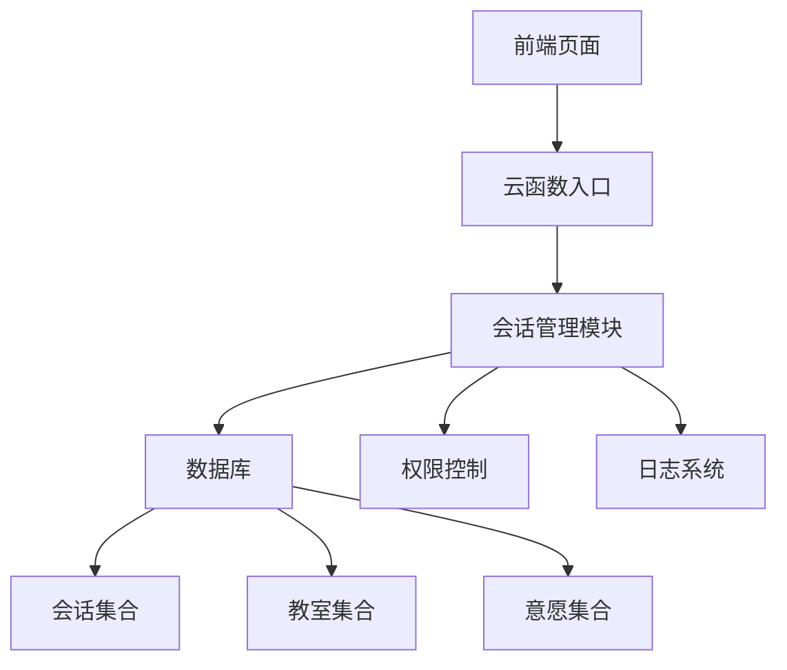
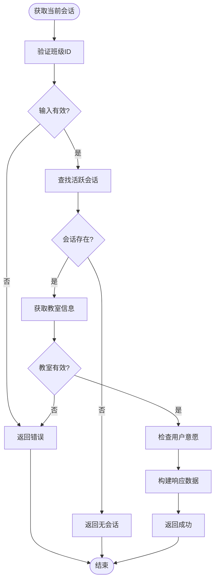
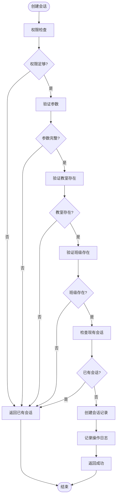
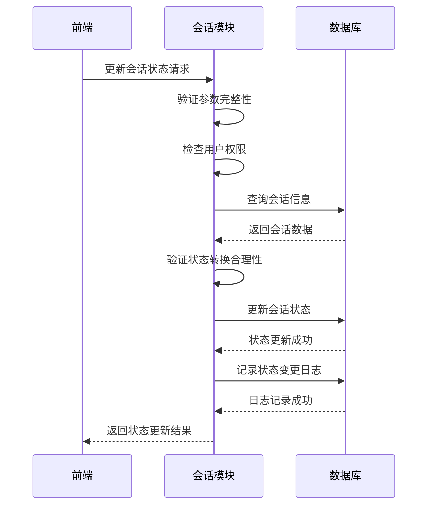
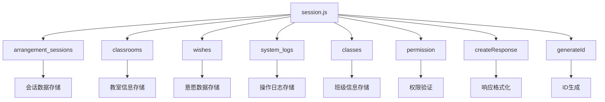

# 会话管理模块设计

<cite>
**本文档引用文件**  
- [session.js](file://cloudfunctions/seatArrangementFunctions/modules/session.js)
- [session-management.js](file://miniprogram/pages/session-management/session-management.js)
- [index.js](file://miniprogram/pages/index/index.js)
</cite>

## 目录
1. [简介](#简介)
2. [项目结构](#项目结构)
3. [核心组件](#核心组件)
4. [架构概述](#架构概述)
5. [详细组件分析](#详细组件分析)
6. [依赖分析](#依赖分析)
7. [性能考虑](#性能考虑)
8. [故障排除指南](#故障排除指南)
9. [结论](#结论)

## 简介
会话管理模块是排座系统的核心控制中枢，负责协调学生意愿收集、算法执行和结果发布三个阶段的流程控制。该模块通过会话生命周期管理机制，确保排座流程的有序进行。模块提供了创建排座会话、获取当前会话状态、更新会话进度及统计信息等核心功能，同时与前端页面进行紧密交互，实现完整的排座管理闭环。

## 项目结构
排座会话管理模块位于云函数 `seatArrangementFunctions` 的 `modules` 目录下，与前端页面 `session-management` 形成完整的前后端交互体系。

```mermaid
graph TB
subgraph "前端"
A[session-management.js]
B[index.js]
end
subgraph "后端"
C[session.js]
D[index.js]
end
A --> C : 调用云函数
B --> C : 调用云函数
C --> E[(数据库)]
C --> F[(日志系统)]
```

**图表来源**  
- [session.js](file://cloudfunctions/seatArrangementFunctions/modules/session.js)
- [session-management.js](file://miniprogram/pages/session-management/session-management.js)

**章节来源**  
- [session.js](file://cloudfunctions/seatArrangementFunctions/modules/session.js)
- [session-management.js](file://miniprogram/pages/session-management/session-management.js)

## 核心组件
会话管理模块包含四个核心功能函数：`getCurrentSession`、`createSession`、`getStatistics` 和 `updateSessionStatus`，分别负责获取当前会话、创建新会话、获取统计信息和更新会话状态。这些函数通过统一的响应格式与前端交互，确保接口的一致性和可维护性。

**章节来源**  
- [session.js](file://cloudfunctions/seatArrangementFunctions/modules/session.js#L5-L415)

## 架构概述
会话管理模块采用分层架构设计，将业务逻辑、数据访问和权限控制分离，确保代码的可维护性和可扩展性。模块通过云函数入口 `index.js` 暴露接口，前端页面通过云调用与后端交互。



**图表来源**  
- [session.js](file://cloudfunctions/seatArrangementFunctions/modules/session.js)
- [index.js](file://cloudfunctions/seatArrangementFunctions/index.js)

## 详细组件分析

### 获取当前会话分析
`getCurrentSession` 函数负责获取当前活跃的排座会话，为用户提供会话状态和参与信息。



**图表来源**  
- [session.js](file://cloudfunctions/seatArrangementFunctions/modules/session.js#L5-L75)

**章节来源**  
- [session.js](file://cloudfunctions/seatArrangementFunctions/modules/session.js#L5-L75)

### 创建会话分析
`createSession` 函数负责创建新的排座会话，确保会话创建的合法性和完整性。



**图表来源**  
- [session.js](file://cloudfunctions/seatArrangementFunctions/modules/session.js#L80-L196)

**章节来源**  
- [session.js](file://cloudfunctions/seatArrangementFunctions/modules/session.js#L80-L196)

### 会话状态更新分析
`updateSessionStatus` 函数负责更新会话状态，确保状态转换的合理性和可追溯性。



**图表来源**  
- [session.js](file://cloudfunctions/seatArrangementFunctions/modules/session.js#L318-L391)

**章节来源**  
- [session.js](file://cloudfunctions/seatArrangementFunctions/modules/session.js#L318-L391)

## 依赖分析
会话管理模块依赖于多个核心组件和数据集合，形成完整的依赖关系网络。



**图表来源**  
- [session.js](file://cloudfunctions/seatArrangementFunctions/modules/session.js)

**章节来源**  
- [session.js](file://cloudfunctions/seatArrangementFunctions/modules/session.js)

## 性能考虑
会话管理模块在设计时考虑了性能优化，通过合理的数据库查询和缓存策略确保响应速度。模块采用批量操作和索引优化，减少数据库查询次数，提高系统整体性能。

## 故障排除指南
会话管理模块提供了完善的异常处理机制，能够有效应对会话冲突、状态不一致等问题。

**章节来源**  
- [session.js](file://cloudfunctions/seatArrangementFunctions/modules/session.js)

## 结论
会话管理模块通过清晰的职责划分和严谨的状态管理，实现了排座流程的高效控制。模块设计充分考虑了可扩展性和可维护性，为系统的稳定运行提供了坚实基础。