# 学生管理模块设计

<cite>
**Referenced Files in This Document**   
- [student.js](file://cloudfunctions/seatArrangementFunctions/modules/student.js)
- [index.js](file://cloudfunctions/quickstartFunctions/index.js)
- [profile.js](file://miniprogram/pages/profile/profile.js)
- [session.js](file://cloudfunctions/seatArrangementFunctions/modules/session.js)
- [wish.js](file://cloudfunctions/seatArrangementFunctions/modules/wish.js)
- [result.js](file://cloudfunctions/seatArrangementFunctions/modules/result.js)
</cite>

## 目录
1. [学生管理模块概述](#学生管理模块概述)
2. [核心功能实现](#核心功能实现)
3. [数据完整性与合法性验证](#数据完整性与合法性验证)
4. [业务场景数据关联](#业务场景数据关联)
5. [接口调用示例](#接口调用示例)
6. [性能优化策略](#性能优化策略)
7. [异常处理方案](#异常处理方案)

## 学生管理模块概述

学生管理模块是座位安排系统的核心组件，负责学生信息的全生命周期管理。该模块通过云数据库对学生集合进行高效查询与更新，为排座会话、意愿提交和结果分配等业务场景提供数据支持。

模块采用模块化设计，将学生信息的增删改查、批量导入、同班同学查询等功能封装在独立的云函数中，通过统一的响应格式返回结果。系统通过JWT令牌进行身份验证，确保只有授权用户才能访问相关功能。

**Section sources**
- [student.js](file://cloudfunctions/seatArrangementFunctions/modules/student.js#L1-L322)

## 核心功能实现

### 学生信息增删改查

学生管理模块提供了完整的学生信息管理功能，包括获取学生档案、更新学生档案、获取同班同学列表等操作。

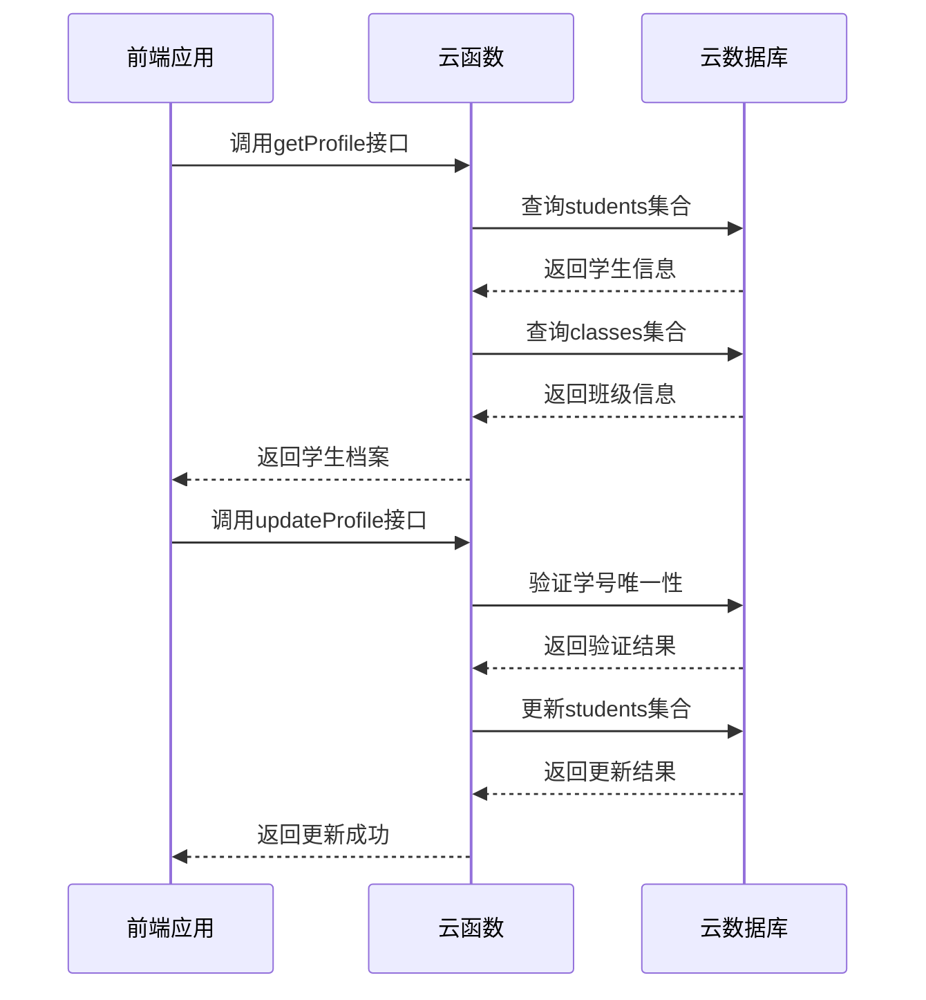

**Diagram sources**
- [student.js](file://cloudfunctions/seatArrangementFunctions/modules/student.js#L5-L144)

**Section sources**
- [student.js](file://cloudfunctions/seatArrangementFunctions/modules/student.js#L5-L144)

### 批量导入功能

批量导入功能允许管理员一次性导入多个学生信息，提高数据录入效率。系统会对每条学生数据进行独立验证和处理，确保数据质量。

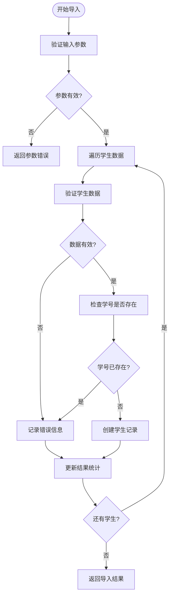

**Diagram sources**
- [student.js](file://cloudfunctions/seatArrangementFunctions/modules/student.js#L214-L313)

**Section sources**
- [student.js](file://cloudfunctions/seatArrangementFunctions/modules/student.js#L214-L313)

### 同班同学查询

同班同学查询功能允许学生获取所在班级的其他同学信息，为意愿提交中的邻座偏好选择提供数据支持。

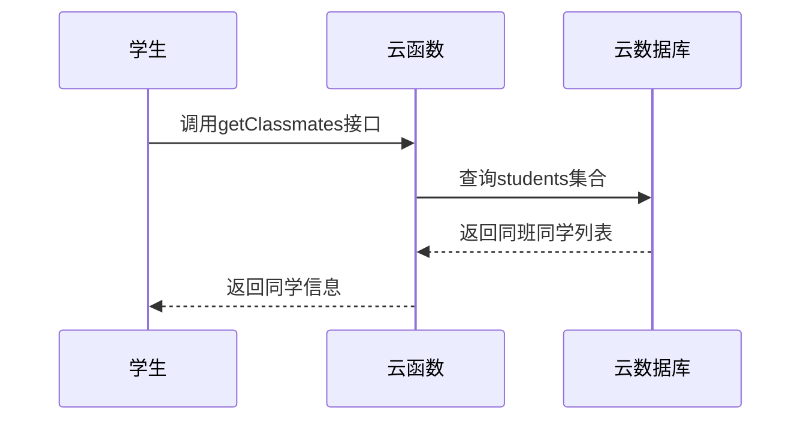

**Diagram sources**
- [student.js](file://cloudfunctions/seatArrangementFunctions/modules/student.js#L149-L179)

**Section sources**
- [student.js](file://cloudfunctions/seatArrangementFunctions/modules/student.js#L149-L179)

## 数据完整性与合法性验证

### 数据验证机制

学生管理模块实施了多层次的数据验证机制，确保学生数据的完整性和合法性。

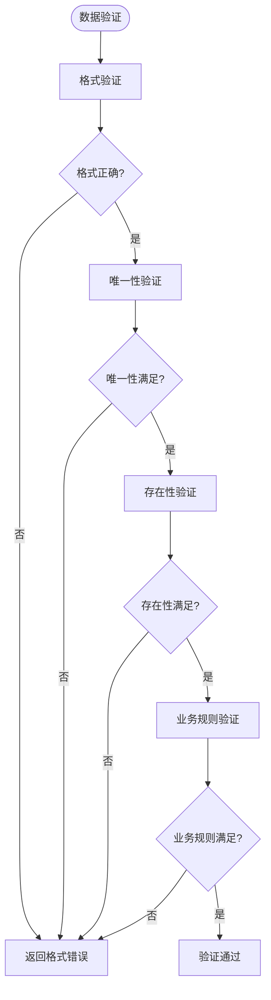

**Diagram sources**
- [student.js](file://cloudfunctions/seatArrangementFunctions/modules/student.js#L56-L99)

**Section sources**
- [student.js](file://cloudfunctions/seatArrangementFunctions/modules/student.js#L56-L99)

### 验证规则详情

| 验证类型 | 验证规则 | 错误码 | 错误信息 |
|--------|--------|-------|--------|
| 学号格式 | 9-12位数字 | 400 | 学号格式不正确 |
| 学号唯一性 | 不可重复 | 409 | 学号已被使用 |
| 班级存在性 | 必须存在 | 400 | 指定的班级不存在 |
| 必填字段 | 姓名、学号必填 | 400 | 姓名和学号不能为空 |
| 权限检查 | 仅管理员可导入 | 403 | 权限不足 |

**Section sources**
- [student.js](file://cloudfunctions/seatArrangementFunctions/modules/student.js#L211-L258)

## 业务场景数据关联

### 学生信息与排座会话关联

学生信息与排座会话之间存在紧密的数据关联，确保排座过程的准确性和完整性。

```mermaid
erDiagram
STUDENT {
string student_id PK
string name
string student_number UK
string class_id FK
boolean is_active
}
CLASS {
string class_id PK
string name
string grade
int active_students
}
SESSION {
string session_id PK
string class_id FK
string classroom_id FK
string status
datetime deadline
}
WISH {
string wish_id PK
string student_id FK
string session_id FK
json preferred_seats
json avoided_seats
json preferred_neighbors
json avoided_neighbors
}
RESULT {
string assignment_id PK
string student_id FK
string session_id FK
string seat_id
float satisfaction_score
}
STUDENT ||--o{ SESSION : "belongs to"
STUDENT ||--o{ WISH : "submits"
STUDENT ||--o{ RESULT : "receives"
CLASS ||--o{ SESSION : "has"
SESSION ||--o{ WISH : "collects"
SESSION ||--o{ RESULT : "generates"
```

**Diagram sources**
- [student.js](file://cloudfunctions/seatArrangementFunctions/modules/student.js#L1-L322)
- [session.js](file://cloudfunctions/seatArrangementFunctions/modules/session.js#L1-L416)
- [wish.js](file://cloudfunctions/seatArrangementFunctions/modules/wish.js#L1-L454)
- [result.js](file://cloudfunctions/seatArrangementFunctions/modules/result.js#L1-L456)

**Section sources**
- [student.js](file://cloudfunctions/seatArrangementFunctions/modules/student.js#L1-L322)
- [session.js](file://cloudfunctions/seatArrangementFunctions/modules/session.js#L1-L416)
- [wish.js](file://cloudfunctions/seatArrangementFunctions/modules/wish.js#L1-L454)
- [result.js](file://cloudfunctions/seatArrangementFunctions/modules/result.js#L1-L456)

### 排座流程数据流

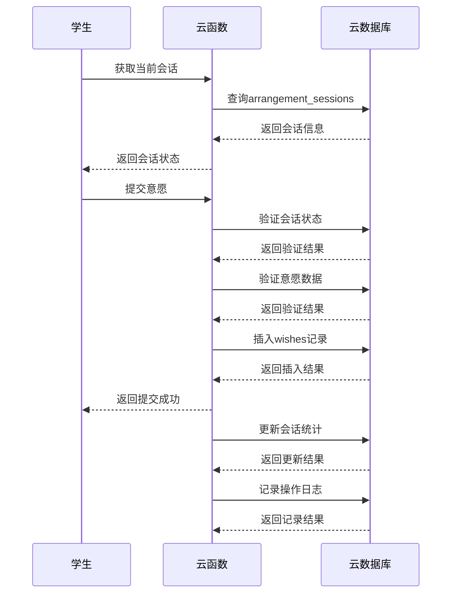

**Diagram sources**
- [session.js](file://cloudfunctions/seatArrangementFunctions/modules/session.js#L1-L416)
- [wish.js](file://cloudfunctions/seatArrangementFunctions/modules/wish.js#L1-L454)

**Section sources**
- [session.js](file://cloudfunctions/seatArrangementFunctions/modules/session.js#L1-L416)
- [wish.js](file://cloudfunctions/seatArrangementFunctions/modules/wish.js#L1-L454)

## 接口调用示例

### 前端获取学生档案

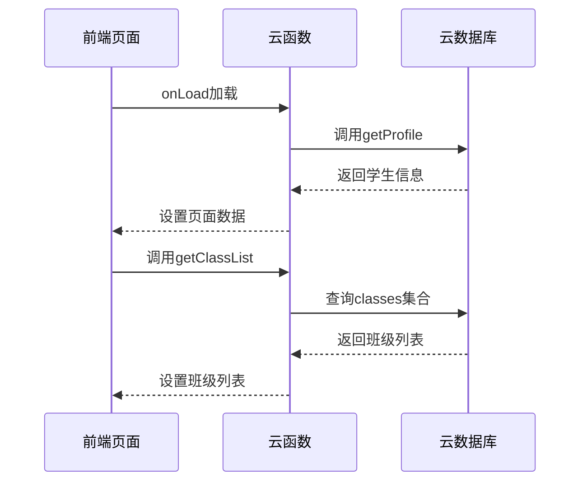

**Diagram sources**
- [profile.js](file://miniprogram/pages/profile/profile.js#L1-L301)

**Section sources**
- [profile.js](file://miniprogram/pages/profile/profile.js#L1-L301)

### 前端更新学生信息

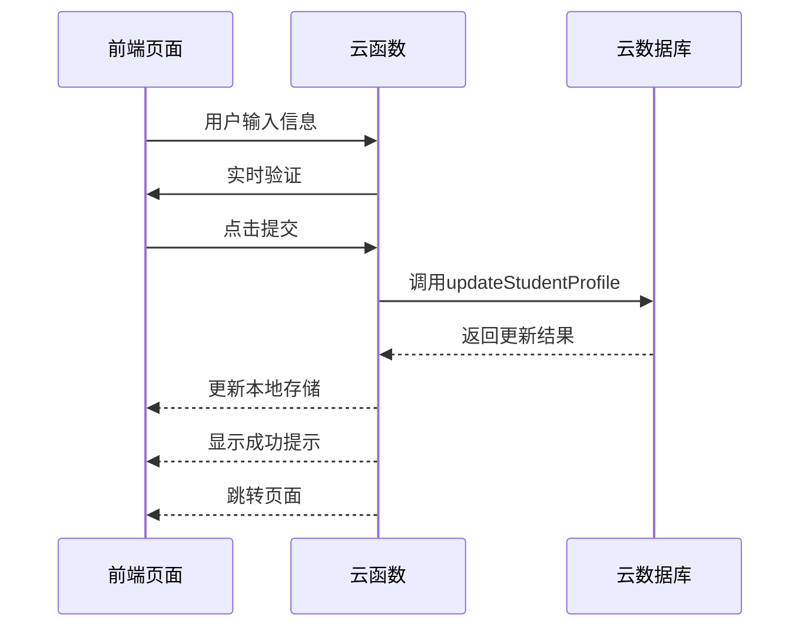

**Diagram sources**
- [profile.js](file://miniprogram/pages/profile/profile.js#L1-L301)

**Section sources**
- [profile.js](file://miniprogram/pages/profile/profile.js#L1-L301)

### 云函数路由处理

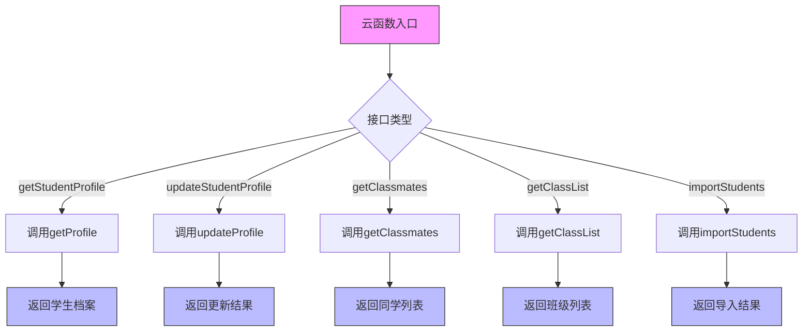

**Diagram sources**
- [index.js](file://cloudfunctions/quickstartFunctions/index.js#L1-L156)

**Section sources**
- [index.js](file://cloudfunctions/quickstartFunctions/index.js#L1-L156)

## 性能优化策略

### 数据库查询优化

学生管理模块通过多种策略优化数据库查询性能：

1. **字段选择优化**：使用`field`方法只查询必要字段，减少数据传输量
2. **索引使用**：在常用查询字段（如`student_id`、`class_id`）上建立索引
3. **分页处理**：对于大量数据查询，采用分页机制
4. **缓存机制**：对频繁访问的数据进行缓存

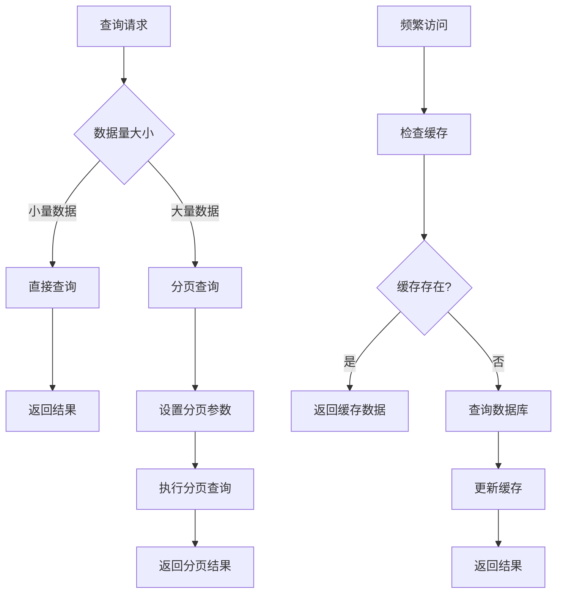

**Section sources**
- [student.js](file://cloudfunctions/seatArrangementFunctions/modules/student.js#L146-L209)

### 批量操作优化

批量导入功能采用逐条处理的方式，避免单次操作数据量过大导致性能问题。

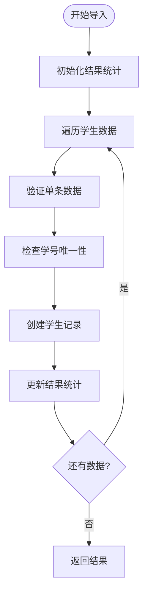

**Section sources**
- [student.js](file://cloudfunctions/seatArrangementFunctions/modules/student.js#L214-L313)

## 异常处理方案

### 常见异常类型

| 异常类型 | 原因 | 处理方案 |
|--------|-----|--------|
| 参数不完整 | 缺少必要参数 | 返回400错误，提示缺失参数 |
| 权限不足 | 用户无操作权限 | 返回403错误，提示权限不足 |
| 数据不存在 | 查询记录不存在 | 返回404错误，提示数据不存在 |
| 冲突错误 | 数据冲突（如学号重复） | 返回409错误，提示冲突原因 |
| 服务器错误 | 系统内部错误 | 返回500错误，记录错误日志 |

**Section sources**
- [student.js](file://cloudfunctions/seatArrangementFunctions/modules/student.js#L5-L313)

### 异常处理流程

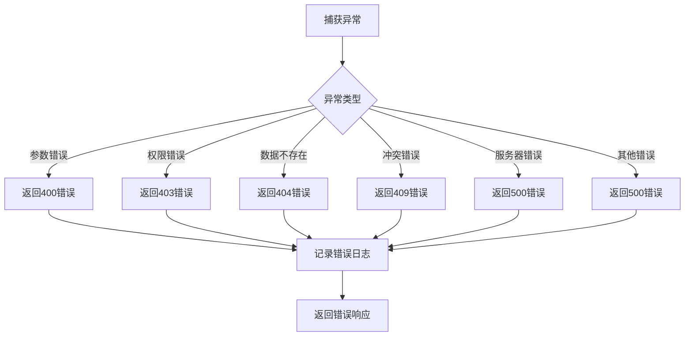

**Section sources**
- [student.js](file://cloudfunctions/seatArrangementFunctions/modules/student.js#L5-L313)