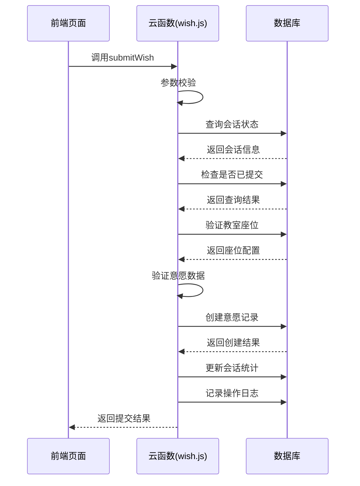
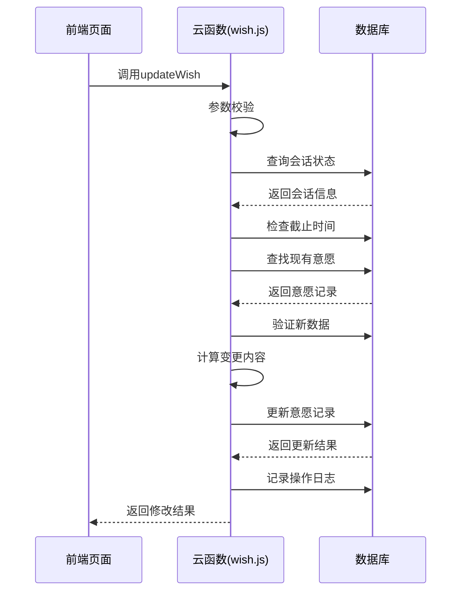
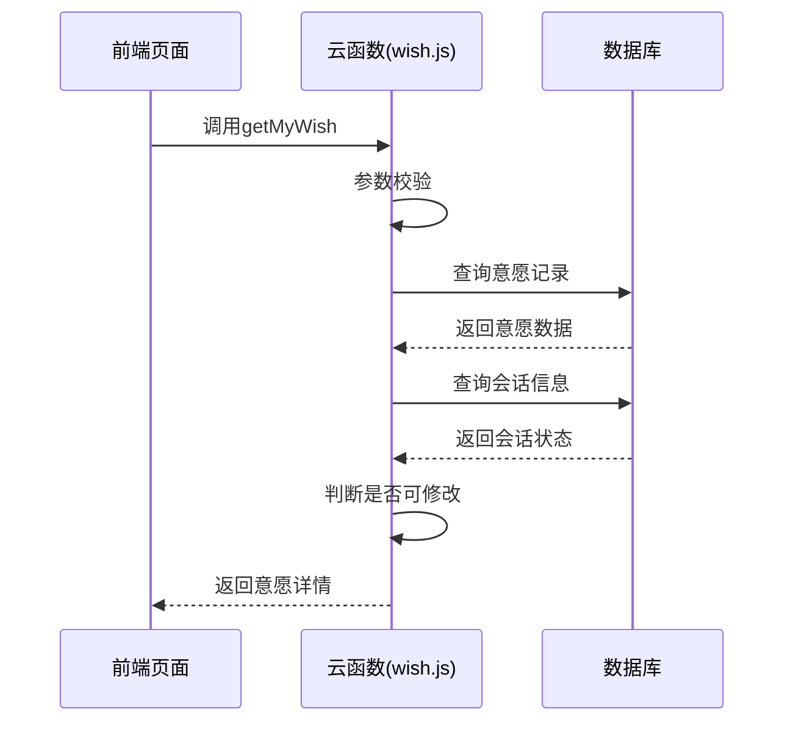
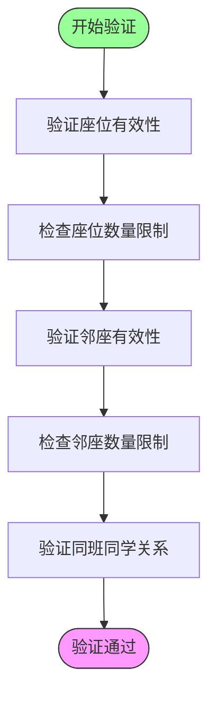
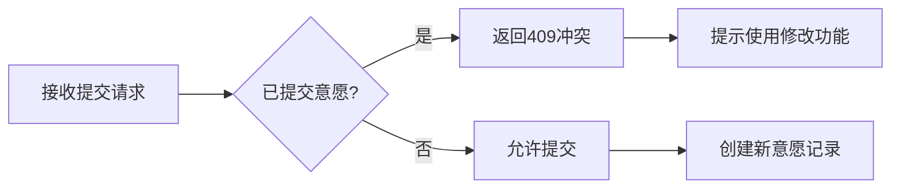
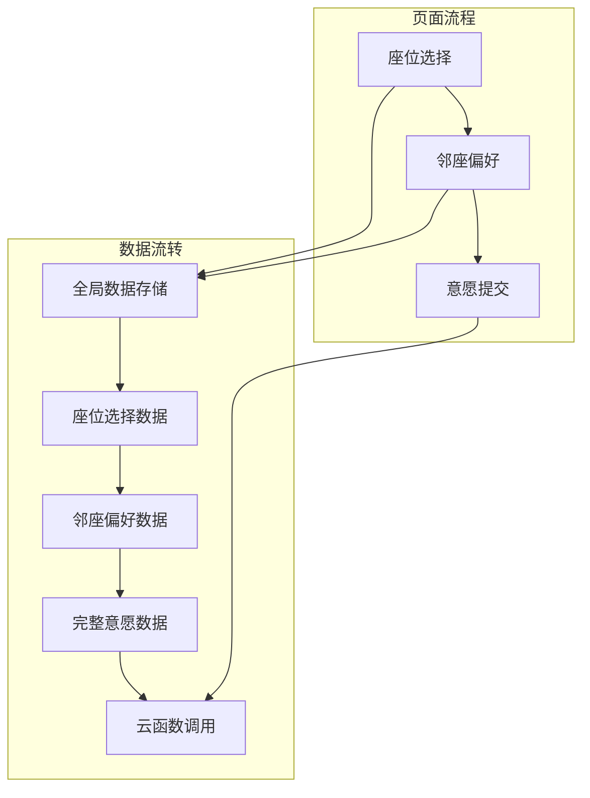
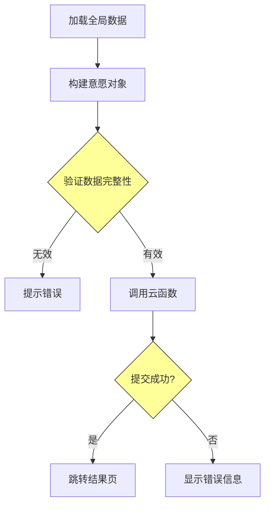
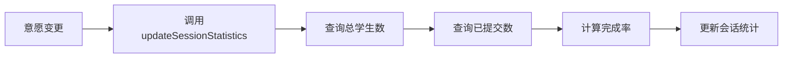

# 意愿管理模块设计

<cite>
**本文档引用文件**  
- [wish.js](file://cloudfunctions/seatArrangementFunctions/modules/wish.js)
- [wish-submit.js](file://miniprogram/pages/wish-submit/wish-submit.js)
- [seat-selection.js](file://miniprogram/pages/seat-selection/seat-selection.js)
- [neighbor-preference.js](file://miniprogram/pages/neighbor-preference/neighbor-preference.js)
</cite>

## 目录
1. [简介](#简介)
2. [核心功能分析](#核心功能分析)
3. [意愿数据结构设计](#意愿数据结构设计)
4. [唯一性与并发控制机制](#唯一性与并发控制机制)
5. [前端交互流程](#前端交互流程)
6. [数据一致性保障](#数据一致性保障)
7. [常见错误与调试方法](#常见错误与调试方法)

## 简介
本模块实现学生座位意愿的提交、修改与查询功能，支持偏好座位、避免座位、邻座偏好等多维度选择。系统通过会话控制、数据验证和版本管理确保数据完整性与用户体验。

## 核心功能分析

### 意愿提交功能
实现学生在指定会话中提交座位偏好，包含完整的参数校验、会话状态检查与数据持久化流程。

**功能流程：**
1. 验证请求参数完整性
2. 检查排座会话是否存在且处于收集状态
3. 验证提交截止时间
4. 检查是否已提交过意愿
5. 验证座位与邻座选择的有效性
6. 创建意愿记录并更新会话统计



**图示来源**
- [wish.js](file://cloudfunctions/seatArrangementFunctions/modules/wish.js#L5-L119)

**本节来源**
- [wish.js](file://cloudfunctions/seatArrangementFunctions/modules/wish.js#L5-L119)

### 意愿修改功能
支持学生在有效期内修改已提交的意愿，系统自动记录修改历史和变更内容。



**图示来源**
- [wish.js](file://cloudfunctions/seatArrangementFunctions/modules/wish.js#L124-L229)

**本节来源**
- [wish.js](file://cloudfunctions/seatArrangementFunctions/modules/wish.js#L124-L229)

### 意愿查询功能
提供学生查询自己已提交意愿的接口，包含版本信息和修改权限判断。



**图示来源**
- [wish.js](file://cloudfunctions/seatArrangementFunctions/modules/wish.js#L234-L291)

**本节来源**
- [wish.js](file://cloudfunctions/seatArrangementFunctions/modules/wish.js#L234-L291)

## 意愿数据结构设计

### 核心数据字段
意愿数据结构设计遵循完整性、可扩展性和易用性原则，主要包含以下字段：

| 字段名称 | 类型 | 描述 | 验证规则 |
|---------|------|------|---------|
| preferred_seats | 数组 | 偏好座位列表 | 最多5个，必须为有效座位 |
| avoided_seats | 数组 | 避免座位列表 | 最多5个，必须为有效座位 |
| preferred_neighbors | 数组 | 偏好邻座列表 | 最多3个，必须为同班同学 |
| avoided_neighbors | 数组 | 避免邻座列表 | 最多3个，必须为同班同学 |
| special_requirements | 字符串 | 特殊需求说明 | 可选字段 |
| version | 数字 | 意愿版本号 | 每次修改递增 |
| modification_history | 数组 | 修改历史记录 | 包含版本、时间、变更内容 |

### 数据验证逻辑
系统通过`validateWishData`函数对意愿数据进行严格验证：



**图示来源**
- [wish.js](file://cloudfunctions/seatArrangementFunctions/modules/wish.js#L296-L371)

**本节来源**
- [wish.js](file://cloudfunctions/seatArrangementFunctions/modules/wish.js#L296-L371)

## 唯一性与并发控制机制

### 单次提交限制
系统通过数据库查询确保每位学生在指定会话中只能提交一次有效意愿：



**本节来源**
- [wish.js](file://cloudfunctions/seatArrangementFunctions/modules/wish.js#L34-L38)

### 并发冲突处理
采用乐观锁机制处理并发修改，通过版本号控制确保数据一致性：

1. 读取当前意愿版本
2. 计算新版本号（当前版本+1）
3. 更新数据时包含版本号
4. 记录完整的修改历史

**本节来源**
- [wish.js](file://cloudfunctions/seatArrangementFunctions/modules/wish.js#L190-L195)

## 前端交互流程

### 完整提交流程
学生提交意愿的完整前端流程包括三个主要页面：



**图示来源**
- [seat-selection.js](file://miniprogram/pages/seat-selection/seat-selection.js#L338-L360)
- [neighbor-preference.js](file://miniprogram/pages/neighbor-preference/neighbor-preference.js#L287-L308)
- [wish-submit.js](file://miniprogram/pages/wish-submit/wish-submit.js#L100-L121)

### 座位选择页面
实现教室座位的可视化选择，支持缩放、拖拽和模式切换：

**功能特点：**
- 双模式选择（偏好/避免）
- 实时状态显示
- 数量限制提示
- 清空选择功能

**本节来源**
- [seat-selection.js](file://miniprogram/pages/seat-selection/seat-selection.js#L0-L360)

### 邻座偏好页面
提供同班同学列表，支持搜索和关系类型选择：

**交互逻辑：**
- 自动加载同班同学
- 支持姓名/学号搜索
- 限制最多选择3人
- 可设置关系类型和避免原因

**本节来源**
- [neighbor-preference.js](file://miniprogram/pages/neighbor-preference/neighbor-preference.js#L0-L308)

### 意愿提交页面
整合所有选择数据，完成最终提交：



**图示来源**
- [wish-submit.js](file://miniprogram/pages/wish-submit/wish-submit.js#L40-L99)

**本节来源**
- [wish-submit.js](file://miniprogram/pages/wish-submit/wish-submit.js#L40-L99)

## 数据一致性保障

### 统计信息同步
每次意愿提交或修改后，系统自动更新会话统计信息：



**本节来源**
- [wish.js](file://cloudfunctions/seatArrangementFunctions/modules/wish.js#L78-L81)
- [wish.js](file://cloudfunctions/seatArrangementFunctions/modules/wish.js#L410-L447)

### 操作日志记录
所有关键操作均记录详细日志，便于审计和问题排查：

| 日志字段 | 说明 |
|---------|------|
| action | 操作类型（submit_wish/update_wish） |
| user_id | 学生ID |
| session_id | 会话ID |
| details | 操作详情（座位数、变更内容等） |
| result | 操作结果（success/failure） |

**本节来源**
- [wish.js](file://cloudfunctions/seatArrangementFunctions/modules/wish.js#L105-L118)
- [wish.js](file://cloudfunctions/seatArrangementFunctions/modules/wish.js#L215-L228)

## 常见错误与调试方法

### 重复提交问题
**错误表现：** "您已提交过意愿，请使用修改功能"

**解决方案：**
1. 检查`wishes`集合中是否已存在该学生在当前会话的记录
2. 确认前端是否正确处理了修改流程
3. 验证会话状态是否仍为"collecting"

**调试方法：**
```javascript
// 数据库查询示例
db.collection('wishes').where({
  student_id: 'student_001',
  session_id: 'session_001'
}).get()
```

**本节来源**
- [wish.js](file://cloudfunctions/seatArrangementFunctions/modules/wish.js#L34-L38)

### 数据格式错误
**错误表现：** "缺少必要参数" 或 "最多只能选择5个偏好座位"

**验证检查清单：**
- 确认`session_id`、`wish_data`、`student_id`参数存在
- 检查偏好座位数量≤5
- 验证避免座位数量≤5
- 确保邻座选择为同班同学

**本节来源**
- [wish.js](file://cloudfunctions/seatArrangementFunctions/modules/wish.js#L7-L14)
- [wish.js](file://cloudfunctions/seatArrangementFunctions/modules/wish.js#L300-L371)

### 时间截止问题
**错误表现：** "意愿提交已截止"

**排查步骤：**
1. 检查`arrangement_sessions`集合中的截止时间
2. 确认服务器时间与客户端时间同步
3. 验证会话状态是否为"collecting"

**本节来源**
- [wish.js](file://cloudfunctions/seatArrangementFunctions/modules/wish.js#L22-L27)
- [wish.js](file://cloudfunctions/seatArrangementFunctions/modules/wish.js#L139-L144)