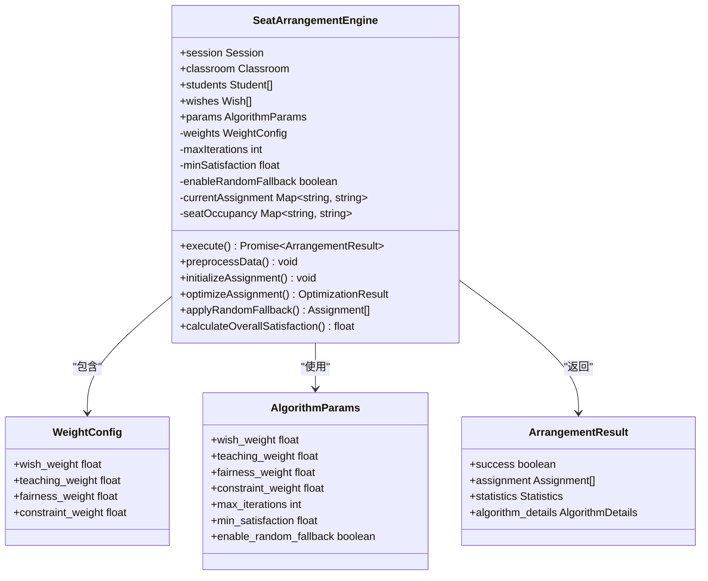
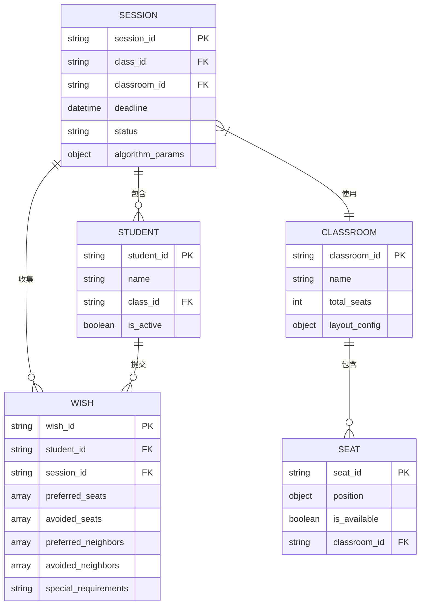
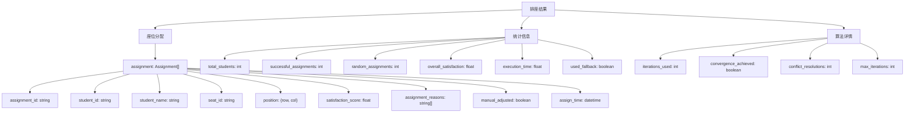
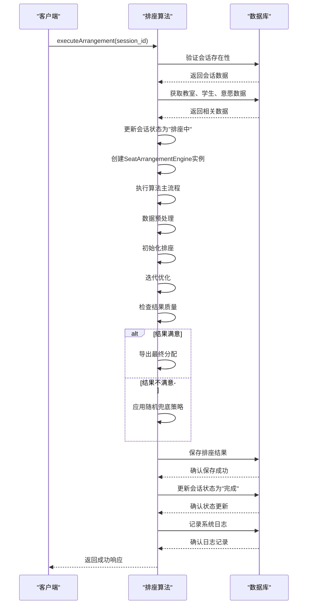
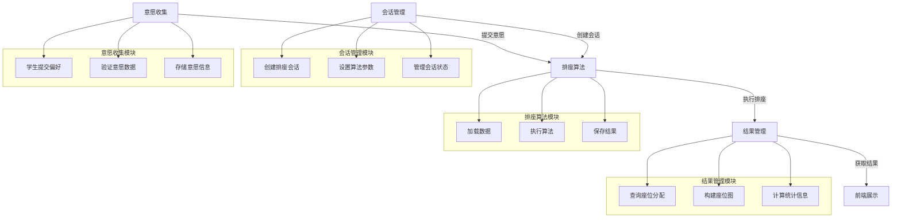
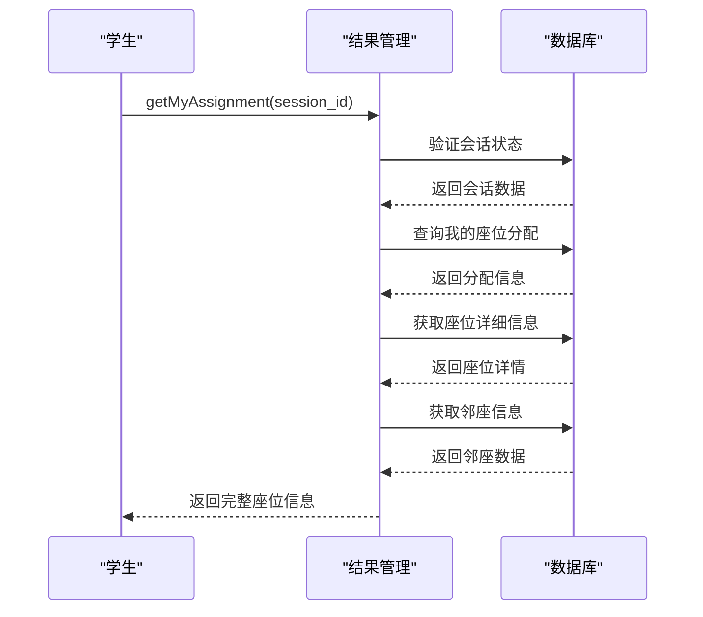

# 排座算法模块设计

<cite>
**本文档引用文件**  
- [algorithm.js](file://cloudfunctions/seatArrangementFunctions/modules/algorithm.js)
- [result.js](file://cloudfunctions/seatArrangementFunctions/modules/result.js)
- [session.js](file://cloudfunctions/seatArrangementFunctions/modules/session.js)
</cite>

## 目录
1. [引言](#引言)
2. [核心算法设计](#核心算法设计)
3. [输入输出结构](#输入输出结构)
4. [执行流程分析](#执行流程分析)
5. [可配置参数说明](#可配置参数说明)
6. [性能分析与优化](#性能分析与优化)
7. [调用场景与协同工作](#调用场景与协同工作)
8. [调试与验证方法](#调试与验证方法)

## 引言
本系统实现了基于学生意愿的智能排座算法，通过综合考虑学生提交的邻座偏好、座位区域选择等个性化需求，结合班级人数、教室布局等客观约束条件，采用多权重评分机制进行优化求解。算法具备完善的兜底策略和异常处理机制，确保在各种情况下都能生成合理的座位安排方案。

**Section sources**
- [algorithm.js](file://cloudfunctions/seatArrangementFunctions/modules/algorithm.js#L1-L50)

## 核心算法设计
排座算法采用多阶段优化策略，包含数据预处理、初始分配、迭代优化和兜底处理四个主要阶段。算法核心为`SeatArrangementEngine`类，通过多权重评分系统综合评估各种因素的影响。



**Diagram sources**
- [algorithm.js](file://cloudfunctions/seatArrangementFunctions/modules/algorithm.js#L104-L448)

**Section sources**
- [algorithm.js](file://cloudfunctions/seatArrangementFunctions/modules/algorithm.js#L104-L448)

## 输入输出结构
算法接收会话ID作为主要输入参数，通过数据库查询获取完整的排座所需数据。输出结果包含详细的座位分配信息、统计指标和算法执行详情。

### 输入数据结构


**Diagram sources**
- [algorithm.js](file://cloudfunctions/seatArrangementFunctions/modules/algorithm.js#L453-L484)
- [session.js](file://cloudfunctions/seatArrangementFunctions/modules/session.js#L138-L145)

### 输出数据结构


**Diagram sources**
- [algorithm.js](file://cloudfunctions/seatArrangementFunctions/modules/algorithm.js#L174-L199)

## 执行流程分析
算法执行流程包含完整的生命周期管理，从数据加载到结果保存，确保每个环节都得到有效处理。



**Diagram sources**
- [algorithm.js](file://cloudfunctions/seatArrangementFunctions/modules/algorithm.js#L6-L99)

**Section sources**
- [algorithm.js](file://cloudfunctions/seatArrangementFunctions/modules/algorithm.js#L6-L99)

## 可配置参数说明
算法支持多种可配置参数，允许管理员根据实际情况调整算法行为，以满足不同场景的需求。

### 参数配置表
| 参数名称 | 默认值 | 说明 | 影响 |
|---------|-------|------|------|
| **wish_weight** | 0.4 | 意愿权重 | 控制学生个人偏好在整体评分中的重要性，值越大越倾向于满足学生个人意愿 |
| **teaching_weight** | 0.3 | 教学权重 | 考虑教学需求的权重，如视力、听力等特殊需求 |
| **fairness_weight** | 0.2 | 公平性权重 | 确保分配过程的公平性，避免某些学生长期处于不利位置 |
| **constraint_weight** | 0.1 | 约束权重 | 处理硬性约束条件的权重，如特殊座位要求 |
| **max_iterations** | 1000 | 最大迭代次数 | 限制算法优化过程的最长运行时间，防止无限循环 |
| **min_satisfaction** | 0.7 | 最小满意度阈值 | 算法收敛的最低标准，低于此值将启用兜底策略 |
| **enable_random_fallback** | true | 启用随机兜底 | 当算法无法找到满意解时，是否采用随机分配作为备选方案 |

这些参数在创建排座会话时通过`session_data.algorithm_params`进行配置，允许管理员根据具体需求进行调整。

**Section sources**
- [algorithm.js](file://cloudfunctions/seatArrangementFunctions/modules/algorithm.js#L110-L120)
- [session.js](file://cloudfunctions/seatArrangementFunctions/modules/session.js#L138-L145)

## 性能分析与优化
算法在设计时充分考虑了性能因素，通过合理的数据结构选择和优化策略确保在大规模数据下的执行效率。

### 时间复杂度分析
```mermaid
flowchart TD
A[算法执行流程] --> B[数据预处理 O(n+m)]
A --> C[初始分配 O(n*m)]
A --> D[迭代优化 O(k*n)]
A --> E[结果导出 O(n)]
subgraph "复杂度说明"
B --> B1["n: 学生数量"]
B --> B2["m: 意愿数量"]
C --> C1["n: 学生数量"]
C --> C2["m: 偏好座位数量"]
D --> D1["k: 实际迭代次数"]
D --> D2["n: 学生数量"]
E --> E1["n: 成功分配的学生数量"]
end
```

**Diagram sources**
- [algorithm.js](file://cloudfunctions/seatArrangementFunctions/modules/algorithm.js#L218-L232)
- [algorithm.js](file://cloudfunctions/seatArrangementFunctions/modules/algorithm.js#L234-L264)

### 大规模数据优化建议
1. **分批处理**：对于超大班级，可考虑将学生分组进行多次排座
2. **并行计算**：在支持的环境下，可将迭代优化过程并行化
3. **缓存机制**：对频繁访问的数据（如教室布局）进行缓存
4. **索引优化**：确保数据库相关字段（如session_id、student_id）已建立索引
5. **参数调优**：根据实际情况调整`max_iterations`和`min_satisfaction`参数，平衡质量和性能

**Section sources**
- [algorithm.js](file://cloudfunctions/seatArrangementFunctions/modules/algorithm.js#L328-L366)

## 调用场景与协同工作
排座算法与其他模块紧密协作，形成完整的排座管理系统。

### 模块协同流程


**Diagram sources**
- [algorithm.js](file://cloudfunctions/seatArrangementFunctions/modules/algorithm.js#L6-L99)
- [result.js](file://cloudfunctions/seatArrangementFunctions/modules/result.js#L81-L164)

### 实际调用示例
当管理员在前端界面点击"开始排座"按钮时：
1. 前端调用`executeArrangement`云函数
2. 系统验证管理员权限和会话状态
3. 加载相关数据并执行排座算法
4. 将结果保存到数据库
5. 更新会话状态为"已完成"
6. 前端刷新界面显示排座结果

**Section sources**
- [algorithm.js](file://cloudfunctions/seatArrangementFunctions/modules/algorithm.js#L6-L99)
- [result.js](file://cloudfunctions/seatArrangementFunctions/modules/result.js#L5-L76)

## 调试与验证方法
为确保算法的正确性和可靠性，系统提供了多种调试和验证手段。

### 调试日志
算法在执行过程中会输出详细的日志信息，包括：
- 数据预处理完成情况
- 初始分配结果
- 迭代优化进度
- 收敛情况
- 兜底策略应用情况

这些日志可以帮助开发人员快速定位问题和优化算法性能。

### 结果验证
通过`result.js`模块提供的接口可以验证排座结果的正确性：



**Diagram sources**
- [result.js](file://cloudfunctions/seatArrangementFunctions/modules/result.js#L5-L76)

### 统计分析
系统提供详细的统计信息，包括：
- 总体满意度
- 满意度分布
- 执行时间
- 使用兜底策略情况
- 迭代次数

这些统计信息可用于评估算法效果和持续优化。

**Section sources**
- [result.js](file://cloudfunctions/seatArrangementFunctions/modules/result.js#L5-L76)
- [result.js](file://cloudfunctions/seatArrangementFunctions/modules/result.js#L223-L257)