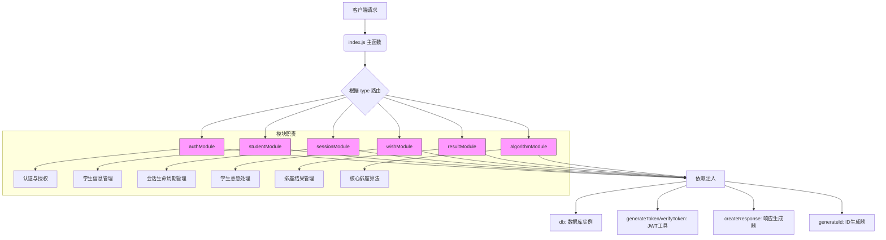

# 模块化架构设计

<cite>
**本文档引用的文件**
- [auth.js](file://cloudfunctions/seatArrangementFunctions/modules/auth.js)
- [student.js](file://cloudfunctions/seatArrangementFunctions/modules/student.js)
- [session.js](file://cloudfunctions/seatArrangementFunctions/modules/session.js)
- [wish.js](file://cloudfunctions/seatArrangementFunctions/modules/wish.js)
- [result.js](file://cloudfunctions/seatArrangementFunctions/modules/result.js)
- [algorithm.js](file://cloudfunctions/seatArrangementFunctions/modules/algorithm.js)
- [index.js](file://cloudfunctions/seatArrangementFunctions/index.js)
</cite>

## 目录
1. [引言](#引言)
2. [模块职责划分原则](#模块职责划分原则)
3. [模块高内聚与低耦合设计](#模块高内聚与低耦合设计)
4. [依赖注入机制](#依赖注入机制)
5. [模块接口设计规范](#模块接口设计规范)
6. [模块化对可维护性、可测试性和可扩展性的影响](#模块化对可维护性可测试性和可扩展性的影响)
7. [模块间调用关系图](#模块间调用关系图)

## 引言
本项目采用模块化架构设计，将后端功能划分为多个独立且职责明确的模块，包括认证（auth）、学生管理（student）、排座会话（session）、学生意愿（wish）、排座结果（result）和排座算法（algorithm）等。这种设计旨在提升代码的可维护性、可测试性和可扩展性。通过依赖注入的方式，各模块共享数据库实例和公共工具函数，同时保持松耦合。本文档将深入分析各模块的职责划分、封装原则、依赖管理及接口设计，并展示其如何共同构建一个结构清晰、易于维护的系统。

## 模块职责划分原则
系统中的每个模块都遵循单一职责原则，专注于处理特定领域的业务逻辑。

- **auth模块**：负责所有与认证和授权相关的操作，包括微信用户登录、管理员登录以及令牌刷新。它处理用户身份验证、JWT令牌的生成与验证，并构建用户档案。
- **student模块**：专注于学生信息的管理，提供获取学生档案、更新个人信息、查询同班同学列表、获取班级列表以及批量导入学生等功能。
- **session模块**：管理排座会话的生命周期，包括创建新的排座会话、获取当前会话状态、查询会话统计信息以及更新会话状态。
- **wish模块**：处理学生提交和修改座位意愿的业务逻辑，包括意愿的提交、更新、查询以及对意愿数据的有效性进行验证。
- **result模块**：负责排座结果的管理与查询，提供获取个人座位分配、查看完整的排座结果以及手动调整座位的功能。
- **algorithm模块**：封装了核心的排座算法逻辑，负责执行自动排座任务，通过多权重评分和冲突解决策略生成座位安排。

**模块职责划分原则**
- [auth.js](file://cloudfunctions/seatArrangementFunctions/modules/auth.js#L1-L244)
- [student.js](file://cloudfunctions/seatArrangementFunctions/modules/student.js#L1-L321)
- [session.js](file://cloudfunctions/seatArrangementFunctions/modules/session.js#L1-L415)
- [wish.js](file://cloudfunctions/seatArrangementFunctions/modules/wish.js#L1-L453)
- [result.js](file://cloudfunctions/seatArrangementFunctions/modules/result.js#L1-L455)
- [algorithm.js](file://cloudfunctions/seatArrangementFunctions/modules/algorithm.js#L1-L508)

## 模块高内聚与低耦合设计
各模块通过精心设计实现了高内聚和低耦合。

**高内聚**体现在每个模块内部的功能高度相关。例如，`auth.js`中的所有函数都围绕用户认证展开，从微信登录到管理员登录，再到令牌刷新，逻辑紧密相连。`algorithm.js`则将整个排座算法的核心逻辑（如`SeatArrangementEngine`类）封装在一个模块内，包括数据预处理、初始化、迭代优化和兜底策略，确保了算法逻辑的完整性。

**低耦合**通过清晰的接口和依赖注入来实现。模块之间不直接相互引用，而是通过`index.js`中的主函数进行路由分发。例如，`wish.js`模块在验证意愿时，需要查询班级信息，但它并不直接调用`student.js`或`session.js`，而是通过传入的`db`依赖直接访问数据库。这使得`wish.js`模块可以独立于其他业务模块进行开发和测试，只要数据库结构不变，其功能就不会受到影响。

**模块高内聚与低耦合设计**
- [auth.js](file://cloudfunctions/seatArrangementFunctions/modules/auth.js#L1-L244)
- [student.js](file://cloudfunctions/seatArrangementFunctions/modules/student.js#L1-L321)
- [session.js](file://cloudfunctions/seatArrangementFunctions/modules/session.js#L1-L415)
- [wish.js](file://cloudfunctions/seatArrangementFunctions/modules/wish.js#L1-L453)
- [algorithm.js](file://cloudfunctions/seatArrangementFunctions/modules/algorithm.js#L1-L508)
- [index.js](file://cloudfunctions/seatArrangementFunctions/index.js#L1-L305)

## 依赖注入机制
系统采用依赖注入（Dependency Injection, DI）模式来管理模块间的共享资源，避免了硬编码的依赖关系，极大地提高了代码的灵活性和可测试性。

在`index.js`的主函数中，定义了一个包含所有共享依赖的`dependencies`对象，其中包括：
- `db`: 云数据库实例
- `generateToken`: JWT令牌生成函数
- `verifyToken`: JWT令牌验证函数
- `createResponse`: 统一响应格式生成函数
- `getWXContext`: 获取微信上下文函数
- `generateId`: 生成唯一ID的函数

这些依赖项被作为一个整体对象，通过函数参数的形式注入到各个模块的具体方法中。例如，在调用`authModule.wxLogin(event, dependencies)`时，`dependencies`对象被完整地传递给`wxLogin`函数。`wxLogin`函数内部即可使用`dependencies.db`进行数据库操作，使用`dependencies.createResponse`生成响应。这种方式使得模块不再需要关心依赖的创建过程，只需使用即可，同时也方便在单元测试中用模拟对象（mock）替换真实的依赖。

**依赖注入机制**
- [index.js](file://cloudfunctions/seatArrangementFunctions/index.js#L100-L120)
- [auth.js](file://cloudfunctions/seatArrangementFunctions/modules/auth.js#L1-L244)

## 模块接口设计规范
所有模块的接口设计遵循统一的规范，确保了系统的一致性和易用性。

1.  **函数命名**：采用动词+名词的格式，清晰表达函数意图，如`submitWish`、`createSession`、`getMyAssignment`。
2.  **参数结构**：主要函数通常接受三个参数：`event`（包含请求数据）、`userInfo`（经过认证的用户信息，可选）和`dependencies`（依赖对象）。这种结构使得函数签名标准化。
3.  **返回值**：所有函数都通过`createResponse`函数返回统一格式的响应对象，包含`success`、`data`、`message`、`code`和`timestamp`字段，便于前端解析。
4.  **错误处理**：每个函数都包含完整的`try-catch`块，捕获并处理运行时错误，确保不会因未捕获的异常导致云函数崩溃，并能向客户端返回有意义的错误信息。
5.  **权限检查**：涉及敏感操作的函数（如`createSession`、`manualAdjustSeat`）首先会检查`userInfo`中的角色权限，确保只有授权用户才能执行。

**模块接口设计规范**
- [index.js](file://cloudfunctions/seatArrangementFunctions/index.js#L122-L305)
- [session.js](file://cloudfunctions/seatArrangementFunctions/modules/session.js#L1-L415)
- [result.js](file://cloudfunctions/seatArrangementFunctions/modules/result.js#L1-L455)

## 模块化对可维护性、可测试性和可扩展性的影响
模块化设计显著提升了代码的可维护性、可测试性和可扩展性。

**可维护性**：当需要修改某个功能时，开发者可以快速定位到对应的模块文件。例如，修改登录逻辑只需关注`auth.js`，而不会影响到排座算法。代码的职责清晰，降低了理解和修改的复杂度。

**可测试性**：由于依赖通过参数注入，可以轻松地为模块编写单元测试。例如，可以为`validateWishData`函数创建一个模拟的`db`对象，测试其在各种输入下的行为，而无需连接真实的数据库，实现了快速、隔离的测试。

**可扩展性**：添加新功能变得非常简单。如果需要增加一个“通知”模块，只需创建`notification.js`文件，实现相关函数，并在`index.js`中引入和路由即可，无需修改现有模块的核心逻辑。同样，可以轻松地为`algorithm.js`添加新的排座策略，而不会影响到意愿提交或结果查询的功能。

**模块化对可维护性可测试性和可扩展性的影响**
- [auth.js](file://cloudfunctions/seatArrangementFunctions/modules/auth.js#L1-L244)
- [wish.js](file://cloudfunctions/seatArrangementFunctions/modules/wish.js#L1-L453)
- [algorithm.js](file://cloudfunctions/seatArrangementFunctions/modules/algorithm.js#L1-L508)
- [index.js](file://cloudfunctions/seatArrangementFunctions/index.js#L1-L305)

## 模块间调用关系图
下图展示了各模块在`index.js`主函数的协调下，如何通过依赖注入共享资源，并响应不同的请求类型。

**Diagram sources**
- [index.js](file://cloudfunctions/seatArrangementFunctions/index.js#L1-L305)
- [auth.js](file://cloudfunctions/seatArrangementFunctions/modules/auth.js#L1-L244)
- [student.js](file://cloudfunctions/seatArrangementFunctions/modules/student.js#L1-L321)
- [session.js](file://cloudfunctions/seatArrangementFunctions/modules/session.js#L1-L415)
- [wish.js](file://cloudfunctions/seatArrangementFunctions/modules/wish.js#L1-L453)
- [result.js](file://cloudfunctions/seatArrangementFunctions/modules/result.js#L1-L455)
- [algorithm.js](file://cloudfunctions/seatArrangementFunctions/modules/algorithm.js#L1-L508)

**Section sources**
- [index.js](file://cloudfunctions/seatArrangementFunctions/index.js#L1-L305)