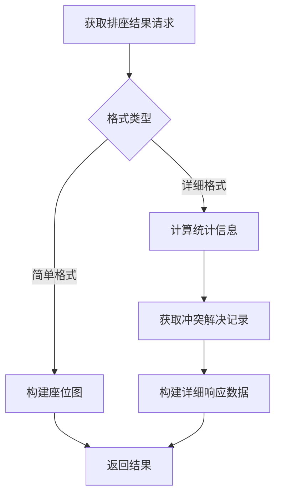
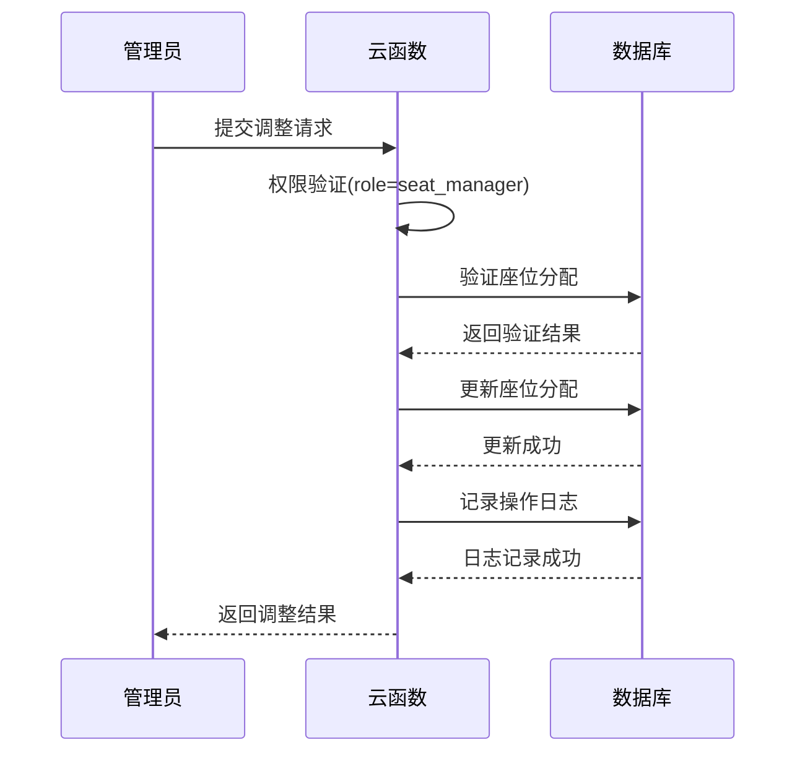
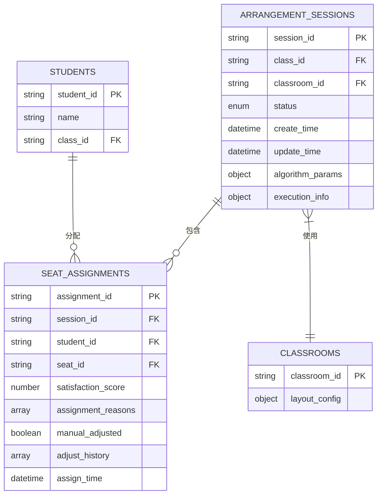
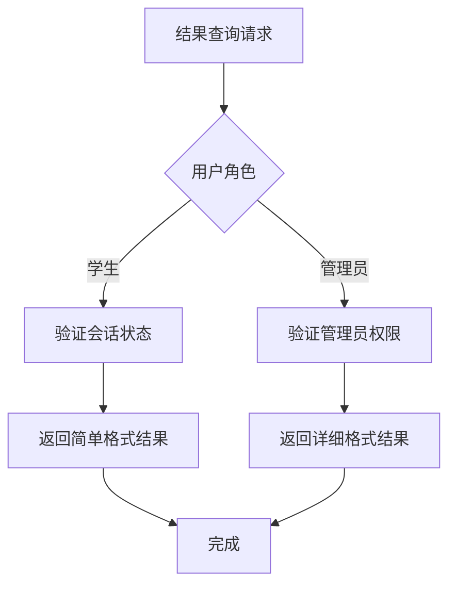
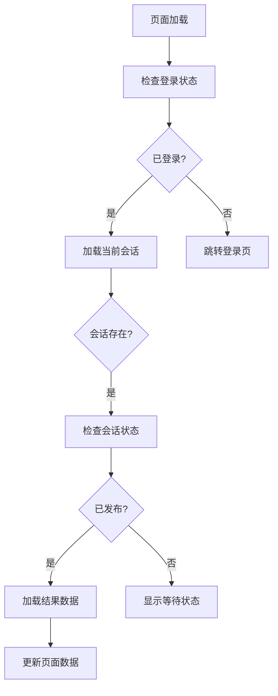
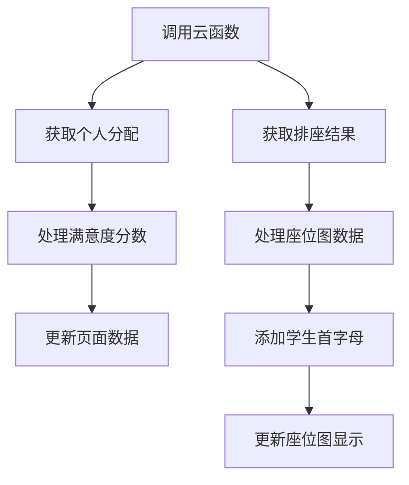

# 结果管理模块设计

<cite>
**本文档引用文件**  
- [result.js](file://cloudfunctions/seatArrangementFunctions/modules/result.js)
- [result.js](file://miniprogram/pages/result/result.js)
- [index.js](file://cloudfunctions/seatArrangementFunctions/index.js)
- [session.js](file://cloudfunctions/seatArrangementFunctions/modules/session.js)
</cite>

## 目录
1. [简介](#简介)
2. [核心功能实现](#核心功能实现)
3. [数据结构设计](#数据结构设计)
4. [结果发布流程](#结果发布流程)
5. [前端展示逻辑](#前端展示逻辑)
6. [结果一致性维护策略](#结果一致性维护策略)
7. [典型问题排查路径](#典型问题排查路径)

## 简介
结果管理模块是排座系统的核心组成部分，负责生成、查询和管理座位分配结果。该模块通过`result.js`云函数实现，支持学生查询个人座位、获取班级整体排座表以及管理员手动调整座位等操作。系统通过严格的权限校验、数据锁定和通知机制确保结果发布的准确性和一致性。

## 核心功能实现

### 个人座位查询
`getMyAssignment`函数实现个人座位查询功能，通过会话ID和学生ID验证后，从`seat_assignments`集合中获取座位分配信息，并结合教室布局返回详细的座位信息和邻座情况。

**功能流程：**
1. 验证会话状态是否为"completed"或"published"
2. 查询学生的座位分配记录
3. 获取教室布局信息并解析具体座位位置
4. 查询邻座信息并构建响应数据

**Section sources**
- [result.js](file://cloudfunctions/seatArrangementFunctions/modules/result.js#L5-L76)

### 班级排座表获取
`getArrangementResult`函数提供班级整体排座表的获取功能，支持简单格式和详细格式两种输出模式。管理员可查看详细统计信息，普通学生仅能查看简单布局。

**Diagram sources**
- [result.js](file://cloudfunctions/seatArrangementFunctions/modules/result.js#L81-L164)

### 手动调整座位
`manualAdjustSeat`函数支持管理员手动调整座位，包含权限验证、调整有效性检查、座位更新和操作日志记录等完整流程。

**Diagram sources**
- [result.js](file://cloudfunctions/seatArrangementFunctions/modules/result.js#L325-L416)

## 数据结构设计

### 座位分配数据结构
座位分配结果存储在`seat_assignments`集合中，包含学生信息、座位ID、满意度评分和分配原因等关键字段。

**数据结构：**
- assignment_id: 分配记录ID
- session_id: 会话ID
- student_id: 学生ID
- seat_id: 座位ID
- satisfaction_score: 满意度评分(0-1)
- assignment_reasons: 分配原因列表
- manual_adjusted: 是否手动调整
- adjust_history: 调整历史记录
- assign_time: 分配时间

**Section sources**
- [result.js](file://cloudfunctions/seatArrangementFunctions/modules/result.js#L5-L455)

### 会话关联设计
结果数据通过`session_id`与排座会话建立关联，确保每次排座的结果独立且可追溯。会话信息包含教室ID、状态、执行信息等元数据。

**Diagram sources**
- [result.js](file://cloudfunctions/seatArrangementFunctions/modules/result.js#L5-L455)
- [session.js](file://cloudfunctions/seatArrangementFunctions/modules/session.js#L0-L45)

## 结果发布流程

### 权限校验机制
系统采用基于角色的访问控制(RBAC)机制，确保不同用户只能访问相应权限的数据。

**权限规则：**
- 学生：只能查询个人座位和简单排座图
- 排座管理员(seat_manager)：可查看详细结果和手动调整座位
- 系统管理员(admin)：拥有全部权限

**Section sources**
- [result.js](file://cloudfunctions/seatArrangementFunctions/modules/result.js#L81-L164)
- [result.js](file://cloudfunctions/seatArrangementFunctions/modules/result.js#L325-L416)

### 数据锁定与通知
结果发布后，系统通过状态锁定防止重复生成，同时通过前端页面状态更新通知用户。

**流程特点：**
1. 会话状态设置为"published"后锁定
2. 前端通过`getCurrentSession`获取最新会话状态
3. 状态变更时触发结果加载
4. 操作日志记录所有关键变更

**Section sources**
- [result.js](file://cloudfunctions/seatArrangementFunctions/modules/result.js#L5-L455)
- [session.js](file://cloudfunctions/seatArrangementFunctions/modules/session.js#L0-L45)

## 前端展示逻辑

### 页面生命周期管理
`result.js`页面通过`onLoad`和`onShow`生命周期方法管理结果展示流程。

**Section sources**
- [result.js](file://miniprogram/pages/result/result.js#L0-L205)

### 数据加载与展示
页面通过云函数调用获取数据，并将原始数据转换为适合展示的格式。

**关键处理：**
- 将满意度分数转换为百分比显示
- 从座位图中提取学生姓名首字母用于可视化
- 根据分数等级显示不同的满意度描述
- 支持下拉刷新获取最新数据

**Section sources**
- [result.js](file://miniprogram/pages/result/result.js#L0-L205)

## 结果一致性维护策略

### 防止重复生成
系统通过会话状态机和权限控制防止结果被重复生成或修改。

**状态约束：**
- 只有"completed"和"published"状态的会话才能查询结果
- 手动调整仅允许在结果发布后进行
- 每个会话的排座结果唯一且不可逆

### 算法输出稳定性
通过固定随机种子、确定性算法和输入数据校验确保算法输出的稳定性。

**保障措施：**
- 使用相同的输入数据和参数生成相同的结果
- 记录算法执行参数和环境信息
- 对关键计算过程进行单元测试
- 实现结果校验机制

**Section sources**
- [result.js](file://cloudfunctions/seatArrangementFunctions/modules/result.js#L5-L455)

## 典型问题排查路径

### 常见问题及解决方案
| 问题现象 | 可能原因 | 排查路径 |
|---------|--------|---------|
| 无法获取座位 | 会话未完成 | 检查会话状态是否为"published" |
| 座位信息缺失 | 数据关联错误 | 验证session_id和student_id的正确性 |
| 满意度分数异常 | 算法计算错误 | 检查assignment_reasons中的原因记录 |
| 手动调整失败 | 权限不足 | 确认用户角色为"seat_manager" |
| 座位图显示异常 | 布局配置错误 | 检查classroom的layout_config |

**Section sources**
- [result.js](file://cloudfunctions/seatArrangementFunctions/modules/result.js#L5-L455)
- [result.js](file://miniprogram/pages/result/result.js#L0-L205)