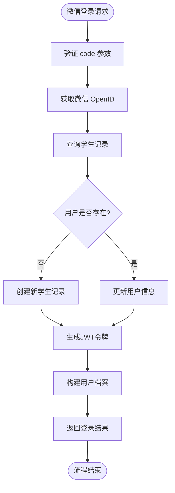

# 认证模块设计

<cite>
**本文档中引用的文件**   
- [auth.js](file://cloudfunctions/seatArrangementFunctions/modules/auth.js)
- [index.js](file://cloudfunctions/seatArrangementFunctions/index.js)
- [session.js](file://cloudfunctions/seatArrangementFunctions/modules/session.js)
- [student.js](file://cloudfunctions/seatArrangementFunctions/modules/student.js)
- [permission.js](file://cloudfunctions/seatArrangementFunctions/modules/permission.js)
- [admin.js](file://cloudfunctions/seatArrangementFunctions/modules/admin.js)
</cite>

## 目录
1. [项目结构](#项目结构)
2. [核心组件](#核心组件)
3. [架构概述](#架构概述)
4. [详细组件分析](#详细组件分析)
5. [依赖分析](#依赖分析)
6. [性能考虑](#性能考虑)
7. [故障排除指南](#故障排除指南)
8. [结论](#结论)

## 项目结构

本项目采用云函数架构，主要分为前端小程序和后端云函数两大部分。认证模块位于 `cloudfunctions/seatArrangementFunctions/modules/auth.js`，是整个系统权限控制的核心。该模块与其他模块通过依赖注入方式解耦，实现了高内聚低耦合的设计。

**图示来源**
- [auth.js](file://cloudfunctions/seatArrangementFunctions/modules/auth.js)
- [index.js](file://cloudfunctions/seatArrangementFunctions/index.js)

**本节来源**
- [auth.js](file://cloudfunctions/seatArrangementFunctions/modules/auth.js)
- [index.js](file://cloudfunctions/seatArrangementFunctions/index.js)

## 核心组件

`auth.js` 模块实现了三大核心功能：微信登录、管理员登录和令牌刷新。微信登录通过微信上下文获取用户 openid，实现免密登录；管理员登录采用用户名密码验证机制；令牌刷新功能支持无感续期，提升用户体验。所有认证操作均通过 JWT 令牌进行状态管理，确保了系统的无状态性和可扩展性。

**本节来源**
- [auth.js](file://cloudfunctions/seatArrangementFunctions/modules/auth.js#L5-L249)

## 架构概述

系统采用基于 JWT 的认证授权体系，`auth.js` 模块作为认证中心，与其他业务模块协同工作。当用户发起请求时，云函数入口 `index.js` 首先进行路由分发，对非公开接口进行令牌验证。认证通过后，将用户信息传递给相应业务模块，由 `permission.js` 进行细粒度权限控制。

**图示来源**
- [index.js](file://cloudfunctions/seatArrangementFunctions/index.js#L155-L204)
- [auth.js](file://cloudfunctions/seatArrangementFunctions/modules/auth.js#L5-L249)
- [permission.js](file://cloudfunctions/seatArrangementFunctions/modules/permission.js#L9-L34)

## 详细组件分析

### 微信登录分析

微信登录流程实现了用户身份的自动绑定和信息同步。新用户首次登录时，系统会自动创建学生记录；已存在用户则更新其微信信息。该设计简化了用户操作，提升了注册转化率。

**图示来源**
- [auth.js](file://cloudfunctions/seatArrangementFunctions/modules/auth.js#L5-L118)

**本节来源**
- [auth.js](file://cloudfunctions/seatArrangementFunctions/modules/auth.js#L5-L118)
- [index.js](file://cloudfunctions/seatArrangementFunctions/index.js#L155-L204)

### 管理员登录分析

管理员登录采用传统用户名密码验证机制，支持多种管理员角色。登录成功后生成具有时效性的 JWT 令牌，并记录登录日志，便于审计追踪。系统还实现了密码明文存储的警告，提示开发者在生产环境使用加密存储。

**图示来源**
- [auth.js](file://cloudfunctions/seatArrangementFunctions/modules/auth.js#L123-L212)

**本节来源**
- [auth.js](file://cloudfunctions/seatArrangementFunctions/modules/auth.js#L123-L212)
- [admin.js](file://cloudfunctions/seatArrangementFunctions/modules/admin.js#L3-L61)

### 令牌刷新分析

令牌刷新机制实现了访问令牌的无感续期，提升用户体验。通过验证刷新令牌的有效性，为用户生成新的短期访问令牌，既保证了安全性，又避免了频繁重新登录。

**图示来源**
- [auth.js](file://cloudfunctions/seatArrangementFunctions/modules/auth.js#L217-L243)

**本节来源**
- [auth.js](file://cloudfunctions/seatArrangementFunctions/modules/auth.js#L217-L243)
- [index.js](file://cloudfunctions/seatArrangementFunctions/index.js#L155-L204)

## 依赖分析

`auth.js` 模块通过依赖注入方式与系统其他组件交互，实现了良好的解耦。其主要依赖包括数据库操作、JWT 令牌生成与验证、响应格式化等基础服务。同时，该模块与 `session.js`、`student.js` 等业务模块协同工作，构成了完整的权限控制体系。

**图示来源**
- [auth.js](file://cloudfunctions/seatArrangementFunctions/modules/auth.js)
- [index.js](file://cloudfunctions/seatArrangementFunctions/index.js)
- [permission.js](file://cloudfunctions/seatArrangementFunctions/modules/permission.js)

**本节来源**
- [auth.js](file://cloudfunctions/seatArrangementFunctions/modules/auth.js)
- [index.js](file://cloudfunctions/seatArrangementFunctions/index.js)
- [permission.js](file://cloudfunctions/seatArrangementFunctions/modules/permission.js)

## 性能考虑

认证模块在设计时充分考虑了性能因素。JWT 令牌验证采用同步方式，避免了异步开销；数据库查询均使用索引字段（如 openid、username）；响应格式统一化减少了序列化开销。对于高并发场景，建议将 JWT 密钥存储在环境变量中，并考虑引入缓存机制优化数据库查询。

## 故障排除指南

### 登录失败问题

当用户登录失败时，可能的原因包括：
- 微信授权码缺失或无效
- 管理员用户名或密码错误
- 数据库连接异常
- JWT 密钥不匹配

解决方案：
1. 检查前端是否正确传递了 `code` 参数
2. 确认管理员账户状态是否为激活状态
3. 验证云数据库是否正常运行
4. 确保所有云函数使用相同的 JWT 密钥

**本节来源**
- [auth.js](file://cloudfunctions/seatArrangementFunctions/modules/auth.js#L5-L249)
- [index.js](file://cloudfunctions/seatArrangementFunctions/index.js#L155-L204)

### 令牌失效问题

令牌失效的常见原因：
- 令牌过期（学生7天，管理员8小时）
- 令牌被篡改
- JWT 密钥变更

解决方案：
1. 实现令牌刷新机制，使用 `refreshToken` 接口
2. 确保生产环境使用安全的密钥管理
3. 检查客户端时间是否与服务器同步

**本节来源**
- [auth.js](file://cloudfunctions/seatArrangementFunctions/modules/auth.js#L217-L243)
- [index.js](file://cloudfunctions/seatArrangementFunctions/index.js#L25-L36)

## 结论

`auth.js` 模块作为系统的核心认证组件，实现了安全可靠的用户身份验证机制。通过 JWT 令牌管理用户会话，结合细粒度的权限控制，构建了完整的权限体系。模块设计遵循高内聚低耦合原则，通过依赖注入方式与其他组件解耦，便于维护和扩展。建议在生产环境中加强密码加密存储，定期轮换 JWT 密钥，以进一步提升系统安全性。