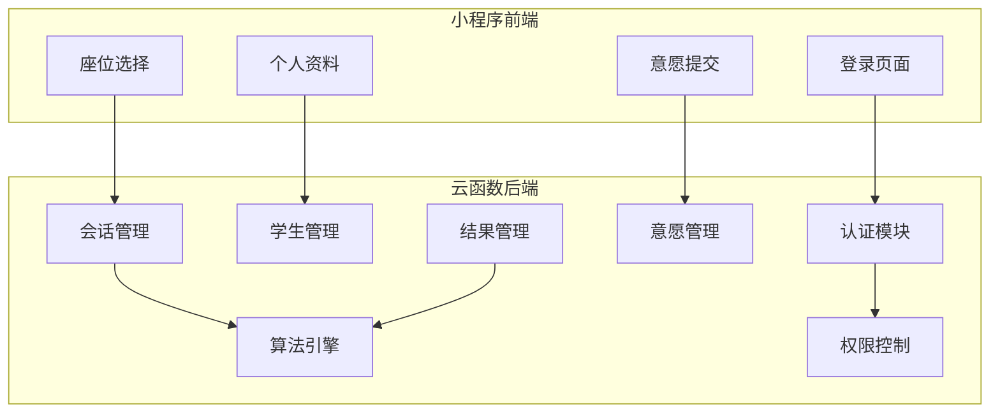
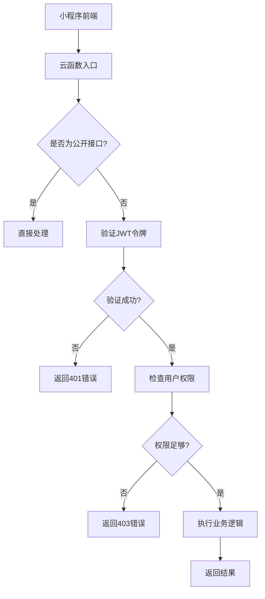
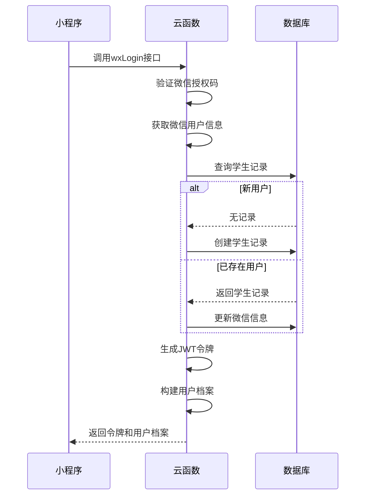
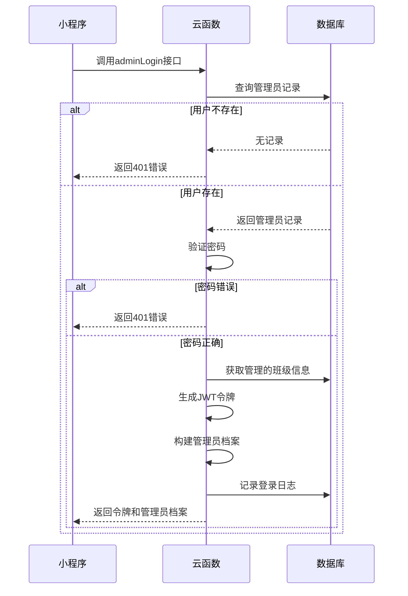
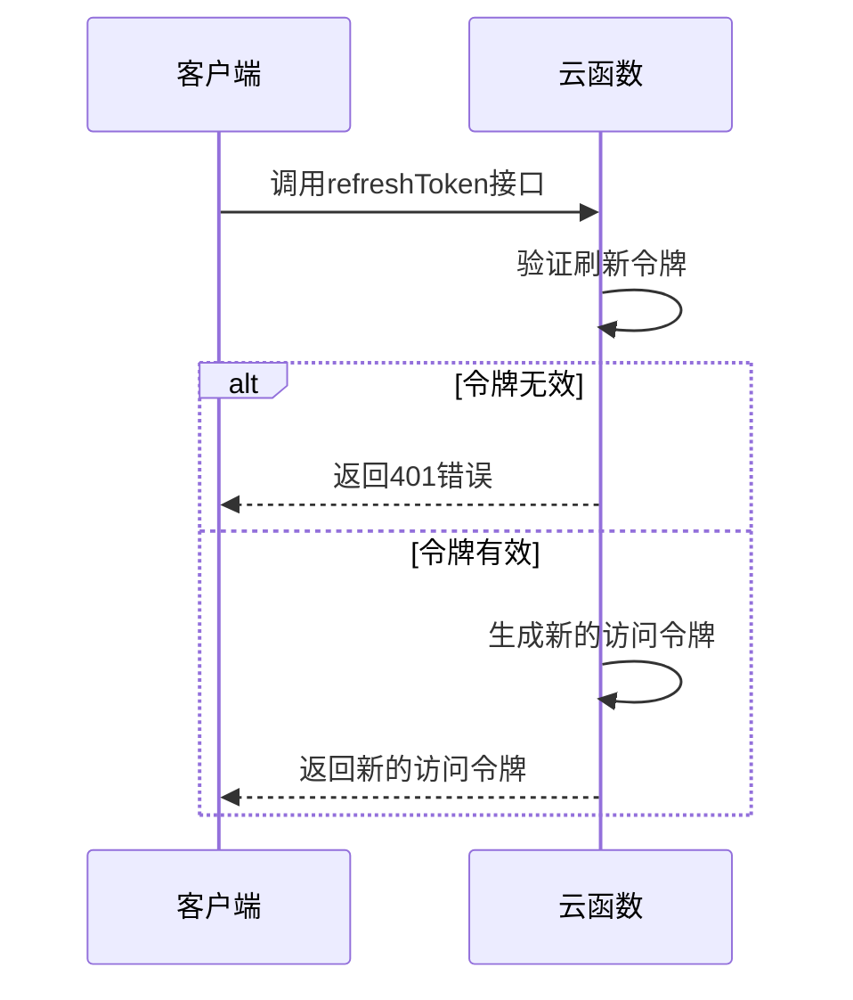
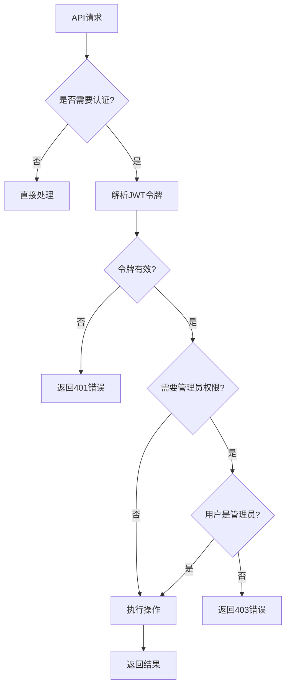
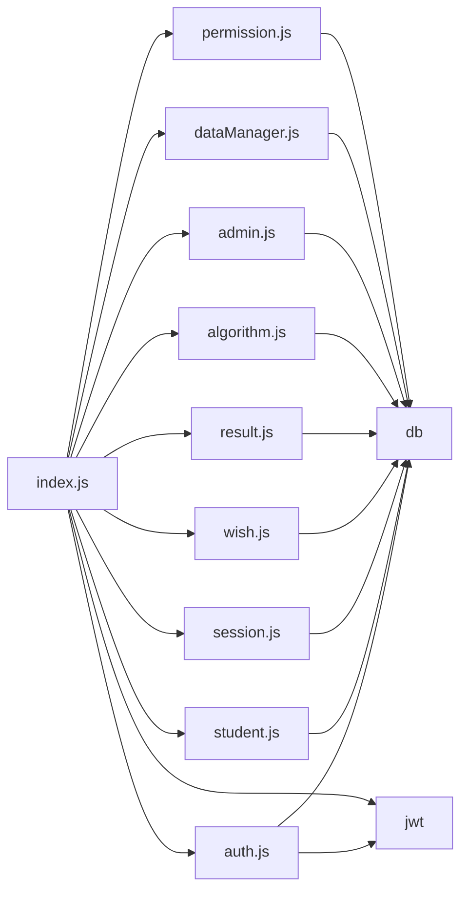

# 认证与权限机制

<cite>
**本文档引用的文件**  
- [auth.js](file://cloudfunctions/seatArrangementFunctions/modules/auth.js)
- [index.js](file://cloudfunctions/seatArrangementFunctions/index.js)
- [login.js](file://miniprogram/pages/login/login.js)
- [permission.js](file://cloudfunctions/seatArrangementFunctions/modules/permission.js)
- [dataManager.js](file://cloudfunctions/seatArrangementFunctions/modules/dataManager.js)
- [admin.js](file://cloudfunctions/seatArrangementFunctions/modules/admin.js)
- [student.js](file://cloudfunctions/seatArrangementFunctions/modules/student.js)
</cite>

## 目录
1. [简介](#简介)
2. [项目结构](#项目结构)
3. [核心组件](#核心组件)
4. [架构概览](#架构概览)
5. [详细组件分析](#详细组件分析)
6. [依赖分析](#依赖分析)
7. [性能考虑](#性能考虑)
8. [故障排除指南](#故障排除指南)
9. [结论](#结论)

## 简介
本系统实现了基于JWT的微信登录和管理员登录双重认证机制，支持学生与管理员两种角色的权限控制。系统通过云函数处理认证请求，使用JSON Web Token（JWT）进行会话管理，确保安全性和可扩展性。微信登录利用微信开放能力获取用户身份，管理员登录则通过用户名密码验证。系统采用模块化设计，将认证、权限、数据管理等功能分离，便于维护和扩展。

## 项目结构
系统由小程序前端和云函数后端组成。前端包含登录、个人资料、座位选择等页面，后端云函数分为多个模块，包括认证、学生管理、会话管理、意愿管理、结果管理、算法引擎和权限控制等。这种分层架构使得各功能模块职责清晰，便于团队协作开发。

**图示来源**  
- [auth.js](file://cloudfunctions/seatArrangementFunctions/modules/auth.js)
- [login.js](file://miniprogram/pages/login/login.js)

**本节来源**  
- [auth.js](file://cloudfunctions/seatArrangementFunctions/modules/auth.js)
- [login.js](file://miniprogram/pages/login/login.js)

## 核心组件
系统的核心认证组件包括微信登录、管理员登录和令牌刷新功能。微信登录通过`wxLogin`函数实现，管理员登录通过`adminLogin`函数实现，令牌刷新通过`refreshToken`函数实现。这些函数都位于`auth.js`模块中，通过统一的响应格式返回结果。系统使用JWT进行会话管理，不同角色的用户获得不同有效期的令牌，学生令牌有效期为7天，管理员令牌有效期为8小时。

**本节来源**  
- [auth.js](file://cloudfunctions/seatArrangementFunctions/modules/auth.js)
- [index.js](file://cloudfunctions/seatArrangementFunctions/index.js)

## 架构概览
系统的认证架构采用分层设计，前端页面通过云函数调用与后端交互，云函数内部通过依赖注入方式调用各个模块。认证流程包括微信授权、用户信息获取、数据库查询、JWT令牌生成等步骤。权限控制通过中间件实现，对需要认证的接口进行令牌验证和角色检查。这种架构设计使得认证逻辑与业务逻辑分离，提高了代码的可维护性和安全性。

**图示来源**  
- [index.js](file://cloudfunctions/seatArrangementFunctions/index.js)
- [auth.js](file://cloudfunctions/seatArrangementFunctions/modules/auth.js)

## 详细组件分析

### 微信登录分析
微信登录功能通过`wxLogin`函数实现，该函数首先验证微信授权码，然后获取微信用户信息，接着在数据库中查找或创建学生记录，最后生成JWT令牌并返回用户档案。对于新用户，系统会自动创建学生记录并初始化相关信息；对于已存在用户，系统会更新其微信信息。生成的JWT令牌包含学生ID、OpenID、角色和班级ID等信息，有效期为7天。

**图示来源**  
- [auth.js](file://cloudfunctions/seatArrangementFunctions/modules/auth.js#L5-L118)
- [login.js](file://miniprogram/pages/login/login.js#L50-L90)

**本节来源**  
- [auth.js](file://cloudfunctions/seatArrangementFunctions/modules/auth.js#L5-L118)
- [login.js](file://miniprogram/pages/login/login.js#L50-L90)

### 管理员登录分析
管理员登录功能通过`adminLogin`函数实现，该函数首先验证用户名和密码，然后在数据库中查找管理员记录，接着生成JWT令牌并构建管理员档案。与微信登录不同，管理员登录需要验证密码，系统目前采用明文密码比较，实际项目中应使用加密存储。生成的JWT令牌包含管理员ID、用户名、角色和管理的班级ID等信息，有效期为8小时。登录成功后，系统会记录登录日志，便于审计和监控。

**图示来源**  
- [auth.js](file://cloudfunctions/seatArrangementFunctions/modules/auth.js#L123-L207)
- [admin.js](file://cloudfunctions/seatArrangementFunctions/modules/admin.js#L3-L61)

**本节来源**  
- [auth.js](file://cloudfunctions/seatArrangementFunctions/modules/auth.js#L123-L207)
- [admin.js](file://cloudfunctions/seatArrangementFunctions/modules/admin.js#L3-L61)

### 令牌刷新分析
令牌刷新功能通过`refreshToken`函数实现，该函数用于在访问令牌过期后获取新的访问令牌，而无需用户重新登录。客户端在访问令牌即将过期时，使用刷新令牌调用此接口。系统验证刷新令牌的有效性后，生成一个新的访问令牌返回给客户端。这种方式提高了用户体验，同时保持了较高的安全性。刷新令牌本身也有有效期，需要定期重新登录获取新的刷新令牌。

**图示来源**  
- [auth.js](file://cloudfunctions/seatArrangementFunctions/modules/auth.js#L212-L238)
- [index.js](file://cloudfunctions/seatArrangementFunctions/index.js#L25-L36)

**本节来源**  
- [auth.js](file://cloudfunctions/seatArrangementFunctions/modules/auth.js#L212-L238)
- [index.js](file://cloudfunctions/seatArrangementFunctions/index.js#L25-L36)

### 权限控制分析
系统的权限控制通过`permission.js`模块实现，采用中间件模式对不同接口进行权限检查。系统定义了`requireAdmin`、`allowRead`和`requireAdminWrite`等装饰器函数，用于标记需要特定权限的接口。读取操作通常对所有认证用户开放，写入操作仅限管理员。权限检查基于JWT令牌中的角色信息，支持学生、管理员和排座负责人等不同角色。这种设计使得权限控制逻辑集中且易于维护。

**图示来源**  
- [permission.js](file://cloudfunctions/seatArrangementFunctions/modules/permission.js)
- [dataManager.js](file://cloudfunctions/seatArrangementFunctions/modules/dataManager.js)

**本节来源**  
- [permission.js](file://cloudfunctions/seatArrangementFunctions/modules/permission.js)
- [dataManager.js](file://cloudfunctions/seatArrangementFunctions/modules/dataManager.js)

## 依赖分析
系统各模块之间存在明确的依赖关系。`index.js`作为云函数入口，依赖所有功能模块；`auth.js`依赖数据库操作、JWT生成和验证等功能；`permission.js`被所有需要权限控制的模块依赖。这种依赖关系通过依赖注入方式在`index.js`中管理，确保了模块间的松耦合。数据库作为核心依赖，被几乎所有模块直接或间接使用。

**图示来源**  
- [index.js](file://cloudfunctions/seatArrangementFunctions/index.js)
- [auth.js](file://cloudfunctions/seatArrangementFunctions/modules/auth.js)

**本节来源**  
- [index.js](file://cloudfunctions/seatArrangementFunctions/index.js)
- [auth.js](file://cloudfunctions/seatArrangementFunctions/modules/auth.js)

## 性能考虑
系统在性能方面做了多项优化。首先，使用JWT进行会话管理，避免了服务器端会话存储的开销；其次，数据库查询使用索引和限制返回字段，提高了查询效率；再次，批量操作采用Promise.all并发执行，减少了网络延迟；最后，敏感操作如密码验证和权限检查都集中在服务端，确保了安全性和一致性。对于高并发场景，可以进一步引入缓存机制，如Redis，来减轻数据库压力。

## 故障排除指南
常见问题包括登录失败、权限不足和接口调用错误等。登录失败可能由于微信授权码无效、用户名密码错误或网络问题导致；权限不足通常是由于JWT令牌过期或用户角色不符合要求；接口调用错误可能是参数缺失或格式不正确。排查时应首先检查日志输出，确认错误类型和位置，然后根据错误信息逐步验证输入参数、认证状态和权限配置。对于复杂问题，可以使用调试工具逐步执行代码，定位问题根源。

**本节来源**  
- [auth.js](file://cloudfunctions/seatArrangementFunctions/modules/auth.js)
- [index.js](file://cloudfunctions/seatArrangementFunctions/index.js)
- [permission.js](file://cloudfunctions/seatArrangementFunctions/modules/permission.js)

## 结论
本系统实现了完整的认证与权限机制，支持微信登录和管理员登录两种方式，使用JWT进行会话管理，通过中间件实现细粒度的权限控制。系统架构清晰，模块职责明确，代码可维护性强。未来可以进一步优化，如引入密码加密存储、增加多因素认证、实现更复杂的权限模型等，以满足更高安全要求的应用场景。