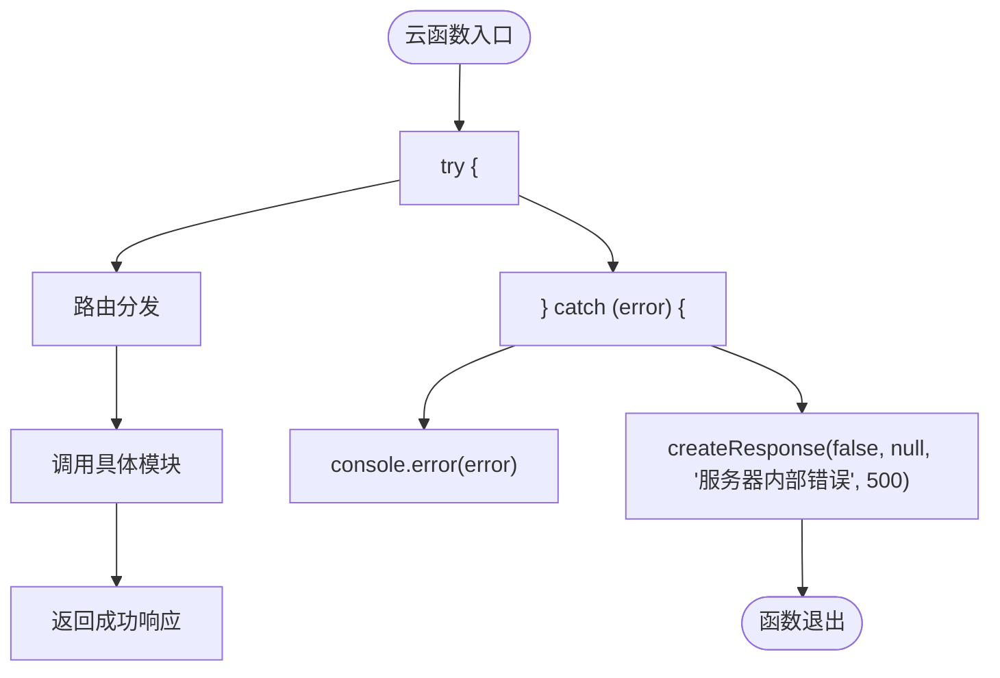
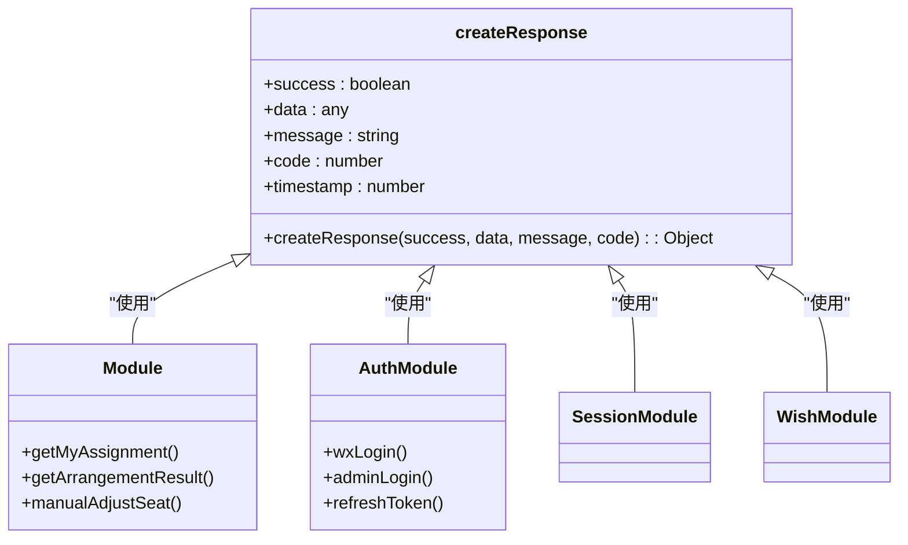
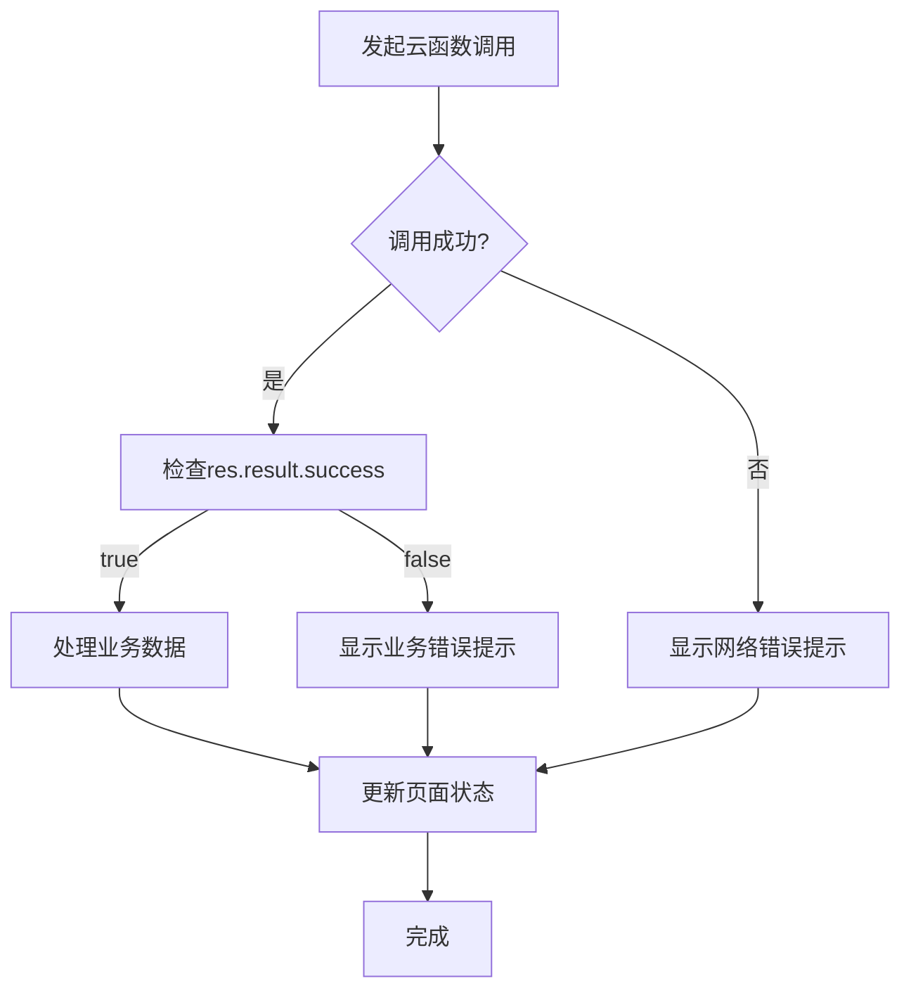

# 错误处理与日志监控

<cite>
**本文档引用的文件**  
- [result.js](file://cloudfunctions/seatArrangementFunctions/modules/result.js)
- [index.js](file://cloudfunctions/seatArrangementFunctions/index.js)
- [auth.js](file://cloudfunctions/seatArrangementFunctions/modules/auth.js)
- [session.js](file://cloudfunctions/seatArrangementFunctions/modules/session.js)
- [wish.js](file://cloudfunctions/seatArrangementFunctions/modules/wish.js)
- [student.js](file://cloudfunctions/seatArrangementFunctions/modules/student.js)
- [algorithm.js](file://cloudfunctions/seatArrangementFunctions/modules/algorithm.js)
- [admin.js](file://cloudfunctions/seatArrangementFunctions/modules/admin.js)
- [dataManager.js](file://cloudfunctions/seatArrangementFunctions/modules/dataManager.js)
- [permission.js](file://cloudfunctions/seatArrangementFunctions/modules/permission.js)
- [result.js](file://miniprogram/pages/result/result.js)
- [seat-selection.js](file://miniprogram/pages/seat-selection/seat-selection.js)
- [login.js](file://miniprogram/pages/login/login.js)
- [app.js](file://miniprogram/app.js)
</cite>

## 目录
1. [引言](#引言)
2. [云函数中的异步异常捕获机制](#云函数中的异步异常捕获机制)
3. [统一响应格式封装：result.js模块](#统一响应格式封装resultjs模块)
4. [结构化错误响应与详细上下文日志](#结构化错误响应与详细上下文日志)
5. [前端对结果的一致性处理](#前端对结果的一致性处理)
6. [云开发控制台的日志查看与错误追踪](#云开发控制台的日志查看与错误追踪)
7. [性能分析与调用监控](#性能分析与调用监控)
8. [常见错误码定义及解决方案](#常见错误码定义及解决方案)
9. [告警机制建议](#告警机制建议)
10. [总结](#总结)

## 引言
本系统为座位安排小程序，包含学生端和管理端功能。系统通过微信云开发实现，采用云函数处理核心业务逻辑。本文档详细说明系统的错误处理机制和日志监控方案，涵盖从云函数异常捕获、统一响应格式到前端处理、日志追踪和告警设置的完整链路。

## 云函数中的异步异常捕获机制
系统在云函数入口处使用 `try-catch` 捕获所有未处理的异步异常，确保任何未被捕获的错误不会导致函数崩溃，而是以统一格式返回错误信息。

在 `index.js` 文件中，主函数 `main` 包裹了整个请求处理流程：



**图示来源**  
- [index.js](file://cloudfunctions/seatArrangementFunctions/index.js#L150-L305)

**本节来源**  
- [index.js](file://cloudfunctions/seatArrangementFunctions/index.js#L150-L305)

## 统一响应格式封装：result.js模块
`result.js` 模块通过 `createResponse` 函数封装了统一的响应格式，确保所有接口返回的数据结构一致。

`createResponse` 函数定义在 `index.js` 中，被所有模块共享使用：

```javascript
const createResponse = (success, data = null, message = '', code = 200) => {
  return {
    success,
    code,
    message,
    data,
    timestamp: Date.now()
  };
};
```

所有业务模块（如 `result.js`, `auth.js`, `session.js` 等）在成功或失败时都调用此函数生成响应。



**图示来源**  
- [index.js](file://cloudfunctions/seatArrangementFunctions/index.js#L100-L110)
- [result.js](file://cloudfunctions/seatArrangementFunctions/modules/result.js)
- [auth.js](file://cloudfunctions/seatArrangementFunctions/modules/auth.js)
- [session.js](file://cloudfunctions/seatArrangementFunctions/modules/session.js)
- [wish.js](file://cloudfunctions/seatArrangementFunctions/modules/wish.js)

**本节来源**  
- [index.js](file://cloudfunctions/seatArrangementFunctions/index.js#L100-L110)
- [result.js](file://cloudfunctions/seatArrangementFunctions/modules/result.js)
- [auth.js](file://cloudfunctions/seatArrangementFunctions/modules/auth.js)

## 结构化错误响应与详细上下文日志
系统在捕获异常时，会记录详细的上下文日志，并生成结构化的错误响应。

### 错误响应结构
所有错误响应都遵循统一格式：
```json
{
  "success": false,
  "code": 400,
  "message": "缺少必要参数",
  "data": null,
  "timestamp": 1700000000000
}
```

### 详细上下文日志
在每个模块的 `catch` 块中，使用 `console.error` 记录详细的错误信息，包括函数名和错误详情：

```javascript
} catch (error) {
  console.error('getMyAssignment error:', error);
  return createResponse(false, null, '获取座位分配失败: ' + error.message, 500);
}
```

这种模式在所有模块中保持一致，便于追踪错误来源。

```mermaid
sequenceDiagram
participant Client as "客户端"
participant CloudFunc as "云函数"
participant DB as "数据库"
Client->>CloudFunc : 发起请求
CloudFunc->>CloudFunc : 参数验证
alt 参数无效
CloudFunc-->>Client : 400 错误响应
else 有效
CloudFunc->>DB : 数据库操作
DB-->>CloudFunc : 返回数据
CloudFunc->>CloudFunc : 处理数据
CloudFunc-->>Client : 200 成功响应
end
exception CloudFunc
CloudFunc->>CloudFunc : 捕获异常
CloudFunc->>CloudFunc : console.error记录
CloudFunc-->>Client : 500 错误响应
end
```

**图示来源**  
- [result.js](file://cloudfunctions/seatArrangementFunctions/modules/result.js#L15-L455)
- [auth.js](file://cloudfunctions/seatArrangementFunctions/modules/auth.js#L15-L244)
- [session.js](file://cloudfunctions/seatArrangementFunctions/modules/session.js#L15-L415)

**本节来源**  
- [result.js](file://cloudfunctions/seatArrangementFunctions/modules/result.js#L15-L455)
- [auth.js](file://cloudfunctions/seatArrangementFunctions/modules/auth.js#L15-L244)

## 前端对结果的一致性处理
前端页面通过统一的云函数调用方式处理结果，确保对成功和失败情况的一致性处理。

以 `result.js` 页面为例，所有云函数调用都包含 `success` 和 `fail` 回调：

```javascript
wx.cloud.callFunction({
  name: 'seatArrangementFunctions',
  data: {
    type: 'getMyAssignment',
    token: wx.getStorageSync('token'),
    session_id: that.data.currentSession.session_id
  },
  success: (res) => {
    if (res.result.success && res.result.data) {
      // 处理成功响应
      that.setData({
        myAssignment: res.result.data,
        satisfactionScore: (score * 100).toFixed(0),
        hasResult: true,
        loading: false
      });
    } else {
      // 处理业务逻辑错误
      that.setData({ 
        loading: false,
        hasResult: false 
      });
    }
  },
  fail: (err) => {
    // 处理网络或系统错误
    that.setData({ loading: false });
    wx.showToast({
      title: '加载结果失败',
      icon: 'none'
    });
  }
});
```



**图示来源**  
- [result.js](file://miniprogram/pages/result/result.js#L70-L120)
- [seat-selection.js](file://miniprogram/pages/seat-selection/seat-selection.js#L100-L150)
- [login.js](file://miniprogram/pages/login/login.js#L80-L130)

**本节来源**  
- [result.js](file://miniprogram/pages/result/result.js#L70-L120)
- [seat-selection.js](file://miniprogram/pages/seat-selection/seat-selection.js#L100-L150)

## 云开发控制台的日志查看与错误追踪
开发者可通过微信云开发控制台查看详细的日志信息，进行错误追踪。

### 日志查看步骤
1. 登录微信云开发控制台
2. 进入"云函数"管理页面
3. 选择具体函数（如 `seatArrangementFunctions`）
4. 查看"调用日志"标签页
5. 根据时间、请求ID等条件筛选日志

### 错误追踪方法
- 通过 `console.log` 和 `console.error` 输出的结构化日志
- 每个请求的完整上下文信息（event, context）
- 错误堆栈信息（在 `catch` 块中输出）

系统在关键操作点都添加了日志输出，如：
```javascript
console.log('Cloud function called with event:', JSON.stringify(event, null, 2));
console.log('开始执行排座算法...');
console.log('初始化完成: 已分配${this.currentAssignment.size}名学生');
```

**本节来源**  
- [index.js](file://cloudfunctions/seatArrangementFunctions/index.js#L155)
- [algorithm.js](file://cloudfunctions/seatArrangementFunctions/modules/algorithm.js#L150)
- [session.js](file://cloudfunctions/seatArrangementFunctions/modules/session.js#L15)

## 性能分析与调用监控
云开发控制台提供性能分析和调用监控功能，帮助开发者优化系统性能。

### 性能指标
- 函数执行时间
- 内存使用情况
- 调用次数统计
- 错误率

### 监控建议
1. 设置性能基线，监控异常波动
2. 分析慢调用，优化数据库查询
3. 监控高频调用接口，评估是否需要缓存
4. 跟踪错误率变化，及时发现潜在问题

系统在算法执行等耗时操作中记录执行时间：
```javascript
const startTime = Date.now();
// ... 执行操作
const executionTime = (endTime - startTime) / 1000;
```

**本节来源**  
- [algorithm.js](file://cloudfunctions/seatArrangementFunctions/modules/algorithm.js#L150-L200)
- [index.js](file://cloudfunctions/seatArrangementFunctions/index.js)

## 常见错误码定义及解决方案
系统定义了标准化的HTTP状态码和业务错误码，便于前端处理。

### HTTP状态码规范
| 状态码 | 含义 | 示例 |
|-------|------|------|
| 200 | 成功 | 操作成功完成 |
| 400 | 请求错误 | 缺少必要参数 |
| 401 | 未授权 | 认证令牌无效 |
| 403 | 禁止访问 | 权限不足 |
| 404 | 未找到 | 资源不存在 |
| 409 | 冲突 | 资源已存在 |
| 500 | 服务器错误 | 内部错误 |

### 常见错误及解决方案
| 错误码 | 错误信息 | 可能原因 | 解决方案 |
|-------|--------|--------|--------|
| 400 | 缺少必要参数 | 请求参数不完整 | 检查请求参数是否齐全 |
| 401 | 令牌验证失败 | token过期或无效 | 重新登录获取新token |
| 403 | 权限不足 | 用户角色无权操作 | 检查用户角色和权限 |
| 404 | 排座结果尚未生成 | 会话状态不正确 | 等待排座完成 |
| 409 | 学号已被使用 | 学生信息重复 | 修改学号重新提交 |
| 500 | 服务器内部错误 | 系统异常 | 联系管理员检查日志 |

**本节来源**  
- [index.js](file://cloudfunctions/seatArrangementFunctions/index.js)
- [result.js](file://cloudfunctions/seatArrangementFunctions/modules/result.js)
- [auth.js](file://cloudfunctions/seatArrangementFunctions/modules/auth.js)

## 告警机制建议
为确保系统稳定运行，建议设置以下告警机制：

### 告警类型
1. **错误率告警**：当500错误率超过阈值时触发
2. **性能告警**：当函数执行时间超过阈值时触发
3. **调用量告警**：当调用量异常激增时触发
4. **空结果告警**：关键接口返回空结果时触发

### 告警配置建议
- 错误率 > 1% 持续5分钟
- 平均执行时间 > 3秒
- 调用量突增超过日常均值200%
- 连续3次调用返回空结果

### 告警通知方式
- 企业微信/钉钉机器人通知
- 邮件通知
- 短信通知（重要告警）

通过设置告警机制，可以及时发现并处理系统异常，保障服务稳定性。

## 总结
本系统通过完善的错误处理机制和日志监控方案，确保了服务的稳定性和可维护性。核心要点包括：
- 使用 `try-catch` 捕获所有异步异常
- 通过 `createResponse` 统一封装响应格式
- 记录详细的上下文日志便于追踪
- 前端统一处理成功和失败响应
- 利用云开发控制台进行日志查看和性能分析
- 定义标准化的错误码体系
- 建议设置多维度的告警机制

这些机制共同构成了系统的健壮性基础，为用户提供稳定可靠的服务体验。