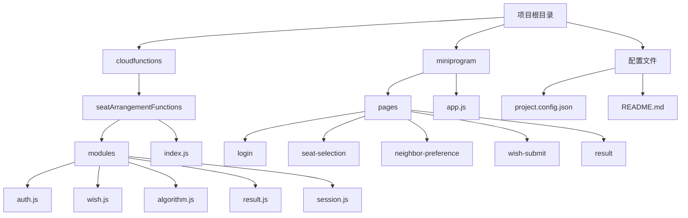
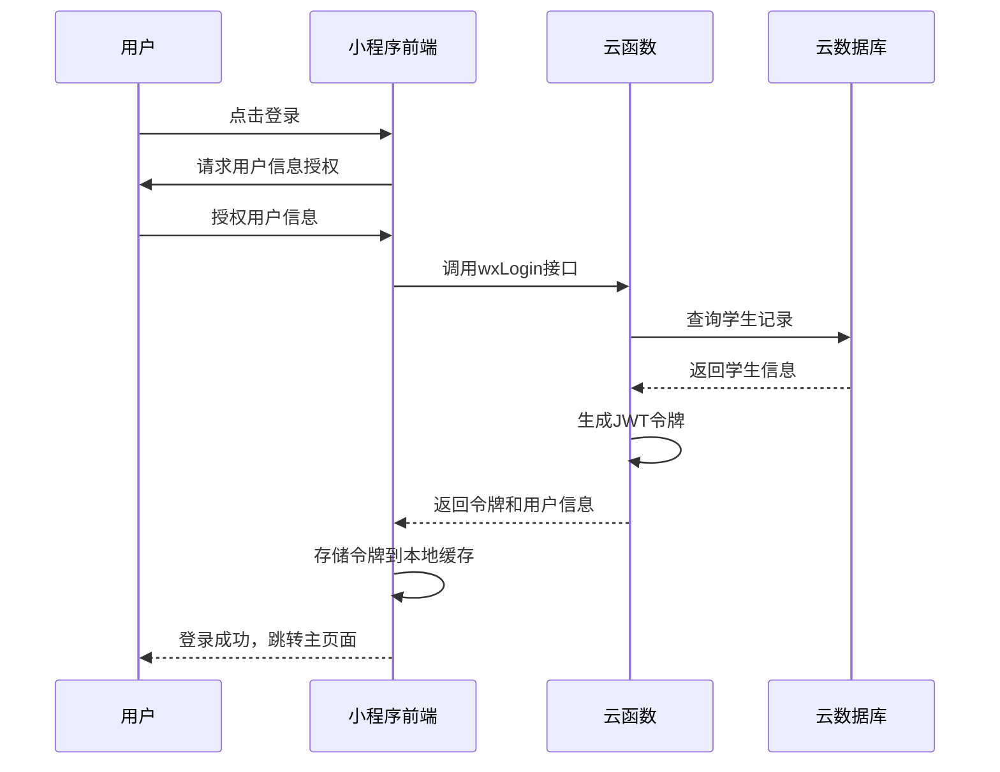
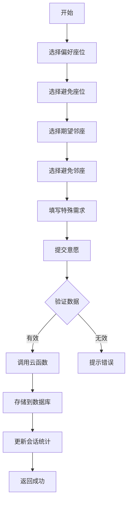
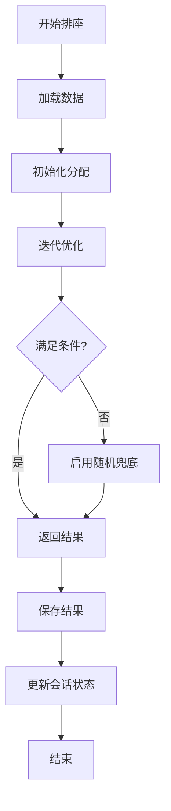

# 开发者指南

<cite>
**本文档引用文件**  
- [README.md](file://README.md)
- [project.config.json](file://project.config.json)
- [app.js](file://miniprogram/app.js)
- [login.js](file://miniprogram/pages/login/login.js)
- [seat-selection.js](file://miniprogram/pages/seat-selection/seat-selection.js)
- [neighbor-preference.js](file://miniprogram/pages/neighbor-preference/neighbor-preference.js)
- [wish-submit.js](file://miniprogram/pages/wish-submit/wish-submit.js)
- [result.js](file://miniprogram/pages/result/result.js)
- [index.js](file://cloudfunctions/seatArrangementFunctions/index.js)
- [auth.js](file://cloudfunctions/seatArrangementFunctions/modules/auth.js)
- [wish.js](file://cloudfunctions/seatArrangementFunctions/modules/wish.js)
- [algorithm.js](file://cloudfunctions/seatArrangementFunctions/modules/algorithm.js)
- [result.js](file://cloudfunctions/seatArrangementFunctions/modules/result.js)
- [session.js](file://cloudfunctions/seatArrangementFunctions/modules/session.js)
</cite>

## 目录
1. [简介](#简介)
2. [项目结构](#项目结构)
3. [环境搭建与本地运行](#环境搭建与本地运行)
4. [核心功能模块分析](#核心功能模块分析)
5. [云函数与页面开发](#云函数与页面开发)
6. [代码规范与模块化原则](#代码规范与模块化原则)
7. [功能扩展指南](#功能扩展指南)
8. [常见问题与调试技巧](#常见问题与调试技巧)
9. [结论](#结论)

## 简介
本指南旨在为新加入的开发者提供完整的入门指导，涵盖从项目克隆到功能扩展的全流程。系统基于微信小程序云开发技术栈，实现了智能排座算法与意愿收集功能。通过本指南，开发者将快速掌握项目架构、核心流程和开发规范，高效参与项目迭代。

## 项目结构
项目采用标准的小程序云开发目录结构，分为前端（miniprogram）和云函数（cloudfunctions）两大模块。前端负责用户交互与数据展示，云函数处理业务逻辑与数据库操作。



**图示来源**  
- [project.config.json](file://project.config.json#L1-L84)
- 项目结构信息

**本节来源**  
- [project.config.json](file://project.config.json#L1-L84)
- [README.md](file://README.md#L1-L12)

## 环境搭建与本地运行
### 克隆与初始化
1. 克隆项目仓库到本地
2. 使用微信开发者工具打开项目目录
3. 确保已安装Node.js环境（云函数开发需要）

### 依赖安装
云函数依赖通过npm管理，需在各云函数目录下执行：
```bash
cd cloudfunctions/seatArrangementFunctions
npm install
```

### 环境配置
1. 在 `project.config.json` 中配置正确的 `appid` 和云环境ID
2. 在 `miniprogram/app.js` 中设置云环境ID
3. 配置微信开发者工具的域名白名单

### 小程序调试器启动
1. 打开微信开发者工具
2. 选择项目目录
3. 点击"编译"按钮
4. 使用真机调试或模拟器查看效果
5. 云函数可在本地模拟运行

**本节来源**  
- [project.config.json](file://project.config.json#L1-L84)
- [app.js](file://miniprogram/app.js#L1-L20)
- [README.md](file://README.md#L1-L12)

## 核心功能模块分析
### 用户认证流程
系统采用JWT令牌进行身份验证，支持微信授权登录和管理员账号登录。



**图示来源**  
- [auth.js](file://cloudfunctions/seatArrangementFunctions/modules/auth.js#L1-L244)
- [login.js](file://miniprogram/pages/login/login.js#L1-L184)

**本节来源**  
- [auth.js](file://cloudfunctions/seatArrangementFunctions/modules/auth.js#L1-L244)
- [login.js](file://miniprogram/pages/login/login.js#L1-L184)

### 意愿收集流程
学生通过多步骤表单提交座位偏好和邻座意愿，系统进行数据验证和存储。



**图示来源**  
- [wish.js](file://cloudfunctions/seatArrangementFunctions/modules/wish.js#L1-L453)
- [seat-selection.js](file://miniprogram/pages/seat-selection/seat-selection.js#L1-L360)
- [neighbor-preference.js](file://miniprogram/pages/neighbor-preference/neighbor-preference.js#L1-L308)
- [wish-submit.js](file://miniprogram/pages/wish-submit/wish-submit.js#L1-L121)

**本节来源**  
- [wish.js](file://cloudfunctions/seatArrangementFunctions/modules/wish.js#L1-L453)
- [seat-selection.js](file://miniprogram/pages/seat-selection/seat-selection.js#L1-L360)
- [neighbor-preference.js](file://miniprogram/pages/neighbor-preference/neighbor-preference.js#L1-L308)
- [wish-submit.js](file://miniprogram/pages/wish-submit/wish-submit.js#L1-L121)

### 排座算法执行
系统采用多权重评分算法，结合意愿匹配、教学需求和公平性因素进行智能排座。



**图示来源**  
- [algorithm.js](file://cloudfunctions/seatArrangementFunctions/modules/algorithm.js#L1-L508)
- [index.js](file://cloudfunctions/seatArrangementFunctions/index.js#L1-L305)

**本节来源**  
- [algorithm.js](file://cloudfunctions/seatArrangementFunctions/modules/algorithm.js#L1-L508)
- [index.js](file://cloudfunctions/seatArrangementFunctions/index.js#L1-L305)

## 云函数与页面开发
### 添加新的云函数
1. 在 `cloudfunctions` 目录下创建新文件夹
2. 创建 `index.js` 文件并编写主函数
3. 创建 `package.json` 文件管理依赖
4. 在开发者工具中右键上传并部署

### 添加新的页面
1. 在 `miniprogram/pages` 目录下创建新文件夹
2. 创建 `index.js`、`index.json`、`index.wxml` 和 `index.wxss` 文件
3. 在 `app.json` 的 pages 数组中添加新页面路径
4. 编译查看效果

**本节来源**  
- [project.config.json](file://project.config.json#L1-L84)
- [app.js](file://miniprogram/app.js#L1-L20)
- 项目结构信息

## 代码规范与模块化原则
### 代码风格规范
1. 使用ES6+语法，保持代码现代化
2. 函数命名采用驼峰式，变量命名清晰
3. 每个函数有明确的注释说明功能和参数
4. 错误处理统一使用try-catch和返回对象格式
5. 日志记录完整，便于问题追踪

### 模块化开发原则
1. 云函数按功能模块划分（auth、wish、result等）
2. 每个模块职责单一，便于维护
3. 依赖注入模式，提高代码可测试性
4. 统一响应格式，简化前端处理
5. 权限检查集中管理，确保安全性

**本节来源**  
- [index.js](file://cloudfunctions/seatArrangementFunctions/index.js#L1-L305)
- [auth.js](file://cloudfunctions/seatArrangementFunctions/modules/auth.js#L1-L244)
- [wish.js](file://cloudfunctions/seatArrangementFunctions/modules/wish.js#L1-L453)
- [algorithm.js](file://cloudfunctions/seatArrangementFunctions/modules/algorithm.js#L1-L508)

## 功能扩展指南
### 扩展排座算法策略
1. 在 `modules/algorithm.js` 中添加新的算法类
2. 实现统一的执行接口
3. 在配置中添加算法选择参数
4. 修改云函数路由以支持新算法

### 修改意愿收集表单
1. 调整前端页面的表单字段
2. 更新云函数中意愿数据的验证逻辑
3. 修改数据库集合的字段定义
4. 更新相关页面的数据处理逻辑

**本节来源**  
- [algorithm.js](file://cloudfunctions/seatArrangementFunctions/modules/algorithm.js#L1-L508)
- [wish.js](file://cloudfunctions/seatArrangementFunctions/modules/wish.js#L1-L453)
- [seat-selection.js](file://miniprogram/pages/seat-selection/seat-selection.js#L1-L360)
- [neighbor-preference.js](file://miniprogram/pages/neighbor-preference/neighbor-preference.js#L1-L308)

## 常见问题与调试技巧
### 云函数调用失败
1. 检查网络连接是否正常
2. 确认云环境ID配置正确
3. 查看云函数日志中的错误信息
4. 验证参数格式和必填项
5. 检查权限设置是否正确

### 登录异常
1. 确认微信开发者工具已登录正确账号
2. 检查用户授权是否已获取
3. 验证JWT令牌是否过期
4. 查看数据库中用户记录是否存在
5. 检查云函数返回的错误码和消息

### 调试技巧
1. 使用 `console.log` 输出关键变量值
2. 在云开发控制台查看实时日志
3. 使用微信开发者工具的调试面板
4. 分段测试功能，定位问题模块
5. 利用断点调试逐步执行代码

**本节来源**  
- [auth.js](file://cloudfunctions/seatArrangementFunctions/modules/auth.js#L1-L244)
- [index.js](file://cloudfunctions/seatArrangementFunctions/index.js#L1-L305)
- [login.js](file://miniprogram/pages/login/login.js#L1-L184)

## 结论
本指南全面介绍了项目的开发环境搭建、核心功能实现和扩展开发方法。通过遵循代码规范和模块化原则，开发者可以高效地参与项目开发。系统架构清晰，功能模块解耦，便于后续功能扩展和维护。建议新开发者先从阅读核心模块代码开始，理解整体流程后再进行功能开发。