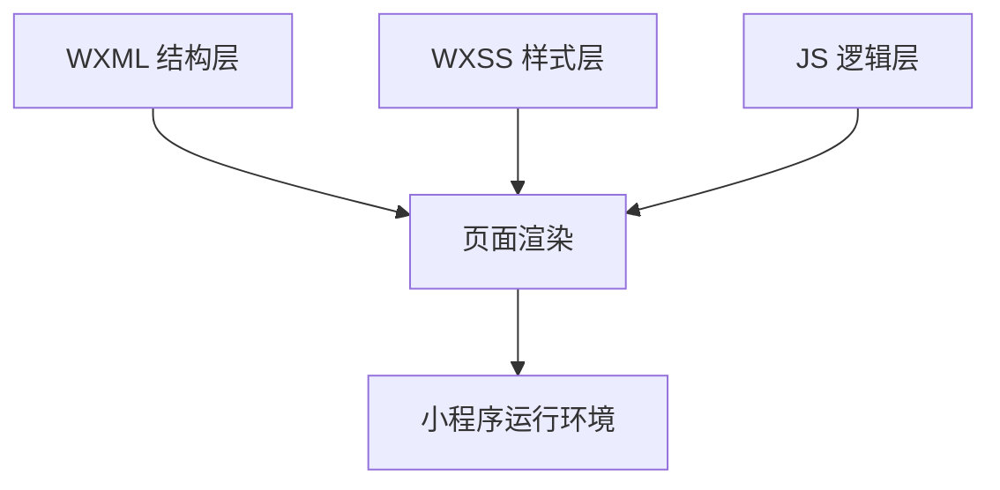
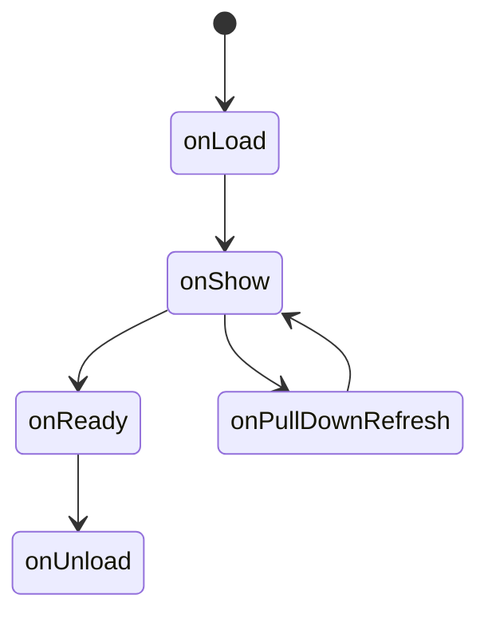
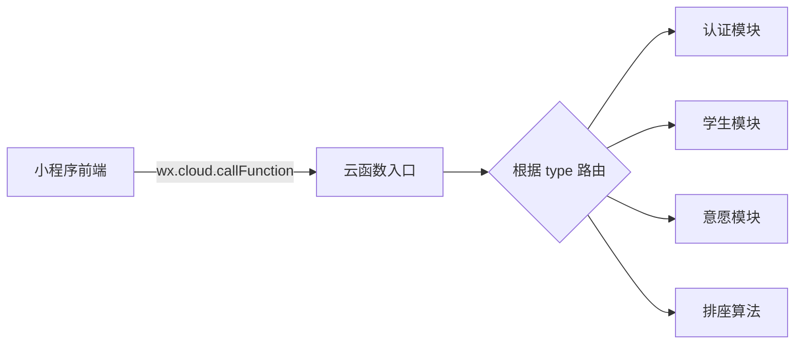
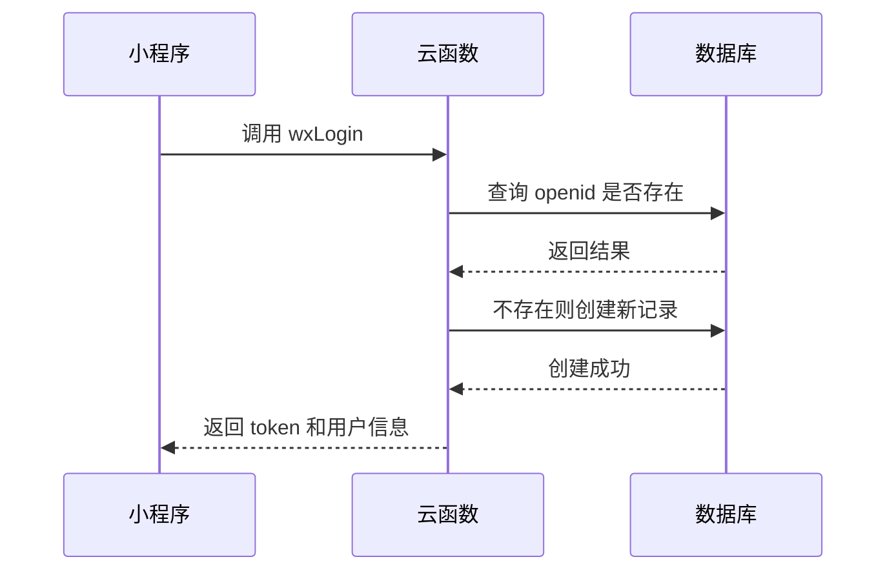
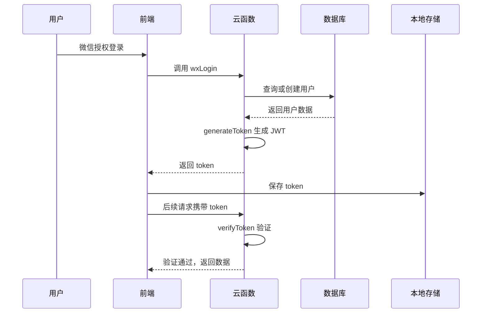
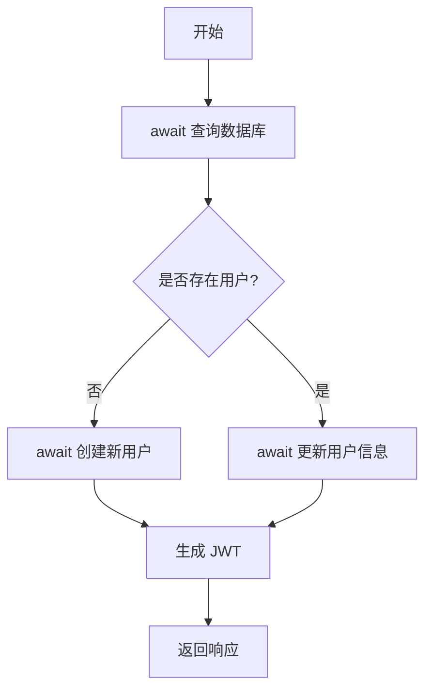
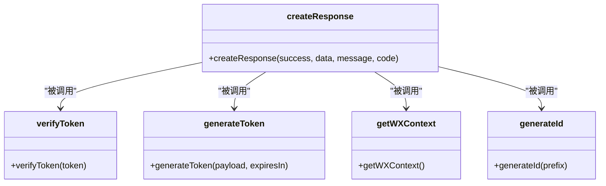

# 技术栈

<cite>
**本文档中引用的文件**  
- [app.js](file://miniprogram/app.js)
- [app.json](file://miniprogram/app.json)
- [login.js](file://miniprogram/pages/login/login.js)
- [profile.js](file://miniprogram/pages/profile/profile.js)
- [seat-selection.js](file://miniprogram/pages/seat-selection/seat-selection.js)
- [neighbor-preference.js](file://miniprogram/pages/neighbor-preference/neighbor-preference.js)
- [wish-submit.js](file://miniprogram/pages/wish-submit/wish-submit.js)
- [result.js](file://miniprogram/pages/result/result.js)
- [auth.js](file://cloudfunctions/seatArrangementFunctions/modules/auth.js)
- [index.js](file://cloudfunctions/seatArrangementFunctions/index.js)
- [package.json](file://cloudfunctions/seatArrangementFunctions/package.json)
</cite>

## 目录
1. [项目概述](#项目概述)
2. [前端技术栈](#前端技术栈)
3. [后端技术栈](#后端技术栈)
4. [关键依赖库与版本](#关键依赖库与版本)
5. [异步编程模式](#异步编程模式)
6. [技术选型背景](#技术选型背景)
7. [代码风格与编程范式](#代码风格与编程范式)

## 项目概述

本项目是一个基于微信小程序的自动排座位系统，采用微信云开发架构，包含前端小程序与后端云函数两大部分。系统支持学生登录、个人信息管理、座位偏好选择、邻座意愿提交及排座结果查看等功能。整体技术栈围绕微信生态构建，充分利用云开发能力实现快速部署和高效开发。

**Section sources**
- [README.md](file://README.md#L1-L13)

## 前端技术栈

### 微信小程序框架核心特性

本项目使用标准微信小程序框架，基于 WXML、WXSS 和 JavaScript 三层结构构建用户界面与交互逻辑。

- **WXML**：用于定义页面结构，采用数据绑定语法实现动态渲染，如 `{{userInfo.name}}` 实现用户信息展示。
- **WXSS**：扩展了 CSS 功能，支持 rpx 自适应单位，确保在不同设备上具有一致的视觉效果。
- **JS 逻辑层**：每个页面由独立的 `.js` 文件控制，通过 Page 构造器定义页面生命周期、数据和事件处理函数。

页面结构在 `app.json` 中统一配置，包括 tabBar 导航栏、页面路径注册等。



**Diagram sources**
- [app.json](file://miniprogram/app.json#L1-L58)

### 页面生命周期管理

小程序页面遵循标准生命周期钩子，主要使用以下方法：

- `onLoad`：页面加载时触发，用于初始化数据和调用云函数。
- `onShow`：页面显示时触发，常用于刷新数据（如排座会话状态）。
- `onPullDownRefresh`：下拉刷新时触发，重新加载当前数据。

例如，在 `seat-selection.js` 中，`onLoad` 检查登录状态并加载当前排座会话；`onShow` 在每次页面显示时刷新会话数据。



**Diagram sources**
- [seat-selection.js](file://miniprogram/pages/seat-selection/seat-selection.js#L0-L360)
- [result.js](file://miniprogram/pages/result/result.js#L0-L186)

## 后端技术栈

### Node.js 环境下的云函数实现

后端采用微信云开发提供的 Node.js 云函数环境，所有业务逻辑封装在 `cloudfunctions` 目录下。主函数 `seatArrangementFunctions/index.js` 作为统一入口，通过 `type` 参数路由到不同模块。

云函数具备以下优势：
- 无需运维服务器，自动伸缩。
- 内置微信上下文（如 openid），天然支持身份识别。
- 可直接访问云数据库和文件存储。



**Diagram sources**
- [index.js](file://cloudfunctions/seatArrangementFunctions/index.js#L0-L169)

### wx-server-sdk 与云数据库集成

项目依赖 `wx-server-sdk` 与云数据库交互。该 SDK 提供了简洁的 API 用于增删改查操作，支持链式调用和 Promise 异步处理。

在 `auth.js` 中，通过 `db.collection('students').where({...}).get()` 查询学生记录；若不存在则调用 `.add()` 创建新用户。所有数据库操作均返回 Promise，便于异步流程控制。



**Diagram sources**
- [auth.js](file://cloudfunctions/seatArrangementFunctions/modules/auth.js#L5-L118)
- [index.js](file://cloudfunctions/seatArrangementFunctions/index.js#L0-L169)

### JWT 认证机制

系统采用 `jsonwebtoken` 库实现 JWT 认证，保障接口安全。

#### 认证流程
1. 用户登录后，服务端生成包含用户身份信息的 JWT 令牌。
2. 客户端将令牌存储于本地缓存（`wx.setStorageSync`）。
3. 后续请求携带 token，云函数通过 `verifyToken` 验证其有效性。
4. 验证通过后执行业务逻辑，否则返回 401 错误。

#### 关键函数
- `generateToken(payload, expiresIn)`：生成指定有效期的 JWT。
- `verifyToken(token)`：验证 token 并解析用户信息。

JWT 有效期限根据不同角色设定：
- 学生：7 天
- 管理员：8 小时
- 刷新令牌：2 小时



**Diagram sources**
- [auth.js](file://cloudfunctions/seatArrangementFunctions/modules/auth.js#L5-L238)
- [index.js](file://cloudfunctions/seatArrangementFunctions/index.js#L22-L38)

## 关键依赖库及其版本

| 依赖库 | 版本 | 用途 | 选择原因 |
|-------|------|------|----------|
| `wx-server-sdk` | ~2.4.0 | 云开发服务端 SDK | 微信官方提供，无缝集成云数据库、文件存储和上下文获取 |
| `jsonwebtoken` | ^8.5.1 | JWT 令牌生成与验证 | 成熟稳定，轻量级，广泛用于无状态认证 |

这些依赖定义在 `cloudfunctions/seatArrangementFunctions/package.json` 中，确保云函数运行环境具备所需能力。

**Section sources**
- [package.json](file://cloudfunctions/seatArrangementFunctions/package.json#L1-L14)

## 异步编程模式

项目广泛使用 JavaScript 的异步编程模式，主要采用 `Promise` 和 `async/await`。

### Promise 应用
前端通过 `wx.cloud.callFunction` 发起云函数调用，返回 Promise 对象，使用 `.then()` 和 `.catch()` 处理结果或错误。

### async/await 模式
后端云函数大量使用 `async/await` 简化异步流程，避免回调地狱。例如在 `auth.js` 中：

```javascript
const wxLogin = async (event, { db, ... }) => {
  const student = await db.collection('students').where({...}).get();
  if (student.data.length === 0) {
    await db.collection('students').add({...});
  }
  // 后续逻辑
};
```

这种模式使异步代码看起来像同步代码，极大提升了可读性和维护性。



**Diagram sources**
- [auth.js](file://cloudfunctions/seatArrangementFunctions/modules/auth.js#L5-L118)

## 技术选型背景

### 为何选择微信小程序 + 云开发？
- **快速上线**：无需搭建后端服务器，降低运维成本。
- **生态整合**：天然支持微信登录、消息推送等能力。
- **开发效率高**：前后端统一使用 JavaScript，团队协作顺畅。
- **成本低**：云开发按量计费，适合中小型应用。

### 为何使用 JWT？
- **无状态**：服务端不存储 session，适合分布式部署。
- **安全性高**：通过密钥签名防止篡改。
- **跨域友好**：可在不同子域间传递身份信息。

### 为何不使用传统 Session？
- 云函数为无状态服务，难以维护 session 状态。
- JWT 更符合 Serverless 架构的设计理念。

## 代码风格与编程范式

### 模块化设计
后端采用模块化组织代码，将功能拆分为 `auth`、`student`、`wish` 等模块，通过 `require` 引入，提升可维护性。

### 统一响应格式
定义 `createResponse(success, data, message, code)` 函数，确保所有接口返回结构一致，便于前端统一处理。

### 错误处理
采用 try-catch 捕获异常，并通过 `console.error` 记录日志，同时返回结构化错误信息，便于调试。

### 依赖注入
通过将 `db`、`generateToken` 等依赖作为参数传入模块函数，提高代码可测试性和解耦程度。



**Diagram sources**
- [index.js](file://cloudfunctions/seatArrangementFunctions/index.js#L22-L38)