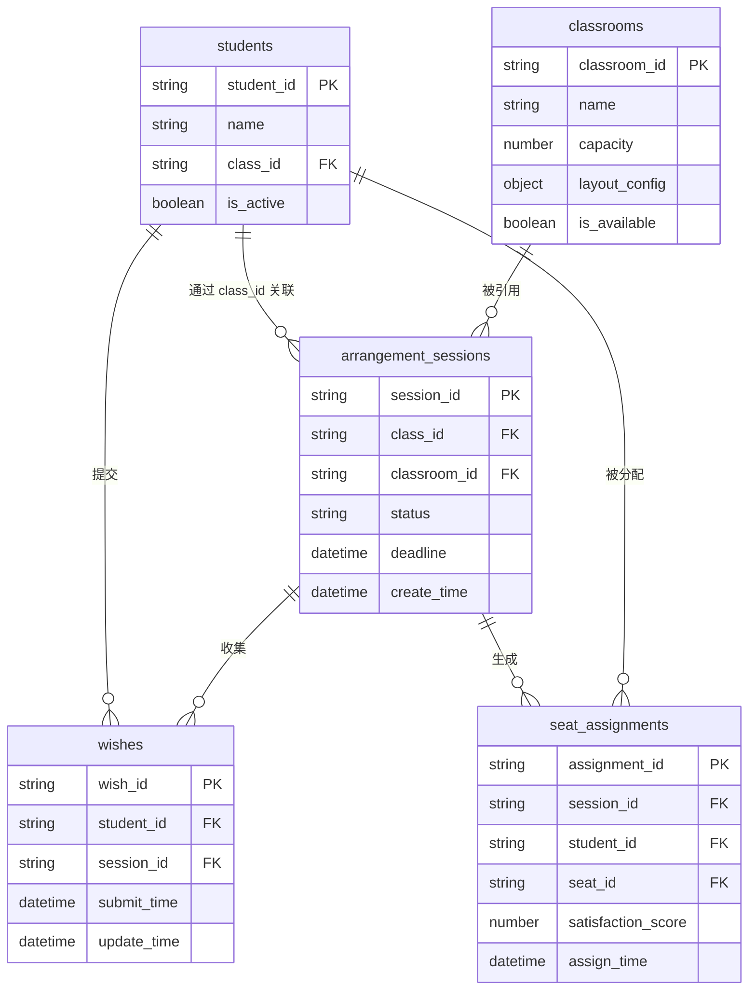

# 数据关系

<cite>
**本文档引用的文件**  
- [index.js](file://cloudfunctions/seatArrangementFunctions/index.js)
- [dataManager.js](file://cloudfunctions/seatArrangementFunctions/modules/dataManager.js)
- [session.js](file://cloudfunctions/seatArrangementFunctions/modules/session.js)
- [wish.js](file://cloudfunctions/seatArrangementFunctions/modules/wish.js)
- [student.js](file://cloudfunctions/seatArrangementFunctions/modules/student.js)
- [result.js](file://cloudfunctions/seatArrangementFunctions/modules/result.js)
- [algorithm.js](file://cloudfunctions/seatArrangementFunctions/modules/algorithm.js)
</cite>

## 目录
1. [引言](#引言)
2. [核心数据集合与逻辑关系](#核心数据集合与逻辑关系)
3. [实体关系图（ER图）](#实体关系图er图)
4. [多集合联合查询设计原理](#多集合联合查询设计原理)
5. [外键约束的实现与数据一致性保障](#外键约束的实现与数据一致性保障)
6. [总结](#总结)

## 引言
本文档旨在深入分析座位安排系统中各数据集合之间的逻辑关系。重点阐述学生、排座会话、意愿、座位分配和教室等核心实体之间的关联方式，通过实体关系图（ER图）进行可视化描述，并结合 `loadArrangementData` 函数中的 `Promise.all` 查询模式，解析多集合联合查询的设计原理。同时，本文将解释系统如何在应用层实现外键约束，以保障跨集合数据的一致性。

## 核心数据集合与逻辑关系
系统中的核心数据集合包括：`students`（学生）、`arrangement_sessions`（排座会话）、`wishes`（意愿）、`seat_assignments`（座位分配）和 `classrooms`（教室）。它们之间的逻辑关系如下：

1.  **学生与排座会话的关联**：`students` 集合与 `arrangement_sessions` 集合通过 `class_id` 字段建立关联。一个班级（`class_id`）可以发起多次排座会话，而一个学生属于一个特定的班级。因此，当查询某个班级的排座会话时，系统会根据 `class_id` 进行筛选，从而确定该班级所有学生的排座上下文。

2.  **意愿的多对一关系**：`wishes` 集合通过 `session_id` 和 `student_id` 两个字段，分别与 `arrangement_sessions` 和 `students` 建立多对一关系。这意味着一个学生（`student_id`）可以在一个排座会话（`session_id`）中提交一条意愿记录。这种设计确保了意愿的上下文明确，即每条意愿都绑定到特定的学生和特定的排座会话。

3.  **座位分配的核心关联作用**：`seat_assignments` 集合是整个系统的核心关联实体，它通过 `session_id`、`student_id` 和 `seat_id` 三个字段，将排座会话、学生和具体座位三方连接起来。`session_id` 确保了分配结果属于某次排座任务，`student_id` 指明了被分配的学生，而 `seat_id` 则指定了具体的座位。这三者共同构成了一个完整的、不可分割的分配事实。

4.  **教室对会话的引用**：`arrangement_sessions` 集合通过 `classroom_id` 字段引用 `classrooms` 集合。这表明每次排座会话都是在某个具体的教室中进行的。通过 `classroom_id`，系统可以获取该教室的布局、容量等信息，为排座算法提供必要的物理空间数据。

**Section sources**
- [session.js](file://cloudfunctions/seatArrangementFunctions/modules/session.js#L15-L415)
- [wish.js](file://cloudfunctions/seatArrangementFunctions/modules/wish.js#L15-L453)
- [result.js](file://cloudfunctions/seatArrangementFunctions/modules/result.js#L15-L455)

## 实体关系图（ER图）
以下ER图直观地展示了上述数据集合之间的关系。

**Diagram sources**
- [dataManager.js](file://cloudfunctions/seatArrangementFunctions/modules/dataManager.js#L15-L401)
- [session.js](file://cloudfunctions/seatArrangementFunctions/modules/session.js#L15-L415)
- [wish.js](file://cloudfunctions/seatArrangementFunctions/modules/wish.js#L15-L453)
- [result.js](file://cloudfunctions/seatArrangementFunctions/modules/result.js#L15-L455)

## 多集合联合查询设计原理
在执行排座算法时，系统需要同时获取会话、教室、学生和意愿等多方数据。`loadArrangementData` 函数是实现这一需求的关键，其设计原理如下：

该函数首先通过 `session_id` 从 `arrangement_sessions` 集合中获取会话信息。随后，它利用 `Promise.all` 方法并发地执行三个独立的数据库查询：
1.  根据会话信息中的 `classroom_id` 查询 `classrooms` 集合。
2.  根据会话信息中的 `class_id` 查询 `students` 集合。
3.  根据 `session_id` 查询 `wishes` 集合。

`Promise.all` 的使用是此设计的核心。它允许这三个I/O密集型的数据库查询并行执行，而不是串行等待。这极大地提高了数据加载的效率，因为总耗时取决于最慢的那个查询，而不是所有查询耗时的总和。一旦所有查询完成，函数便将结果整合成一个包含会话、教室、学生和意愿的完整数据对象，供后续的排座算法使用。

这种设计模式体现了“分而治之”的思想，将一个复杂的、多数据源的查询任务分解为多个独立的、可并行的子任务，从而优化了系统性能。

**Section sources**
- [algorithm.js](file://cloudfunctions/seatArrangementFunctions/modules/algorithm.js#L453-L484)

## 外键约束的实现与数据一致性保障
本系统并未在数据库层面（如云开发数据库）强制实施外键约束，而是选择在应用层（Application Layer）通过业务逻辑代码来实现和保障数据一致性。

具体实现方式如下：
*   **写入时验证**：在创建或更新数据时，系统会主动查询关联集合以验证外键的有效性。例如，在 `createSession` 函数中，会先检查 `classroom_id` 是否存在于 `classrooms` 集合中，以及 `class_id` 是否存在于 `classes` 集合中，只有验证通过才会创建新的排座会话。
*   **删除时保护**：在删除被引用的实体时，系统会检查是否存在依赖关系。例如，在 `deleteClass` 函数中，会先检查该班级是否有正在进行的排座会话，如果有，则阻止删除操作，从而防止出现“孤儿”会话。
*   **查询时关联**：在读取数据时，如 `getCurrentSession` 或 `getMyAssignment`，系统会根据外键（如 `classroom_id`, `student_id`）进行多次查询，将分散在不同集合中的关联数据拼接起来，形成完整的业务视图。

这种应用层外键的实现方式，虽然增加了业务代码的复杂性，但为系统带来了更高的灵活性。它允许系统在不支持原生外键的数据库环境中运行，并且可以实现更复杂的、带有业务逻辑的约束（例如，只允许在会话状态为“收集意愿”时提交意愿）。通过严谨的业务逻辑校验和错误处理，系统有效地保障了跨集合数据的引用完整性，避免了无效或孤立的数据记录。

**Section sources**
- [session.js](file://cloudfunctions/seatArrangementFunctions/modules/session.js#L15-L415)
- [wish.js](file://cloudfunctions/seatArrangementFunctions/modules/wish.js#L15-L453)
- [dataManager.js](file://cloudfunctions/seatArrangementFunctions/modules/dataManager.js#L15-L401)

## 总结
本文档详细分析了座位安排系统中各数据集合的逻辑关系。通过 `class_id`、`session_id`、`student_id` 和 `classroom_id` 等字段，系统构建了一个清晰、高效的数据关联网络。`seat_assignments` 作为核心实体，通过三方外键连接了排座任务、学生和物理座位。`Promise.all` 的并发查询模式优化了多集合数据的加载性能。尽管缺乏数据库原生外键支持，但系统通过在应用层实施严格的验证和保护逻辑，成功地维护了数据的完整性和一致性，确保了业务流程的可靠运行。