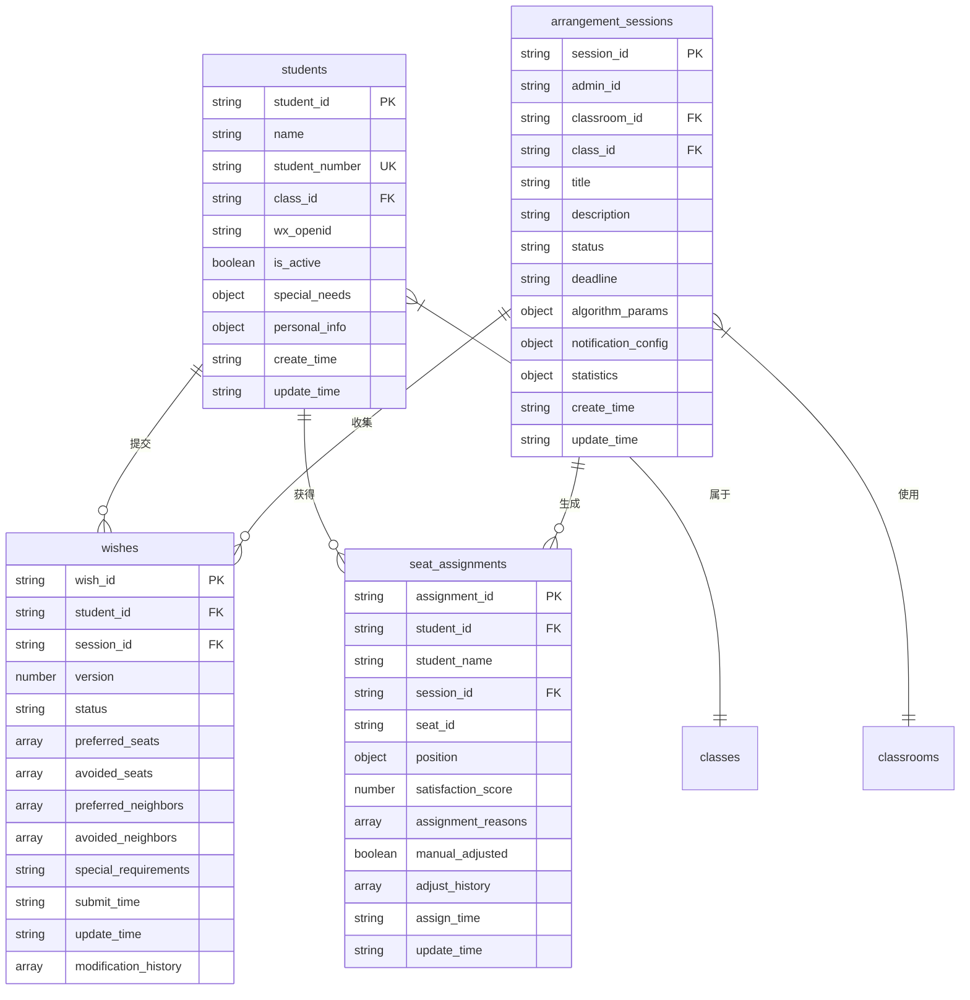

# 数据库设计

<cite>
**本文档引用的文件**
- [session.js](file://cloudfunctions/seatArrangementFunctions/modules/session.js)
- [student.js](file://cloudfunctions/seatArrangementFunctions/modules/student.js)
- [wish.js](file://cloudfunctions/seatArrangementFunctions/modules/wish.js)
- [result.js](file://cloudfunctions/seatArrangementFunctions/modules/result.js)
- [algorithm.js](file://cloudfunctions/seatArrangementFunctions/modules/algorithm.js)
- [admin.js](file://cloudfunctions/seatArrangementFunctions/modules/admin.js)
- [index.js](file://cloudfunctions/seatArrangementFunctions/index.js)
</cite>

## 目录
1. [引言](#引言)
2. [核心集合数据结构](#核心集合数据结构)
3. [集合间关联关系](#集合间关联关系)
4. [索引设计与查询优化](#索引设计与查询优化)
5. [数据生命周期管理](#数据生命周期管理)
6. [实体关系图（ER图）](#实体关系图（er图）)

## 引言
本数据库设计文档基于云函数中对数据库的访问逻辑，详细阐述了学生信息、排座会话、学生意愿和座位分配等核心集合的数据结构。文档定义了每个字段的名称、类型、含义及约束条件，并说明了集合之间的关联关系。同时，文档解释了索引设计以优化查询性能，并描述了数据生命周期管理策略。

## 核心集合数据结构

### 学生信息（students）
存储所有学生的基本信息。

**字段定义：**
- `student_id` (string, 唯一, 非空): 学生唯一标识符。
- `name` (string, 非空): 学生姓名。
- `student_number` (string, 唯一): 学号。
- `class_id` (string, 非空): 所属班级ID，关联`classes`集合。
- `wx_openid` (string): 微信OpenID。
- `is_active` (boolean): 学生状态，是否活跃。
- `special_needs` (object): 特殊需求，包含视力、听力、身高等信息。
- `personal_info` (object): 个人附加信息，如性别。
- `create_time` (string, ISO8601): 创建时间。
- `update_time` (string, ISO8601): 更新时间。

**约束条件：**
- `student_id` 和 `student_number` 为唯一索引。
- `class_id` 必须存在且有效。

**Section sources**
- [student.js](file://cloudfunctions/seatArrangementFunctions/modules/student.js#L1-L322)

### 排座会话（arrangement_sessions）
存储每次排座会话的配置和状态。

**字段定义：**
- `session_id` (string, 唯一, 非空): 会话唯一标识符。
- `admin_id` (string, 非空): 创建会话的管理员ID。
- `classroom_id` (string, 非空): 关联的教室ID。
- `class_id` (string, 非空): 关联的班级ID。
- `title` (string): 会话标题。
- `description` (string): 会话描述。
- `status` (string, 非空): 会话状态（collecting, arranging, completed, published, cancelled）。
- `deadline` (string, ISO8601, 非空): 意愿提交截止时间。
- `auto_start_arrangement` (boolean): 是否自动开始排座。
- `auto_publish_result` (boolean): 是否自动发布结果。
- `algorithm_params` (object): 算法参数，包含权重、迭代次数等。
- `notification_config` (object): 通知配置。
- `statistics` (object): 会话统计信息，包含总学生数、已提交意愿数等。
- `create_time` (string, ISO8601): 创建时间。
- `update_time` (string, ISO8601): 更新时间。

**约束条件：**
- 每个班级在同一时间只能有一个状态为`collecting`或`arranging`的会话。
- `status` 字段的转换必须符合预定义的流程。

**Section sources**
- [session.js](file://cloudfunctions/seatArrangementFunctions/modules/session.js#L1-L416)

### 学生意愿（wishes）
存储学生在特定会话中提交的座位偏好。

**字段定义：**
- `wish_id` (string, 唯一, 非空): 意愿唯一标识符。
- `student_id` (string, 非空): 学生ID。
- `session_id` (string, 非空): 关联的排座会话ID。
- `version` (number, 非空): 意愿版本号，用于追踪修改。
- `status` (string, 非空): 意愿状态（submitted）。
- `preferred_seats` (array): 偏好座位列表，每个元素包含`seat_id`和`priority`。
- `avoided_seats` (array): 避免座位列表，每个元素包含`seat_id`。
- `preferred_neighbors` (array): 偏好邻座列表，每个元素包含`student_id`。
- `avoided_neighbors` (array): 避免邻座列表，每个元素包含`student_id`。
- `special_requirements` (string): 特殊需求说明。
- `submit_time` (string, ISO8601): 提交时间。
- `update_time` (string, ISO8601): 更新时间。
- `modification_history` (array): 修改历史，记录每次修改的版本、时间和变更内容。

**约束条件：**
- 每个学生在同一个会话中只能提交一份意愿。
- `preferred_seats` 和 `avoided_seats` 中的座位ID必须是该会话教室中的有效且可用的座位。
- `preferred_neighbors` 和 `avoided_neighbors` 中的学生ID必须是同班同学。
- `preferred_seats` 和 `avoided_seats` 的数量分别不超过5个。
- `preferred_neighbors` 和 `avoided_neighbors` 的数量分别不超过3个。

**Section sources**
- [wish.js](file://cloudfunctions/seatArrangementFunctions/modules/wish.js#L1-L454)

### 座位分配（seat_assignments）
存储排座算法执行后的最终座位分配结果。

**字段定义：**
- `assignment_id` (string, 唯一, 非空): 分配记录唯一标识符。
- `student_id` (string, 非空): 学生ID。
- `student_name` (string, 非空): 学生姓名。
- `session_id` (string, 非空): 关联的排座会话ID。
- `seat_id` (string, 非空): 分配的座位ID。
- `position` (object): 座位位置，包含`row`和`col`。
- `satisfaction_score` (number): 学生满意度分数（0-1）。
- `assignment_reasons` (array): 分配原因，如`algorithm_optimization`或`random_fallback`。
- `manual_adjusted` (boolean): 是否为手动调整。
- `adjust_history` (array): 调整历史，记录每次手动调整的来源、目标、原因和时间。
- `assign_time` (string, ISO8601): 分配时间。
- `update_time` (string, ISO8601): 更新时间。

**约束条件：**
- 在同一个会话中，一个座位ID只能被分配给一个学生。
- 在同一个会话中，一个学生ID只能有一条有效的分配记录。

**Section sources**
- [result.js](file://cloudfunctions/seatArrangementFunctions/modules/result.js#L1-L456)
- [algorithm.js](file://cloudfunctions/seatArrangementFunctions/modules/algorithm.js#L1-L509)

## 集合间关联关系

### 主要关联
- **学生与会话**：通过`students.class_id`与`arrangement_sessions.class_id`关联，表示学生属于某个班级的排座会话。
- **意愿与会话**：通过`wishes.session_id`与`arrangement_sessions.session_id`关联，表示意愿属于某个排座会话。
- **意愿与学生**：通过`wishes.student_id`与`students.student_id`关联，表示意愿由特定学生提交。
- **分配与会话**：通过`seat_assignments.session_id`与`arrangement_sessions.session_id`关联，表示分配结果属于某个排座会话。
- **分配与学生**：通过`seat_assignments.student_id`与`students.student_id`关联，表示分配结果对应特定学生。

### 间接关联
- **学生与意愿**：一个学生可以在多个会话中提交意愿，形成一对多关系。
- **会话与分配**：一个会话会产生多条分配记录，形成一对多关系。
- **教室与会话**：一个教室可以被多个会话使用，形成一对多关系。

## 索引设计与查询优化

### 核心索引
为优化查询性能，以下字段已建立索引：

- **students集合**：
  - `student_id` (唯一索引): 用于快速查找特定学生。
  - `student_number` (唯一索引): 用于学号查重。
  - `class_id` (普通索引): 用于按班级查询学生列表。

- **arrangement_sessions集合**：
  - `session_id` (唯一索引): 用于快速查找特定会话。
  - `class_id` + `status` (复合索引): 用于查找班级的当前活跃会话。
  - `classroom_id` (普通索引): 用于按教室查找会话。

- **wishes集合**：
  - `student_id` + `session_id` (复合唯一索引): 用于确保学生在会话中只有一份意愿，并支持快速查询。
  - `session_id` (普通索引): 用于按会话ID查询所有意愿，是排座算法的核心查询。

- **seat_assignments集合**：
  - `session_id` + `student_id` (复合索引): 用于快速查询学生在特定会话中的分配结果。
  - `session_id` + `seat_id` (复合索引): 用于检查座位在会话中是否已被占用，是手动调整功能的核心查询。

### 查询优化策略
- **按会话查询意愿**：`wishes`集合上的`session_id`索引确保了排座算法可以高效地获取所有学生的意愿数据。
- **获取学生分配**：`seat_assignments`集合上的`session_id`和`student_id`复合索引使得`getMyAssignment`函数能够快速响应。
- **手动调整验证**：`seat_assignments`集合上的`session_id`和`seat_id`复合索引使得`validateSeatAdjustment`函数能够高效地检查目标座位是否被占用。
- **统计信息查询**：`arrangement_sessions`集合上的`class_id`和`status`复合索引支持了`getStatistics`函数对活跃会话的快速查找。

## 数据生命周期管理

### 数据创建
- **学生信息**：通过`importStudents`云函数批量导入或通过系统初始化创建。
- **排座会话**：由管理员通过`createSession`云函数创建。
- **学生意愿**：由学生在会话的收集期内通过`submitWish`云函数提交。
- **座位分配**：由排座算法在`executeArrangement`云函数执行后批量创建。

### 数据更新
- **学生信息**：学生可通过`updateProfile`云函数更新个人档案。
- **学生意愿**：学生可在截止时间前通过`updateWish`云函数修改意愿，系统会记录修改历史。
- **排座会话**：管理员可通过`updateSessionStatus`云函数更新会话状态。
- **座位分配**：管理员可通过`manualAdjustSeat`云函数进行手动调整，系统会将调整记录追加到`adjust_history`数组中。

### 数据删除与归档
- **软删除策略**：系统主要采用软删除。例如，`students`集合中的`is_active`字段用于标记学生是否毕业或转学，而非物理删除。
- **会话状态流转**：会话通过`status`字段的状态机进行管理，从`collecting`到`published`，最终完成生命周期。已取消的会话标记为`cancelled`。
- **数据归档**：历史会话及其相关的意愿、分配数据将被保留，用于统计分析和审计。系统不提供物理删除功能，以保证数据的完整性和可追溯性。

## 实体关系图（ER图）

**Diagram sources**
- [student.js](file://cloudfunctions/seatArrangementFunctions/modules/student.js#L1-L322)
- [session.js](file://cloudfunctions/seatArrangementFunctions/modules/session.js#L1-L416)
- [wish.js](file://cloudfunctions/seatArrangementFunctions/modules/wish.js#L1-L454)
- [result.js](file://cloudfunctions/seatArrangementFunctions/modules/result.js#L1-L456)

**Section sources**
- [student.js](file://cloudfunctions/seatArrangementFunctions/modules/student.js#L1-L322)
- [session.js](file://cloudfunctions/seatArrangementFunctions/modules/session.js#L1-L416)
- [wish.js](file://cloudfunctions/seatArrangementFunctions/modules/wish.js#L1-L454)
- [result.js](file://cloudfunctions/seatArrangementFunctions/modules/result.js#L1-L456)