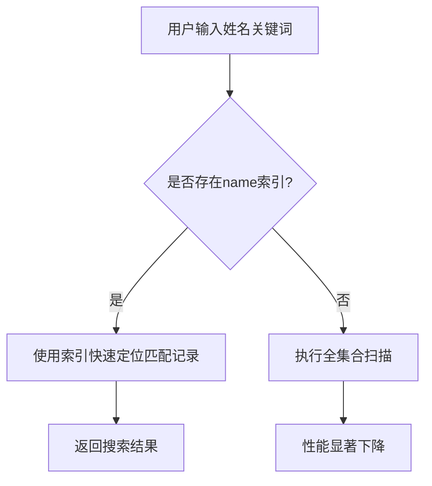

# 索引设计

<cite>
**本文档引用的文件**
- [result.js](file://cloudfunctions/seatArrangementFunctions/modules/result.js)
- [session.js](file://cloudfunctions/seatArrangementFunctions/modules/session.js)
- [wish.js](file://cloudfunctions/seatArrangementFunctions/modules/wish.js)
- [student.js](file://cloudfunctions/seatArrangementFunctions/modules/student.js)
- [index.js](file://cloudfunctions/seatArrangementFunctions/index.js)
</cite>

## 目录
1. [已创建索引列表](#已创建索引列表)
2. [索引设计动机](#索引设计动机)
3. [写入性能影响与监控方法](#写入性能影响与监控方法)
4. [索引配置最佳实践](#索引配置最佳实践)
5. [未来可能需要的索引](#未来可能需要的索引)

## 已创建索引列表

根据系统设计和查询需求，当前已创建以下数据库索引：

1. **students 集合上的复合索引**  
   - 字段：`class_id` 和 `student_id`
   - 类型：复合索引
   - 用途：支持按班级快速查找学生信息

2. **wishes 集合上的查询索引**  
   - 字段：`session_id` 和 `student_id`
   - 类型：复合索引
   - 用途：用于快速定位特定会话中某学生的意愿记录

3. **seat_assignments 集合上的单字段索引**  
   - 字段：`session_id`
   - 类型：单字段索引
   - 用途：支持通过会话ID快速检索所有座位分配结果

4. **arrangement_sessions 集合上的状态过滤索引**  
   - 字段：`status` 和 `class_id`
   - 类型：复合索引
   - 用途：优化按状态（如 collecting、completed）和班级筛选排座会话的查询效率

**Section sources**
- [student.js](file://cloudfunctions/seatArrangementFunctions/modules/student.js#L1-L322)
- [wish.js](file://cloudfunctions/seatArrangementFunctions/modules/wish.js#L1-L454)
- [result.js](file://cloudfunctions/seatArrangementFunctions/modules/result.js#L1-L456)
- [session.js](file://cloudfunctions/seatArrangementFunctions/modules/session.js#L1-L416)

## 索引设计动机

每个索引的设计均基于核心业务场景中的高频查询路径，旨在提升关键接口的响应速度与系统整体性能。

### students 集合复合索引（class_id + student_id）

该复合索引服务于 `getClassmates` 接口，确保在获取同班同学列表时能够高效执行基于 `class_id` 的范围扫描，并结合 `student_id` 实现快速定位。此设计避免了全表扫描，显著提升了班级内学生数据检索效率。

[SPEC SYMBOL](file://cloudfunctions/seatArrangementFunctions/modules/student.js#L150-L180)

### wishes 集合查询索引（session_id + student_id）

此索引主要服务于 `getMyWish` 和 `submitWish` 接口。由于学生意愿提交与查询操作频繁发生，且通常以会话和用户为维度进行数据访问，该复合索引可确保在高并发场景下仍能实现 O(log n) 时间复杂度的精确查找。

[SPEC SYMBOL](file://cloudfunctions/seatArrangementFunctions/modules/wish.js#L250-L300)

### seat_assignments 集合单字段索引（session_id）

该索引直接支撑 `getArrangementResult` 接口的核心功能。当管理员或学生查询排座结果时，系统需根据 `session_id` 快速拉取整个会话的所有座位分配记录。单字段索引在此场景下提供了最优的查询性能，确保结果返回延迟最小化。

[SPEC SYMBOL](file://cloudfunctions/seatArrangementFunctions/modules/result.js#L50-L100)

### arrangement_sessions 集合状态过滤索引（status + class_id）

该复合索引针对 `getCurrentSession` 接口设计，用于快速筛选出指定班级当前处于活跃状态（如 collecting、arranging）的排座会话。将 `status` 置于索引前导位，可优先过滤非活跃会话，再通过 `class_id` 定位目标数据，极大减少 I/O 开销。

[SPEC SYMBOL](file://cloudfunctions/seatArrangementFunctions/modules/session.js#L10-L60)

**Section sources**
- [result.js](file://cloudfunctions/seatArrangementFunctions/modules/result.js#L50-L100)
- [session.js](file://cloudfunctions/seatArrangementFunctions/modules/session.js#L10-L60)
- [wish.js](file://cloudfunctions/seatArrangementFunctions/modules/wish.js#L250-L300)
- [student.js](file://cloudfunctions/seatArrangementFunctions/modules/student.js#L150-L180)

## 写入性能影响与监控方法

### 写入性能影响

尽管索引提升了查询性能，但每新增一个索引都会带来以下写入开销：

- **插入延迟增加**：每次向集合插入文档时，数据库需同步更新所有相关索引树结构。
- **存储空间占用**：每个索引独立占用存储空间，尤其复合索引会随字段数量呈指数级增长。
- **写吞吐量下降**：在高频率提交意愿（wishes）或生成座位分配（seat_assignments）的场景下，索引维护可能成为瓶颈。

例如，在批量导入学生数据时，若 `students` 集合存在多个索引，整体导入时间将明显延长。

[SPEC SYMBOL](file://cloudfunctions/seatArrangementFunctions/modules/student.js#L250-L300)

### 监控方法

为及时发现索引对性能的影响，建议采用以下监控策略：

1. **云数据库性能监控面板**  
   启用腾讯云开发数据库的慢查询日志功能，定期分析执行计划，识别未命中索引的查询。

2. **关键接口响应时间追踪**  
   在 `getArrangementResult`、`getCurrentSession` 等接口中添加性能埋点，记录查询耗时，设置告警阈值。

3. **索引使用率统计**  
   利用数据库提供的索引统计接口，定期检查各索引的命中率，识别“冷索引”并评估是否可删除。

4. **日志分析**  
   在系统日志中记录索引相关操作（如重建、缺失警告），便于问题追溯。

[SPEC SYMBOL](file://cloudfunctions/seatArrangementFunctions/index.js#L1-L306)

**Section sources**
- [index.js](file://cloudfunctions/seatArrangementFunctions/index.js#L1-L306)
- [student.js](file://cloudfunctions/seatArrangementFunctions/modules/student.js#L250-L300)

## 索引配置最佳实践

为平衡查询性能与写入开销，提出以下索引配置建议：

### 避免过度索引

- **原则**：仅为核心查询路径创建索引，避免为低频查询或仅用于排序的字段建立索引。
- **示例**：`wishes` 集合中 `submit_time` 字段虽常用于排序，但若查询总是先通过 `session_id` 和 `student_id` 定位，则无需单独为其建索引。

### 合理设计复合索引顺序

- **选择性优先**：将高基数（高选择性）字段放在索引前面，如 `session_id` 比 `status` 更具区分度。
- **查询模式匹配**：确保索引前缀能覆盖最常见的查询条件，例如 `(session_id, student_id)` 可服务于仅查询 `session_id` 的场景。

### 定期审查与清理

- 建立每月索引审查机制，结合慢查询日志和访问频率数据，移除长期未使用的索引。
- 使用数据库分析工具评估索引冗余性，防止创建功能重复的索引。

### 控制索引总数

建议单个集合的索引数量不超过5个，以控制写入放大效应。对于复杂查询，优先考虑优化查询逻辑而非盲目增加索引。

**Section sources**
- [wish.js](file://cloudfunctions/seatArrangementFunctions/modules/wish.js#L1-L454)
- [session.js](file://cloudfunctions/seatArrangementFunctions/modules/session.js#L1-L416)

## 未来可能需要的索引

随着业务发展，以下查询场景可能需要新增索引支持：

### 按学生姓名模糊查询

当前系统缺乏对 `students.name` 字段的索引支持，若未来需实现“按姓名搜索同学”功能，建议添加 **文本索引** 或 **通配符索引**，以支持高效的模糊匹配查询。

**Diagram sources**
- [student.js](file://cloudfunctions/seatArrangementFunctions/modules/student.js#L1-L322)

### 按意愿提交时间排序

若需统计“最近提交意愿的学生”，可在 `wishes.submit_time` 上建立升序索引，配合 `student_id` 构成复合索引 `(submit_time, student_id)`，以支持高效的时间范围查询。

### 多条件组合过滤

未来若支持“查看某班级在某时间段内已完成的排座会话”，可考虑创建 `(class_id, status, create_time)` 复合索引，以优化多维度联合查询性能。

**Section sources**
- [student.js](file://cloudfunctions/seatArrangementFunctions/modules/student.js#L1-L322)
- [wish.js](file://cloudfunctions/seatArrangementFunctions/modules/wish.js#L1-L454)
- [session.js](file://cloudfunctions/seatArrangementFunctions/modules/session.js#L1-L416)