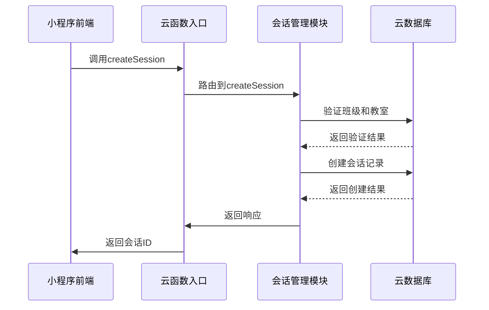
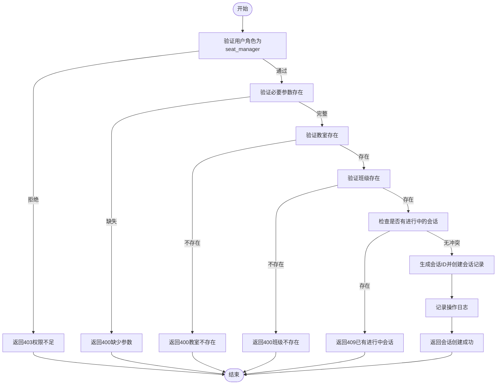
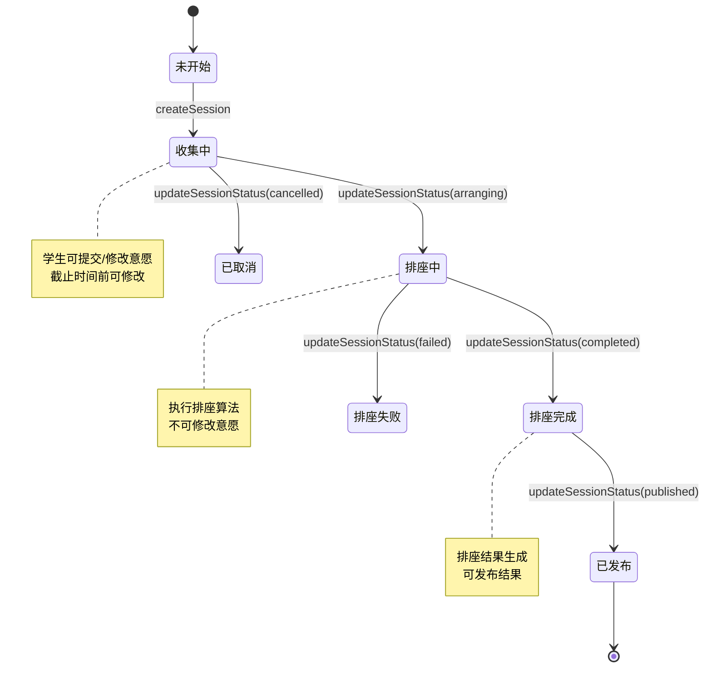
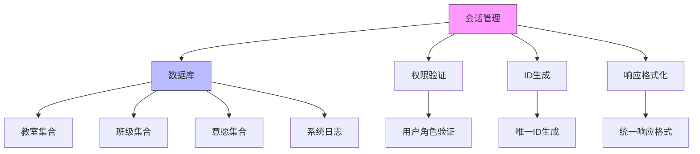

# 会话管理模块

<cite>
**本文档引用的文件**
- [session.js](file://cloudfunctions/seatArrangementFunctions/modules/session.js)
- [index.js](file://miniprogram/pages/index/index.js)
- [session-management.js](file://miniprogram/pages/session-management/session-management.js)
- [index.js](file://cloudfunctions/seatArrangementFunctions/index.js)
</cite>

## 目录
1. [简介](#简介)
2. [项目结构](#项目结构)
3. [核心组件](#核心组件)
4. [架构概述](#架构概述)
5. [详细组件分析](#详细组件分析)
6. [依赖分析](#依赖分析)
7. [性能考虑](#性能考虑)
8. [故障排除指南](#故障排除指南)
9. [结论](#结论)

## 简介
本文档详细描述了排座系统的会话管理模块，涵盖会话的创建、状态管理、统计查询和生命周期控制。重点解析了 `session.js` 中的核心函数逻辑，包括会话状态机的转换规则、会话配置参数及其对排座结果的影响。同时结合前端页面逻辑，说明会话状态如何影响用户界面的呈现，并提供并发控制和异常处理机制以确保数据一致性。

## 项目结构
会话管理模块主要分布在云函数和小程序页面两个部分。云函数 `seatArrangementFunctions` 负责会话的后端逻辑处理，而小程序页面则提供用户交互界面。

```mermaid
graph TB
subgraph "云函数"
A[seatArrangementFunctions]
A --> B[modules/session.js]
A --> C[modules/algorithm.js]
A --> D[modules/wish.js]
end
subgraph "小程序页面"
E[pages/session-management]
F[pages/index]
E --> G[session-management.js]
F --> H[index.js]
end
B < --> G
C < --> G
D < --> G
```

**图示来源**
- [session.js](file://cloudfunctions/seatArrangementFunctions/modules/session.js#L1-L415)
- [session-management.js](file://miniprogram/pages/session-management/session-management.js#L1-L477)

**本节来源**
- [session.js](file://cloudfunctions/seatArrangementFunctions/modules/session.js#L1-L415)
- [session-management.js](file://miniprogram/pages/session-management/session-management.js#L1-L477)

## 核心组件
会话管理模块的核心功能包括会话创建、当前会话获取、状态更新和统计查询。这些功能通过云函数暴露给前端调用，实现了完整的会话生命周期管理。

**本节来源**
- [session.js](file://cloudfunctions/seatArrangementFunctions/modules/session.js#L1-L415)
- [index.js](file://cloudfunctions/seatArrangementFunctions/index.js#L200-L235)

## 架构概述
会话管理采用前后端分离架构，前端通过云函数调用与后端交互。后端采用模块化设计，将不同功能分离到独立模块中，提高了代码的可维护性和可扩展性。



**图示来源**
- [session.js](file://cloudfunctions/seatArrangementFunctions/modules/session.js#L77-L196)
- [index.js](file://cloudfunctions/seatArrangementFunctions/index.js#L200-L235)

## 详细组件分析

### 会话创建分析
`createSession` 函数负责创建新的排座会话，包含完整的权限验证、参数校验和业务逻辑处理。



**图示来源**
- [session.js](file://cloudfunctions/seatArrangementFunctions/modules/session.js#L77-L196)

**本节来源**
- [session.js](file://cloudfunctions/seatArrangementFunctions/modules/session.js#L77-L196)
- [session-management.js](file://miniprogram/pages/session-management/session-management.js#L130-L192)

### 会话状态机分析
会话状态机定义了会话的生命周期和状态转换规则，确保系统状态的一致性和合法性。



**图示来源**
- [session.js](file://cloudfunctions/seatArrangementFunctions/modules/session.js#L315-L361)
- [session.js](file://cloudfunctions/seatArrangementFunctions/modules/session.js#L355-L415)

**本节来源**
- [session.js](file://cloudfunctions/seatArrangementFunctions/modules/session.js#L315-L415)

### 会话配置参数
会话配置参数影响排座算法的执行结果，主要包括算法权重和通知配置。

```mermaid
erDiagram
会话配置 ||--o{ 算法参数 : 包含
会话配置 ||--o{ 通知配置 : 包含
算法参数 {
float 意愿权重 0.4
float 教学权重 0.3
float 公平权重 0.2
float 约束权重 0.1
int 最大迭代次数 1000
float 最小满意度 0.7
boolean 启用随机兜底 true
}
通知配置 {
boolean 创建时发送 true
boolean 发送提醒 true
array 提醒时间 [24,6,1]
boolean 发布时发送 true
}
```

**图示来源**
- [session.js](file://cloudfunctions/seatArrangementFunctions/modules/session.js#L114-L153)

**本节来源**
- [session.js](file://cloudfunctions/seatArrangementFunctions/modules/session.js#L114-L153)
- [session-management.js](file://miniprogram/pages/session-management/session-management.js#L130-L192)

## 依赖分析
会话管理模块依赖于多个其他模块和系统组件，形成了复杂的依赖关系网络。



**图示来源**
- [session.js](file://cloudfunctions/seatArrangementFunctions/modules/session.js#L1-L415)
- [index.js](file://cloudfunctions/seatArrangementFunctions/index.js#L1-L305)

**本节来源**
- [session.js](file://cloudfunctions/seatArrangementFunctions/modules/session.js#L1-L415)
- [index.js](file://cloudfunctions/seatArrangementFunctions/index.js#L1-L305)

## 性能考虑
会话管理模块在设计时考虑了性能优化，包括数据库查询优化、并发控制和异常处理。

**本节来源**
- [session.js](file://cloudfunctions/seatArrangementFunctions/modules/session.js#L1-L415)

## 故障排除指南
会话管理模块提供了完善的错误处理机制，帮助开发者快速定位和解决问题。

**本节来源**
- [session.js](file://cloudfunctions/seatArrangementFunctions/modules/session.js#L1-L415)

## 结论
会话管理模块实现了完整的排座会话生命周期管理，通过清晰的状态机设计和完善的错误处理机制，确保了系统的稳定性和可靠性。模块化的设计使得功能扩展和维护更加容易，为排座系统的其他功能提供了坚实的基础。