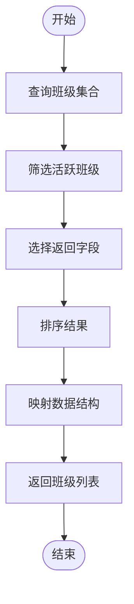

# 学生管理模块

<cite>
**本文档引用文件**  
- [student.js](file://cloudfunctions/seatArrangementFunctions/modules/student.js)
- [profile.js](file://miniprogram/pages/profile/profile.js)
- [auth.js](file://cloudfunctions/seatArrangementFunctions/modules/auth.js)
- [dataManager.js](file://cloudfunctions/seatArrangementFunctions/modules/dataManager.js)
- [localdb.js](file://offline/storage/localdb.js)
- [fileManager.js](file://desktop/src/fileManager.js)
</cite>

## 目录
1. [简介](#简介)
2. [核心功能概述](#核心功能概述)
3. [学生信息增删改查](#学生信息增删改查)
4. [批量导入功能](#批量导入功能)
5. [同班同学查询](#同班同学查询)
6. [前端交互逻辑](#前端交互逻辑)
7. [数据格式与错误处理](#数据格式与错误处理)
8. [数据关联与隐私保护](#数据关联与隐私保护)
9. [性能优化建议](#性能优化建议)

## 简介
学生管理模块是座位安排系统的核心组成部分，负责学生信息的全生命周期管理。该模块提供学生档案的增删改查、批量导入、同班同学查询等功能，支持管理员和学生用户的不同操作权限。系统通过云函数实现后端逻辑，结合小程序前端页面完成用户交互，确保数据的一致性和安全性。

## 核心功能概述
学生管理模块主要包含以下功能：
- 学生档案的获取与更新
- 同班同学列表查询
- 班级列表获取
- 学生数据批量导入
- 前端表单交互与验证
- 数据隐私保护机制

该模块通过`student.js`云函数实现核心业务逻辑，`profile.js`小程序页面实现用户界面交互，两者通过云函数调用进行数据通信。

**Section sources**
- [student.js](file://cloudfunctions/seatArrangementFunctions/modules/student.js#L1-L321)
- [profile.js](file://miniprogram/pages/profile/profile.js#L1-L300)

## 学生信息增删改查

### 信息获取流程
`getProfile`函数实现学生档案获取功能，其业务流程如下：


**Diagram sources**
- [student.js](file://cloudfunctions/seatArrangementFunctions/modules/student.js#L1-L54)

### 信息更新逻辑
`updateProfile`函数处理学生档案更新，包含完整的数据校验和事务处理：


**Diagram sources**
- [student.js](file://cloudfunctions/seatArrangementFunctions/modules/student.js#L56-L144)

**Section sources**
- [student.js](file://cloudfunctions/seatArrangementFunctions/modules/student.js#L1-L144)
- [profile.js](file://miniprogram/pages/profile/profile.js#L150-L250)

## 批量导入功能

### 批量导入事务处理
`importStudents`函数实现学生数据批量导入，采用逐条处理方式确保数据一致性：


**Diagram sources**
- [student.js](file://cloudfunctions/seatArrangementFunctions/modules/student.js#L211-L321)

### 数据校验规则
批量导入时执行以下校验规则：

| 校验类型 | 规则说明 | 错误码 | 错误信息 |
|---------|--------|-------|--------|
| 权限校验 | 用户角色必须为admin或seat_manager | 403 | 权限不足 |
| 数据格式 | students_data必须为数组 | 400 | 学生数据格式错误 |
| 必填字段 | 姓名和学号不能为空 | - | 姓名和学号不能为空 |
| 学号唯一性 | 学号在系统中必须唯一 | - | 学号已存在 |
| 班级存在性 | 指定班级必须存在 | 400 | 指定的班级不存在 |

**Section sources**
- [student.js](file://cloudfunctions/seatArrangementFunctions/modules/student.js#L211-L321)
- [fileManager.js](file://desktop/src/fileManager.js#L62-L87)

## 同班同学查询

### 同班同学查询流程
`getClassmates`函数实现同班同学查询功能：


**Diagram sources**
- [student.js](file://cloudfunctions/seatArrangementFunctions/modules/student.js#L146-L209)

### 班级列表获取
`getClassList`函数获取活跃班级列表：



**Diagram sources**
- [student.js](file://cloudfunctions/seatArrangementFunctions/modules/student.js#L146-L209)

**Section sources**
- [student.js](file://cloudfunctions/seatArrangementFunctions/modules/student.js#L146-L209)

## 前端交互逻辑

### 学生档案页面交互
`profile.js`页面实现学生档案的展示与编辑交互：


**Diagram sources**
- [profile.js](file://miniprogram/pages/profile/profile.js#L1-L300)

### 表单验证规则
前端表单执行以下验证规则：

| 字段 | 验证规则 | 错误提示 |
|------|--------|--------|
| 姓名 | 必填，不能为空 | 请输入姓名 |
| 学号 | 必填，9-12位数字 | 学号格式不正确 |
| 班级 | 必选，不能为空 | 请选择班级 |

**Section sources**
- [profile.js](file://miniprogram/pages/profile/profile.js#L150-L250)

## 数据格式与错误处理

### 批量导入CSV格式示例
批量导入支持的CSV文件格式如下：

```csv
姓名,学号,班级,联系方式,特殊需求,性别
张三,20210001,计算机1班,13800138000,视力不佳,1
李四,20210002,计算机1班,13800138001,听力不佳,0
王五,20210003,计算机2班,13800138002,身高较高,1
```

**Section sources**
- [fileManager.js](file://desktop/src/fileManager.js#L62-L87)

### 错误处理机制
系统采用分层错误处理机制：


**Section sources**
- [student.js](file://cloudfunctions/seatArrangementFunctions/modules/student.js#L211-L321)
- [profile.js](file://miniprogram/pages/profile/profile.js#L250-L300)

## 数据关联与隐私保护

### 学生数据与排座会话关联
学生数据与排座会话通过以下方式关联：


**Diagram sources**
- [session.js](file://cloudfunctions/seatArrangementFunctions/modules/session.js#L1-L45)
- [result.js](file://cloudfunctions/seatArrangementFunctions/modules/result.js#L1-L47)

### 隐私数据保护策略
系统采用多层隐私保护策略：


**Section sources**
- [dataManager.js](file://cloudfunctions/seatArrangementFunctions/modules/dataManager.js#L42-L86)
- [auth.js](file://cloudfunctions/seatArrangementFunctions/modules/auth.js#L46-L90)

## 性能优化建议

### 大规模数据导入优化
针对大规模数据导入的优化建议：


**Section sources**
- [student.js](file://cloudfunctions/seatArrangementFunctions/modules/student.js#L211-L321)
- [localdb.js](file://offline/storage/localdb.js#L211-L262)

### 具体优化措施
| 优化方向 | 当前实现 | 建议优化方案 | 预期效果 |
|--------|--------|------------|--------|
| 批量插入 | 逐条插入 | 使用批量插入API | 提升10倍以上性能 |
| 事务控制 | 无事务 | 包裹在事务中 | 确保数据一致性 |
| 分批处理 | 单次处理 | 每100条为一批 | 避免超时 |
| 并行处理 | 串行处理 | 并行处理批次 | 利用多核优势 |
| 索引优化 | 无索引 | 为关键字段创建索引 | 查询速度提升 |

**Section sources**
- [student.js](file://cloudfunctions/seatArrangementFunctions/modules/student.js#L211-L321)
- [localdb.js](file://offline/storage/localdb.js#L211-L262)