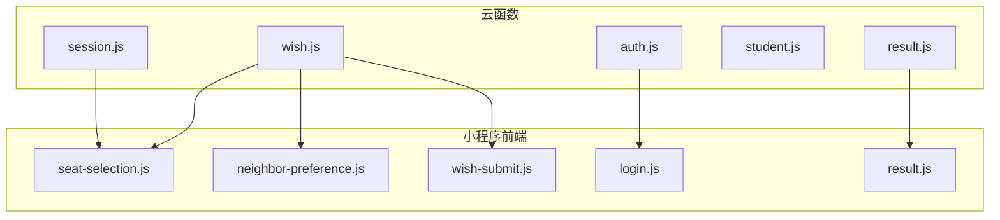
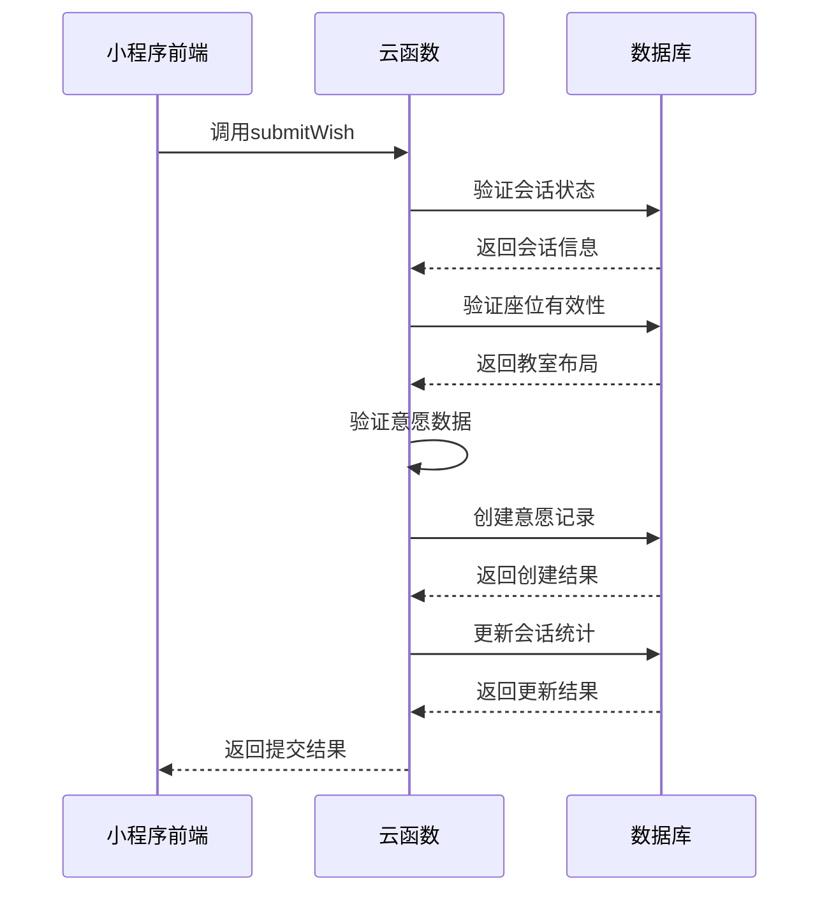
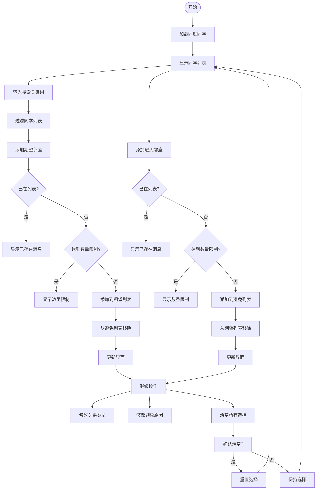
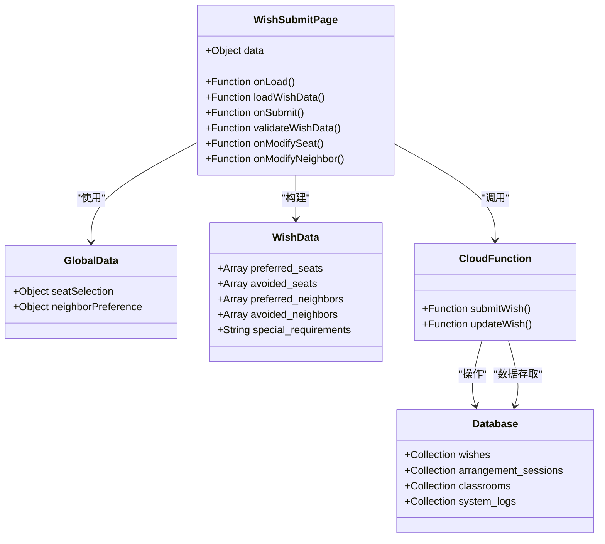
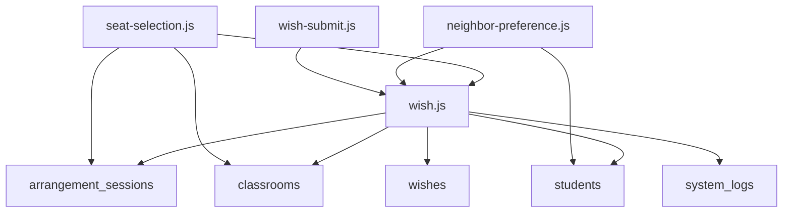

# 意愿管理模块

<cite>
**本文档引用文件**  
- [wish.js](file://cloudfunctions/seatArrangementFunctions/modules/wish.js)
- [seat-selection.js](file://miniprogram/pages/seat-selection/seat-selection.js)
- [neighbor-preference.js](file://miniprogram/pages/neighbor-preference/neighbor-preference.js)
- [wish-submit.js](file://miniprogram/pages/wish-submit/wish-submit.js)
</cite>

## 目录
1. [项目结构](#项目结构)
2. [核心组件](#核心组件)
3. [架构概述](#架构概述)
4. [详细组件分析](#详细组件分析)
5. [依赖分析](#依赖分析)
6. [性能考虑](#性能考虑)
7. [故障排除指南](#故障排除指南)
8. [结论](#结论)

## 项目结构

本项目采用分层架构设计，包含云函数和小程序前端两大部分。云函数模块负责业务逻辑处理和数据存储，小程序前端负责用户交互和数据展示。



**图示来源**  
- [wish.js](file://cloudfunctions/seatArrangementFunctions/modules/wish.js)
- [seat-selection.js](file://miniprogram/pages/seat-selection/seat-selection.js)
- [neighbor-preference.js](file://miniprogram/pages/neighbor-preference/neighbor-preference.js)

**本节来源**  
- [wish.js](file://cloudfunctions/seatArrangementFunctions/modules/wish.js)
- [seat-selection.js](file://miniprogram/pages/seat-selection/seat-selection.js)

## 核心组件

意愿管理模块是学生排座系统的核心功能之一，主要包含三个关键操作：提交意愿、更新意愿和获取个人意愿。这些功能通过云函数实现，确保数据的一致性和安全性。

**本节来源**  
- [wish.js](file://cloudfunctions/seatArrangementFunctions/modules/wish.js#L5-L453)

## 架构概述

意愿管理模块采用前后端分离架构，前端负责收集用户输入，后端进行数据验证和持久化存储。整个流程涉及多个组件的协同工作。



**图示来源**  
- [wish.js](file://cloudfunctions/seatArrangementFunctions/modules/wish.js#L5-L119)
- [seat-selection.js](file://miniprogram/pages/seat-selection/seat-selection.js#L0-L361)

## 详细组件分析

### 座位选择分析

座位选择功能允许学生选择偏好座位和避免座位，通过直观的界面操作完成选择。

```mermaid
flowchart TD
Start([开始]) --> LoadSession["加载当前会话"]
LoadSession --> CheckSession{"会话存在?"}
CheckSession --> |是| LoadWish["加载已有意愿"]
CheckSession --> |否| ShowMessage["显示无会话消息"]
LoadWish --> DisplaySeats["显示座位布局"]
DisplaySeats --> SelectMode["选择模式(偏好/避免)"]
SelectMode --> TapSeat["点击座位"]
TapSeat --> ValidateSeat{"座位有效?"}
ValidateSeat --> |否| ShowError["显示错误消息"]
ValidateSeat --> |是| UpdateSelection["更新选择状态"]
UpdateSelection --> CheckLimit{"达到数量限制?"]
CheckLimit --> |是| ShowLimit["显示数量限制"]
CheckLimit --> |否| UpdateUI["更新界面显示"]
UpdateUI --> Continue["继续选择"]
Continue --> ClearSelection["清空选择"]
ClearSelection --> Confirm["确认清空?"]
Confirm --> |是| Reset["重置选择"]
Confirm --> |否| Keep["保持选择"]
Reset --> DisplaySeats
Keep --> DisplaySeats
```

**图示来源**  
- [seat-selection.js](file://miniprogram/pages/seat-selection/seat-selection.js#L0-L361)

**本节来源**  
- [seat-selection.js](file://miniprogram/pages/seat-selection/seat-selection.js#L0-L361)

### 邻座偏好分析

邻座偏好设置功能允许学生选择期望的邻座和需要避免的邻座，支持搜索和关系类型设置。



**图示来源**  
- [neighbor-preference.js](file://miniprogram/pages/neighbor-preference/neighbor-preference.js#L0-L309)

**本节来源**  
- [neighbor-preference.js](file://miniprogram/pages/neighbor-preference/neighbor-preference.js#L0-L309)

### 意愿提交分析

意愿提交功能整合座位选择和邻座偏好，完成最终的意愿提交流程。



**图示来源**  
- [wish-submit.js](file://miniprogram/pages/wish-submit/wish-submit.js#L0-L121)
- [wish.js](file://cloudfunctions/seatArrangementFunctions/modules/wish.js#L5-L453)

**本节来源**  
- [wish-submit.js](file://miniprogram/pages/wish-submit/wish-submit.js#L0-L121)

## 依赖分析

意愿管理模块涉及多个组件之间的依赖关系，确保功能的完整性和数据的一致性。



**图示来源**  
- [wish.js](file://cloudfunctions/seatArrangementFunctions/modules/wish.js)
- [seat-selection.js](file://miniprogram/pages/seat-selection/seat-selection.js)
- [neighbor-preference.js](file://miniprogram/pages/neighbor-preference/neighbor-preference.js)

**本节来源**  
- [wish.js](file://cloudfunctions/seatArrangementFunctions/modules/wish.js)
- [seat-selection.js](file://miniprogram/pages/seat-selection/seat-selection.js)
- [neighbor-preference.js](file://miniprogram/pages/neighbor-preference/neighbor-preference.js)

## 性能考虑

意愿管理模块在设计时考虑了多个性能因素，包括网络请求优化、数据验证效率和用户体验。

**本节来源**  
- [wish.js](file://cloudfunctions/seatArrangementFunctions/modules/wish.js)
- [seat-selection.js](file://miniprogram/pages/seat-selection/seat-selection.js)
- [neighbor-preference.js](file://miniprogram/pages/neighbor-preference/neighbor-preference.js)

## 故障排除指南

### 常见错误场景及处理方案

1. **超时提交**
   - 错误信息：意愿提交已截止
   - 处理方案：检查会话截止时间，提醒学生在规定时间内完成提交

2. **重复提交**
   - 错误信息：您已提交过意愿，请使用修改功能
   - 处理方案：引导学生使用更新功能修改已有意愿

3. **网络错误**
   - 错误信息：网络错误，请重试
   - 处理方案：检查网络连接，重新尝试提交

4. **数据验证失败**
   - 错误信息：最多只能选择5个偏好座位
   - 处理方案：提示学生调整选择数量，符合系统限制

**本节来源**  
- [wish.js](file://cloudfunctions/seatArrangementFunctions/modules/wish.js#L5-L453)
- [wish-submit.js](file://miniprogram/pages/wish-submit/wish-submit.js#L0-L121)

## 结论

意愿管理模块通过完善的前后端协作，实现了学生座位偏好和邻座偏好的采集功能。系统设计考虑了数据验证、冲突检测和版本控制等关键因素，确保了数据的完整性和一致性。前端交互设计直观易用，后端逻辑严谨可靠，为学生提供了良好的使用体验。