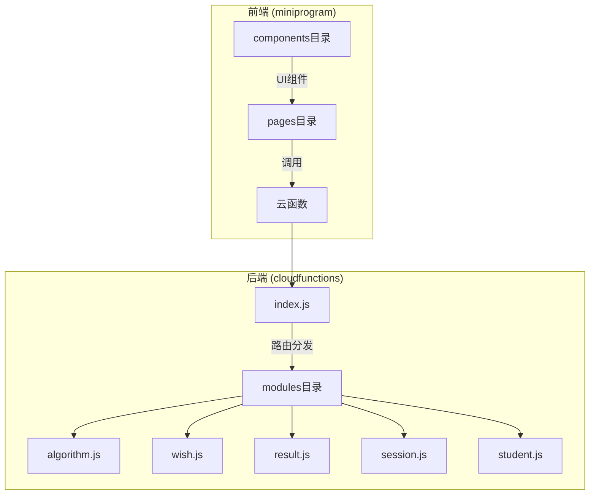
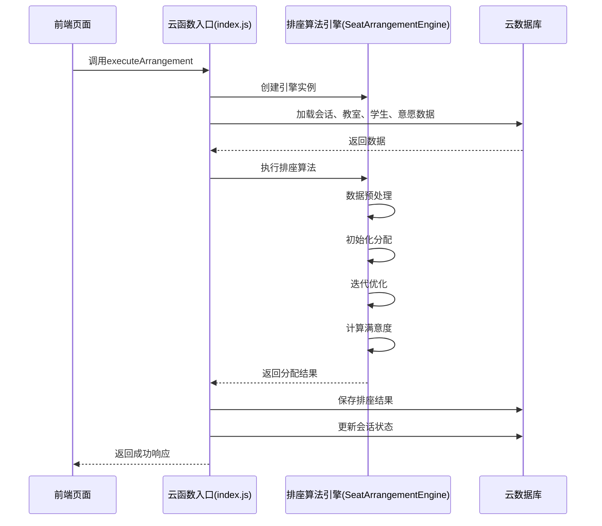
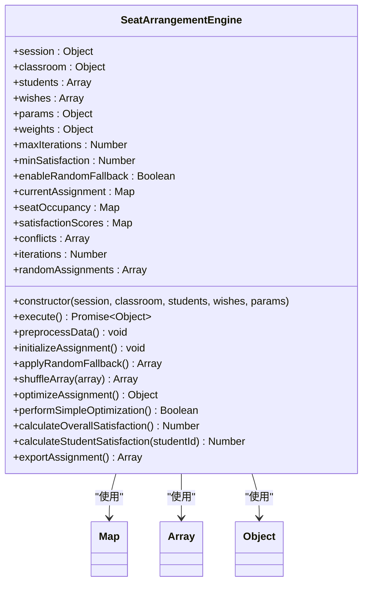
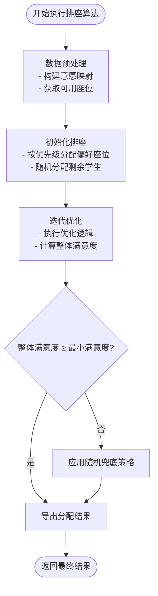
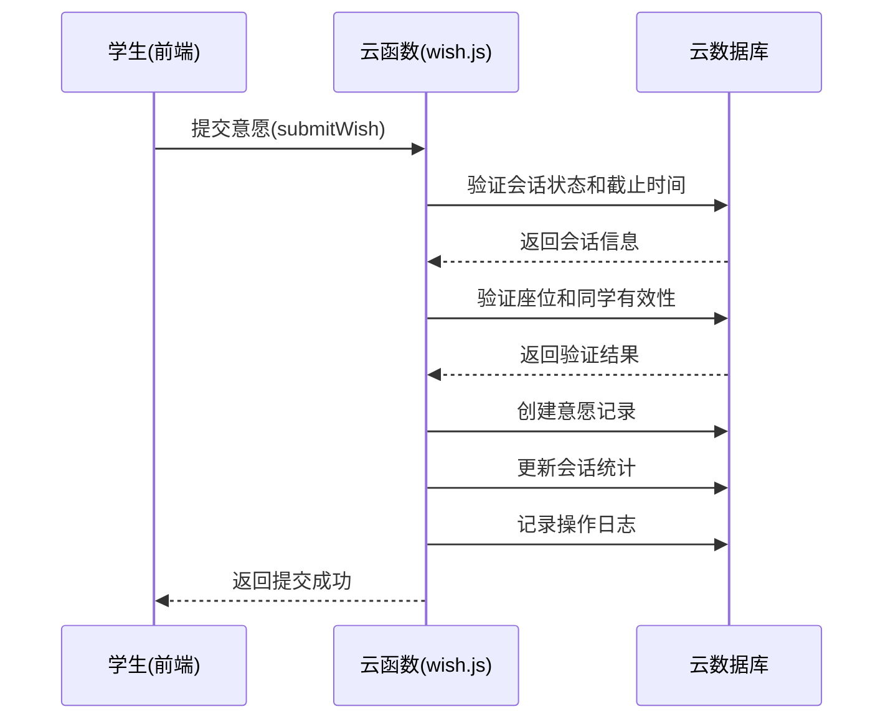
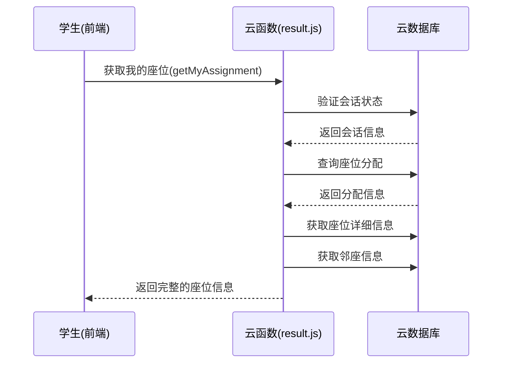
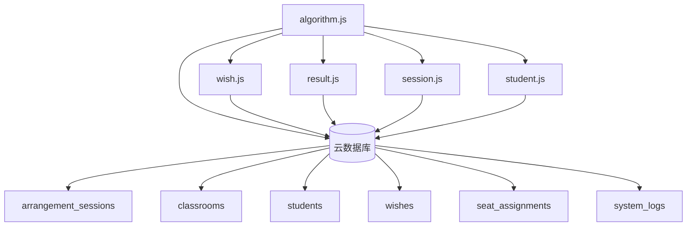

# 排座算法模块

<cite>
**本文档引用文件**  
- [algorithm.js](file://cloudfunctions/seatArrangementFunctions/modules/algorithm.js)
- [wish.js](file://cloudfunctions/seatArrangementFunctions/modules/wish.js)
- [result.js](file://cloudfunctions/seatArrangementFunctions/modules/result.js)
- [session.js](file://cloudfunctions/seatArrangementFunctions/modules/session.js)
- [student.js](file://cloudfunctions/seatArrangementFunctions/modules/student.js)
</cite>

## 目录
1. [简介](#简介)
2. [项目结构](#项目结构)
3. [核心组件](#核心组件)
4. [架构概览](#架构概览)
5. [详细组件分析](#详细组件分析)
6. [依赖分析](#依赖分析)
7. [性能考量](#性能考量)
8. [故障排除指南](#故障排除指南)
9. [结论](#结论)

## 简介
本文档深度解析自动排座算法的核心实现，说明如何将学生意愿转化为最优座位分配方案。重点阐述 `algorithm.js` 中的计算逻辑，包括偏好权重计算、冲突消解策略和优化目标函数。解释算法输入（学生意愿、班级布局）和输出（座位矩阵）的数据结构。提供算法复杂度分析和性能基准测试建议。说明可配置参数（如邻座优先级、公平性权重）对结果的影响，并给出调参指南。包含调试模式的设计，便于追踪算法决策过程。

## 项目结构
本项目为微信小程序云开发架构，包含前端页面和云函数后端。排座算法模块位于云函数 `seatArrangementFunctions` 的 `modules` 目录下，通过 `index.js` 进行路由分发。

**Diagram sources**
- [algorithm.js](file://cloudfunctions/seatArrangementFunctions/modules/algorithm.js)
- [wish.js](file://cloudfunctions/seatArrangementFunctions/modules/wish.js)
- [result.js](file://cloudfunctions/seatArrangementFunctions/modules/result.js)
- [session.js](file://cloudfunctions/seatArrangementFunctions/modules/session.js)
- [student.js](file://cloudfunctions/seatArrangementFunctions/modules/student.js)
- [index.js](file://cloudfunctions/seatArrangementFunctions/index.js)

**Section sources**
- [algorithm.js](file://cloudfunctions/seatArrangementFunctions/modules/algorithm.js)
- [index.js](file://cloudfunctions/seatArrangementFunctions/index.js)

## 核心组件
排座系统的核心组件包括排座算法引擎、学生意愿管理、排座结果管理、排座会话管理和学生信息管理。算法引擎是系统的核心，负责将学生提交的意愿数据转化为最终的座位分配方案。意愿管理模块负责收集和验证学生提交的偏好和避免座位、邻座等信息。结果管理模块负责存储和查询最终的排座结果。会话管理模块负责控制排座流程的状态机。学生信息模块提供学生档案和同班同学列表。

**Section sources**
- [algorithm.js](file://cloudfunctions/seatArrangementFunctions/modules/algorithm.js)
- [wish.js](file://cloudfunctions/seatArrangementFunctions/modules/wish.js)
- [result.js](file://cloudfunctions/seatArrangementFunctions/modules/result.js)
- [session.js](file://cloudfunctions/seatArrangementFunctions/modules/session.js)
- [student.js](file://cloudfunctions/seatArrangementFunctions/modules/student.js)

## 架构概览
系统采用云函数驱动的微服务架构，前端通过云函数调用与后端交互。排座算法作为独立模块被集成，遵循清晰的输入-处理-输出流程。

**Diagram sources**
- [algorithm.js](file://cloudfunctions/seatArrangementFunctions/modules/algorithm.js#L6-L99)
- [index.js](file://cloudfunctions/seatArrangementFunctions/index.js#L200-L210)

## 详细组件分析

### 排座算法引擎分析
`SeatArrangementEngine` 类是排座算法的核心实现，负责将学生意愿转化为最优的座位分配方案。

#### 类结构与依赖关系

**Diagram sources**
- [algorithm.js](file://cloudfunctions/seatArrangementFunctions/modules/algorithm.js#L104-L448)

#### 算法执行流程

**Diagram sources**
- [algorithm.js](file://cloudfunctions/seatArrangementFunctions/modules/algorithm.js#L133-L250)

**Section sources**
- [algorithm.js](file://cloudfunctions/seatArrangementFunctions/modules/algorithm.js#L104-L448)

### 学生意愿管理分析
`wish.js` 模块负责管理学生提交的座位和邻座偏好。

#### 意愿提交流程

**Diagram sources**
- [wish.js](file://cloudfunctions/seatArrangementFunctions/modules/wish.js#L6-L180)

**Section sources**
- [wish.js](file://cloudfunctions/seatArrangementFunctions/modules/wish.js#L6-L180)

### 排座结果管理分析
`result.js` 模块负责管理排座结果的查询和手动调整。

#### 获取排座结果流程

**Diagram sources**
- [result.js](file://cloudfunctions/seatArrangementFunctions/modules/result.js#L6-L100)

**Section sources**
- [result.js](file://cloudfunctions/seatArrangementFunctions/modules/result.js#L6-L150)

## 依赖分析
排座算法模块依赖于多个其他模块和数据库集合，形成了清晰的依赖关系图。

**Diagram sources**
- [algorithm.js](file://cloudfunctions/seatArrangementFunctions/modules/algorithm.js)
- [wish.js](file://cloudfunctions/seatArrangementFunctions/modules/wish.js)
- [result.js](file://cloudfunctions/seatArrangementFunctions/modules/result.js)
- [session.js](file://cloudfunctions/seatArrangementFunctions/modules/session.js)
- [student.js](file://cloudfunctions/seatArrangementFunctions/modules/student.js)

**Section sources**
- [algorithm.js](file://cloudfunctions/seatArrangementFunctions/modules/algorithm.js)
- [index.js](file://cloudfunctions/seatArrangementFunctions/index.js)

## 性能考量
排座算法的性能主要受学生数量和迭代次数的影响。算法的时间复杂度为 O(n * m)，其中 n 是学生数量，m 是最大迭代次数。在 `algorithm.js` 中，`max_iterations` 参数默认为 1000，对于大型班级可能需要调整。算法使用 Map 数据结构进行座位和学生映射，保证了 O(1) 的查找效率。在 `optimizeAssignment` 方法中，简化了优化逻辑，实际应用中可能需要更复杂的交换策略来提高满意度。建议在生产环境中对不同规模的班级进行基准测试，以确定最优的 `max_iterations` 和 `min_satisfaction` 参数。

## 故障排除指南
当排座算法执行失败时，系统会记录详细的日志信息，便于排查问题。

**Section sources**
- [algorithm.js](file://cloudfunctions/seatArrangementFunctions/modules/algorithm.js#L70-L95)
- [result.js](file://cloudfunctions/seatArrangementFunctions/modules/result.js#L300-L350)

## 结论
本文档详细解析了自动排座算法的核心实现。`SeatArrangementEngine` 通过多权重评分系统将学生意愿转化为座位分配方案，结合了初始化分配、迭代优化和随机兜底策略，确保了算法的鲁棒性。系统设计了完善的意愿管理、结果查询和手动调整功能，形成了一个完整的排座解决方案。通过合理的参数配置和性能优化，该算法能够有效满足实际教学场景的需求。