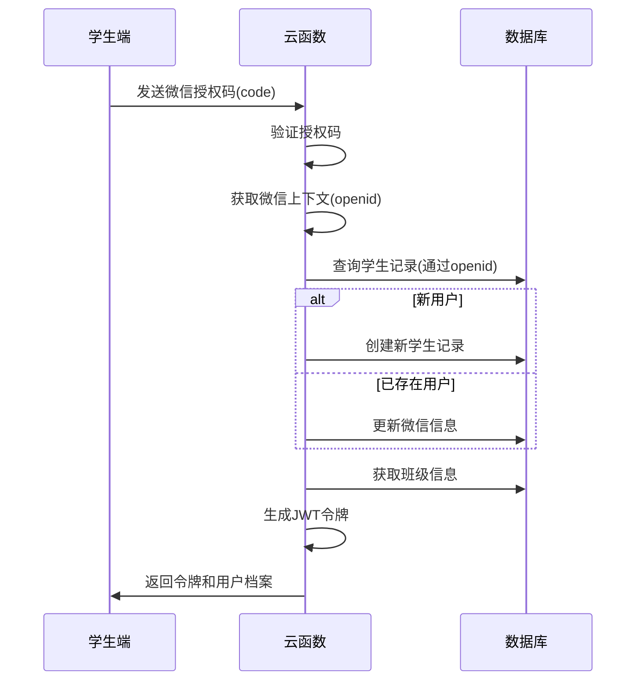
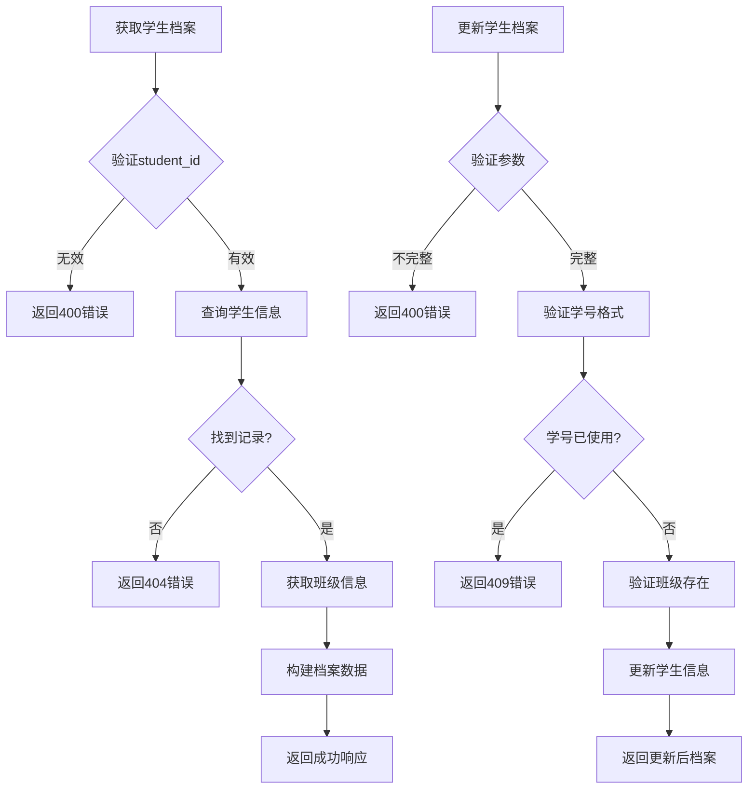
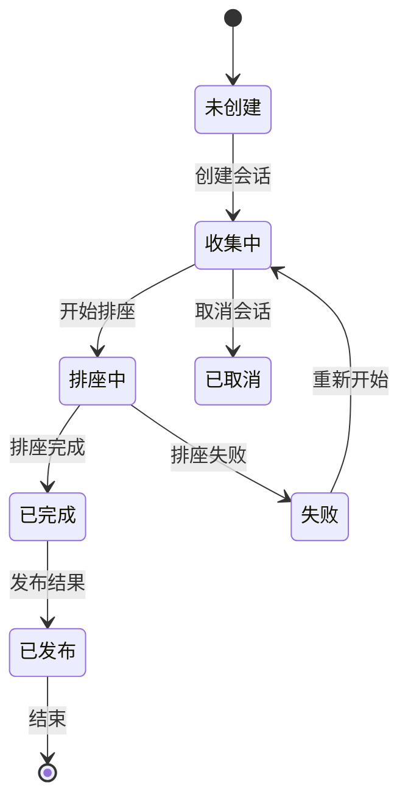
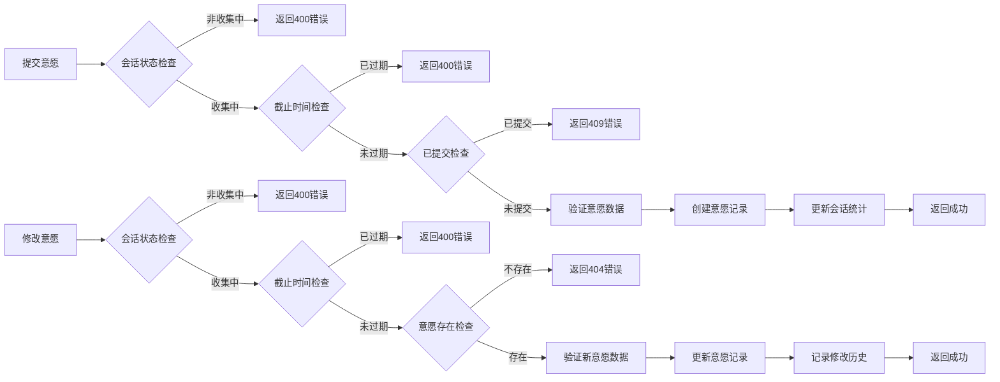
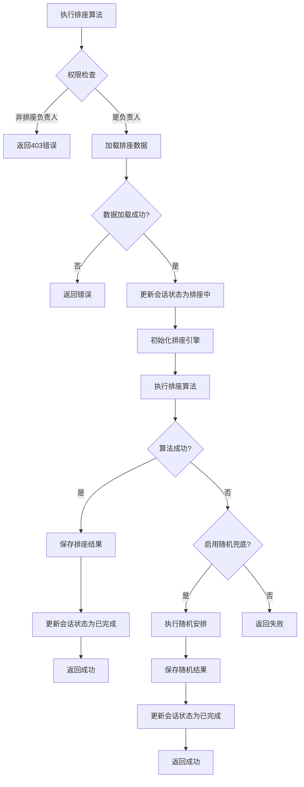

# 核心功能模块

<cite>
**本文档引用的文件**
- [auth.js](file://cloudfunctions/seatArrangementFunctions/modules/auth.js)
- [student.js](file://cloudfunctions/seatArrangementFunctions/modules/student.js)
- [session.js](file://cloudfunctions/seatArrangementFunctions/modules/session.js)
- [wish.js](file://cloudfunctions/seatArrangementFunctions/modules/wish.js)
- [algorithm.js](file://cloudfunctions/seatArrangementFunctions/modules/algorithm.js)
- [result.js](file://cloudfunctions/seatArrangementFunctions/modules/result.js)
- [index.js](file://cloudfunctions/seatArrangementFunctions/index.js)
</cite>

## 目录
1. [用户认证模块](#用户认证模块)
2. [学生管理模块](#学生管理模块)
3. [会话管理模块](#会话管理模块)
4. [意愿管理模块](#意愿管理模块)
5. [排座算法模块](#排座算法模块)
6. [结果管理模块](#结果管理模块)
7. [模块协同工作流程](#模块协同工作流程)

## 用户认证模块

用户认证模块负责处理学生和管理员的登录认证，通过JWT令牌实现安全的身份验证。该模块提供了微信登录、管理员登录和令牌刷新三个核心接口。



**接口定义**
- **微信登录** (`wxLogin`): 接收微信授权码，验证后返回JWT令牌和用户档案
- **管理员登录** (`adminLogin`): 验证管理员凭据，返回管理令牌和权限信息
- **令牌刷新** (`refreshToken`): 使用刷新令牌获取新的访问令牌

**内部逻辑**
1. 验证输入参数完整性
2. 通过微信上下文获取用户openid
3. 在数据库中查找或创建学生记录
4. 关联班级信息并构建用户档案
5. 生成具有有效期的JWT令牌

**调用示例**
```javascript
// 学生微信登录
const result = await cloud.callFunction({
  name: 'seatArrangementFunctions',
  data: {
    type: 'wxLogin',
    code: 'wechat_auth_code',
    userInfo: {
      nickName: '张三',
      avatarUrl: 'https://example.com/avatar.jpg',
      gender: 1
    }
  }
});
```

**错误处理策略**
- 缺少授权码：返回400错误，提示"缺少微信授权码"
- 获取微信信息失败：返回400错误，提示"获取微信用户信息失败"
- 数据库操作异常：返回500错误，记录详细错误日志
- 令牌生成失败：捕获JWT异常，返回500错误

**模块协同**
- 与学生管理模块共享学生数据结构
- 为会话管理模块提供认证后的用户信息
- 为意愿管理模块验证用户身份
- 为排座算法模块确保管理员权限

**Section sources**
- [auth.js](file://cloudfunctions/seatArrangementFunctions/modules/auth.js#L5-L244)
- [index.js](file://cloudfunctions/seatArrangementFunctions/index.js#L70-L75)

## 学生管理模块

学生管理模块负责学生档案的查询、更新和班级信息管理，为排座系统提供基础的学生数据支持。



**接口定义**
- **获取学生档案** (`getProfile`): 根据student_id查询学生信息
- **更新学生档案** (`updateProfile`): 修改学生基本信息和特殊需求
- **获取同班同学** (`getClassmates`): 查询同班活跃学生列表
- **获取班级列表** (`getClassList`): 获取所有活跃班级信息
- **批量导入学生** (`importStudents`): 管理员批量导入学生数据

**内部逻辑**
1. 参数验证和权限检查
2. 数据库查询和更新操作
3. 学号格式验证（9-12位数字）
4. 学号唯一性检查
5. 班级存在性验证
6. 批量导入的逐条处理和错误收集

**调用示例**
```javascript
// 更新学生档案
const result = await cloud.callFunction({
  name: 'seatArrangementFunctions',
  data: {
    type: 'updateStudentProfile',
    token: 'user_jwt_token',
    profile_data: {
      name: '李四',
      student_number: '20210001',
      class_id: 'class_001',
      special_needs: {
        vision_impaired: true,
        hearing_impaired: false,
        height_tall: true,
        other_requirements: '需要前排座位'
      }
    }
  }
});
```

**错误处理策略**
- 参数不完整：返回400错误，提示"参数不完整"
- 学号格式错误：返回400错误，提示"学号格式不正确"
- 学号已被使用：返回409错误，提示"学号已被使用"
- 班级不存在：返回400错误，提示"指定的班级不存在"
- 数据库查询失败：返回500错误，记录详细错误日志

**模块协同**
- 与用户认证模块共享学生数据结构
- 为会话管理模块提供班级学生总数
- 为意愿管理模块验证学生班级信息
- 为结果管理模块提供学生基本信息

**Section sources**
- [student.js](file://cloudfunctions/seatArrangementFunctions/modules/student.js#L5-L321)
- [index.js](file://cloudfunctions/seatArrangementFunctions/index.js#L83-L87)

## 会话管理模块

会话管理模块负责排座会话的生命周期管理，包括创建、状态更新和统计信息获取，是排座流程的核心控制中心。



**接口定义**
- **获取当前会话** (`getCurrentSession`): 查询指定班级的当前排座会话
- **创建排座会话** (`createSession`): 创建新的排座任务
- **获取会话统计** (`getStatistics`): 获取会话的详细统计信息
- **更新会话状态** (`updateSessionStatus`): 修改会话状态（如开始排座、发布结果）

**内部逻辑**
1. 会话状态机管理（收集中、排座中、已完成、已发布、已取消）
2. 权限验证（仅排座负责人可创建和更新会话）
3. 会话参数验证（教室、班级、截止时间）
4. 统计信息实时更新（提交率、完成率）
5. 操作日志记录

**调用示例**
```javascript
// 创建排座会话
const result = await cloud.callFunction({
  name: 'seatArrangementFunctions',
  data: {
    type: 'createSession',
    token: 'admin_jwt_token',
    session_data: {
      classroom_id: 'room_001',
      class_id: 'class_001',
      deadline: '2023-12-31T23:59:59Z',
      title: '期末座位安排',
      description: '本学期最后一次座位调整',
      algorithm_params: {
        wish_weight: 0.4,
        teaching_weight: 0.3,
        fairness_weight: 0.2,
        constraint_weight: 0.1
      }
    }
  }
});
```

**错误处理策略**
- 权限不足：返回403错误，提示"权限不足"
- 缺少必要参数：返回400错误，提示"缺少必要参数"
- 教室不存在：返回400错误，提示"指定的教室不存在"
- 班级不存在：返回400错误，提示"指定的班级不存在"
- 已有进行中会话：返回409错误，提示"该班级已有进行中的排座会话"
- 状态转换无效：返回400错误，提示"无法从当前状态转换到目标状态"

**模块协同**
- 与用户认证模块验证管理员身份
- 与意愿管理模块协调意愿收集截止时间
- 与排座算法模块触发排座任务
- 与结果管理模块同步会话状态

**Section sources**
- [session.js](file://cloudfunctions/seatArrangementFunctions/modules/session.js#L5-L415)
- [index.js](file://cloudfunctions/seatArrangementFunctions/index.js#L95-L98)

## 意愿管理模块

意愿管理模块负责学生座位意愿的提交、修改和查询，是排座算法的重要输入来源。



**接口定义**
- **提交意愿** (`submitWish`): 学生首次提交座位意愿
- **更新意愿** (`updateWish`): 学生修改已提交的意愿
- **获取我的意愿** (`getMyWish`): 查询学生自己的意愿记录

**内部逻辑**
1. 会话状态和截止时间验证
2. 意愿数据有效性验证（座位、邻座选择）
3. 提交冲突检查（防止重复提交）
4. 修改历史记录（版本控制）
5. 会话统计信息更新

**调用示例**
```javascript
// 提交座位意愿
const result = await cloud.callFunction({
  name: 'seatArrangementFunctions',
  data: {
    type: 'submitWish',
    token: 'student_jwt_token',
    session_id: 'session_001',
    wish_data: {
      preferred_seats: [
        { seat_id: 'A1', priority: 1 },
        { seat_id: 'A2', priority: 2 }
      ],
      avoided_seats: [
        { seat_id: 'C5' }
      ],
      preferred_neighbors: [
        { student_id: 'stu_002' }
      ],
      avoided_neighbors: [
        { student_id: 'stu_003' }
      ],
      special_requirements: '需要靠近电源插座'
    }
  }
});
```

**错误处理策略**
- 会话不在收集中状态：返回400错误，提示"排座会话不存在或已结束意愿收集"
- 意愿提交已截止：返回400错误，提示"意愿提交已截止"
- 已提交过意愿：返回409错误，提示"您已提交过意愿，请使用修改功能"
- 意愿数据无效：返回400错误，具体说明无效原因
- 数据库操作失败：返回500错误，记录详细错误日志

**模块协同**
- 与会话管理模块同步会话状态和截止时间
- 为排座算法模块提供学生意愿数据
- 与结果管理模块关联学生与座位分配
- 与学生管理模块验证同班同学关系

**Section sources**
- [wish.js](file://cloudfunctions/seatArrangementFunctions/modules/wish.js#L5-L453)
- [index.js](file://cloudfunctions/seatArrangementFunctions/index.js#L110-L112)

## 排座算法模块

排座算法模块是系统的核心计算引擎，基于学生意愿和多权重评分系统计算最优座位安排。



**接口定义**
- **执行排座** (`executeArrangement`): 启动排座算法计算最优解

**内部逻辑**
1. 权限验证（仅排座负责人可执行）
2. 数据预处理（构建学生、座位、意愿映射）
3. 初始化分配（基于偏好座位的初始分配）
4. 迭代优化（多轮优化提升整体满意度）
5. 质量检查（满意度阈值验证）
6. 兜底策略（随机安排作为备选方案）

**算法核心流程**
1. **数据预处理**：构建学生意愿映射和可用座位列表
2. **初始化分配**：优先满足学生的偏好座位请求
3. **迭代优化**：通过交换优化提升整体满意度
4. **质量评估**：检查满意度是否达到预设阈值
5. **兜底策略**：若无法找到满意解，则采用随机安排

**调用示例**
```javascript
// 执行排座算法
const result = await cloud.callFunction({
  name: 'seatArrangementFunctions',
  data: {
    type: 'executeArrangement',
    token: 'seat_manager_jwt_token',
    session_id: 'session_001',
    force_start: true
  }
});
```

**错误处理策略**
- 权限不足：返回403错误，提示"权限不足"
- 会话ID缺失：返回400错误，提示"缺少会话ID"
- 数据加载失败：返回相应错误码和消息
- 算法执行失败：自动启用随机兜底策略或返回500错误
- 会话状态更新失败：记录错误日志，但不影响主流程

**模块协同**
- 与会话管理模块同步排座进度和状态
- 从意愿管理模块获取学生意愿数据
- 使用学生管理模块提供的学生信息
- 将结果传递给结果管理模块进行存储和查询
- 依赖用户认证模块验证执行权限

**Section sources**
- [algorithm.js](file://cloudfunctions/seatArrangementFunctions/modules/algorithm.js#L6-L508)
- [index.js](file://cloudfunctions/seatArrangementFunctions/index.js#L100)

## 结果管理模块

结果管理模块负责排座结果的查询、展示和手动调整，为学生和管理员提供最终的座位分配信息。

```mermaid
flowchart TD
    A[获取我的座位] --> B{参数验证}
    B -->|无效| C[返回400错误]
    B -->|有效| D[验证会话状态]
    D -->|未完成| E[返回404错误]
    D -->|已完成| F[查询座位分配]
    F --> G{找到分配?}
    G -->|否| H[返回404错误]
    G -->|是| I[获取座位详情]
    I --> J[获取邻座信息]
    J --> K[构建响应数据]
    K --> L[返回成功]
    
    M[获取排座结果] --> N{权限检查}
    N -->|无权限| O[返回403错误]
    N -->|有权限| P[验证会话状态]
    P -->|未完成| Q[返回404错误]
    P -->|已完成| R[获取所有分配]
    R --> S[构建座位图]
    S --> T{详细格式?}
    T -->|是| U[计算统计信息]
    U --> V[获取冲突记录]
    V --> W[返回