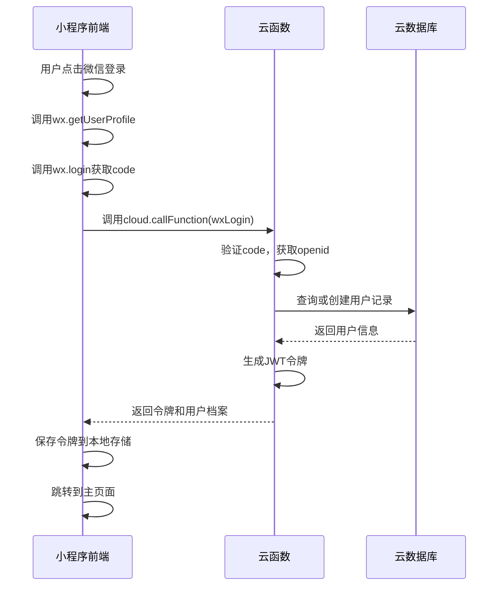
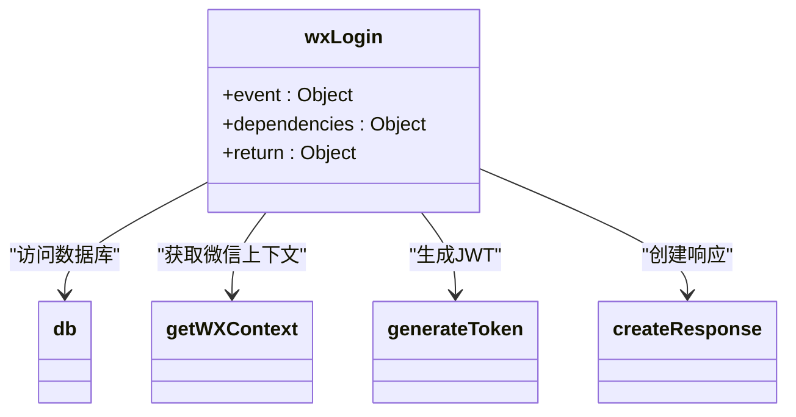
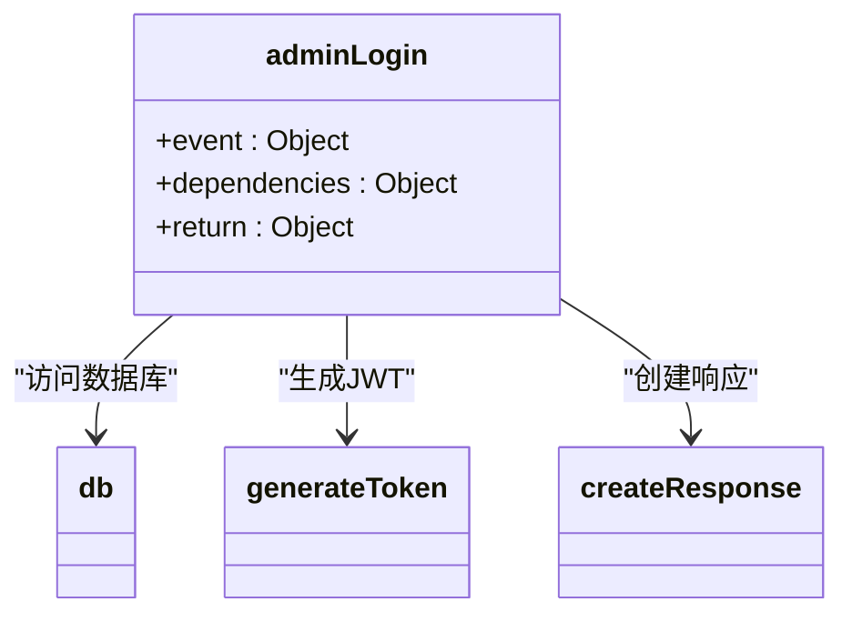
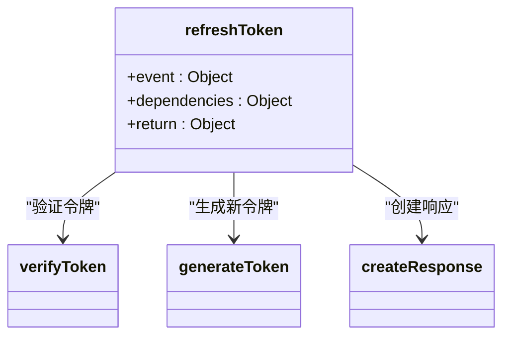
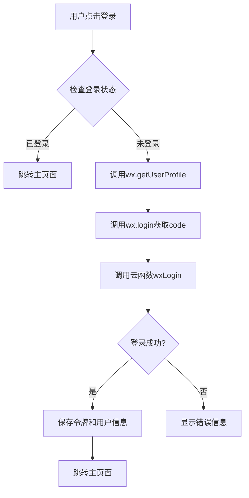
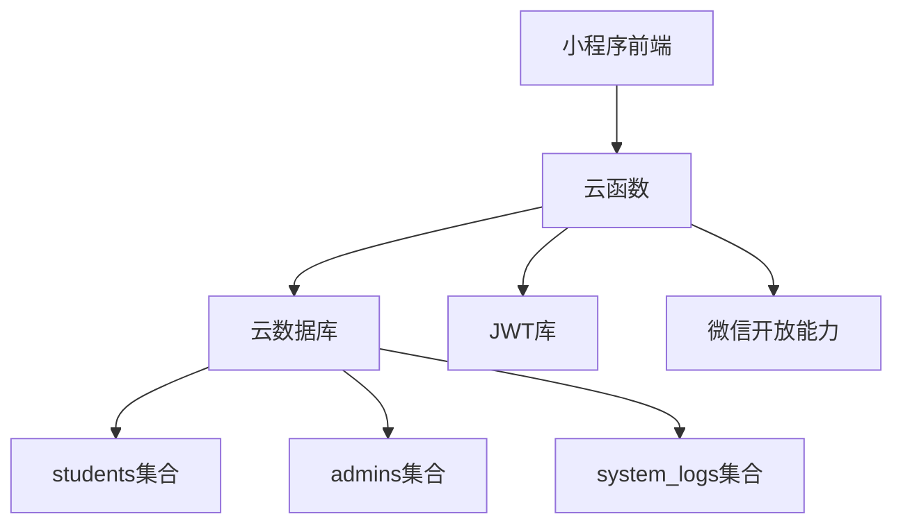

# 用户认证模块

<cite>
**本文档引用的文件**  
- [auth.js](file://cloudfunctions/seatArrangementFunctions/modules/auth.js)
- [login.js](file://miniprogram/pages/login/login.js)
- [index.js](file://cloudfunctions/seatArrangementFunctions/index.js)
</cite>

## 目录
1. [简介](#简介)
2. [项目结构](#项目结构)
3. [核心组件](#核心组件)
4. [架构概述](#架构概述)
5. [详细组件分析](#详细组件分析)
6. [依赖分析](#依赖分析)
7. [性能考虑](#性能考虑)
8. [故障排除指南](#故障排除指南)
9. [结论](#结论)

## 简介
本文档详细描述了微信登录、管理员登录和JWT令牌刷新机制的实现。重点分析了`auth.js`中各函数（如`wxLogin`、`adminLogin`、`refreshToken`）的接口定义、参数校验逻辑和安全策略。结合`login.js`前端调用流程，说明认证状态的管理方式。提供完整的调用示例，包括请求参数格式、成功响应和常见错误码（如401未授权）。说明与云数据库中用户集合的交互方式，以及密码加密存储的实现。指出潜在的安全风险及防范措施，如防止暴力破解、令牌泄露等。

## 项目结构
本项目采用云开发架构，包含云函数和小程序前端两大部分。云函数`seatArrangementFunctions`包含认证、学生管理、会话管理等多个模块。小程序前端包含登录、个人资料、座位选择等页面。认证模块主要由`auth.js`实现，前端登录逻辑在`login.js`中处理。

**Section sources**
- [auth.js](file://cloudfunctions/seatArrangementFunctions/modules/auth.js)
- [login.js](file://miniprogram/pages/login/login.js)

## 核心组件
认证模块的核心组件包括微信登录、管理员登录和令牌刷新功能。这些功能通过云函数实现，前端通过云调用与后端交互。认证状态通过本地存储管理，包括令牌、用户信息和过期时间。

**Section sources**
- [auth.js](file://cloudfunctions/seatArrangementFunctions/modules/auth.js#L5-L238)
- [login.js](file://miniprogram/pages/login/login.js#L1-L184)

## 架构概述
系统采用前后端分离架构，前端小程序通过云调用与后端云函数通信。认证流程包括微信授权、云函数处理和本地状态管理三个阶段。JWT令牌用于身份验证，包含用户角色和权限信息。

**Diagram sources**
- [auth.js](file://cloudfunctions/seatArrangementFunctions/modules/auth.js#L5-L118)
- [login.js](file://miniprogram/pages/login/login.js#L45-L100)

## 详细组件分析

### 微信登录分析
微信登录功能实现了基于微信开放能力的免密登录。用户授权后，前端获取用户信息和登录凭证，调用云函数完成认证流程。

#### 接口定义

**Diagram sources**
- [auth.js](file://cloudfunctions/seatArrangementFunctions/modules/auth.js#L5-L118)

#### 参数校验逻辑
微信登录函数对输入参数进行严格校验，确保`code`和用户信息存在。通过微信上下文获取`openid`，作为用户唯一标识。如果`openid`获取失败，返回400错误。

#### 安全策略
- 使用微信官方授权机制，确保用户身份真实性
- 通过`openid`作为用户标识，避免敏感信息暴露
- 生成JWT令牌时包含学生ID、角色和班级信息
- 令牌有效期设置为7天，平衡安全性和用户体验

**Section sources**
- [auth.js](file://cloudfunctions/seatArrangementFunctions/modules/auth.js#L5-L118)
- [login.js](file://miniprogram/pages/login/login.js#L45-L100)

### 管理员登录分析
管理员登录功能为系统管理员提供认证入口，支持用户名密码登录。

#### 接口定义

**Diagram sources**
- [auth.js](file://cloudfunctions/seatArrangementFunctions/modules/auth.js#L123-L207)

#### 参数校验逻辑
管理员登录函数校验用户名和密码是否为空。查询数据库中激活状态的管理员记录，验证密码匹配性。密码验证目前为明文比较，实际项目中应使用加密存储。

#### 安全策略
- 仅查询激活状态的管理员账户
- 登录成功后记录登录日志，包含用户名和登录类型
- 生成JWT令牌有效期为8小时，较学生用户更短
- 令牌包含管理员ID、用户名、角色和管理的班级信息

**Section sources**
- [auth.js](file://cloudfunctions/seatArrangementFunctions/modules/auth.js#L123-L207)

### 令牌刷新分析
令牌刷新功能允许用户在访问令牌过期后获取新的访问令牌，无需重新登录。

#### 接口定义

**Diagram sources**
- [auth.js](file://cloudfunctions/seatArrangementFunctions/modules/auth.js#L212-L238)

#### 参数校验逻辑
令牌刷新函数校验刷新令牌是否存在。使用`verifyToken`函数验证令牌有效性，失败则返回401错误。验证通过后，使用原令牌的载荷生成新的访问令牌。

#### 安全策略
- 刷新令牌本身需要保密，防止泄露
- 新生成的访问令牌有效期为2小时
- 通过统一的令牌验证机制确保安全性
- 错误处理中不泄露具体失败原因

**Section sources**
- [auth.js](file://cloudfunctions/seatArrangementFunctions/modules/auth.js#L212-L238)

### 前端认证状态管理
前端通过本地存储管理用户认证状态，实现登录态的持久化。

#### 登录流程

**Diagram sources**
- [login.js](file://miniprogram/pages/login/login.js#L45-L100)

#### 状态管理
- 使用`wx.setStorageSync`保存令牌、用户信息和过期时间
- 在`onLoad`时检查登录状态，实现自动登录
- 提供退出登录功能，清除本地存储
- 检查用户信息完整性，引导完善资料

**Section sources**
- [login.js](file://miniprogram/pages/login/login.js#L1-L184)

## 依赖分析
认证模块依赖云数据库、JWT库和云函数基础能力。前端依赖微信小程序基础库2.2.3以上版本。

**Diagram sources**
- [index.js](file://cloudfunctions/seatArrangementFunctions/index.js#L1-L306)
- [auth.js](file://cloudfunctions/seatArrangementFunctions/modules/auth.js)

## 性能考虑
- 云函数冷启动时间影响首次登录速度
- 数据库查询优化，使用索引提高查询效率
- 令牌生成和验证使用高效算法
- 前端避免重复调用云函数

## 故障排除指南
### 常见错误码
| 错误码 | 含义 | 解决方案 |
|-------|------|---------|
| 400 | 参数错误 | 检查请求参数是否完整 |
| 401 | 未授权 | 检查用户名密码或令牌有效性 |
| 404 | 资源不存在 | 检查数据库记录是否存在 |
| 500 | 服务器错误 | 查看云函数日志 |

### 安全风险及防范
- **暴力破解**：目前无失败次数限制，建议增加登录失败锁定机制
- **令牌泄露**：使用HTTPS传输，前端避免日志输出令牌
- **密码明文存储**：应使用bcrypt等算法加密存储密码
- **会话固定**：每次登录生成新令牌，旧令牌立即失效

**Section sources**
- [auth.js](file://cloudfunctions/seatArrangementFunctions/modules/auth.js)
- [login.js](file://miniprogram/pages/login/login.js)

## 结论
用户认证模块实现了微信登录、管理员登录和令牌刷新功能，通过JWT实现安全的身份验证。前端与后端通过云函数高效通信，本地存储管理认证状态。建议加强密码加密存储和登录安全策略，进一步提升系统安全性。