# 结果管理模块

<cite>
**本文档引用的文件**   
- [result.js](file://cloudfunctions/seatArrangementFunctions/modules/result.js)
- [result.js](file://miniprogram/pages/result/result.js)
- [index.js](file://cloudfunctions/seatArrangementFunctions/index.js)
- [fileManager.js](file://desktop/src/fileManager.js)
</cite>

## 目录
1. [简介](#简介)
2. [结果生成与算法协同流程](#结果生成与算法协同流程)
3. [核心功能实现机制](#核心功能实现机制)
4. [前端页面交互设计](#前端页面交互设计)
5. [权限控制与审计日志](#权限控制与审计日志)
6. [结果发布状态机](#结果发布状态机)
7. [数据导出与性能优化](#数据导出与性能优化)

## 简介

结果管理模块负责排座结果的生成、查询、调整和展示。该模块通过云函数实现后端逻辑，结合小程序前端页面为学生和管理员提供完整的排座结果管理功能。系统支持获取个人座位分配、查看完整排座图、手动调整座位等核心功能，并实现了完善的权限控制和审计机制。

**Section sources**
- [result.js](file://cloudfunctions/seatArrangementFunctions/modules/result.js#L1-L10)

## 结果生成与算法协同流程

排座结果的生成是一个多阶段的协同过程，涉及会话管理、意愿收集、算法执行和结果存储等多个组件的协作。整个流程从创建排座会话开始，经过意愿收集阶段，最终由算法模块执行排座并生成结果。

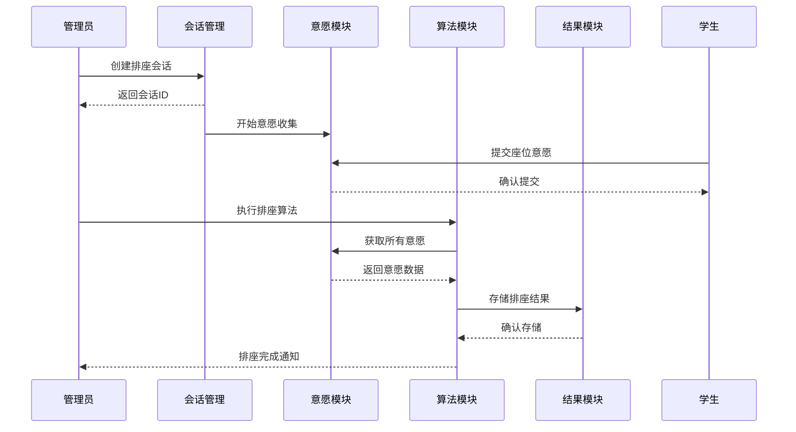

**Diagram sources**
- [index.js](file://cloudfunctions/seatArrangementFunctions/index.js#L200-L267)
- [result.js](file://cloudfunctions/seatArrangementFunctions/modules/result.js#L81-L164)

## 核心功能实现机制

### 结果生成机制

排座结果的生成由`getArrangementResult`函数实现，该函数负责构建完整的排座图和相关统计信息。函数首先验证会话状态，确保排座结果已生成或已发布，然后从数据库获取所有座位分配数据。

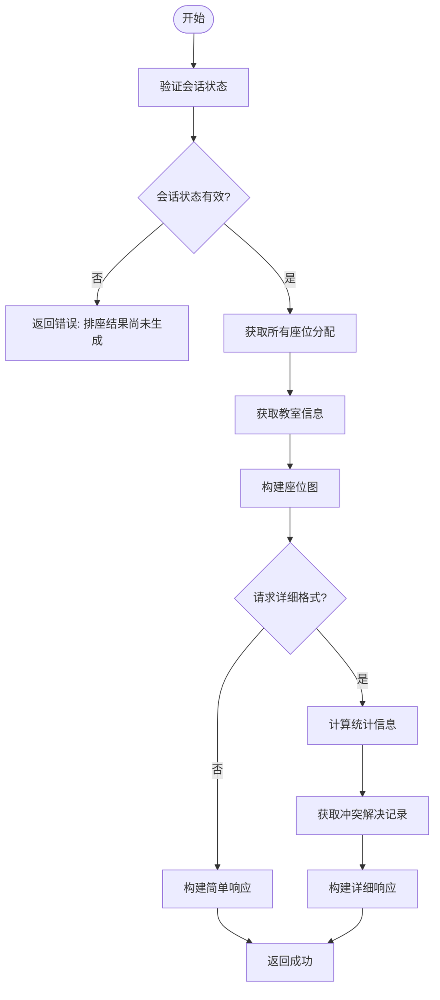

**Diagram sources**
- [result.js](file://cloudfunctions/seatArrangementFunctions/modules/result.js#L81-L164)
- [result.js](file://cloudfunctions/seatArrangementFunctions/modules/result.js#L226-L257)

### 个人座位查询机制

`getMyAssignment`函数实现了学生查询个人座位的功能。该函数首先验证用户身份和会话状态，然后查找学生的具体座位分配，并补充座位详细信息和邻座信息。

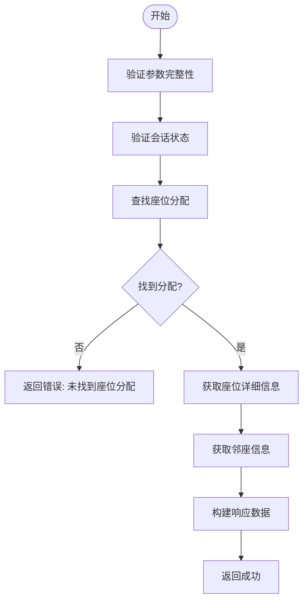

**Diagram sources**
- [result.js](file://cloudfunctions/seatArrangementFunctions/modules/result.js#L5-L76)
- [result.js](file://cloudfunctions/seatArrangementFunctions/modules/result.js#L166-L224)

### 座位调整机制

`manualAdjustSeat`函数实现了管理员手动调整座位的功能。该函数包含严格的权限检查、调整验证和操作审计机制，确保调整过程的安全性和可追溯性。

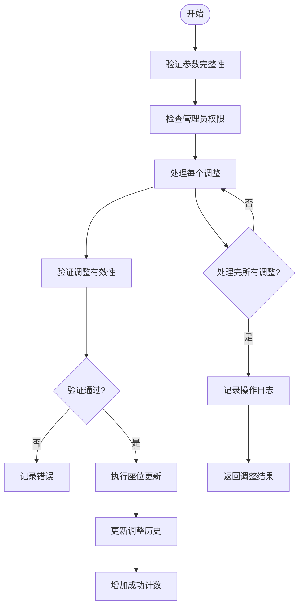

**Diagram sources**
- [result.js](file://cloudfunctions/seatArrangementFunctions/modules/result.js#L325-L416)
- [result.js](file://cloudfunctions/seatArrangementFunctions/modules/result.js#L421-L449)

## 前端页面交互设计

### 页面生命周期与数据加载

结果页面的交互设计遵循小程序的生命周期，通过`onLoad`和`onShow`事件钩子实现数据的自动加载和刷新。页面首先检查登录状态，然后加载当前会话信息，并根据会话状态决定是否加载排座结果。

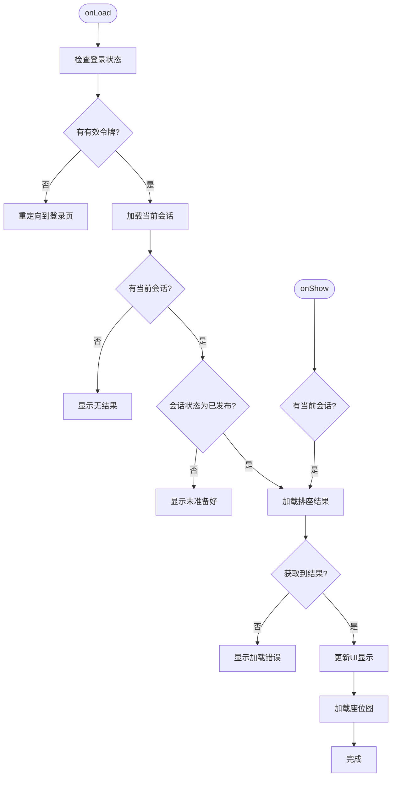

**Diagram sources**
- [result.js](file://miniprogram/pages/result/result.js#L1-L76)

### 用户交互功能

结果页面提供了丰富的用户交互功能，包括下拉刷新、结果分享、查看统计和重新提交意愿等。这些功能通过事件绑定和云函数调用实现，为用户提供完整的排座结果管理体验。

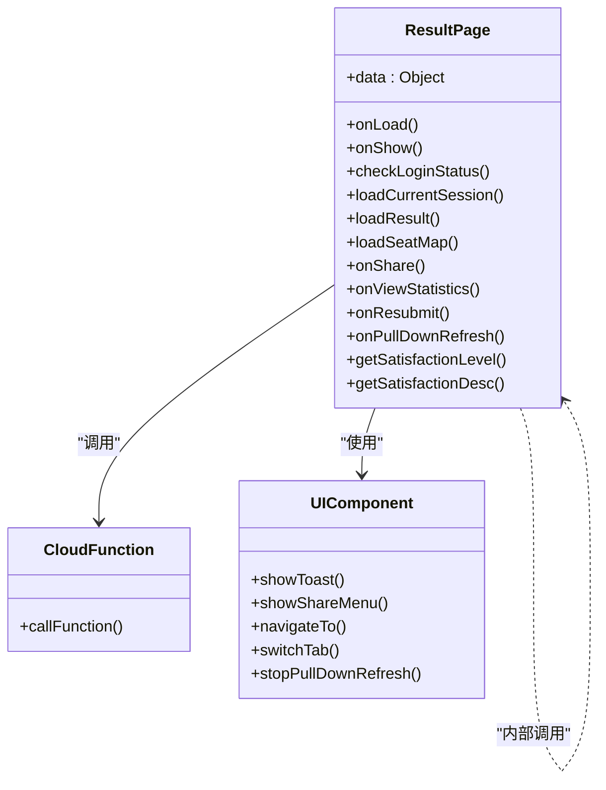

**Diagram sources**
- [result.js](file://miniprogram/pages/result/result.js#L78-L205)

## 权限控制与审计日志

### 权限控制机制

系统实现了严格的权限控制机制，确保不同角色只能访问其权限范围内的功能。管理员和座位管理员可以查看详细结果，而普通学生只能查看简单结果。

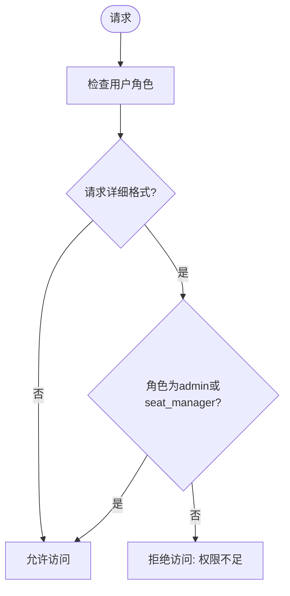

**Diagram sources**
- [result.js](file://cloudfunctions/seatArrangementFunctions/modules/result.js#L90-L93)

### 审计日志记录

所有手动调整操作都会被记录到系统日志中，包括操作者、操作时间、调整详情和结果。这为系统的安全性和可追溯性提供了保障。

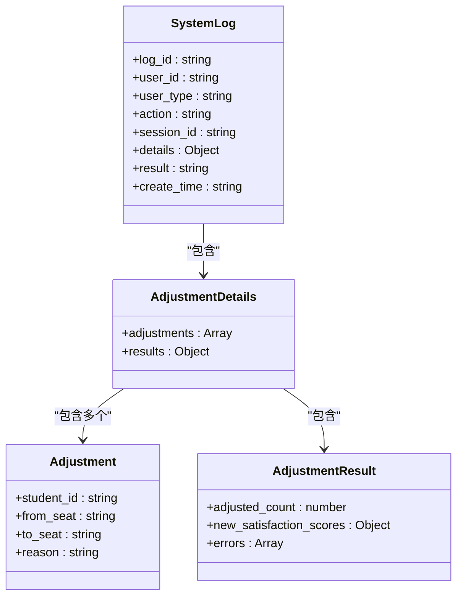

**Diagram sources**
- [result.js](file://cloudfunctions/seatArrangementFunctions/modules/result.js#L398-L416)

## 结果发布状态机

排座会话的状态管理采用状态机模式，确保系统状态的正确转换和数据一致性。会话状态从创建到完成，经历多个阶段，每个阶段都有明确的入口和出口条件。

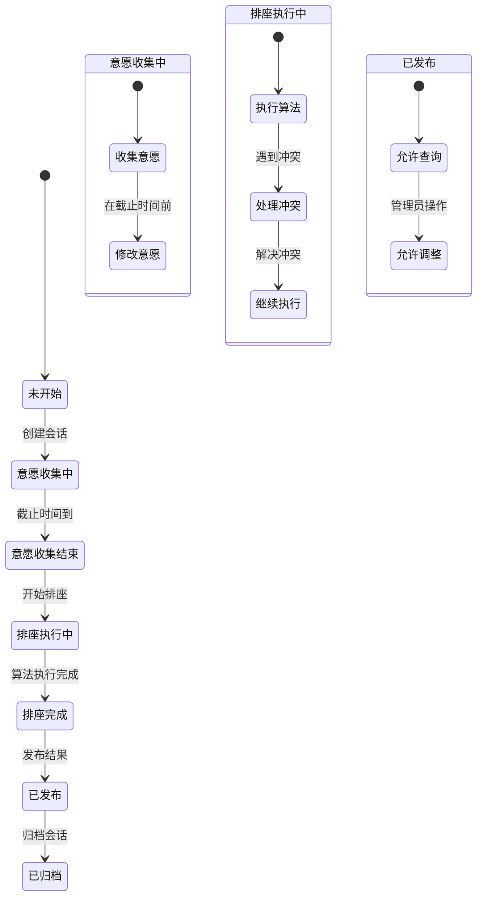

**Diagram sources**
- [result.js](file://cloudfunctions/seatArrangementFunctions/modules/result.js#L58-L62)
- [result.js](file://cloudfunctions/seatArrangementFunctions/modules/result.js#L105-L109)

## 数据导出与性能优化

### 数据导出功能

系统提供了排座结果的Excel导出功能，支持将结果数据导出为结构化的Excel文件，便于存档和进一步分析。

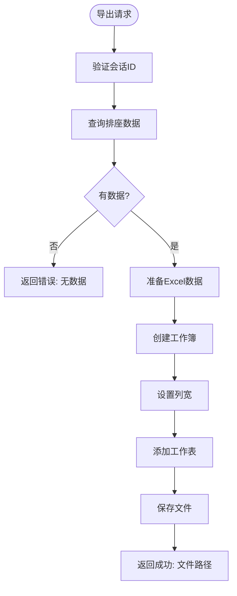

**Diagram sources**
- [fileManager.js](file://desktop/src/fileManager.js#L188-L255)

### 性能优化建议

针对大规模结果集的查询，建议采用分页查询机制，避免一次性加载过多数据导致性能问题。

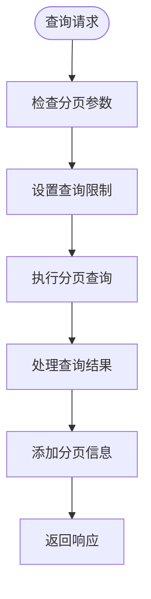

**Section sources**
- [fileManager.js](file://desktop/src/fileManager.js#L188-L255)
- [result.js](file://cloudfunctions/seatArrangementFunctions/modules/result.js#L120-L125)