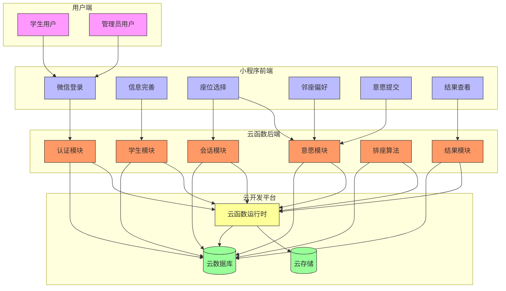

# 系统概述

<cite>
**本文档引用文件**  
- [login.js](file://miniprogram/pages/login/login.js)
- [profile.js](file://miniprogram/pages/profile/profile.js)
- [seat-selection.js](file://miniprogram/pages/seat-selection/seat-selection.js)
- [neighbor-preference.js](file://miniprogram/pages/neighbor-preference/neighbor-preference.js)
- [wish-submit.js](file://miniprogram/pages/wish-submit/wish-submit.js)
- [result.js](file://miniprogram/pages/result/result.js)
- [app.js](file://miniprogram/app.js)
- [index.js](file://cloudfunctions/seatArrangementFunctions/index.js)
- [auth.js](file://cloudfunctions/seatArrangementFunctions/modules/auth.js)
- [student.js](file://cloudfunctions/seatArrangementFunctions/modules/student.js)
- [session.js](file://cloudfunctions/seatArrangementFunctions/modules/session.js)
- [wish.js](file://cloudfunctions/seatArrangementFunctions/modules/wish.js)
- [algorithm.js](file://cloudfunctions/seatArrangementFunctions/modules/algorithm.js)
- [result.js](file://cloudfunctions/seatArrangementFunctions/modules/result.js)
</cite>

## 目录
1. [系统核心目标与解决的问题](#系统核心目标与解决的问题)
2. [整体业务流程](#整体业务流程)
3. [用户角色与操作路径](#用户角色与操作路径)
4. [前后端协作机制](#前后端协作机制)
5. [微信云开发平台支撑](#微信云开发平台支撑)
6. [系统可扩展性与定制潜力](#系统可扩展性与定制潜力)
7. [系统上下文图](#系统上下文图)

## 系统核心目标与解决的问题

智能自动排座位系统旨在解决传统人工排座过程中存在的效率低下、公平性不足、个性化需求难以满足等问题。系统通过算法自动化实现座位安排，确保排座过程的科学性、公正性和高效性。核心目标包括：实现基于学生意愿的智能化排座，平衡教学需求与学生偏好；通过多权重评分机制，综合考虑愿望满足度、教学便利性、公平性和约束条件；提供灵活的排座会话管理，支持管理员创建、监控和执行排座任务；确保特殊需求学生的合理安排，如视力障碍、听力障碍或身高较高的学生；提供透明的结果反馈机制，让学生能够查看自己的座位安排及满意度评分。

**Section sources**
- [algorithm.js](file://cloudfunctions/seatArrangementFunctions/modules/algorithm.js#L101-L131)
- [session.js](file://cloudfunctions/seatArrangementFunctions/modules/session.js#L114-L153)

## 整体业务流程

系统的整体业务流程始于管理员创建排座会话，定义排座规则、截止时间和算法参数。随后，学生用户通过微信登录进入系统，完善个人信息并提交座位意愿。意愿包括对特定座位的偏好（优先选择）和避免（不希望坐的位置），以及邻座偏好和特殊需求。当所有学生提交意愿后，管理员可启动排座算法。系统执行多阶段优化算法，首先基于学生意愿进行初始分配，然后通过迭代优化提升整体满意度，若无法达到预设满意度阈值，则启用随机兜底策略确保所有学生都有座位。排座完成后，结果被保存至云端数据库，学生可查看自己的座位安排和满意度评分，管理员可查看详细的统计分析和冲突解决记录。

**Section sources**
- [algorithm.js](file://cloudfunctions/seatArrangementFunctions/modules/algorithm.js#L133-L175)
- [session.js](file://cloudfunctions/seatArrangementFunctions/modules/session.js#L0-L45)

## 用户角色与操作路径

系统主要涉及两类用户：学生和管理员，各自具有明确的操作路径。

### 学生用户操作路径
学生用户的操作路径从微信登录开始，通过`login.js`中的`onWxLogin`函数调用云函数进行身份验证。登录成功后，系统检查用户信息完整性，若未完善则引导至信息完善页面`profile.js`。在信息完善页面，学生填写姓名、学号、班级等基本信息，并可设置特殊需求。信息完善后，学生进入主页面`seat-selection.js`，在此页面查看当前排座会话，选择偏好座位和避免座位。完成座位选择后，进入邻座偏好页面`neighbor-preference.js`，设置希望或避免的邻座同学。最后在意愿提交页面`wish-submit.js`确认并提交所有意愿。排座结果公布后，学生可在`result.js`页面查看自己的座位安排、满意度评分和整体座位图。

### 管理员用户操作路径
管理员通过专用登录页面进行身份验证，登录后进入管理仪表盘，可查看系统统计信息和近期活动。管理员的主要操作是创建排座会话，设置会话标题、关联班级、教室、截止时间等参数，并配置算法权重（如愿望权重、教学权重等）。在排座意愿收集阶段，管理员可监控提交进度。当达到截止时间或手动触发时，管理员启动排座算法，系统执行`executeArrangement`函数进行自动化排座。排座完成后，管理员可查看详细结果，包括座位分配图、统计信息和冲突解决记录，并可选择发布结果供学生查看。

**Section sources**
- [login.js](file://miniprogram/pages/login/login.js#L41-L76)
- [profile.js](file://miniprogram/pages/profile/profile.js#L114-L178)
- [seat-selection.js](file://miniprogram/pages/seat-selection/seat-selection.js#L51-L100)
- [result.js](file://miniprogram/pages/result/result.js#L77-L113)

## 前后端分离架构协作机制

系统采用前后端分离架构，小程序前端与云函数后端通过微信云开发平台进行高效协作。前端基于微信小程序框架，负责用户界面展示和交互逻辑，使用WXML、WXSS和JavaScript构建用户界面。后端采用云函数形式部署，每个云函数对应特定的业务逻辑，如用户认证、数据查询、排座算法执行等。前后端通过`wx.cloud.callFunction` API进行通信，前端调用指定名称的云函数并传递参数，云函数处理请求后返回标准化的响应数据。

云函数入口文件`index.js`作为路由中心，根据请求的`type`参数将请求分发到相应的处理模块。例如，当`type`为`wxLogin`时，请求被路由到`auth.js`模块的`wxLogin`函数；当`type`为`executeArrangement`时，请求被路由到`algorithm.js`模块的`executeArrangement`函数。所有云函数共享统一的依赖注入对象，包括数据库实例、响应生成器、令牌验证器等，确保代码的模块化和可维护性。这种架构实现了业务逻辑与界面展示的完全分离，提高了系统的可扩展性和安全性。

**Section sources**
- [index.js](file://cloudfunctions/seatArrangementFunctions/index.js#L68-L117)
- [login.js](file://miniprogram/pages/login/login.js#L78-L129)

## 微信云开发平台支撑

本系统深度依赖微信云开发平台提供的三大核心能力：云数据库、云存储和云函数，构建了一个无需传统服务器的全栈云原生应用。

### 云数据库支撑
云数据库作为系统的核心数据存储，采用JSON文档型数据库，支持在小程序前端和云函数中直接读写。系统使用多个集合（Collection）来组织数据，如`students`集合存储学生信息，`arrangement_sessions`集合存储排座会话，`wishes`集合存储学生意愿，`seat_assignments`集合存储排座结果。数据库的灵活模式允许动态添加字段，适应业务需求的变化。通过数据库查询API，可以实现复杂的数据筛选、排序和聚合操作，如查找特定班级的活跃学生、统计某会话的意愿提交情况等。

### 云函数支撑
云函数作为业务逻辑的执行单元，运行在微信云端，具有天然的微信鉴权优势。系统将不同功能模块化为独立的云函数，如认证模块`auth.js`、学生模块`student.js`、会话模块`session.js`等。云函数使用Node.js运行时，可以引入第三方依赖，如`jsonwebtoken`用于JWT令牌生成和验证。云函数的无服务器特性意味着开发者无需关心服务器运维，只需专注于业务逻辑实现，同时享受自动伸缩、高可用性等优势。

### 云存储支撑
云存储用于管理静态资源和用户上传的文件，如学生头像、班级照片等。虽然当前代码中未直接体现云存储的使用，但其作为云开发平台的组成部分，为未来功能扩展提供了基础，如允许学生上传个人照片作为头像，或管理员上传教室平面图等。

**Section sources**
- [index.js](file://cloudfunctions/seatArrangementFunctions/index.js#L0-L169)
- [app.js](file://miniprogram/app.js#L0-L20)

## 系统可扩展性与定制潜力

本系统在设计上充分考虑了可扩展性和定制潜力，为未来功能迭代和个性化需求提供了坚实基础。

### 可扩展性
系统的模块化设计使其易于扩展新功能。云函数架构允许开发者轻松添加新的业务逻辑，如增加新的排座算法、引入更复杂的约束条件或开发数据导出功能。数据库的灵活模式使得添加新字段或新集合变得简单，例如可以为学生增加"学习风格"字段，或为教室增加"设备配置"字段。前端页面结构清晰，遵循微信小程序的最佳实践，便于开发新页面或修改现有页面。

### 定制潜力
系统提供了丰富的配置选项，允许管理员根据具体需求进行定制。在创建排座会话时，管理员可以调整算法参数，如愿望权重、教学权重、公平性权重和约束权重，以适应不同场景的需求。系统支持自定义教室布局，通过`classroom.layout_config.seats`字段定义座位的行列、位置和可用性，满足不同教室的物理布局。此外，系统预留了扩展点，如`special_needs`字段可以进一步细化，支持更多类型的特殊需求；`notification_config`字段可以扩展为支持多种通知方式和模板。

**Section sources**
- [algorithm.js](file://cloudfunctions/seatArrangementFunctions/modules/algorithm.js#L114-L131)
- [session.js](file://cloudfunctions/seatArrangementFunctions/modules/session.js#L114-L153)

## 系统上下文图

**Diagram sources**
- [app.js](file://miniprogram/app.js#L0