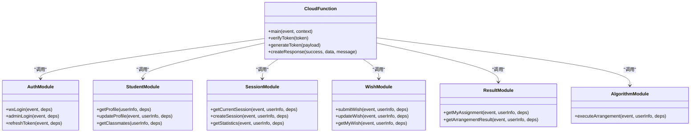

# 项目目录结构详解

<cite>
**本文档引用的文件**  
- [app.json](file://miniprogram/app.json)
- [app.js](file://miniprogram/app.js)
- [envList.js](file://miniprogram/envList.js)
- [project.config.json](file://project.config.json)
- [quickstartFunctions/index.js](file://cloudfunctions/quickstartFunctions/index.js)
- [seatArrangementFunctions/index.js](file://cloudfunctions/seatArrangementFunctions/index.js)
- [seatArrangementFunctions/modules/auth.js](file://cloudfunctions/seatArrangementFunctions/modules/auth.js)
- [seatArrangementFunctions/modules/algorithm.js](file://cloudfunctions/seatArrangementFunctions/modules/algorithm.js)
- [seatArrangementFunctions/modules/student.js](file://cloudfunctions/seatArrangementFunctions/modules/student.js)
- [seatArrangementFunctions/modules/session.js](file://cloudfunctions/seatArrangementFunctions/modules/session.js)
- [seatArrangementFunctions/modules/wish.js](file://cloudfunctions/seatArrangementFunctions/modules/wish.js)
- [seatArrangementFunctions/modules/result.js](file://cloudfunctions/seatArrangementFunctions/modules/result.js)
- [login.js](file://miniprogram/pages/login/login.js)
- [profile.js](file://miniprogram/pages/profile/profile.js)
- [seat-selection.js](file://miniprogram/pages/seat-selection/seat-selection.js)
</cite>

## 目录

1. [项目整体结构](#项目整体结构)  
2. [小程序前端结构分析](#小程序前端结构分析)  
   2.1 [app.json：页面路由与窗口配置](#appjson页面路由与窗口配置)  
   2.2 [app.js：全局状态与生命周期](#appjs全局状态与生命周期)  
3. [云函数后端结构分析](#云函数后端结构分析)  
   3.1 [quickstartFunctions 与 seatArrangementFunctions 对比](#quickstartfunctions-与-seatarrangementfunctions-对比)  
   3.2 [seatArrangementFunctions 模块化设计](#seatarrangementfunctions-模块化设计)  
4. [项目配置文件说明](#项目配置文件说明)  
   4.1 [envList.js：环境配置](#envlistjs环境配置)  
   4.2 [project.config.json：项目设置](#projectconfigjson项目设置)  
5. [前后端交互流程示例](#前后端交互流程示例)  
6. [总结](#总结)

## 项目整体结构

本项目采用微信小程序标准前后端分离架构，前端位于 `miniprogram` 目录，后端云函数位于 `cloudfunctions` 目录。整体结构清晰，功能模块划分明确，便于团队协作与维护。

**图示来源**  
- [project.config.json](file://project.config.json#L1-L85)
- [app.json](file://miniprogram/app.json#L1-L57)

## 小程序前端结构分析

### app.json：页面路由与窗口配置

`app.json` 文件定义了小程序的全局配置，包括页面路由、窗口样式、底部标签栏等。

#### 页面路由配置

`pages` 字段定义了小程序的所有页面路径，按顺序加载。当前项目包含以下页面：
- 登录页：`pages/login/login`
- 个人中心：`pages/profile/profile`
- 座位选择：`pages/seat-selection/seat-selection`
- 邻座偏好：`pages/neighbor-preference/neighbor-preference`
- 意愿提交：`pages/wish-submit/wish-submit`
- 排座结果：`pages/result/result`
- 首页：`pages/index/index`
- 示例页：`pages/example/index`

#### 窗口样式配置

`window` 字段定义了小程序的全局窗口样式：
- 背景颜色：`#F6F6F6`
- 导航栏背景色：`#1976D2`
- 导航栏文字颜色：白色
- 导航栏标题：`自动排座位系统`

#### 底部标签栏（TabBar）

`tabBar` 配置了底部标签栏，包含四个主要功能入口：
- 选择座位
- 我的意愿
- 排座结果
- 个人中心

每个标签配有正常和选中状态的图标，提升用户体验。

**本节来源**  
- [app.json](file://miniprogram/app.json#L1-L57)

### app.js：全局状态与生命周期

`app.js` 是小程序的全局逻辑文件，通过 `App()` 构造器定义应用实例。

#### 全局数据管理

`globalData` 对象用于存储全局状态，当前主要包含：
- `env`：云开发环境 ID，决定云函数调用的目标环境

该配置支持多环境部署（如开发、测试、生产），通过切换 `env` 值即可实现环境切换。

#### 生命周期钩子

`onLaunch` 是小程序启动时触发的生命周期函数，主要执行以下操作：
1. 检查基础库版本是否支持云开发（需 2.2.3 及以上）
2. 初始化云开发环境，使用 `globalData.env` 作为目标环境
3. 启用用户访问追踪（`traceUser: true`）

此设计确保了云开发能力的正常启用，并为后续的云函数调用做好准备。

**本节来源**  
- [app.js](file://miniprogram/app.js#L1-L20)

## 云函数后端结构分析

### quickstartFunctions 与 seatArrangementFunctions 对比

项目包含两个云函数：`quickstartFunctions` 和 `seatArrangementFunctions`，二者功能定位不同。

| 特性 | quickstartFunctions | seatArrangementFunctions |
|------|---------------------|--------------------------|
| 功能定位 | 快速入门示例 | 生产级排座系统核心 |
| 模块化 | 无独立模块目录 | 有 `modules` 模块化设计 |
| 算法支持 | 无专用算法模块 | 包含 `algorithm.js` 排座引擎 |
| 代码组织 | 单文件集中式 | 多文件模块化 |
| 可维护性 | 较低 | 高 |
| 扩展性 | 有限 | 良好 |

`quickstartFunctions` 作为初始示例，功能较为简单；而 `seatArrangementFunctions` 是实际业务的核心，具备完整的模块化设计和复杂的排座算法。

**本节来源**  
- [quickstartFunctions/index.js](file://cloudfunctions/quickstartFunctions/index.js#L1-L155)
- [seatArrangementFunctions/index.js](file://cloudfunctions/seatArrangementFunctions/index.js#L1-L169)

### seatArrangementFunctions 模块化设计

`seatArrangementFunctions` 采用模块化设计，将不同业务功能拆分为独立模块，存放在 `modules` 目录下。

#### 模块划分

| 模块文件 | 功能说明 |
|---------|---------|
| auth.js | 认证授权模块，处理微信登录、管理员登录、令牌刷新 |
| student.js | 学生管理模块，获取档案、更新信息、获取同班同学 |
| session.js | 排座会话管理，创建会话、获取当前会话、统计信息 |
| wish.js | 意愿管理，提交/修改/获取学生座位意愿 |
| result.js | 结果管理，获取个人分配、查看排座结果、手动调整 |
| algorithm.js | 排座算法引擎，核心排座逻辑与优化算法 |

#### 模块化优势

1. **职责分离**：每个模块专注单一业务领域，降低耦合度
2. **易于维护**：功能修改只需关注对应模块，不影响其他部分
3. **可测试性**：模块可独立测试，提高代码质量
4. **可复用性**：模块可在不同场景下复用
5. **团队协作**：多人开发时可并行工作，减少冲突

#### 依赖注入机制

云函数入口通过 `dependencies` 对象将数据库实例、工具函数等统一注入各模块，避免重复传递参数，提高代码整洁度。

**图示来源**  
- [seatArrangementFunctions/index.js](file://cloudfunctions/seatArrangementFunctions/index.js#L1-L169)
- [seatArrangementFunctions/modules/auth.js](file://cloudfunctions/seatArrangementFunctions/modules/auth.js#L1-L244)
- [seatArrangementFunctions/modules/algorithm.js](file://cloudfunctions/seatArrangementFunctions/modules/algorithm.js#L1-L508)

## 项目配置文件说明

### envList.js：环境配置

`envList.js` 文件用于管理多环境配置，当前内容较为简单：

- `envList`：环境 ID 列表，目前为空数组
- `isMac`：标识是否为 Mac 系统，用于环境适配

该文件通常用于在不同环境（开发、测试、生产）间切换云开发资源，支持多环境部署策略。

**本节来源**  
- [envList.js](file://miniprogram/envList.js#L1-L6)

### project.config.json：项目设置

`project.config.json` 是小程序项目的配置文件，包含关键设置：

#### 核心配置项

- `miniprogramRoot`: 小程序源码根目录
- `cloudfunctionRoot`: 云函数根目录
- `appid`: 小程序唯一标识
- `projectname`: 项目名称
- `libVersion`: 基础库版本

#### 开发设置

`setting` 字段包含丰富的开发选项：
- ES6 转 ES5：`es6: true`
- 上传时压缩：`minified: true`
- 上传时自动补全 Sitemap：`checkSiteMap: true`
- 代码包自动构建：`useCompilerModule: true`

#### 编辑器设置

`editorSetting` 定义了代码编辑偏好：
- 缩进方式：使用空格
- 缩进大小：2 个空格

该文件是项目的基础配置，确保开发环境的一致性。

**本节来源**  
- [project.config.json](file://project.config.json#L1-L85)

## 前后端交互流程示例

以学生登录并提交座位意愿为例，展示前后端协作流程：

**图示来源**  
- [login.js](file://miniprogram/pages/login/login.js#L1-L177)
- [seatArrangementFunctions/modules/auth.js](file://cloudfunctions/seatArrangementFunctions/modules/auth.js#L1-L244)
- [seatArrangementFunctions/modules/wish.js](file://cloudfunctions/seatArrangementFunctions/modules/wish.js#L1-L453)

## 总结

本项目采用清晰的前后端分离架构，前端通过 `app.json` 和 `app.js` 实现页面路由与全局状态管理，后端通过模块化云函数实现复杂业务逻辑。`seatArrangementFunctions` 的模块化设计体现了良好的软件工程实践，将认证、学生管理、会话、意愿、结果、算法等职责分离，提高了代码的可维护性和可扩展性。配置文件 `project.config.json` 和 `envList.js` 支持多环境开发与部署。整体结构合理，适合团队协作开发和长期维护。